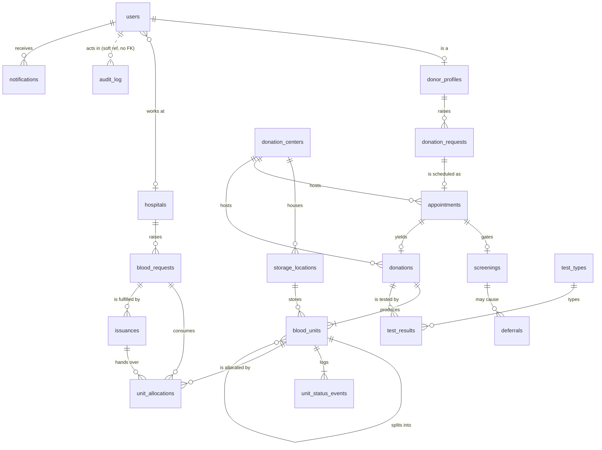
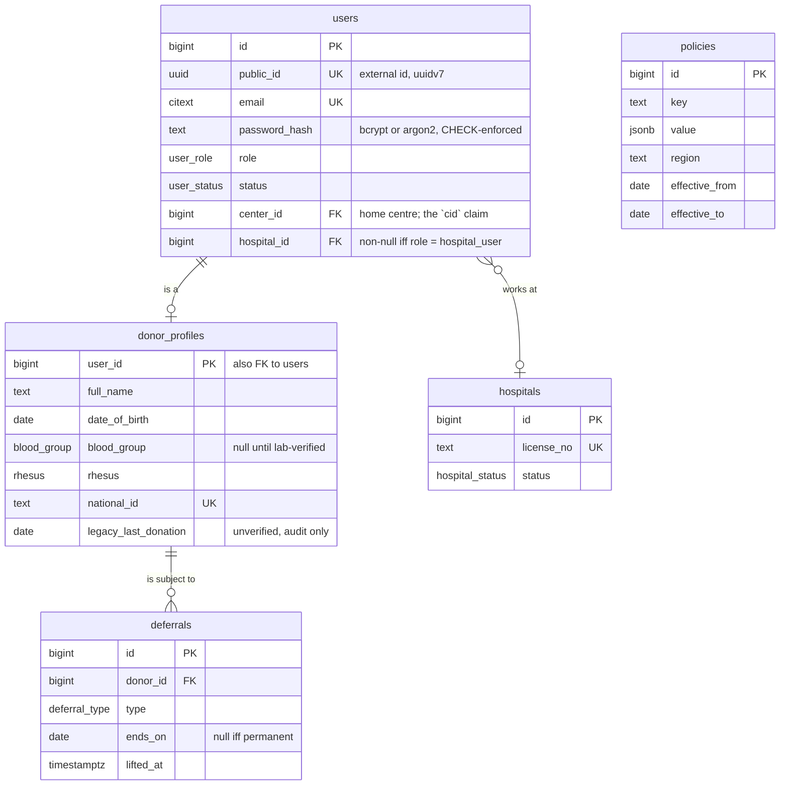
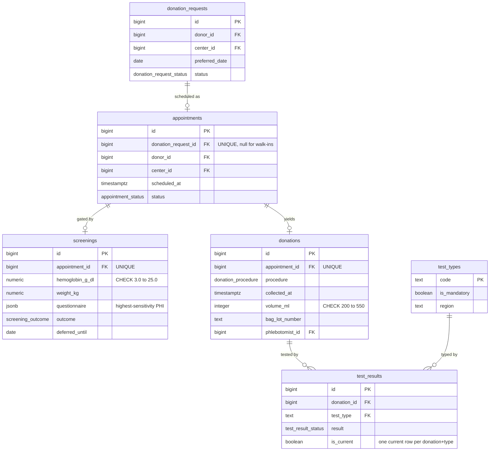
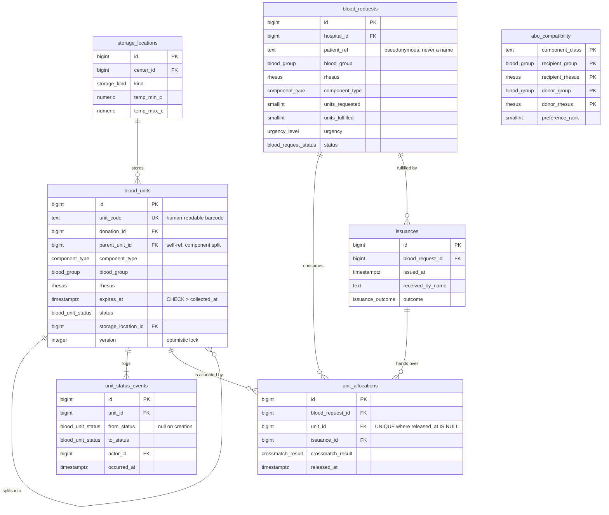

# BBank — Database Schema

> **Status:** Draft v1 · **Date:** 2026-09-01 · **Target engine:** PostgreSQL 18 (as pinned in `compose.yaml`)
>
> **Siblings:** [PRD](./PRD.md) · [TRD](./TRD.md) · [User Journey](./USER_JOURNEY.md) · [UI/UX Brief](./UIUX_BRIEF.md) · [Implementation Plan](./IMPLEMENTATION_PLAN.md) · [Project Status](./PROJECT_STATUS.md)
>
> **This document owns every table and column name in BBank.** Sibling documents cite the
> identifiers defined here; they never redefine them. Requirement IDs (`FR-xx`, `NFR-xx`)
> are owned by the PRD and cited here.
>
> Every `sql` block in this document was executed against a live `postgres:18` instance
> before publication. The DDL in §6, the indexes in §7, the views in §8, the triggers in
> §9, the allocation query in §10 and the migration in §11 all ran clean, in the order
> printed.

---

## 1. Overview & design principles

BBank today is an appointment book. This schema turns it into a **blood bank**: a system
whose job is to know, for every millilitre of blood in the building, where it came from,
what was done to it, where it is now, and where it went. Five principles drive every
decision below.

### 1.1 The unit is the central entity, not the donor

The legacy schema is donor-shaped: `donors` is the root, everything else hangs off it, and
the object of interest is a person. That is the wrong centre of gravity. A blood bank's
inventory, its liabilities, its recalls and its regulatory obligations are all expressed in
**units** — one bag, one component, one barcode. `blood_units` is therefore the busiest
table, the one with the most indexes, the one with a status machine, and the one every
other domain either feeds or consumes. The donor becomes what they actually are in the
process: the *origin* of a unit, linked through `donations`.

Practical consequence: you should be able to answer "what is in the fridge right now?"
without touching `donor_profiles` at all, and "who did unit X come from?" with a single
join path that never guesses.

### 1.2 Status transitions are append-only events, never silent UPDATEs

`blood_units.status` moves through
`quarantined → available → reserved → issued → transfused` (with `expired`, `discarded`
and `recalled` as absorbing side-exits). Every one of those transitions writes a row to
`unit_status_events` carrying `from_status`, `to_status`, `actor_id`, `reason` and
`occurred_at`. The current status column is a **cache of the last event**, not the record.

This is not defensive programming, it is the regulatory requirement. If a recipient has a
transfusion reaction, or a donor seroconverts and a look-back is triggered, you must be
able to walk backwards from patient to donor and forwards from donor to every unit and
recipient — and prove *when* each decision was taken and *by whom*. An `UPDATE` that
overwrites state destroys that evidence. `unit_status_events` and `audit_log` both carry
`BEFORE UPDATE OR DELETE` triggers that raise an exception (§9.5).

### 1.3 Clinical thresholds live in `policies`, never as magic numbers in code

56 days between whole-blood donations. 12.5 g/dL haemoglobin for female donors. 42 days
for packed red cells. Every one of these is a *regional policy*, not a constant — a
different national blood service, or the same service next year, will use different
numbers. Hard-coding `if daysSince < 56` in `main.go` guarantees that the code, the UI copy
and the printed donor leaflet drift apart.

All of them live in `policies` as `(key, value JSONB, region, effective_from,
effective_to)` rows, with a GiST exclusion constraint that makes overlapping versions of
the same key physically impossible. The `donor_eligibility` view (§8.3) reads them through
`active_policies`, so changing an interval is a data change, not a deploy. The seeded set
is in §12.1 and matches the clinical constants agreed in the foundation brief.

### 1.4 Soft transitions over hard `DELETE`

**This is the anti-pattern the schema exists to fix.** `backend/main.go:469`, inside
`confirmRequest`:

```go
// 3. Delete the now-fulfilled request
if _, err = tx.Exec("DELETE FROM requests WHERE id = $1", req.Id); err != nil {
```

Confirming a donation request *destroys the request*. Three things break at once:

1. `appointments.request_id` becomes a dangling integer pointing at nothing. This is why
   the legacy `appointments` table has **no foreign key** on `request_id` — it could not
   have one and still work.
2. The history of "who asked, when, and who approved it" is gone. There is no way to
   compute approval latency, no-show rate against original request, or admin throughput.
3. There is no audit trail of the decision at all.

The replacement is a status transition: `donation_requests.status` moves
`pending → approved`, the row survives, and the `appointments` row carries a real
`donation_request_id` foreign key back to it. Across the schema, essentially every foreign
key is `ON DELETE RESTRICT`. Clinical rows are not deleted; they are transitioned,
superseded, or archived. The two deliberate exceptions are `notifications` (`ON DELETE
CASCADE` — an SMS reminder is not a clinical record) and nullable actor references
(`ON DELETE SET NULL` — a deactivated staff account must not block a record from existing,
though in practice `users` are deactivated, never deleted).

### 1.5 PHI is identified, minimised, and located

Every column that is personal or health data is enumerated in §13 with a retention rule. A
few consequences show up directly in the DDL:

- `blood_requests.patient_ref` is a **hospital-supplied pseudonymous reference**, not a
  patient name. BBank never stores patient identity; the hospital holds the mapping. That
  is a deliberate minimisation choice and it materially shrinks the compliance surface.
- `screenings.questionnaire` is JSONB and holds the most sensitive data in the system
  (sexual history, travel, drug use). It is constrained to an object, never indexed on
  content, and never leaves the server unredacted.
- Object-storage artefacts (consent PDFs, lab reports, ID scans, delivery notes) are
  *referenced* by URL, never inlined as bytea. See TRD scaling rule 4.

---

## 2. Current state — the three tables that exist today

Reproduced exactly from `backend/main.go` lines 91–117, where they are executed on every
boot as `CREATE TABLE IF NOT EXISTS`.

```sql
CREATE TABLE IF NOT EXISTS donors (
    id            SERIAL PRIMARY KEY,
    full_name     TEXT,
    email         TEXT UNIQUE,
    dob           DATE,
    gender        TEXT,
    blood_group   TEXT,
    rhesus        TEXT,
    contact       TEXT,
    address       TEXT,
    password      TEXT,
    last_donation DATE
);

CREATE TABLE IF NOT EXISTS requests (
    id            SERIAL PRIMARY KEY,
    donor_id      INTEGER REFERENCES donors(id),
    donor_name    TEXT,
    last_donation DATE,
    created_at    TIMESTAMP DEFAULT CURRENT_TIMESTAMP
);

CREATE TABLE IF NOT EXISTS appointments (
    id               SERIAL PRIMARY KEY,
    request_id       INTEGER,
    donor_id         INTEGER REFERENCES donors(id),
    donor_name       TEXT,
    appointment_date DATE
);
```

### 2.1 What is wrong with them

| # | Defect | Why it matters | Fixed by |
|---|---|---|---|
| D1 | **There is no blood.** No donation event, no unit, no component, no test, no storage, no expiry, no recipient. | The system cannot answer the only questions a blood bank exists to answer. This is the core diagnosis. | §6 tables 12–19 |
| D2 | **`requests` is misnamed.** In a blood bank a "request" is a *hospital asking for units*. Here it means *a donor asking for a slot*. | The vocabulary is inverted against the entire domain; the landing page already promises hospitals a feature the word has been spent on. | Rename to `donation_requests`; `blood_requests` reserved for demand (§11 step 4) |
| D3 | **No status column anywhere.** Not on `requests`, not on `appointments`. | State is encoded by row *existence* — hence the hard `DELETE`. No-shows, cancellations, deferrals and rejections are unrepresentable. | `donation_request_status`, `appointment_status` (§5) |
| D4 | **`donors.last_donation` is donor-entered free text.** It is a `DATE` typed into a signup form, copied into `requests.last_donation`, and never validated against anything. | Donor eligibility — a **safety** decision — is computed from self-reported, unverifiable data. A donor can book a second donation the next day by editing one field. | Derived by `donor_eligibility` from real `donations` rows (§8.3). Legacy value preserved as `donor_profiles.legacy_last_donation` and explicitly excluded from the view. |
| D5 | **No FK from `appointments.request_id` to `requests.id`.** | It *cannot* have one, because `confirmRequest` deletes the parent row. The missing constraint is a symptom of D6. Real dangling values exist in any live database. | Real FK after the hard delete is removed (§11 step 5) |
| D6 | **Hard `DELETE` on confirm** (`main.go:469`). | Destroys the request, orphans the appointment, erases the decision. | Status transition (§1.4) |
| D7 | **`TEXT` for everything, including enums.** `gender`, `blood_group`, `rhesus` are unconstrained text. `rhesus` is stored as `'+'`/`'-'` by the frontend but nothing enforces it. | `'O'`, `'o'`, `'O+'`, `'0'` are all storable in `blood_group`. Any query grouping by blood group is already wrong. | Native enums (§5) |
| D8 | **`TIMESTAMP` not `TIMESTAMPTZ`; `DATE` for appointment times.** | `requests.created_at` has no timezone. An appointment has no *time*, only a day. | `TIMESTAMPTZ` throughout; `scheduled_at TIMESTAMPTZ` |
| D9 | **`password` column holds the bcrypt hash but is named `password`.** | Invites the plaintext bug. Also serialised into the `Donor` struct with `omitempty`, so it leaks unless every handler remembers to blank it. | `users.password_hash` with a `CHECK` rejecting anything that is not a bcrypt/argon2 hash |
| D10 | **`donor_name` denormalised into both child tables.** | Renaming a donor silently leaves stale names on their history. | Removed; joined from `donor_profiles` |
| D11 | **No `updated_at`, no soft-delete, no audit.** | Nothing is reconstructable. | `updated_at` triggers, `audit_log`, `unit_status_events` |
| D12 | **Schema created at application boot.** | Covered in §11.1 — this is an operational defect, not just a stylistic one. | `golang-migrate` |

---

## 3. Entity–relationship diagrams

Twenty-two tables is too many for one legible diagram, so this is an overview plus three
domain views. Cardinality notation: `||` exactly one, `o|` zero-or-one, `o{` zero-or-many,
`|{` one-or-many.

### 3.1 Overview — the vein-to-vein spine



### 3.2 Domain A — Identity & Donors



### 3.3 Domain B — Collection & Lab



### 3.4 Domain C — Inventory & Fulfilment



---

## 4. Naming & typing conventions

| Rule | Choice | Rationale |
|---|---|---|
| Table names | `snake_case`, plural | Matches the legacy tables; no churn. |
| Primary keys | `id BIGINT GENERATED ALWAYS AS IDENTITY` | SQL-standard; `GENERATED ALWAYS` prevents accidental explicit inserts (the migration opts out with `OVERRIDING SYSTEM VALUE`, which is exactly the audit trail you want). `BIGINT` because `unit_status_events` and `audit_log` will exceed `INT4` within a decade at scale. |
| External identifiers | `public_id UUID DEFAULT uuidv7()` on `users`; `unit_code TEXT` on `blood_units` | Sequential integers in URLs leak donor counts and enable enumeration. `uuidv7()` is native in PostgreSQL 18 and is index-friendly (time-ordered), unlike v4. |
| Timestamps | `TIMESTAMPTZ` without exception | Centers have a `timezone` column; a `TIMESTAMP` here would be a latent bug on every deployment that crosses a zone. |
| Clinical measurements | `NUMERIC(p,s)` | `FLOAT` cannot represent 12.5 exactly. Haemoglobin thresholds are compared for equality against policy values; binary floating point makes that comparison non-deterministic. Never use `REAL`/`DOUBLE PRECISION` for a value a clinician reads off an instrument. |
| Counts / volumes | `INTEGER`, `SMALLINT` | `volume_ml` is a whole number of millilitres. |
| Email | `CITEXT` | Case-insensitive uniqueness without a functional index and without every query remembering `lower()`. The legacy code already does `strings.ToLower` inconsistently. |
| Booleans | `is_`/`had_` prefix, `NOT NULL DEFAULT` | Three-valued boolean logic is a bug factory. |
| Money | *(none yet)* | If cost recovery is added, `NUMERIC(12,2)` plus an ISO-4217 currency column. Never `FLOAT`. |
| Audit columns | `created_at`, `updated_at` on every mutable table | `updated_at` maintained by trigger, not by the application. |

---

## 5. Enumerated types

```sql
-- Clinical vocabulary
CREATE TYPE blood_group    AS ENUM ('A', 'B', 'AB', 'O');
CREATE TYPE rhesus         AS ENUM ('positive', 'negative');
CREATE TYPE gender         AS ENUM ('male', 'female', 'other', 'undisclosed');
CREATE TYPE component_type AS ENUM (
    'whole_blood', 'packed_red_cells', 'fresh_frozen_plasma', 'platelets', 'cryoprecipitate'
);
CREATE TYPE donation_procedure AS ENUM (
    'whole_blood', 'apheresis_platelet', 'apheresis_plasma', 'double_red_cell'
);

-- Identity
CREATE TYPE user_role   AS ENUM (
    'donor', 'staff', 'lab_tech', 'inventory_manager', 'hospital_user', 'admin'
);
CREATE TYPE user_status AS ENUM ('pending_verification', 'active', 'suspended', 'deactivated');
CREATE TYPE hospital_status AS ENUM ('pending_approval', 'active', 'suspended');

-- Domain state machines (foundation brief §3.2 — values are exact, do not vary)
CREATE TYPE appointment_status      AS ENUM (
    'scheduled', 'checked_in', 'completed', 'no_show', 'cancelled', 'deferred'
);
CREATE TYPE donation_request_status AS ENUM (
    'pending', 'approved', 'rejected', 'cancelled', 'expired'
);
CREATE TYPE screening_outcome       AS ENUM (
    'passed', 'deferred_temporary', 'deferred_permanent'
);
CREATE TYPE deferral_type           AS ENUM ('temporary', 'permanent');
CREATE TYPE blood_unit_status       AS ENUM (
    'quarantined', 'available', 'reserved', 'issued', 'transfused',
    'expired', 'discarded', 'recalled'
);
CREATE TYPE test_result_status      AS ENUM (
    'pending', 'non_reactive', 'reactive', 'indeterminate'
);
CREATE TYPE blood_request_status    AS ENUM (
    'pending', 'approved', 'partially_fulfilled', 'fulfilled', 'rejected', 'cancelled', 'expired'
);
CREATE TYPE urgency_level           AS ENUM ('routine', 'urgent', 'emergency');
CREATE TYPE crossmatch_result       AS ENUM ('not_required', 'compatible', 'incompatible');
CREATE TYPE issuance_outcome        AS ENUM (
    'pending', 'transfused', 'returned', 'expired', 'discarded'
);

-- Infrastructure
CREATE TYPE storage_kind         AS ENUM ('fridge', 'freezer', 'platelet_agitator', 'transport_box');
CREATE TYPE notification_channel AS ENUM ('email', 'sms', 'in_app');
CREATE TYPE notification_status  AS ENUM ('queued', 'sent', 'delivered', 'failed', 'cancelled');
```

**Additions to the foundation brief, flagged explicitly:** `gender`, `user_status`,
`hospital_status`, `donation_procedure`, `crossmatch_result`, `storage_kind`,
`notification_status` and the `'in_app'` channel are not in §3.2 of the brief. They are
required by the entity list in §4 of the brief, which names the columns but not their
domains. `issuance_outcome` adds `'pending'` to the brief's four values because an issuance
row exists before its outcome is known. `donation_procedure` is required because the
eligibility interval differs by procedure (56 days whole blood vs 7 days apheresis
platelet, brief §3.3) and cannot be derived without it.

### 5.1 Enum vs lookup table — the tradeoff, and the choice

A native `ENUM` gives type safety at the column, four bytes of storage, a natural sort
order, and a guarantee that no handler inserts `'Available '` with a trailing space. The
costs are real: values can only be added (`ALTER TYPE ... ADD VALUE` cannot be rolled back
inside a transaction), values cannot be renamed or removed without recreating the type and
rewriting dependent columns, and an enum carries no per-value metadata — no display label,
no active flag, no region scoping. **The rule applied here: enum if the set is defined by
the code, lookup table if the set is defined by the operator.** A `blood_unit_status` of
`'reserved'` is meaningless unless `allocateUnit()` knows what to do with it, so it is an
enum. The TTI panel is region-configurable by explicit requirement (brief §3.3) — adding
HTLV screening must not need a deploy — so `test_types` is a **table** and
`test_results.test_type` is a `TEXT` FK to it, which additionally lets the release guard
(§9.3) compute "every mandatory active test is non-reactive" as a plain join.
`abo_compatibility` is a table for the same reason plus one more: it must be *joinable*
(§12.2).

---

## 6. Full DDL

Dependency-ordered. Runs top to bottom on a fresh PostgreSQL 18 database after the enum
block in §5.

### 6.0 Extensions

```sql
CREATE EXTENSION IF NOT EXISTS citext;     -- case-insensitive email
CREATE EXTENSION IF NOT EXISTS pg_trgm;    -- fuzzy donor / unit-code search (scaling rule 9)
CREATE EXTENSION IF NOT EXISTS btree_gin;  -- composite GIN over scalar + trigram columns
CREATE EXTENSION IF NOT EXISTS btree_gist; -- equality operators inside the policies EXCLUDE
```

### 6.1 Identity

```sql
-- Every authenticated principal in the system, whatever their role.
CREATE TABLE users (
    id                 BIGINT      GENERATED ALWAYS AS IDENTITY PRIMARY KEY,
    public_id          UUID        NOT NULL DEFAULT uuidv7(),
    email              CITEXT      NOT NULL,
    password_hash      TEXT        NOT NULL,
    role               user_role   NOT NULL DEFAULT 'donor',
    status             user_status NOT NULL DEFAULT 'pending_verification',
    phone              TEXT,
    center_id          BIGINT,                     -- FK added after donation_centers exists
    hospital_id        BIGINT,                     -- FK added after hospitals exists
    last_login_at      TIMESTAMPTZ,
    failed_login_count SMALLINT    NOT NULL DEFAULT 0,
    locked_until       TIMESTAMPTZ,
    created_at         TIMESTAMPTZ NOT NULL DEFAULT now(),
    updated_at         TIMESTAMPTZ NOT NULL DEFAULT now(),
    deactivated_at     TIMESTAMPTZ,
    CONSTRAINT users_email_key        UNIQUE (email),
    CONSTRAINT users_public_id_key    UNIQUE (public_id),
    CONSTRAINT users_email_format     CHECK (email ~ '^[^@[:space:]]+@[^@[:space:]]+\.[^@[:space:]]+$'),
    CONSTRAINT users_hash_not_plain   CHECK (password_hash ~ '^\$(2[aby]|argon2(i|d|id))\$'),
    CONSTRAINT users_deactivated_sync CHECK ((status = 'deactivated') = (deactivated_at IS NOT NULL))
);

-- Donor-specific attributes. 1:1 with users where role = 'donor'.
CREATE TABLE donor_profiles (
    user_id                 BIGINT      PRIMARY KEY REFERENCES users(id) ON DELETE RESTRICT,
    full_name               TEXT        NOT NULL,
    date_of_birth           DATE        NOT NULL,
    gender                  gender      NOT NULL DEFAULT 'undisclosed',
    blood_group             blood_group,
    rhesus                  rhesus,
    blood_group_verified_at TIMESTAMPTZ,
    contact_phone           TEXT        NOT NULL,
    address_line            TEXT,
    city                    TEXT,
    region                  TEXT,
    national_id             TEXT,
    emergency_contact_name  TEXT,
    emergency_contact_phone TEXT,
    total_donations         INTEGER     NOT NULL DEFAULT 0,
    legacy_last_donation    DATE,
    created_at              TIMESTAMPTZ NOT NULL DEFAULT now(),
    updated_at              TIMESTAMPTZ NOT NULL DEFAULT now(),
    CONSTRAINT donor_profiles_national_id_key UNIQUE (national_id),
    CONSTRAINT donor_profiles_dob_sane        CHECK (date_of_birth > DATE '1900-01-01'),
    CONSTRAINT donor_profiles_abo_paired      CHECK ((blood_group IS NULL) = (rhesus IS NULL)),
    CONSTRAINT donor_profiles_verified_needs_group
        CHECK (blood_group_verified_at IS NULL OR blood_group IS NOT NULL),
    CONSTRAINT donor_profiles_total_nonneg    CHECK (total_donations >= 0)
);
```

`donor_profiles.blood_group` is nullable on purpose: a donor self-reports a group at
signup, but the value that may be used for allocation is the one the laboratory typed —
recorded by setting `blood_group_verified_at`. `blood_units.blood_group` is **not** copied
from the profile; it is entered at processing time from the lab result. Trusting a
self-reported group for a transfusion is a patient-safety failure.

### 6.2 Facilities & reference data

```sql
-- A physical site where donations are collected.
CREATE TABLE donation_centers (
    id                BIGINT      GENERATED ALWAYS AS IDENTITY PRIMARY KEY,
    code              TEXT        NOT NULL,
    name              TEXT        NOT NULL,
    address_line      TEXT        NOT NULL,
    city              TEXT        NOT NULL,
    region            TEXT        NOT NULL,
    phone             TEXT,
    email             CITEXT,
    latitude          NUMERIC(9,6),
    longitude         NUMERIC(9,6),
    capacity_per_slot SMALLINT    NOT NULL DEFAULT 4,
    slot_minutes      SMALLINT    NOT NULL DEFAULT 30,
    opening_hours     JSONB       NOT NULL DEFAULT '{}'::jsonb,
    timezone          TEXT        NOT NULL DEFAULT 'Africa/Douala',
    is_active         BOOLEAN     NOT NULL DEFAULT TRUE,
    created_at        TIMESTAMPTZ NOT NULL DEFAULT now(),
    updated_at        TIMESTAMPTZ NOT NULL DEFAULT now(),
    CONSTRAINT donation_centers_code_key  UNIQUE (code),
    CONSTRAINT donation_centers_capacity  CHECK (capacity_per_slot BETWEEN 1 AND 100),
    CONSTRAINT donation_centers_slot_len  CHECK (slot_minutes BETWEEN 5 AND 240),
    CONSTRAINT donation_centers_lat_range CHECK (latitude  IS NULL OR latitude  BETWEEN -90  AND 90),
    CONSTRAINT donation_centers_lng_range CHECK (longitude IS NULL OR longitude BETWEEN -180 AND 180)
);

-- A temperature-controlled place inside a center where units physically sit.
CREATE TABLE storage_locations (
    id             BIGINT       GENERATED ALWAYS AS IDENTITY PRIMARY KEY,
    center_id      BIGINT       NOT NULL REFERENCES donation_centers(id) ON DELETE RESTRICT,
    name           TEXT         NOT NULL,
    kind           storage_kind NOT NULL,
    temp_min_c     NUMERIC(4,1) NOT NULL,
    temp_max_c     NUMERIC(4,1) NOT NULL,
    capacity_units INTEGER,
    is_active      BOOLEAN      NOT NULL DEFAULT TRUE,
    created_at     TIMESTAMPTZ  NOT NULL DEFAULT now(),
    updated_at     TIMESTAMPTZ  NOT NULL DEFAULT now(),
    CONSTRAINT storage_locations_name_key   UNIQUE (center_id, name),
    CONSTRAINT storage_locations_temp_order CHECK (temp_min_c < temp_max_c),
    CONSTRAINT storage_locations_temp_sane  CHECK (temp_min_c >= -80 AND temp_max_c <= 30),
    CONSTRAINT storage_locations_capacity   CHECK (capacity_units IS NULL OR capacity_units > 0)
);

-- A partner hospital that may raise blood_requests.
CREATE TABLE hospitals (
    id            BIGINT          GENERATED ALWAYS AS IDENTITY PRIMARY KEY,
    name          TEXT            NOT NULL,
    license_no    TEXT            NOT NULL,
    address_line  TEXT            NOT NULL,
    city          TEXT            NOT NULL,
    region        TEXT            NOT NULL,
    phone         TEXT,
    contact_email CITEXT          NOT NULL,
    status        hospital_status NOT NULL DEFAULT 'pending_approval',
    created_at    TIMESTAMPTZ     NOT NULL DEFAULT now(),
    updated_at    TIMESTAMPTZ     NOT NULL DEFAULT now(),
    CONSTRAINT hospitals_license_key UNIQUE (license_no)
);

ALTER TABLE users
    ADD CONSTRAINT users_hospital_fk FOREIGN KEY (hospital_id)
        REFERENCES hospitals(id) ON DELETE RESTRICT,
    ADD CONSTRAINT users_hospital_only_for_hospital_user
        CHECK ((role = 'hospital_user') = (hospital_id IS NOT NULL));

-- The `cid` claim (TRD §7.3) and the `ctr` scope of the RBAC matrix (§7.6).
-- Asymmetric with hospital_id on purpose: `staff` MUST have a home centre,
-- because every one of their matrix cells is centre-scoped and a staff account
-- without one can reach nothing. `lab_tech` and `inventory_manager` MAY have
-- one — they work somewhere, but the matrix grants them cross-centre reads, so
-- the centre is a fact about them rather than a limit on them. Donors, admins
-- and hospital users must not have one.
ALTER TABLE users
    ADD CONSTRAINT users_center_fk FOREIGN KEY (center_id)
        REFERENCES donation_centers(id) ON DELETE RESTRICT,
    ADD CONSTRAINT users_center_matches_role
        CHECK (
            CASE role
                WHEN 'staff'         THEN center_id IS NOT NULL
                WHEN 'donor'         THEN center_id IS NULL
                WHEN 'admin'         THEN center_id IS NULL
                WHEN 'hospital_user' THEN center_id IS NULL
                ELSE TRUE
            END
        );

-- Versioned, region-scoped clinical and operational thresholds. See §12.1.
CREATE TABLE policies (
    id             BIGINT      GENERATED ALWAYS AS IDENTITY PRIMARY KEY,
    key            TEXT        NOT NULL,
    value          JSONB       NOT NULL,
    region         TEXT        NOT NULL DEFAULT '*',
    description    TEXT,
    effective_from DATE        NOT NULL DEFAULT CURRENT_DATE,
    effective_to   DATE,
    created_by     BIGINT      REFERENCES users(id) ON DELETE SET NULL,
    created_at     TIMESTAMPTZ NOT NULL DEFAULT now(),
    updated_at     TIMESTAMPTZ NOT NULL DEFAULT now(),
    CONSTRAINT policies_window CHECK (effective_to IS NULL OR effective_to > effective_from),
    CONSTRAINT policies_no_overlap EXCLUDE USING gist (
        key    WITH =,
        region WITH =,
        daterange(effective_from, effective_to) WITH &&
    )
);

-- The TTI panel. A table, not an enum, because the panel is region-configurable.
CREATE TABLE test_types (
    code          TEXT        PRIMARY KEY,
    name          TEXT        NOT NULL,
    is_mandatory  BOOLEAN     NOT NULL DEFAULT TRUE,
    region        TEXT        NOT NULL DEFAULT '*',
    display_order SMALLINT    NOT NULL DEFAULT 0,
    is_active     BOOLEAN     NOT NULL DEFAULT TRUE,
    created_at    TIMESTAMPTZ NOT NULL DEFAULT now(),
    updated_at    TIMESTAMPTZ NOT NULL DEFAULT now(),
    CONSTRAINT test_types_code_upper CHECK (code = upper(code) AND code ~ '^[A-Z0-9_]{2,32}$')
);

-- ABO/Rh compatibility matrix. Joinable, so allocation stays a single SQL statement.
CREATE TABLE abo_compatibility (
    component_class  TEXT        NOT NULL,
    recipient_group  blood_group NOT NULL,
    recipient_rhesus rhesus      NOT NULL,
    donor_group      blood_group NOT NULL,
    donor_rhesus     rhesus      NOT NULL,
    preference_rank  SMALLINT    NOT NULL DEFAULT 100,
    PRIMARY KEY (component_class, recipient_group, recipient_rhesus, donor_group, donor_rhesus),
    CONSTRAINT abo_compatibility_class CHECK (component_class IN ('red_cells','plasma','platelets'))
);
```

The `policies_no_overlap` exclusion constraint is worth calling out: it makes it
*physically impossible* to have two simultaneously-effective values for the same policy key
in the same region. Without it, `donor_eligibility` would silently pick one at random and
the same donor could be eligible or not depending on plan choice.

### 6.3 Booking

```sql
-- A donor asking to book a donation. The legacy `requests` table, renamed and given state.
CREATE TABLE donation_requests (
    id               BIGINT                  GENERATED ALWAYS AS IDENTITY PRIMARY KEY,
    donor_id         BIGINT                  NOT NULL REFERENCES donor_profiles(user_id) ON DELETE RESTRICT,
    center_id        BIGINT                  NOT NULL REFERENCES donation_centers(id) ON DELETE RESTRICT,
    preferred_date   DATE                    NOT NULL,
    alternate_date   DATE,
    procedure        donation_procedure      NOT NULL DEFAULT 'whole_blood',
    status           donation_request_status NOT NULL DEFAULT 'pending',
    notes            TEXT,
    reviewed_by      BIGINT                  REFERENCES users(id) ON DELETE SET NULL,
    reviewed_at      TIMESTAMPTZ,
    rejection_reason TEXT,
    created_at       TIMESTAMPTZ             NOT NULL DEFAULT now(),
    updated_at       TIMESTAMPTZ             NOT NULL DEFAULT now(),
    CONSTRAINT donation_requests_alt_after   CHECK (alternate_date IS NULL OR alternate_date >= preferred_date),
    CONSTRAINT donation_requests_review_sync CHECK ((reviewed_at IS NULL) = (reviewed_by IS NULL)),
    CONSTRAINT donation_requests_reject_needs_reason
        CHECK (status <> 'rejected' OR rejection_reason IS NOT NULL)
);

-- A scheduled donation slot. Nullable request FK covers walk-in donors.
CREATE TABLE appointments (
    id                  BIGINT             GENERATED ALWAYS AS IDENTITY PRIMARY KEY,
    donation_request_id BIGINT             REFERENCES donation_requests(id) ON DELETE RESTRICT,
    donor_id            BIGINT             NOT NULL REFERENCES donor_profiles(user_id) ON DELETE RESTRICT,
    center_id           BIGINT             NOT NULL REFERENCES donation_centers(id) ON DELETE RESTRICT,
    scheduled_at        TIMESTAMPTZ        NOT NULL,
    procedure           donation_procedure NOT NULL DEFAULT 'whole_blood',
    status              appointment_status NOT NULL DEFAULT 'scheduled',
    checked_in_at       TIMESTAMPTZ,
    completed_at        TIMESTAMPTZ,
    cancelled_at        TIMESTAMPTZ,
    cancellation_reason TEXT,
    created_by          BIGINT             REFERENCES users(id) ON DELETE SET NULL,
    created_at          TIMESTAMPTZ        NOT NULL DEFAULT now(),
    updated_at          TIMESTAMPTZ        NOT NULL DEFAULT now(),
    CONSTRAINT appointments_request_key   UNIQUE (donation_request_id),
    CONSTRAINT appointments_checkin_sync  CHECK (status <> 'checked_in' OR checked_in_at IS NOT NULL),
    CONSTRAINT appointments_complete_sync CHECK (status <> 'completed'
                                                 OR (checked_in_at IS NOT NULL AND completed_at IS NOT NULL)),
    CONSTRAINT appointments_cancel_sync   CHECK ((status = 'cancelled') = (cancelled_at IS NOT NULL)),
    CONSTRAINT appointments_time_order    CHECK (completed_at IS NULL OR checked_in_at IS NULL
                                                 OR completed_at >= checked_in_at)
);
```

### 6.4 Screening & deferral

```sql
-- Pre-donation health check. Exactly one per appointment; gates whether collection happens.
CREATE TABLE screenings (
    id              BIGINT            GENERATED ALWAYS AS IDENTITY PRIMARY KEY,
    appointment_id  BIGINT            NOT NULL REFERENCES appointments(id) ON DELETE RESTRICT,
    donor_id        BIGINT            NOT NULL REFERENCES donor_profiles(user_id) ON DELETE RESTRICT,
    hemoglobin_g_dl NUMERIC(4,1)      NOT NULL,
    bp_systolic     SMALLINT          NOT NULL,
    bp_diastolic    SMALLINT          NOT NULL,
    pulse_bpm       SMALLINT          NOT NULL,
    weight_kg       NUMERIC(5,1)      NOT NULL,
    temperature_c   NUMERIC(3,1)      NOT NULL,
    questionnaire   JSONB             NOT NULL DEFAULT '{}'::jsonb,
    outcome         screening_outcome NOT NULL,
    deferred_until  DATE,
    notes           TEXT,
    screened_by     BIGINT            NOT NULL REFERENCES users(id) ON DELETE RESTRICT,
    screened_at     TIMESTAMPTZ       NOT NULL DEFAULT now(),
    created_at      TIMESTAMPTZ       NOT NULL DEFAULT now(),
    updated_at      TIMESTAMPTZ       NOT NULL DEFAULT now(),
    CONSTRAINT screenings_appointment_key UNIQUE (appointment_id),
    CONSTRAINT screenings_hb_range     CHECK (hemoglobin_g_dl BETWEEN 3.0 AND 25.0),
    CONSTRAINT screenings_sys_range    CHECK (bp_systolic  BETWEEN 60 AND 260),
    CONSTRAINT screenings_dia_range    CHECK (bp_diastolic BETWEEN 30 AND 160),
    CONSTRAINT screenings_bp_order     CHECK (bp_systolic > bp_diastolic),
    CONSTRAINT screenings_pulse_range  CHECK (pulse_bpm BETWEEN 30 AND 200),
    CONSTRAINT screenings_weight_range CHECK (weight_kg BETWEEN 30.0 AND 300.0),
    CONSTRAINT screenings_temp_range   CHECK (temperature_c BETWEEN 30.0 AND 45.0),
    CONSTRAINT screenings_defer_sync   CHECK ((outcome = 'deferred_temporary') = (deferred_until IS NOT NULL)),
    CONSTRAINT screenings_questionnaire_object CHECK (jsonb_typeof(questionnaire) = 'object')
);

-- A period during which a donor may not donate.
CREATE TABLE deferrals (
    id           BIGINT        GENERATED ALWAYS AS IDENTITY PRIMARY KEY,
    donor_id     BIGINT        NOT NULL REFERENCES donor_profiles(user_id) ON DELETE RESTRICT,
    screening_id BIGINT        REFERENCES screenings(id) ON DELETE SET NULL,
    type         deferral_type NOT NULL,
    reason_code  TEXT,
    reason       TEXT          NOT NULL,
    starts_on    DATE          NOT NULL DEFAULT CURRENT_DATE,
    ends_on      DATE,
    lifted_at    TIMESTAMPTZ,
    lifted_by    BIGINT        REFERENCES users(id) ON DELETE SET NULL,
    created_by   BIGINT        REFERENCES users(id) ON DELETE SET NULL,
    created_at   TIMESTAMPTZ   NOT NULL DEFAULT now(),
    updated_at   TIMESTAMPTZ   NOT NULL DEFAULT now(),
    CONSTRAINT deferrals_end_matches_type CHECK ((type = 'permanent') = (ends_on IS NULL)),
    CONSTRAINT deferrals_window           CHECK (ends_on IS NULL OR ends_on > starts_on),
    CONSTRAINT deferrals_lift_sync        CHECK ((lifted_at IS NULL) = (lifted_by IS NULL))
);
```

The `screenings` CHECK ranges are deliberately *plausibility* bounds, not eligibility
bounds. A haemoglobin of 9.2 g/dL is a real measurement that must be recordable — it simply
produces `outcome = 'deferred_temporary'`. A haemoglobin of 132 is a typo. The eligibility
thresholds (12.5 / 13.0 g/dL) live in `policies` and are applied by the application at
screening time. **Do not encode eligibility as a CHECK constraint** — you would make it
impossible to record the very measurements that justify a deferral.

### 6.5 Collection

```sql
-- The physical collection event. The row that was entirely missing from the legacy schema.
CREATE TABLE donations (
    id                   BIGINT             GENERATED ALWAYS AS IDENTITY PRIMARY KEY,
    appointment_id       BIGINT             NOT NULL REFERENCES appointments(id) ON DELETE RESTRICT,
    donor_id             BIGINT             NOT NULL REFERENCES donor_profiles(user_id) ON DELETE RESTRICT,
    center_id            BIGINT             NOT NULL REFERENCES donation_centers(id) ON DELETE RESTRICT,
    procedure            donation_procedure NOT NULL DEFAULT 'whole_blood',
    collected_at         TIMESTAMPTZ        NOT NULL DEFAULT now(),
    volume_ml            INTEGER            NOT NULL,
    bag_lot_number       TEXT               NOT NULL,
    anticoagulant        TEXT               NOT NULL DEFAULT 'CPDA-1',
    phlebotomist_id      BIGINT             NOT NULL REFERENCES users(id) ON DELETE RESTRICT,
    had_adverse_reaction BOOLEAN            NOT NULL DEFAULT FALSE,
    adverse_reaction     TEXT,
    notes                TEXT,
    created_at           TIMESTAMPTZ        NOT NULL DEFAULT now(),
    updated_at           TIMESTAMPTZ        NOT NULL DEFAULT now(),
    CONSTRAINT donations_appointment_key UNIQUE (appointment_id),
    CONSTRAINT donations_volume_range    CHECK (volume_ml BETWEEN 200 AND 550),
    CONSTRAINT donations_reaction_sync   CHECK (had_adverse_reaction = FALSE OR adverse_reaction IS NOT NULL)
);
```

`volume_ml BETWEEN 200 AND 550` is the real clinical range for a whole-blood collection: a
standard bag is 450 ml ± 10%, and anything under 200 ml is a short draw that must not be
processed into components. `bag_lot_number` is the manufacturer's collection-set lot and is
what a device recall is issued against — it is `NOT NULL` for that reason alone.

### 6.6 Inventory

```sql
-- One bag of one component. The central entity of the system.
CREATE TABLE blood_units (
    id                  BIGINT            GENERATED ALWAYS AS IDENTITY PRIMARY KEY,
    unit_code           TEXT              NOT NULL,
    donation_id         BIGINT            NOT NULL REFERENCES donations(id) ON DELETE RESTRICT,
    parent_unit_id      BIGINT            REFERENCES blood_units(id) ON DELETE RESTRICT,
    component_type      component_type    NOT NULL,
    blood_group         blood_group       NOT NULL,
    rhesus              rhesus            NOT NULL,
    volume_ml           INTEGER           NOT NULL,
    collected_at        TIMESTAMPTZ       NOT NULL,
    processed_at        TIMESTAMPTZ,
    expires_at          TIMESTAMPTZ       NOT NULL,
    status              blood_unit_status NOT NULL DEFAULT 'quarantined',
    storage_location_id BIGINT            REFERENCES storage_locations(id) ON DELETE RESTRICT,
    discard_reason      TEXT,
    version             INTEGER           NOT NULL DEFAULT 1,
    created_at          TIMESTAMPTZ       NOT NULL DEFAULT now(),
    updated_at          TIMESTAMPTZ       NOT NULL DEFAULT now(),
    CONSTRAINT blood_units_code_key    UNIQUE (unit_code),
    CONSTRAINT blood_units_code_format CHECK (unit_code ~ '^[A-Z0-9]{3,8}-[0-9]{4}-[0-9]{6}-[A-Z]{2,4}$'),
    CONSTRAINT blood_units_volume      CHECK (volume_ml BETWEEN 15 AND 550),
    CONSTRAINT blood_units_expiry      CHECK (expires_at > collected_at),
    CONSTRAINT blood_units_processed   CHECK (processed_at IS NULL OR processed_at >= collected_at),
    CONSTRAINT blood_units_not_own_parent CHECK (parent_unit_id IS DISTINCT FROM id),
    CONSTRAINT blood_units_discard_reason
        CHECK (status NOT IN ('discarded','recalled') OR discard_reason IS NOT NULL)
);

-- A hospital asking for units. The demand side that did not exist at all.
CREATE TABLE blood_requests (
    id                BIGINT               GENERATED ALWAYS AS IDENTITY PRIMARY KEY,
    hospital_id       BIGINT               NOT NULL REFERENCES hospitals(id) ON DELETE RESTRICT,
    requested_by      BIGINT               NOT NULL REFERENCES users(id) ON DELETE RESTRICT,
    patient_ref       TEXT                 NOT NULL,
    patient_age_years SMALLINT,
    blood_group       blood_group          NOT NULL,
    rhesus            rhesus               NOT NULL,
    component_type    component_type       NOT NULL,
    units_requested   SMALLINT             NOT NULL,
    units_fulfilled   SMALLINT             NOT NULL DEFAULT 0,
    urgency           urgency_level        NOT NULL DEFAULT 'routine',
    needed_by         TIMESTAMPTZ          NOT NULL,
    indication        TEXT,
    status            blood_request_status NOT NULL DEFAULT 'pending',
    reviewed_by       BIGINT               REFERENCES users(id) ON DELETE SET NULL,
    reviewed_at       TIMESTAMPTZ,
    rejection_reason  TEXT,
    created_at        TIMESTAMPTZ          NOT NULL DEFAULT now(),
    updated_at        TIMESTAMPTZ          NOT NULL DEFAULT now(),
    CONSTRAINT blood_requests_units_range  CHECK (units_requested BETWEEN 1 AND 50),
    CONSTRAINT blood_requests_fulfil_range CHECK (units_fulfilled BETWEEN 0 AND units_requested),
    CONSTRAINT blood_requests_fulfilled_complete
        CHECK (status <> 'fulfilled' OR units_fulfilled = units_requested),
    CONSTRAINT blood_requests_reject_needs_reason
        CHECK (status <> 'rejected' OR rejection_reason IS NOT NULL),
    CONSTRAINT blood_requests_age CHECK (patient_age_years IS NULL OR patient_age_years BETWEEN 0 AND 130)
);

-- Append-only ledger of every blood_units.status transition. The traceability record.
CREATE TABLE unit_status_events (
    id               BIGINT            GENERATED ALWAYS AS IDENTITY PRIMARY KEY,
    unit_id          BIGINT            NOT NULL REFERENCES blood_units(id) ON DELETE RESTRICT,
    from_status      blood_unit_status,
    to_status        blood_unit_status NOT NULL,
    reason           TEXT,
    actor_id         BIGINT            REFERENCES users(id) ON DELETE SET NULL,
    blood_request_id BIGINT            REFERENCES blood_requests(id) ON DELETE SET NULL,
    occurred_at      TIMESTAMPTZ       NOT NULL DEFAULT now(),
    CONSTRAINT unit_status_events_real_change CHECK (from_status IS DISTINCT FROM to_status)
);

-- One TTI test result. Repeats supersede rather than overwrite.
CREATE TABLE test_results (
    id          BIGINT             GENERATED ALWAYS AS IDENTITY PRIMARY KEY,
    donation_id BIGINT             NOT NULL REFERENCES donations(id) ON DELETE RESTRICT,
    test_type   TEXT               NOT NULL REFERENCES test_types(code) ON DELETE RESTRICT,
    result      test_result_status NOT NULL DEFAULT 'pending',
    is_current  BOOLEAN            NOT NULL DEFAULT TRUE,
    tested_at   TIMESTAMPTZ,
    tested_by   BIGINT             REFERENCES users(id) ON DELETE RESTRICT,
    instrument  TEXT,
    kit_lot_no  TEXT,
    remarks     TEXT,
    repeat_of   BIGINT             REFERENCES test_results(id) ON DELETE RESTRICT,
    created_at  TIMESTAMPTZ        NOT NULL DEFAULT now(),
    updated_at  TIMESTAMPTZ        NOT NULL DEFAULT now(),
    CONSTRAINT test_results_pending_sync   CHECK ((result = 'pending') = (tested_at IS NULL)),
    CONSTRAINT test_results_tester_sync    CHECK ((tested_at IS NULL) = (tested_by IS NULL)),
    CONSTRAINT test_results_not_own_repeat CHECK (repeat_of IS DISTINCT FROM id)
);
```

`blood_units.volume_ml` allows down to 15 ml because a cryoprecipitate unit really is that
small; the 200 ml floor belongs on `donations`, which is the whole-blood collection. Unit
codes follow `CENTER-YYYY-NNNNNN-CC`, e.g. `DLA01-2026-000001-WB` — enforced by regex so a
scanner misread cannot create a malformed row.

### 6.7 Fulfilment

```sql
-- Handing units over to a hospital against a blood_request.
CREATE TABLE issuances (
    id                  BIGINT           GENERATED ALWAYS AS IDENTITY PRIMARY KEY,
    blood_request_id    BIGINT           NOT NULL REFERENCES blood_requests(id) ON DELETE RESTRICT,
    issued_at           TIMESTAMPTZ      NOT NULL DEFAULT now(),
    issued_by           BIGINT           NOT NULL REFERENCES users(id) ON DELETE RESTRICT,
    received_by_name    TEXT             NOT NULL,
    received_by_role    TEXT,
    delivery_note_url   TEXT,
    transport_temp_c    NUMERIC(4,1),
    outcome             issuance_outcome NOT NULL DEFAULT 'pending',
    outcome_recorded_at TIMESTAMPTZ,
    outcome_notes       TEXT,
    created_at          TIMESTAMPTZ      NOT NULL DEFAULT now(),
    updated_at          TIMESTAMPTZ      NOT NULL DEFAULT now(),
    CONSTRAINT issuances_outcome_sync CHECK ((outcome = 'pending') = (outcome_recorded_at IS NULL)),
    CONSTRAINT issuances_temp_range   CHECK (transport_temp_c IS NULL OR transport_temp_c BETWEEN -80 AND 30)
);

-- The reservation of one specific unit against one specific request.
CREATE TABLE unit_allocations (
    id                BIGINT            GENERATED ALWAYS AS IDENTITY PRIMARY KEY,
    blood_request_id  BIGINT            NOT NULL REFERENCES blood_requests(id) ON DELETE RESTRICT,
    unit_id           BIGINT            NOT NULL REFERENCES blood_units(id) ON DELETE RESTRICT,
    issuance_id       BIGINT            REFERENCES issuances(id) ON DELETE RESTRICT,
    crossmatch_result crossmatch_result NOT NULL DEFAULT 'not_required',
    crossmatch_at     TIMESTAMPTZ,
    crossmatch_by     BIGINT            REFERENCES users(id) ON DELETE RESTRICT,
    allocated_at      TIMESTAMPTZ       NOT NULL DEFAULT now(),
    allocated_by      BIGINT            NOT NULL REFERENCES users(id) ON DELETE RESTRICT,
    released_at       TIMESTAMPTZ,
    release_reason    TEXT,
    created_at        TIMESTAMPTZ       NOT NULL DEFAULT now(),
    updated_at        TIMESTAMPTZ       NOT NULL DEFAULT now(),
    CONSTRAINT unit_allocations_release_sync CHECK ((released_at IS NULL) = (release_reason IS NULL)),
    CONSTRAINT unit_allocations_xm_sync      CHECK ((crossmatch_at IS NULL) = (crossmatch_by IS NULL)),
    CONSTRAINT unit_allocations_issued_needs_xm
        CHECK (issuance_id IS NULL OR crossmatch_result <> 'incompatible'),
    CONSTRAINT unit_allocations_issued_not_released
        CHECK (issuance_id IS NULL OR released_at IS NULL)
);
```

### 6.8 Platform

```sql
-- Domain audit trail. Distinct from and additional to observability logging.
CREATE TABLE audit_log (
    id          BIGINT      GENERATED ALWAYS AS IDENTITY,
    actor_id    BIGINT,
    actor_role  user_role,
    action      TEXT        NOT NULL,
    entity_type TEXT        NOT NULL,
    entity_id   TEXT        NOT NULL,
    before      JSONB,
    after       JSONB,
    ip          INET,
    user_agent  TEXT,
    request_id  TEXT,
    created_at  TIMESTAMPTZ NOT NULL DEFAULT now(),
    PRIMARY KEY (id, created_at)
) PARTITION BY RANGE (created_at);

CREATE TABLE audit_log_2026m09 PARTITION OF audit_log
    FOR VALUES FROM ('2026-09-01') TO ('2026-10-01');
CREATE TABLE audit_log_default PARTITION OF audit_log DEFAULT;

-- Outbox for email/SMS/in-app messages. Not a clinical record.
CREATE TABLE notifications (
    id            BIGINT               GENERATED ALWAYS AS IDENTITY PRIMARY KEY,
    user_id       BIGINT               NOT NULL REFERENCES users(id) ON DELETE CASCADE,
    channel       notification_channel NOT NULL,
    template      TEXT                 NOT NULL,
    payload       JSONB                NOT NULL DEFAULT '{}'::jsonb,
    status        notification_status  NOT NULL DEFAULT 'queued',
    scheduled_for TIMESTAMPTZ          NOT NULL DEFAULT now(),
    sent_at       TIMESTAMPTZ,
    attempts      SMALLINT             NOT NULL DEFAULT 0,
    failed_reason TEXT,
    created_at    TIMESTAMPTZ          NOT NULL DEFAULT now(),
    updated_at    TIMESTAMPTZ          NOT NULL DEFAULT now(),
    CONSTRAINT notifications_sent_sync CHECK ((status IN ('sent','delivered')) = (sent_at IS NOT NULL)),
    CONSTRAINT notifications_fail_sync CHECK (status <> 'failed' OR failed_reason IS NOT NULL),
    CONSTRAINT notifications_attempts  CHECK (attempts BETWEEN 0 AND 100)
);
```

`audit_log` is partitioned by month from day one. It is projected to be ~90% of the
database by volume (§14) and it has a hard retention boundary, so `DETACH PARTITION` +
archive to object storage is the only sane deletion strategy. `PRIMARY KEY (id, created_at)`
is required because a partitioned table's unique constraint must include the partition key.

`audit_log.actor_id` is deliberately **not** a foreign key. An audit record must survive
the deletion of everything it describes, including the actor; a FK would make the audit
trail deletable by cascade, which defeats its purpose.

### 6.9 Column comments

```sql
COMMENT ON COLUMN donor_profiles.total_donations IS
  'Denormalised counter maintained by the donations_sync_counter trigger. Convenience only; donor_eligibility is the source of truth.';
COMMENT ON COLUMN donor_profiles.legacy_last_donation IS
  'Donor-entered value carried over from legacy donors.last_donation. Unverified: deliberately excluded from donor_eligibility. Retained for migration audit only.';
COMMENT ON COLUMN donor_profiles.blood_group IS
  'Self-reported until blood_group_verified_at is set by the laboratory. Never used for allocation.';
COMMENT ON COLUMN blood_units.version IS
  'Optimistic-lock counter incremented by trigger on every UPDATE. Clients that read-modify-write must send the version they read.';
COMMENT ON COLUMN blood_units.parent_unit_id IS
  'Set when this unit was produced by splitting another (whole blood -> PRBC + FFP + platelets). NULL for units created directly from a donation.';
COMMENT ON COLUMN blood_units.unit_code IS
  'Human- and barcode-readable identifier, format CENTER-YYYY-NNNNNN-CC. This is the identifier printed on the bag.';
COMMENT ON COLUMN blood_requests.patient_ref IS
  'Hospital-supplied pseudonymous patient reference. BBank never stores patient identity; the hospital holds the mapping.';
COMMENT ON COLUMN screenings.questionnaire IS
  'Pre-donation health questionnaire. Highest-sensitivity PHI in the system. Never indexed on content, never returned to non-clinical roles.';
COMMENT ON COLUMN policies.value IS
  'JSONB so a policy can carry structured thresholds, e.g. {"female":12.5,"male":13.0}. Readers must tolerate keys they do not know.';
COMMENT ON COLUMN test_results.is_current IS
  'FALSE once superseded by a repeat test. Exactly one current row per (donation_id, test_type), enforced by a partial unique index.';
COMMENT ON COLUMN unit_allocations.released_at IS
  'Set when an allocation is undone (request cancelled, crossmatch incompatible). The partial unique index on unit_id WHERE released_at IS NULL is what makes double-allocation impossible.';
COMMENT ON COLUMN audit_log.actor_id IS
  'Intentionally NOT a foreign key: the audit trail must outlive the rows it describes.';
```

---

## 7. Indexes

Every index below exists because a named query needs it. Indexes cost write throughput and
disk; an index without a query is a liability.

### 7.1 Inventory — the hot path

```sql
-- Q: "Show me available O-negative packed red cells, oldest first."  (FEFO allocation, §10)
CREATE INDEX blood_units_availability_idx
    ON blood_units (blood_group, rhesus, component_type, expires_at)
    WHERE status = 'available';

-- Q: "What expires in the next 72 hours?"  (dashboard tile + nightly expiry sweep)
CREATE INDEX blood_units_expiring_idx
    ON blood_units (expires_at)
    WHERE status IN ('available','reserved','quarantined');

CREATE INDEX blood_units_donation_idx ON blood_units (donation_id);
CREATE INDEX blood_units_parent_idx   ON blood_units (parent_unit_id) WHERE parent_unit_id IS NOT NULL;
CREATE INDEX blood_units_location_idx ON blood_units (storage_location_id)
    WHERE status IN ('quarantined','available','reserved');
```

`blood_units_availability_idx` is **partial on `status = 'available'`** and this is the
single most valuable index decision in the schema. Over ten years the table accumulates
~540k rows, almost all `transfused`, `expired` or `discarded`; only a few hundred are
`available` at any moment. The partial index is therefore orders of magnitude smaller than
a full one, stays resident in shared buffers, and is not touched when a historical row is
updated. The trailing `expires_at` column makes the FEFO `ORDER BY` an index scan with no
sort. `blood_units_expiring_idx` is partial on the three *live* statuses for the same
reason: an already-expired unit does not interest the expiry sweep.

### 7.2 Search — donor lookup at the check-in desk (scaling rule 9)

```sql
CREATE INDEX donor_profiles_name_trgm_idx ON donor_profiles USING gin (full_name  gin_trgm_ops);
CREATE INDEX donor_profiles_nid_trgm_idx  ON donor_profiles USING gin (national_id gin_trgm_ops);
CREATE INDEX donor_profiles_phone_idx     ON donor_profiles (contact_phone);
CREATE INDEX donor_profiles_abo_idx       ON donor_profiles (blood_group, rhesus) WHERE blood_group IS NOT NULL;
CREATE INDEX blood_units_code_trgm_idx    ON blood_units USING gin (unit_code gin_trgm_ops);
```

Front-desk staff type partial, misspelt or transliterated names ("Nkeng" / "Nkegn") and
partial national IDs. A B-tree `LIKE 'x%'` prefix index handles neither; `pg_trgm` GIN
supports `ILIKE '%...%'` and, with `similarity()`, ranked fuzzy match. Per scaling rule 9,
this is the answer until >100k donors; OpenSearch is phase 4. `donor_profiles_abo_idx`
supports the urgent-need broadcast ("every O-negative donor eligible today") and is partial
because an unverified profile has no group and must never appear in that result.

### 7.3 Booking & flow

```sql
-- Q: "Today's schedule at Douala Central."
CREATE INDEX appointments_center_day_idx ON appointments (center_id, scheduled_at)
    WHERE status IN ('scheduled','checked_in');
CREATE INDEX appointments_donor_idx      ON appointments (donor_id, scheduled_at DESC);

-- Invariant: a donor may have at most one open donation request at a time.
CREATE UNIQUE INDEX donation_requests_one_open_per_donor
    ON donation_requests (donor_id) WHERE status = 'pending';

-- Invariant: one active appointment per donor per calendar day.
CREATE UNIQUE INDEX appointments_one_active_per_donor_per_day
    ON appointments (donor_id, ((scheduled_at AT TIME ZONE 'UTC')::date))
    WHERE status IN ('scheduled','checked_in');

-- Q: admin review queue.
CREATE INDEX donation_requests_queue_idx ON donation_requests (center_id, preferred_date)
    WHERE status = 'pending';

CREATE INDEX donations_donor_recent_idx  ON donations (donor_id, collected_at DESC);
CREATE INDEX donations_center_day_idx    ON donations (center_id, collected_at DESC);
CREATE INDEX screenings_donor_idx        ON screenings (donor_id, screened_at DESC);
CREATE INDEX deferrals_active_idx        ON deferrals (donor_id) WHERE lifted_at IS NULL;
CREATE INDEX policies_lookup_idx         ON policies (key, region, effective_from DESC);
```

The two **partial unique** indexes are business rules expressed as constraints rather than
as application checks, which means they hold under concurrency. `(scheduled_at AT TIME ZONE
'UTC')::date` is immutable (the `AT TIME ZONE` conversion with a literal zone is; the bare
`timestamptz::date` cast is not, and would be rejected), so it is indexable. A cancelled or
no-show appointment drops out of the index, so a donor who cancels can rebook the same day.

### 7.4 Lab & event ledger

```sql
CREATE INDEX test_results_donation_idx ON test_results (donation_id);

-- Q: "Which donations are still blocking unit release?"  (lab worklist)
CREATE INDEX test_results_open_idx ON test_results (donation_id)
    WHERE is_current AND result IN ('pending','indeterminate');

-- Q: "Full status history for unit X."  (traceability, the vein-to-vein walk)
CREATE INDEX unit_status_events_unit_idx   ON unit_status_events (unit_id, occurred_at DESC);
CREATE INDEX unit_status_events_recent_idx ON unit_status_events (occurred_at DESC);
```

### 7.5 Demand & fulfilment

```sql
-- Q: hospital's own request list.
CREATE INDEX blood_requests_queue_idx ON blood_requests (hospital_id, status, needed_by);

-- Q: "Open requests, most urgent first."  (the inventory manager's primary screen)
CREATE INDEX blood_requests_open_idx  ON blood_requests (urgency, needed_by)
    WHERE status IN ('pending','approved','partially_fulfilled');

-- Q: "Which open requests could this newly-released unit satisfy?"
CREATE INDEX blood_requests_match_idx ON blood_requests (blood_group, rhesus, component_type)
    WHERE status IN ('pending','approved','partially_fulfilled');

CREATE INDEX unit_allocations_request_idx ON unit_allocations (blood_request_id);
CREATE INDEX issuances_request_idx        ON issuances (blood_request_id, issued_at DESC);

-- THE safety constraint: a unit can have at most one live allocation. See §10.
CREATE UNIQUE INDEX unit_allocations_one_live_per_unit
    ON unit_allocations (unit_id) WHERE released_at IS NULL;

-- Exactly one current result per donation per test type; repeats set is_current = FALSE.
CREATE UNIQUE INDEX test_results_one_current_per_donation_type
    ON test_results (donation_id, test_type) WHERE is_current;
```

### 7.6 Platform

```sql
-- Q: "Everything that ever happened to blood_unit 4471."  (incident reconstruction)
CREATE INDEX audit_log_entity_idx    ON audit_log (entity_type, entity_id, created_at DESC);
CREATE INDEX audit_log_actor_idx     ON audit_log (actor_id, created_at DESC);
CREATE INDEX audit_log_after_gin_idx ON audit_log USING gin (after jsonb_path_ops);

-- Q: outbox poll — "what is due to send?"
CREATE INDEX notifications_outbox_idx ON notifications (scheduled_for) WHERE status = 'queued';
CREATE INDEX notifications_user_idx   ON notifications (user_id, created_at DESC);

CREATE INDEX users_role_status_idx ON users (role, status);
CREATE INDEX users_hospital_idx    ON users (hospital_id) WHERE hospital_id IS NOT NULL;
CREATE INDEX users_center_idx      ON users (center_id, role) WHERE center_id IS NOT NULL;
```

`jsonb_path_ops` rather than the default `jsonb_ops`: it is roughly half the size and
supports the only operator an audit search actually uses (`@>` containment, e.g. "find
every audit row whose after-image mentions blood group AB"). `notifications_outbox_idx` is
partial on `status = 'queued'` — the queue is a handful of rows against hundreds of
thousands of sent ones, so the index stays tiny and the poll is O(1).

**Deliberately not indexed:** `screenings.questionnaire`. Content-searching donor health
questionnaires is not a product requirement and building an index that makes it fast would
be an invitation.

---

## 8. Views & projections

### 8.1 `active_policies` — the policy resolver

```sql
CREATE VIEW active_policies AS
SELECT DISTINCT ON (p.key, p.region)
       p.key, p.region, p.value, p.effective_from
FROM policies p
WHERE p.effective_from <= CURRENT_DATE
  AND (p.effective_to IS NULL OR p.effective_to > CURRENT_DATE)
ORDER BY p.key, p.region, p.effective_from DESC;
```

### 8.2 `inventory_summary` — what the admin dashboard reads

```sql
CREATE VIEW inventory_summary AS
SELECT
    bu.blood_group,
    bu.rhesus,
    bu.component_type,
    count(*) FILTER (WHERE bu.status = 'available')   AS units_available,
    count(*) FILTER (WHERE bu.status = 'reserved')    AS units_reserved,
    count(*) FILTER (WHERE bu.status = 'quarantined') AS units_quarantined,
    count(*) FILTER (WHERE bu.status = 'available'
                       AND bu.expires_at <= now() + INTERVAL '72 hours') AS expiring_within_72h,
    count(*) FILTER (WHERE bu.status = 'available'
                       AND bu.expires_at <= now() + INTERVAL '7 days')   AS expiring_within_7d,
    min(bu.expires_at) FILTER (WHERE bu.status = 'available')            AS next_expiry_at,
    sum(bu.volume_ml)  FILTER (WHERE bu.status = 'available')            AS volume_ml_available
FROM blood_units bu
WHERE bu.status IN ('quarantined','available','reserved')
GROUP BY bu.blood_group, bu.rhesus, bu.component_type;
```

Add `sl.center_id` to the `SELECT` and `GROUP BY` (joining `storage_locations`) for the
per-center variant; `GROUP BY GROUPING SETS ((blood_group, rhesus, component_type),
(center_id, blood_group, rhesus, component_type))` gives both roll-ups in one pass when the
dashboard needs them together.

### 8.3 `donor_eligibility` — the view that fixes defect D4

This is the replacement for donor-entered `last_donation`. It derives the last donation
from **real `donations` rows joined to `completed` appointments**, applies the policy
interval from `active_policies`, layers on active deferrals, and checks the age window.
`legacy_last_donation` is deliberately absent from the computation.

```sql
CREATE VIEW donor_eligibility AS
WITH cfg AS (
    SELECT
        COALESCE((SELECT (value ->> 'days')::int FROM active_policies
                   WHERE key = 'donation_interval_days.whole_blood' AND region = '*'), 56)      AS wb_interval_days,
        COALESCE((SELECT (value ->> 'days')::int FROM active_policies
                   WHERE key = 'donation_interval_days.apheresis_platelet' AND region = '*'), 7) AS plt_interval_days,
        COALESCE((SELECT (value ->> 'min')::int FROM active_policies
                   WHERE key = 'donor_age_years' AND region = '*'), 18)                          AS min_age,
        COALESCE((SELECT (value ->> 'max')::int FROM active_policies
                   WHERE key = 'donor_age_years' AND region = '*'), 65)                          AS max_age,
        COALESCE((SELECT (value ->> 'kg')::numeric FROM active_policies
                   WHERE key = 'donor_min_weight_kg' AND region = '*'), 50)                      AS min_weight_kg
),
last_completed AS (
    SELECT d.donor_id,
           max(d.collected_at)                                                AS last_donated_at,
           max(d.collected_at) FILTER (WHERE d.procedure = 'whole_blood')     AS last_whole_blood_at,
           count(*) FILTER (WHERE d.collected_at > now() - INTERVAL '1 year') AS donations_last_12m
    FROM donations d
    JOIN appointments a ON a.id = d.appointment_id AND a.status = 'completed'
    GROUP BY d.donor_id
),
active_deferrals AS (
    SELECT df.donor_id,
           bool_or(df.type = 'permanent') AS permanently_deferred,
           max(df.ends_on)                AS deferred_until
    FROM deferrals df
    WHERE df.lifted_at IS NULL
      AND (df.ends_on IS NULL OR df.ends_on > CURRENT_DATE)
    GROUP BY df.donor_id
)
SELECT
    dp.user_id AS donor_id,
    dp.full_name,
    dp.blood_group,
    dp.rhesus,
    EXTRACT(YEAR FROM age(CURRENT_DATE, dp.date_of_birth))::int AS age_years,
    lc.last_donated_at,
    lc.donations_last_12m,
    ad.permanently_deferred,
    ad.deferred_until,
    GREATEST(
        COALESCE((lc.last_whole_blood_at + make_interval(days => cfg.wb_interval_days))::date, CURRENT_DATE),
        COALESCE(ad.deferred_until + 1, CURRENT_DATE),
        CURRENT_DATE
    ) AS next_eligible_on,
    (
            COALESCE(ad.permanently_deferred, FALSE) = FALSE
        AND EXTRACT(YEAR FROM age(CURRENT_DATE, dp.date_of_birth)) BETWEEN cfg.min_age AND cfg.max_age
        AND COALESCE(ad.deferred_until, CURRENT_DATE - 1) < CURRENT_DATE
        AND COALESCE((lc.last_whole_blood_at + make_interval(days => cfg.wb_interval_days))::date, CURRENT_DATE) <= CURRENT_DATE
        AND u.status = 'active'
    ) AS is_eligible_today,
    CASE
        WHEN u.status <> 'active'                     THEN 'account_not_active'
        WHEN COALESCE(ad.permanently_deferred, FALSE) THEN 'permanently_deferred'
        WHEN COALESCE(ad.deferred_until, CURRENT_DATE - 1) >= CURRENT_DATE THEN 'temporarily_deferred'
        WHEN EXTRACT(YEAR FROM age(CURRENT_DATE, dp.date_of_birth)) < cfg.min_age THEN 'under_age'
        WHEN EXTRACT(YEAR FROM age(CURRENT_DATE, dp.date_of_birth)) > cfg.max_age THEN 'over_age'
        WHEN COALESCE((lc.last_whole_blood_at + make_interval(days => cfg.wb_interval_days))::date, CURRENT_DATE)
             > CURRENT_DATE THEN 'interval_not_elapsed'
        ELSE 'eligible'
    END AS reason
FROM donor_profiles dp
JOIN users u                  ON u.id       = dp.user_id
CROSS JOIN cfg
LEFT JOIN last_completed lc   ON lc.donor_id = dp.user_id
LEFT JOIN active_deferrals ad ON ad.donor_id = dp.user_id;
```

The `reason` column exists so the UI can say *why* — "You can donate again from 27 October"
beats a greyed-out button. Weight and haemoglobin are not in this view because they are
measured at screening, not stored on the profile; the booking flow checks interval, age and
deferral, and the screening step applies the rest.

### 8.4 `unit_provenance` — the vein-to-vein walk

One row per unit, carrying the whole chain: the recursive CTE climbs `parent_unit_id` to
find the root unit (a split PRBC's donation lives on its parent), then joins forward to
donor, screening, test panel, allocation, issuance and hospital.

```sql
CREATE VIEW unit_provenance AS
WITH RECURSIVE lineage AS (
    SELECT bu.id AS unit_id, bu.id AS ancestor_id, 0 AS depth, bu.parent_unit_id
    FROM blood_units bu
  UNION ALL
    SELECT l.unit_id, p.id, l.depth + 1, p.parent_unit_id
    FROM lineage l
    JOIN blood_units p ON p.id = l.parent_unit_id
),
root AS (
    SELECT DISTINCT ON (unit_id) unit_id, ancestor_id AS root_unit_id, depth AS split_depth
    FROM lineage
    ORDER BY unit_id, depth DESC
)
SELECT
    bu.id AS unit_id, bu.unit_code, bu.component_type, bu.blood_group, bu.rhesus,
    bu.status AS unit_status, bu.expires_at,
    r.root_unit_id, r.split_depth,
    don.id AS donation_id, don.collected_at, don.volume_ml AS donation_volume_ml, don.bag_lot_number,
    dp.user_id AS donor_id, dp.full_name AS donor_name,
    scr.id AS screening_id, scr.hemoglobin_g_dl, scr.outcome AS screening_outcome,
    ctr.name AS center_name,
    (SELECT bool_and(tr.result = 'non_reactive')
       FROM test_results tr WHERE tr.donation_id = don.id AND tr.is_current) AS all_tests_non_reactive,
    (SELECT jsonb_object_agg(tr.test_type, tr.result)
       FROM test_results tr WHERE tr.donation_id = don.id AND tr.is_current) AS test_panel,
    ua.blood_request_id, ua.allocated_at, ua.crossmatch_result,
    iss.issued_at, iss.received_by_name, iss.outcome AS issuance_outcome,
    hosp.name AS hospital_name, br.patient_ref
FROM blood_units bu
JOIN root r               ON r.unit_id  = bu.id
JOIN blood_units rbu      ON rbu.id     = r.root_unit_id
JOIN donations don        ON don.id     = rbu.donation_id
JOIN donor_profiles dp    ON dp.user_id = don.donor_id
JOIN donation_centers ctr ON ctr.id     = don.center_id
LEFT JOIN screenings scr      ON scr.appointment_id = don.appointment_id
LEFT JOIN unit_allocations ua ON ua.unit_id = bu.id AND ua.released_at IS NULL
LEFT JOIN issuances iss       ON iss.id     = ua.issuance_id
LEFT JOIN blood_requests br   ON br.id      = ua.blood_request_id
LEFT JOIN hospitals hosp      ON hosp.id    = br.hospital_id;
```

Always query it filtered — `SELECT * FROM unit_provenance WHERE unit_code = $1` — never
unfiltered. It is a lookup tool, not a report source. Pair it with
`SELECT * FROM unit_status_events WHERE unit_id = $1 ORDER BY occurred_at` for the full
timeline. Because this view is what a look-back investigation runs, it deliberately joins
`donor_profiles` and is therefore restricted to `admin` and `lab_tech` roles at the API
layer (see TRD).

### 8.5 Materialized or not?

**Regular views for all three, at this scale.** At 20,000 donors and 30,000 donations a
year, `blood_units` holds ~54,000 rows a year, of which only a few hundred are ever
`available`. `inventory_summary` is a partial-index-only aggregate over that small live
subset — single-digit milliseconds. Materializing it would buy nothing and cost staleness,
which for stock levels is a patient-safety issue rather than a UX one.

Switch to `MATERIALIZED VIEW` when **both** of these hold:

1. `blood_units` exceeds roughly two million rows *and* the live subset is no longer small
   (i.e. a genuinely large standing inventory), pushing `inventory_summary` past ~100 ms; **and**
2. the dashboard is polled frequently enough that the aggregate is being recomputed
   redundantly — say, more than a few times a second across all sessions.

When you do:

```sql
CREATE MATERIALIZED VIEW inventory_summary_mv AS SELECT * FROM inventory_summary;
CREATE UNIQUE INDEX ON inventory_summary_mv (blood_group, rhesus, component_type);
REFRESH MATERIALIZED VIEW CONCURRENTLY inventory_summary_mv;  -- needs the unique index
```

Refresh must be driven by **`unit_status_events` writes, not by a timer** — the same
invalidation rule the TRD applies to the Redis cache (scaling rule 2). A stale stock figure
is not a cosmetic problem: it causes a hospital to be told a unit exists that does not.

**The hard rule, restated from foundation §5:** allocation must *never* read availability
from a materialized view, a cache, or a read replica. `SELECT ... FOR UPDATE SKIP LOCKED`
against the primary's `blood_units` table is the only acceptable source. Materialize the
dashboard; never materialize the decision.

`donor_eligibility` should stay a regular view permanently — it is queried for one donor at
a time, and it is time-dependent (`CURRENT_DATE`), so a materialized copy would be wrong at
midnight every night.

---

## 9. Triggers & integrity guards

### 9.1 Actor propagation

Triggers need to know who acted. The application sets a transaction-local GUC; the trigger
reads it. This keeps `actor_id` out of every table's column list while still recording it.

```sql
CREATE OR REPLACE FUNCTION current_actor_id() RETURNS BIGINT
LANGUAGE plpgsql STABLE AS $$
DECLARE v TEXT;
BEGIN
    v := current_setting('bbank.actor_id', true);
    IF v IS NULL OR v = '' THEN RETURN NULL; END IF;
    RETURN v::bigint;
END;
$$;
```

Every write transaction opens with `SET LOCAL bbank.actor_id = '<user id>'` (and optionally
`SET LOCAL bbank.transition_reason = '...'`). `SET LOCAL` is transaction-scoped, so a
pooled connection cannot leak one request's actor into another's.

### 9.2 `updated_at`

```sql
CREATE OR REPLACE FUNCTION set_updated_at() RETURNS trigger
LANGUAGE plpgsql AS $$
BEGIN
    NEW.updated_at := now();
    RETURN NEW;
END;
$$;

CREATE TRIGGER users_set_updated_at             BEFORE UPDATE ON users             FOR EACH ROW EXECUTE FUNCTION set_updated_at();
CREATE TRIGGER donor_profiles_set_updated_at    BEFORE UPDATE ON donor_profiles    FOR EACH ROW EXECUTE FUNCTION set_updated_at();
CREATE TRIGGER donation_requests_set_updated_at BEFORE UPDATE ON donation_requests FOR EACH ROW EXECUTE FUNCTION set_updated_at();
CREATE TRIGGER appointments_set_updated_at      BEFORE UPDATE ON appointments      FOR EACH ROW EXECUTE FUNCTION set_updated_at();
CREATE TRIGGER blood_requests_set_updated_at    BEFORE UPDATE ON blood_requests    FOR EACH ROW EXECUTE FUNCTION set_updated_at();
-- ...and the same for the remaining mutable tables.
```

In the database, not the application: an `updated_at` maintained by ORM or by hand is
wrong the first time someone runs a manual `UPDATE` in psql, and that is exactly the
occasion on which you most need it to be right.

### 9.3 Status-event ledger and the release guard

```sql
CREATE OR REPLACE FUNCTION log_unit_status_change() RETURNS trigger
LANGUAGE plpgsql AS $$
BEGIN
    IF TG_OP = 'INSERT' THEN
        INSERT INTO unit_status_events (unit_id, from_status, to_status, reason, actor_id)
        VALUES (NEW.id, NULL, NEW.status, 'unit created', current_actor_id());
        RETURN NEW;
    END IF;

    IF NEW.status IS DISTINCT FROM OLD.status THEN
        INSERT INTO unit_status_events (unit_id, from_status, to_status, reason, actor_id)
        VALUES (NEW.id, OLD.status, NEW.status,
                COALESCE(NEW.discard_reason, current_setting('bbank.transition_reason', true)),
                current_actor_id());
    END IF;
    RETURN NEW;
END;
$$;

-- Refuse to release a unit while any mandatory TTI test is missing, pending,
-- indeterminate or reactive.
CREATE OR REPLACE FUNCTION guard_unit_release() RETURNS trigger
LANGUAGE plpgsql AS $$
DECLARE unresolved INT;
BEGIN
    IF NEW.status = 'available' AND OLD.status IS DISTINCT FROM 'available' THEN
        SELECT count(*) INTO unresolved
        FROM test_types tt
        LEFT JOIN test_results tr
               ON tr.test_type   = tt.code
              AND tr.donation_id = NEW.donation_id
              AND tr.is_current
        WHERE tt.is_mandatory AND tt.is_active
          AND (tr.id IS NULL OR tr.result <> 'non_reactive');

        IF unresolved > 0 THEN
            RAISE EXCEPTION
              'unit % cannot be released: % mandatory TTI test(s) missing or not non_reactive',
              NEW.unit_code, unresolved
              USING ERRCODE = 'check_violation';
        END IF;
    END IF;
    RETURN NEW;
END;
$$;

CREATE OR REPLACE FUNCTION bump_unit_version() RETURNS trigger
LANGUAGE plpgsql AS $$
BEGIN
    NEW.updated_at := now();
    NEW.version    := OLD.version + 1;
    RETURN NEW;
END;
$$;

CREATE TRIGGER blood_units_guard_release BEFORE UPDATE OF status ON blood_units
    FOR EACH ROW EXECUTE FUNCTION guard_unit_release();
CREATE TRIGGER blood_units_bump_version  BEFORE UPDATE ON blood_units
    FOR EACH ROW EXECUTE FUNCTION bump_unit_version();
CREATE TRIGGER blood_units_log_status    AFTER INSERT OR UPDATE OF status ON blood_units
    FOR EACH ROW EXECUTE FUNCTION log_unit_status_change();
```

**The release guard belongs in a trigger and nowhere else.** Releasing an untested unit is
the failure mode that kills a patient. It must hold against the API, against a background
job, against a migration script and against a tired engineer with a psql prompt at 2 a.m.
"The service layer checks it" is not a guarantee; a `BEFORE UPDATE` trigger is. The
`unresolved` count uses `test_types LEFT JOIN test_results` rather than the reverse, so a
*missing* result is caught as firmly as a reactive one — the dangerous case is the test
nobody ran.

### 9.4 Denormalised counter

```sql
CREATE OR REPLACE FUNCTION sync_donor_donation_count() RETURNS trigger
LANGUAGE plpgsql AS $$
BEGIN
    UPDATE donor_profiles
       SET total_donations = total_donations + 1, updated_at = now()
     WHERE user_id = NEW.donor_id;
    RETURN NEW;
END;
$$;

CREATE TRIGGER donations_sync_counter AFTER INSERT ON donations
    FOR EACH ROW EXECUTE FUNCTION sync_donor_donation_count();
```

### 9.5 Append-only enforcement

```sql
CREATE OR REPLACE FUNCTION forbid_mutation() RETURNS trigger
LANGUAGE plpgsql AS $$
BEGIN
    RAISE EXCEPTION '% is append-only; % is not permitted', TG_TABLE_NAME, TG_OP
      USING ERRCODE = 'insufficient_privilege';
END;
$$;

CREATE TRIGGER unit_status_events_append_only BEFORE UPDATE OR DELETE ON unit_status_events
    FOR EACH ROW EXECUTE FUNCTION forbid_mutation();
CREATE TRIGGER audit_log_append_only BEFORE UPDATE OR DELETE ON audit_log
    FOR EACH ROW EXECUTE FUNCTION forbid_mutation();
```

Belt and braces: also `REVOKE UPDATE, DELETE ON unit_status_events, audit_log FROM
bbank_app;`. The trigger catches privileged sessions; the grant catches the application
role. Neither is sufficient alone.

### 9.6 Where the application layer is the right place instead

| Rule | Enforced where | Why |
|---|---|---|
| **FEFO ordering** — allocate the oldest compatible unit first | **Application** (§10 query), backed by `blood_units_availability_idx` | FEFO is a *selection preference*, not an invariant. There are legitimate overrides: a directed donation, a rare-phenotype match, a unit reserved for a specific paediatric case. A trigger that forced FEFO would make those impossible; the constraint that actually matters (one live allocation per unit) is enforced by the partial unique index, which is the invariant. |
| **Eligibility at booking** — interval, age, deferral | **Application**, reading `donor_eligibility` | The decision needs to *explain itself* to the donor ("eligible from 27 October"), and staff need a documented override path for exceptional cases. A trigger can only say no. |
| **Screening thresholds** — Hb ≥ 12.5/13.0, BP window, weight ≥ 50 kg | **Application**, reading `policies` | Out-of-range values must be *recordable* — they are the evidence for the deferral. Encoding them as CHECKs would make it impossible to record the reading that justifies the decision (§6.4). |
| **Component shelf life** — `expires_at = collected_at + policy` | **Application** at unit creation; DB enforces only `expires_at > collected_at` | Shelf life is policy data (12.1) and varies by component and by whether bacterial testing was performed (5 vs 7 days for platelets). A trigger would have to re-read policy on every write and would silently rewrite operator intent. |
| **`blood_request.status` roll-up** from allocations | **Application**, inside the allocation transaction | The transition to `partially_fulfilled` / `fulfilled` is business logic with notification side effects; a CHECK already prevents the impossible states (`units_fulfilled > units_requested`, `fulfilled` with a shortfall). |
| **Legal status-machine transitions** (e.g. `discarded → available`) | **Application** state machine; DB records every attempt | A transition matrix in a trigger becomes a second, divergent copy of the domain logic. `unit_status_events` makes any illegal transition visible after the fact, and `CHECK (from_status IS DISTINCT FROM to_status)` blocks the degenerate case. Revisit if an illegal transition ever actually reaches production. |

The dividing line: **the database enforces what must never be true; the application decides
what should happen.** An untested unit becoming available must never be true. Which of
seven compatible units to pick is a decision.

---

## 10. Concurrency — the allocation race

Two inventory managers, two browser tabs, one bag of O-negative. Both screens list it as
available. Both click Allocate. Without a locking strategy, both transactions read
`status = 'available'`, both write `status = 'reserved'`, both insert an
`unit_allocations` row, and the second overwrites nothing — because there is nothing to
overwrite. One physical bag is now promised to two patients.

**This is the worst bug this system could ship.** Not because it loses data — it does not —
but because it is silent. The database is consistent, the UI is happy, and the failure
surfaces at the point of transfusion, in a hospital, for a patient who has been told a unit
is on its way. Every other bug in BBank degrades a workflow; this one produces a false
promise about a scarce, perishable, life-critical resource.

### 10.1 The FEFO allocation query

First-Expiring-First-Out, ABO/Rh compatible, race-safe. Runs in one statement.

```sql
BEGIN;
SET LOCAL bbank.actor_id         = '42';
SET LOCAL bbank.transition_reason = 'allocated to blood_request 1';

WITH candidate AS (
    SELECT bu.id
    FROM blood_units bu
    JOIN abo_compatibility c
      ON  c.component_class = 'red_cells'
      AND c.donor_group     = bu.blood_group
      AND c.donor_rhesus    = bu.rhesus
    WHERE c.recipient_group  = $1                    -- e.g. 'A'
      AND c.recipient_rhesus = $2                    -- e.g. 'positive'
      AND bu.component_type  = $3                    -- e.g. 'packed_red_cells'
      AND bu.status          = 'available'
      AND bu.expires_at      > now() + INTERVAL '4 hours'
    ORDER BY bu.expires_at ASC, c.preference_rank ASC, bu.id ASC
    LIMIT $4                                         -- units still needed
    FOR UPDATE OF bu SKIP LOCKED
),
reserved AS (
    UPDATE blood_units bu
       SET status = 'reserved'
      FROM candidate
     WHERE bu.id = candidate.id
    RETURNING bu.id, bu.unit_code, bu.expires_at
)
INSERT INTO unit_allocations (blood_request_id, unit_id, allocated_by, crossmatch_result)
SELECT $5, reserved.id, $6, 'not_required'
FROM reserved
RETURNING id, unit_id;

-- then, in the same transaction:
UPDATE blood_requests
   SET units_fulfilled = units_fulfilled + $7,
       status = CASE WHEN units_fulfilled + $7 >= units_requested
                     THEN 'fulfilled'::blood_request_status
                     ELSE 'partially_fulfilled'::blood_request_status END
 WHERE id = $5;
COMMIT;
```

### 10.2 Why each clause is there

- **`FOR UPDATE OF bu`** locks the *unit* rows only — not the `abo_compatibility` rows,
  which are reference data and must not be locked.
- **`SKIP LOCKED`** is what makes this scale. Without it the second manager's transaction
  *blocks* on the first's lock, then wakes to find the row is no longer `available` and
  returns zero units — a confusing empty result after an unexplained pause. With
  `SKIP LOCKED` it steps over the locked row and takes the next-oldest compatible unit.
  Both managers succeed, with different bags.
- **`ORDER BY bu.expires_at ASC`** is FEFO: always issue the unit that dies soonest.
  Wastage is measured in expired bags and LIFO guarantees it. The partial index
  `blood_units_availability_idx` provides this order without a sort.
- **`c.preference_rank ASC`** as tiebreaker keeps universal-donor stock in reserve: an
  A-positive recipient takes A-positive before O-negative, because O-negative is the only
  option for O-negative recipients and unidentified trauma patients.
- **`expires_at > now() + INTERVAL '4 hours'`** stops allocation of a bag that will expire
  before it can reach the ward. In production this is policy
  (`allocation_min_remaining_hours`), not a literal.
- **`LIMIT $4`** — a request for 3 units is one statement, not three round trips.

### 10.3 The backstop

`SKIP LOCKED` prevents the race in the happy path. The **partial unique index** prevents it
absolutely:

```sql
CREATE UNIQUE INDEX unit_allocations_one_live_per_unit
    ON unit_allocations (unit_id) WHERE released_at IS NULL;
```

If any code path — a retry, a bug, a manual fix, a future feature — ever tries to create a
second live allocation for a unit, the insert fails with a unique violation. The
application maps `23505` on this index to a retry-with-different-unit. Defence in depth:
`SKIP LOCKED` for correctness under load, the unique index for correctness under everything
else. Given the choice of only one, keep the index — locking strategies get refactored,
constraints do not.

### 10.4 The `version` column

`blood_units.version` (incremented by trigger on every update) supports optimistic locking
for the *interactive* case — a manager opens a unit's detail page, edits its storage
location, and submits three minutes later. The update carries the version that was read:

```sql
UPDATE blood_units
   SET storage_location_id = $2
 WHERE id = $1 AND version = $3;
-- 0 rows affected => someone else changed it; re-read and show the conflict.
```

Pessimistic locking (`FOR UPDATE`) for the short allocation transaction; optimistic
(`version`) for long user-facing edits. Do not mix them up: holding a row lock across a
user's think-time is how you deadlock a blood bank at peak.

### 10.5 Isolation level

`READ COMMITTED` (the PostgreSQL default) is sufficient here, because the correctness
argument rests on row locks and a unique index rather than on snapshot semantics. Do not
reach for `SERIALIZABLE` for allocation — it would convert this contention into
serialization failures that must be retried, with no safety gain. `REPEATABLE READ` is
appropriate for multi-statement *reports* that must see one consistent snapshot.

---

## 11. Migration path

### 11.1 First: stop creating the schema at boot

`backend/main.go:90-125` executes three `CREATE TABLE IF NOT EXISTS` statements on every
start. This must be removed. It is not a style preference:

1. **`IF NOT EXISTS` silently skips drift.** Add a column to the literal in Go and it is
   never applied to an existing database — the table exists, so the statement is a no-op.
   The code and the database diverge with no error, and nothing detects it.
2. **There is no version.** You cannot ask a running database which schema it is at, so you
   cannot tell whether a deploy is safe.
3. **There is no down path.** A bad deploy cannot be rolled back, because there is nothing
   to roll back.
4. **It breaks the moment there is more than one replica.** Scaling rule 1 puts N stateless
   `goapp` instances behind a load balancer; N instances racing to run DDL at startup
   deadlock against each other on catalogue locks.
5. **It requires DDL privileges at runtime.** The application connects as a role that can
   `DROP TABLE`. A SQL-injection bug becomes a data-destruction bug. The app should own
   `SELECT/INSERT/UPDATE` on its tables and nothing more; migrations run as a separate,
   higher-privileged role in a separate step.
6. **Ordering is by array position in a Go literal.** That is not a dependency graph.

**Recommendation: [`golang-migrate`](https://github.com/golang-migrate/migrate).** Chosen
over `goose` for this project because it ships a standalone binary (so migrations run as a
Docker Compose `depends_on` step or an init container, decoupled from the app image),
because plain-SQL up/down files stay readable to anyone who knows SQL, and because it holds
a Postgres advisory lock during migration so concurrent instances serialise correctly.
`goose` is a perfectly good alternative and its Go-function migrations are genuinely better
if you need programmatic data transforms; almost everything here is plain SQL, so the
simpler tool wins. Either is enormously better than the status quo.

**File naming:** `NNNNNN_snake_case_description.{up,down}.sql`, zero-padded to six digits,
in `backend/migrations/`.

```
backend/migrations/
  000001_extensions_and_enums.up.sql        000001_extensions_and_enums.down.sql
  000002_core_identity.up.sql               000002_core_identity.down.sql
  000003_reference_and_facilities.up.sql    000003_reference_and_facilities.down.sql
  000004_rename_requests.up.sql             000004_rename_requests.down.sql
  000005_appointments_upgrade.up.sql        000005_appointments_upgrade.down.sql
  000006_screening_and_collection.up.sql    000006_screening_and_collection.down.sql
  000007_inventory.up.sql                   000007_inventory.down.sql
  000008_demand_and_fulfilment.up.sql       000008_demand_and_fulfilment.down.sql
  000009_platform.up.sql                    000009_platform.down.sql
  000010_views_and_triggers.up.sql          000010_views_and_triggers.down.sql
  000011_indexes.up.sql                     000011_indexes.down.sql
  000012_seed_reference_data.up.sql         000012_seed_reference_data.down.sql
  000013_fix_donation_counter.up.sql        000013_fix_donation_counter.down.sql
  000014_auth_sessions.up.sql               000014_auth_sessions.down.sql
  000015_user_home_center.up.sql            000015_user_home_center.down.sql
  0000NN_drop_legacy_donors.up.sql          0000NN_drop_legacy_donors.down.sql
```

The last one is unnumbered on purpose: dropping `donors` is deferred to `WI-37`
(`IMPLEMENTATION_PLAN.md`), so it takes whatever number is next when that release
happens rather than reserving one now.

Run: `migrate -path backend/migrations -database "$DATABASE_URL" up`.

### 11.2 The ordered plan

Every step is reversible. Steps 1–15 can be rolled back cleanly; `drop_legacy_donors` is the
one-way door and is deliberately a **separate release** (`WI-37`), run only after the new code
has been live and verified.

| # | Migration | Does | Down migration | Reversible? |
|---|---|---|---|---|
| 1 | `extensions_and_enums` | `CREATE EXTENSION` ×4, `CREATE TYPE` ×20 (§5). Touches no data. | `DROP TYPE` ×20 | Yes |
| 2 | `core_identity` | Create `users`, `donor_profiles`, `migration_rejects`. **Backfill from `donors`** (§11.3). `donors` is left in place, untouched. | `DROP TABLE` ×3 | Yes — `donors` still holds every original row |
| 3 | `reference_and_facilities` | Create `donation_centers`, `storage_locations`, `hospitals`, `policies`, `test_types`, `abo_compatibility`; add the `users.hospital_id` FK; insert one placeholder center with `code = 'MAIN'`. | Drop tables, drop the FK | Yes |
| 4 | `rename_requests` | `ALTER TABLE requests RENAME TO donation_requests` (+ sequence rename); add `center_id`, `preferred_date`, `procedure`, `status`, review columns, `updated_at`; backfill; repoint FKs at `donor_profiles`; drop `donor_name`, `last_donation`; convert `created_at` to `TIMESTAMPTZ`; convert `id` to identity. | Reverse rename, re-add dropped columns (values are lost — accept, or snapshot first) | Yes, structurally |
| 5 | `appointments_upgrade` | Rename `request_id` → `donation_request_id`; quarantine + null dangling values (§11.5); add `center_id`, `scheduled_at TIMESTAMPTZ`, `status`, `checked_in_at`, `completed_at`, `cancelled_at`, audit columns; drop `appointment_date`, `donor_name`; add the three real FKs and `UNIQUE (donation_request_id)`. | Reverse; `donor_name` re-derivable by join | Yes, structurally |
| 6 | `screening_and_collection` | Create `screenings`, `deferrals`, `donations`. Pure additive. | `DROP TABLE` ×3 | Yes |
| 7 | `inventory` | Create `blood_units`, `unit_status_events`, `test_results`. Pure additive. | `DROP TABLE` ×3 | Yes |
| 8 | `demand_and_fulfilment` | Create `blood_requests`, `issuances`, `unit_allocations`; add the `unit_status_events.blood_request_id` FK. Pure additive. | `DROP TABLE` ×3 | Yes |
| 9 | `platform` | Create `audit_log` (partitioned + first partitions) and `notifications`. | `DROP TABLE` ×2 | Yes |
| 10 | `views_and_triggers` | All functions, triggers, and the four views (§8, §9). | `DROP VIEW`, `DROP TRIGGER`, `DROP FUNCTION` | Yes |
| 11 | `indexes` | Every index in §7. Use `CREATE INDEX CONCURRENTLY` in production, which means these statements must run **outside a transaction** — `golang-migrate` supports this with the `x-no-transaction` flag in the DSN or by splitting into single-statement files. | `DROP INDEX CONCURRENTLY` | Yes |
| 12 | `seed_reference_data` | `policies`, `test_types`, `abo_compatibility`, real `donation_centers` (§12). Idempotent via `ON CONFLICT DO NOTHING`. | `DELETE` the seeded keys | Yes |
| 13 | `fix_donation_counter` | Correct the `donations` → `donor_profiles.total_donations` counter trigger. | Restore the previous trigger body | Yes |
| 14 | `auth_sessions` | Create `sessions` (refresh-token families, SHA-256 hashes only); add `users.token_version`, `failed_login_count`, `locked_until`. Supports `WI-17`. | `DROP TABLE sessions`, drop the columns | Yes |
| 15 | `user_home_center` | Add `users.center_id` + FK + the role/centre CHECK + `users_center_idx`. Gives the `cid` claim (TRD §7.3) a source column, without which every `ctr`-scoped grant in the RBAC matrix denies. Supports `WI-20`. | Drop the index, both constraints, then the column | Yes |
| 16 | `idempotency_keys` | Create `idempotency_keys` — TRD §6.4 replay protection: `(actor_id, idem_key)` unique, SHA-256 request fingerprint, stored response status and body, 24h TTL. Supports `WI-21`; `WI-77` turns enforcement on. | `DROP TABLE idempotency_keys` | Yes |
| — | `drop_legacy_donors` | `DROP TABLE donors`. **Separate release.** Only after the app runs entirely on `users` + `donor_profiles` in production and a verified backup exists. | Recreate `donors` and repopulate by joining `users` + `donor_profiles` — lossy for `password` if hashes were rotated | Effectively one-way |

### 11.3 `donors` → `users` + `donor_profiles`

The critical constraint: **`donors.id` must survive as `users.id`**, because
`requests.donor_id` and `appointments.donor_id` reference it and are not being rewritten.

```sql
-- Rows that cannot become a user are quarantined, never silently dropped.
CREATE TABLE migration_rejects (
    id           BIGINT      GENERATED ALWAYS AS IDENTITY PRIMARY KEY,
    source_table TEXT        NOT NULL,
    source_id    BIGINT      NOT NULL,
    reason       TEXT        NOT NULL,
    payload      JSONB       NOT NULL,
    created_at   TIMESTAMPTZ NOT NULL DEFAULT now()
);

INSERT INTO migration_rejects (source_table, source_id, reason, payload)
SELECT 'donors', d.id,
       CASE WHEN d.email IS NULL OR btrim(d.email) = '' THEN 'missing_email' ELSE 'missing_password' END,
       to_jsonb(d)
FROM donors d
WHERE d.email IS NULL OR btrim(d.email) = ''
   OR d.password IS NULL OR btrim(d.password) = '';

-- Preserve the primary keys. GENERATED ALWAYS requires the explicit override,
-- which is itself a useful signal in the migration diff.
INSERT INTO users (id, email, password_hash, role, status, created_at, updated_at)
OVERRIDING SYSTEM VALUE
SELECT d.id, lower(btrim(d.email)), d.password, 'donor', 'active', now(), now()
FROM donors d
WHERE d.email IS NOT NULL AND btrim(d.email) <> ''
  AND d.password IS NOT NULL AND btrim(d.password) <> '';

SELECT setval(pg_get_serial_sequence('users','id'),
              (SELECT COALESCE(max(id), 0) + 1 FROM users), false);

INSERT INTO donor_profiles (user_id, full_name, date_of_birth, gender, blood_group, rhesus,
                            contact_phone, address_line, legacy_last_donation)
SELECT u.id,
       COALESCE(NULLIF(btrim(d.full_name), ''), 'Unknown donor ' || d.id),
       COALESCE(d.dob, DATE '1900-01-02'),                     -- sentinel; flagged for follow-up
       CASE lower(btrim(COALESCE(d.gender,'')))
            WHEN 'male'   THEN 'male'::gender   WHEN 'm' THEN 'male'::gender
            WHEN 'female' THEN 'female'::gender WHEN 'f' THEN 'female'::gender
            WHEN 'other'  THEN 'other'::gender  ELSE 'undisclosed'::gender END,
       CASE upper(btrim(COALESCE(d.blood_group,'')))
            WHEN 'A'  THEN 'A'::blood_group  WHEN 'B' THEN 'B'::blood_group
            WHEN 'AB' THEN 'AB'::blood_group WHEN 'O' THEN 'O'::blood_group
            ELSE NULL END,
       CASE WHEN upper(btrim(COALESCE(d.blood_group,''))) NOT IN ('A','B','AB','O') THEN NULL
            WHEN btrim(COALESCE(d.rhesus,'')) IN ('+','positive','POSITIVE','Positive') THEN 'positive'::rhesus
            WHEN btrim(COALESCE(d.rhesus,'')) IN ('-','negative','NEGATIVE','Negative') THEN 'negative'::rhesus
            ELSE NULL END,
       COALESCE(NULLIF(btrim(d.contact), ''), 'UNKNOWN'),
       d.address,
       d.last_donation
FROM donors d
JOIN users u ON u.id = d.id;

-- A group that parsed but a rhesus that did not must lose both (paired CHECK).
UPDATE donor_profiles SET blood_group = NULL WHERE rhesus IS NULL AND blood_group IS NOT NULL;
```

**Data-preservation decisions, stated plainly:**

- **`donors.password` → `users.password_hash` unchanged.** The existing values are already
  bcrypt (`main.go` uses `bcrypt.GenerateFromPassword`), so `users_hash_not_plain` passes
  and nobody is logged out. Any row whose value is not a recognised hash format is
  quarantined rather than migrated — it would have failed the CHECK anyway, and it is a
  genuine anomaly worth a human look.
- **`donors.email` is lower-cased and trimmed** on the way in. The column becomes `CITEXT`,
  so a pre-existing pair differing only in case would collide; the unique violation aborts
  the migration, which is correct — a duplicate account needs a human decision, not a
  coin flip. Check for it before running: `SELECT lower(email), count(*) FROM donors GROUP
  BY 1 HAVING count(*) > 1;`
- **`donors.dob` is nullable today but `donor_profiles.date_of_birth` is `NOT NULL`.** The
  sentinel `1900-01-02` (just inside the `dob_sane` CHECK) marks the row; a follow-up query
  lists every profile needing a real date, and the booking flow refuses a donor whose age
  cannot be computed, so a sentinel can never quietly become an eligibility decision.
- **`donors.gender` / `blood_group` / `rhesus` are free text** (D7). The `CASE` expressions
  normalise every observed form; anything unrecognised becomes `NULL`/`'undisclosed'` and,
  for blood group, is simply not verified — which is where an unverified group belongs
  anyway (§6.1).
- **`donors.last_donation` → `donor_profiles.legacy_last_donation`, and stops there.** It
  is *not* used to fabricate `donations` rows. Inventing a collection event that never
  happened would poison the traceability chain permanently — there would be a donation with
  no appointment, no screening, no phlebotomist and no unit, and a look-back query would
  find it. It is preserved for audit, `COMMENT`-ed as unverified, and excluded from
  `donor_eligibility`. The operational consequence is real and must be planned for: **every
  existing donor appears as never having donated and is therefore eligible immediately.**
  Mitigation is a UI banner on first login after cutover asking the donor to confirm their
  last donation date, plus a staff-facing list of profiles with a `legacy_last_donation`
  inside the current 56-day window, to be manually reviewed before their next booking.

### 11.4 `requests` → `donation_requests`

```sql
ALTER TABLE requests RENAME TO donation_requests;
ALTER SEQUENCE requests_id_seq RENAME TO donation_requests_id_seq;

ALTER TABLE donation_requests
    ADD COLUMN center_id        BIGINT,
    ADD COLUMN preferred_date   DATE,
    ADD COLUMN procedure        donation_procedure      NOT NULL DEFAULT 'whole_blood',
    ADD COLUMN status           donation_request_status NOT NULL DEFAULT 'pending',
    ADD COLUMN notes            TEXT,
    ADD COLUMN reviewed_by      BIGINT REFERENCES users(id) ON DELETE SET NULL,
    ADD COLUMN reviewed_at      TIMESTAMPTZ,
    ADD COLUMN rejection_reason TEXT,
    ADD COLUMN updated_at       TIMESTAMPTZ NOT NULL DEFAULT now();

UPDATE donation_requests
   SET center_id      = (SELECT id FROM donation_centers WHERE code = 'MAIN'),
       preferred_date = COALESCE(preferred_date, (created_at + INTERVAL '7 days')::date);

ALTER TABLE donation_requests
    ALTER COLUMN created_at TYPE TIMESTAMPTZ USING created_at AT TIME ZONE 'Africa/Douala',
    ALTER COLUMN created_at SET DEFAULT now(),
    ALTER COLUMN created_at SET NOT NULL,
    ALTER COLUMN center_id      SET NOT NULL,
    ALTER COLUMN preferred_date SET NOT NULL,
    ALTER COLUMN donor_id       SET NOT NULL;

ALTER TABLE donation_requests DROP CONSTRAINT requests_donor_id_fkey;
ALTER TABLE donation_requests
    ADD CONSTRAINT donation_requests_donor_fk  FOREIGN KEY (donor_id)
        REFERENCES donor_profiles(user_id) ON DELETE RESTRICT,
    ADD CONSTRAINT donation_requests_center_fk FOREIGN KEY (center_id)
        REFERENCES donation_centers(id) ON DELETE RESTRICT;

ALTER TABLE donation_requests DROP COLUMN donor_name, DROP COLUMN last_donation;

-- SERIAL -> IDENTITY
ALTER TABLE donation_requests ALTER COLUMN id DROP DEFAULT;
DROP SEQUENCE donation_requests_id_seq;
ALTER TABLE donation_requests ALTER COLUMN id ADD GENERATED ALWAYS AS IDENTITY;
SELECT setval(pg_get_serial_sequence('donation_requests','id'),
              (SELECT COALESCE(max(id),0)+1 FROM donation_requests), false);
```

Every surviving row keeps the default `status = 'pending'`, which is exactly right: under
the old model, a request that had been approved was **deleted**, so anything still present
is by definition unapproved. `preferred_date` did not exist, so it is synthesised as
`created_at + 7 days` — clearly a synthetic value, and every one of these rows is in the
admin queue for a human decision anyway. `donor_name` and `last_donation` are dropped as
denormalisation (D10) and unverified data (D4).

### 11.5 `appointments` backfill — and the cost of the hard delete

```sql
ALTER TABLE appointments RENAME COLUMN request_id TO donation_request_id;
ALTER TABLE appointments
    ADD COLUMN center_id           BIGINT,
    ADD COLUMN scheduled_at        TIMESTAMPTZ,
    ADD COLUMN procedure           donation_procedure NOT NULL DEFAULT 'whole_blood',
    ADD COLUMN status              appointment_status NOT NULL DEFAULT 'scheduled',
    ADD COLUMN checked_in_at       TIMESTAMPTZ,
    ADD COLUMN completed_at        TIMESTAMPTZ,
    ADD COLUMN cancelled_at        TIMESTAMPTZ,
    ADD COLUMN cancellation_reason TEXT,
    ADD COLUMN created_by          BIGINT REFERENCES users(id) ON DELETE SET NULL,
    ADD COLUMN created_at          TIMESTAMPTZ NOT NULL DEFAULT now(),
    ADD COLUMN updated_at          TIMESTAMPTZ NOT NULL DEFAULT now();

-- confirmRequest hard-DELETEd the parent row, so historic values are dangling.
-- Record the loss before destroying the evidence of it.
INSERT INTO migration_rejects (source_table, source_id, reason, payload)
SELECT 'appointments', a.id, 'dangling_donation_request_id', to_jsonb(a)
FROM appointments a
WHERE a.donation_request_id IS NOT NULL
  AND NOT EXISTS (SELECT 1 FROM donation_requests r WHERE r.id = a.donation_request_id);

UPDATE appointments a SET donation_request_id = NULL
WHERE a.donation_request_id IS NOT NULL
  AND NOT EXISTS (SELECT 1 FROM donation_requests r WHERE r.id = a.donation_request_id);

UPDATE appointments
   SET scheduled_at  = (appointment_date + TIME '09:00') AT TIME ZONE 'Africa/Douala',
       center_id     = (SELECT id FROM donation_centers WHERE code = 'MAIN'),
       status        = CASE WHEN appointment_date < CURRENT_DATE THEN 'completed'::appointment_status
                            ELSE 'scheduled'::appointment_status END,
       checked_in_at = CASE WHEN appointment_date < CURRENT_DATE
                            THEN (appointment_date + TIME '09:00') AT TIME ZONE 'Africa/Douala' END,
       completed_at  = CASE WHEN appointment_date < CURRENT_DATE
                            THEN (appointment_date + TIME '09:30') AT TIME ZONE 'Africa/Douala' END;

ALTER TABLE appointments
    ALTER COLUMN scheduled_at SET NOT NULL,
    ALTER COLUMN center_id    SET NOT NULL,
    ALTER COLUMN donor_id     SET NOT NULL,
    DROP COLUMN appointment_date,
    DROP COLUMN donor_name;

ALTER TABLE appointments DROP CONSTRAINT appointments_donor_id_fkey;
ALTER TABLE appointments
    ADD CONSTRAINT appointments_donor_fk   FOREIGN KEY (donor_id)
        REFERENCES donor_profiles(user_id) ON DELETE RESTRICT,
    ADD CONSTRAINT appointments_center_fk  FOREIGN KEY (center_id)
        REFERENCES donation_centers(id) ON DELETE RESTRICT,
    ADD CONSTRAINT appointments_request_fk FOREIGN KEY (donation_request_id)
        REFERENCES donation_requests(id) ON DELETE RESTRICT,
    ADD CONSTRAINT appointments_request_key UNIQUE (donation_request_id);

ALTER TABLE appointments ALTER COLUMN id DROP DEFAULT;
DROP SEQUENCE appointments_id_seq;
ALTER TABLE appointments ALTER COLUMN id ADD GENERATED ALWAYS AS IDENTITY;
SELECT setval(pg_get_serial_sequence('appointments','id'),
              (SELECT COALESCE(max(id),0)+1 FROM appointments), false);
```

**In practice, essentially every existing appointment lands in `migration_rejects`.** That
is the direct, measurable cost of D6: an appointment only exists because `confirmRequest`
ran, and `confirmRequest` deleted the request as its last act. The link back to "who asked
and when" is not recoverable — it was never persisted. The rejects table is the honest
record of what was lost, and it is the strongest possible argument for the status
transition that replaces it.

Backfilled `status` is inferred from date: a past appointment becomes `completed`, a future
one stays `scheduled`. This is a *guess* — no-shows are indistinguishable from attendances
in the legacy data, because no-shows were unrepresentable (D3). The synthetic
`checked_in_at`/`completed_at` timestamps satisfy `appointments_complete_sync`; they are
marked as backfill in `migration_rejects` for any future audit. Times default to 09:00
local because the legacy column was a bare `DATE` and carried no time at all.

### 11.6 Verification

Run after every migration, in CI against a restored production snapshot:

```sql
-- No donor row silently vanished.
SELECT (SELECT count(*) FROM donors)                        AS legacy_donors,
       (SELECT count(*) FROM users WHERE role = 'donor')    AS migrated_users,
       (SELECT count(*) FROM migration_rejects
         WHERE source_table = 'donors')                     AS quarantined;
-- legacy_donors must equal migrated_users + quarantined.

-- Every FK now resolves.
SELECT count(*) FROM appointments a
 WHERE a.donation_request_id IS NOT NULL
   AND NOT EXISTS (SELECT 1 FROM donation_requests r WHERE r.id = a.donation_request_id);
-- must be 0

-- Identity sequences are ahead of existing data.
SELECT last_value FROM users_id_seq;  -- must exceed max(users.id)

-- Everything that could not be migrated is accounted for, with a reason.
SELECT source_table, reason, count(*) FROM migration_rejects GROUP BY 1, 2 ORDER BY 1, 2;
```

---

## 12. Seed & reference data

### 12.1 `policies` — the clinical constants

Every value is from the foundation brief §3.3. Shelf lives are stored in **hours** so
platelets (5 days, or 7 with bacterial testing) are expressible without a second unit
column.

```sql
INSERT INTO policies (key, value, region, description) VALUES
 ('donor_age_years',                          '{"min":18,"max":65,"first_time_max":60}', '*', 'Donor age window; first-time donors capped lower'),
 ('donor_min_weight_kg',                      '{"kg":50}',                               '*', 'Minimum donor weight'),
 ('donor_min_hemoglobin_g_dl',                '{"female":12.5,"male":13.0}',             '*', 'Minimum pre-donation haemoglobin'),
 ('donor_vitals_range',                       '{"bp_systolic":{"min":90,"max":180},"bp_diastolic":{"min":50,"max":100},"pulse_bpm":{"min":50,"max":100},"temperature_c":{"max":37.5}}', '*', 'Acceptable pre-donation vitals'),
 ('donation_interval_days.whole_blood',       '{"days":56}',                             '*', 'Minimum gap between whole-blood donations'),
 ('donation_interval_days.apheresis_platelet','{"days":7}',                              '*', 'Minimum gap between platelet apheresis donations'),
 ('donations_per_year_max',                   '{"male":6,"female":4,"apheresis_platelet":24}', '*', 'Annual donation caps'),
 ('shelf_life_hours.whole_blood',             '{"hours":840,"storage_c":[1,6],"note":"35 days, CPDA-1"}',      '*', 'Whole blood shelf life'),
 ('shelf_life_hours.packed_red_cells',        '{"hours":1008,"storage_c":[1,6],"note":"42 days, SAGM/AS-1"}',  '*', 'Packed red cell shelf life'),
 ('shelf_life_hours.platelets',               '{"hours":120,"storage_c":[20,24],"note":"5 days; 7 with bacterial testing"}', '*', 'Platelet shelf life'),
 ('shelf_life_hours.fresh_frozen_plasma',     '{"hours":8760,"storage_c":[-80,-18],"note":"12 months"}',       '*', 'FFP shelf life'),
 ('shelf_life_hours.cryoprecipitate',         '{"hours":8760,"storage_c":[-80,-18],"note":"12 months"}',       '*', 'Cryoprecipitate shelf life'),
 ('expiry_alert_hours',                       '{"hours":72}',                            '*', 'Dashboard near-expiry threshold'),
 ('allocation_min_remaining_hours',           '{"hours":4}',                             '*', 'Do not allocate a unit expiring sooner than this')
ON CONFLICT DO NOTHING;
```

| Component | Storage | Shelf life | `shelf_life_hours` |
|---|---|---|---|
| Whole blood (CPDA-1) | 1–6 °C | 35 days | 840 |
| Packed red cells (SAGM/AS-1) | 1–6 °C | 42 days | 1008 |
| Platelets | 20–24 °C, agitated | 5 days (7 with bacterial testing) | 120 |
| Fresh frozen plasma | ≤ −18 °C | 12 months | 8760 |
| Cryoprecipitate | ≤ −18 °C | 12 months | 8760 |

### 12.2 `abo_compatibility` — SQL or application code?

**Decision: a table in SQL, with a mirrored constant in Go used only for UI hints.**

The argument for application code is that the matrix is fixed biology and will never
change. That is true, and it is not the deciding factor. The deciding factor is that
**allocation is a SQL query**. §10's FEFO statement selects, orders, locks and updates in
one round trip. If compatibility lived only in Go, that statement would have to become
either a giant generated `IN (...)` list or a fetch-all-then-filter-in-app loop — and
fetch-then-filter breaks `SKIP LOCKED`, because the rows you filter out were locked and the
rows you wanted may have been skipped. A joinable table keeps the whole decision atomic.

The secondary argument is drift. Compatibility appears in at least four places: allocation,
the "which requests can this unit serve?" matcher, the hospital-facing availability search,
and the donor-facing "your blood type can help X" copy. One table, one truth. The Go
constant is generated from the table at build time and used only for rendering, never for
selection.

The full red-cell matrix (foundation §3.3 — recipient → acceptable donor groups) plus
`preference_rank` so scarce universal-donor stock is used last:

```sql
INSERT INTO abo_compatibility
    (component_class, recipient_group, recipient_rhesus, donor_group, donor_rhesus, preference_rank)
VALUES
 ('red_cells','O','negative','O','negative',1),
 ('red_cells','O','positive','O','positive',1),
 ('red_cells','O','positive','O','negative',2),
 ('red_cells','A','negative','A','negative',1),
 ('red_cells','A','negative','O','negative',2),
 ('red_cells','A','positive','A','positive',1),
 ('red_cells','A','positive','A','negative',2),
 ('red_cells','A','positive','O','positive',3),
 ('red_cells','A','positive','O','negative',4),
 ('red_cells','B','negative','B','negative',1),
 ('red_cells','B','negative','O','negative',2),
 ('red_cells','B','positive','B','positive',1),
 ('red_cells','B','positive','B','negative',2),
 ('red_cells','B','positive','O','positive',3),
 ('red_cells','B','positive','O','negative',4),
 ('red_cells','AB','negative','AB','negative',1),
 ('red_cells','AB','negative','A','negative',2),
 ('red_cells','AB','negative','B','negative',3),
 ('red_cells','AB','negative','O','negative',4),
 ('red_cells','AB','positive','AB','positive',1),
 ('red_cells','AB','positive','AB','negative',2),
 ('red_cells','AB','positive','A','positive',3),
 ('red_cells','AB','positive','B','positive',4),
 ('red_cells','AB','positive','A','negative',5),
 ('red_cells','AB','positive','B','negative',6),
 ('red_cells','AB','positive','O','positive',7),
 ('red_cells','AB','positive','O','negative',8)
ON CONFLICT DO NOTHING;
```

Which yields exactly the brief's matrix:

| Recipient | Acceptable donor groups | Options |
|---|---|---|
| `O−` | O− | 1 |
| `O+` | O−, O+ | 2 |
| `A−` | O−, A− | 2 |
| `A+` | O−, O+, A−, A+ | 4 |
| `B−` | O−, B− | 2 |
| `B+` | O−, O+, B−, B+ | 4 |
| `AB−` | O−, A−, B−, AB− | 4 |
| `AB+` | all 8 | 8 |

**Plasma compatibility is inverted** — AB is the universal plasma donor — and is seeded as
a separate `component_class = 'plasma'` set. `component_class` therefore maps
`component_type` → matrix: `whole_blood` and `packed_red_cells` use `'red_cells'`;
`fresh_frozen_plasma` and `cryoprecipitate` use `'plasma'`; `platelets` uses `'platelets'`
(seeded to the plasma rules, since the residual plasma is what matters clinically).

### 12.3 `test_types` — the mandatory TTI panel

```sql
INSERT INTO test_types (code, name, is_mandatory, display_order) VALUES
 ('HIV',      'HIV 1/2 antibody-antigen',     TRUE, 1),
 ('HBSAG',    'Hepatitis B surface antigen',  TRUE, 2),
 ('HCV',      'Hepatitis C antibody',         TRUE, 3),
 ('SYPHILIS', 'Treponema pallidum antibody',  TRUE, 4),
 ('MALARIA',  'Malaria antigen',              TRUE, 5)
ON CONFLICT (code) DO NOTHING;
```

All five must be `non_reactive` before a unit leaves `quarantined`, enforced by
`guard_unit_release()` (§9.3). Adding HTLV for a region is one `INSERT` — no deploy, and
the guard picks it up on the next release attempt.

### 12.4 Donation centers & storage

```sql
INSERT INTO donation_centers (code, name, address_line, city, region, phone, capacity_per_slot, timezone)
VALUES
 ('DLA-01','Douala Central Blood Centre','12 Rue Joss, Bonanjo','Douala','Littoral','+237233420001',4,'Africa/Douala'),
 ('YDE-01','Yaoundé Regional Blood Centre','Avenue Kennedy','Yaoundé','Centre','+237222230002',6,'Africa/Douala'),
 ('BUE-01','Buea Mobile Collection Unit','Molyko','Buea','South-West','+237233320003',2,'Africa/Douala')
ON CONFLICT (code) DO NOTHING;

INSERT INTO storage_locations (center_id, name, kind, temp_min_c, temp_max_c, capacity_units)
SELECT c.id, v.name, v.kind::storage_kind, v.tmin, v.tmax, v.cap
FROM donation_centers c
CROSS JOIN (VALUES
    ('Fridge A',       'fridge',            1.0,   6.0, 250),
    ('Fridge B',       'fridge',            1.0,   6.0, 250),
    ('Plasma Freezer', 'freezer',         -30.0, -18.0, 400),
    ('Agitator 1',     'platelet_agitator', 20.0, 24.0,  60)
) AS v(name, kind, tmin, tmax, cap)
WHERE c.code = 'DLA-01'
ON CONFLICT (center_id, name) DO NOTHING;
```

Temperature ranges match the shelf-life policy rows, and `storage_locations_temp_sane`
plus `temp_min_c < temp_max_c` stop an operator from creating a "freezer" at +4 °C.

### 12.5 Dev seed script

`backend/seed/dev_seed.sql`, run only when `APP_ENV=development`. **Never** wired into
migrations, so it cannot reach production.

```
1.  Reference data          — §12.1–12.4 (policies, test_types, abo_compatibility, centers, storage)
2.  Staff accounts          — one per role, password 'devpassword123' bcrypt-hashed:
                              admin@bbank.dev, staff@bbank.dev, lab@bbank.dev,
                              inventory@bbank.dev  (P1-3: replaces the hardcoded admin credential)
3.  Hospitals               — 3 active + 1 pending_approval, each with a hospital_user
4.  Donors                  — 200 generated donor_profiles, blood groups weighted to a
                              realistic African distribution (O+ ~48%, A+ ~24%, B+ ~19%,
                              AB+ ~4%, negatives ~5% overall)
5.  History                 — for 120 of them: donation_request -> appointment(completed)
                              -> screening(passed) -> donation, spread over 18 months,
                              so donor_eligibility has real inputs and next_eligible_on
                              is meaningful
6.  Deferrals               — 8 temporary (low Hb, recent tattoo, travel), 2 permanent
7.  Units                   — ~180 blood_units across all 5 component types and all 8
                              group/rhesus combinations, with a realistic status spread:
                              ~55% transfused/issued, ~25% available, ~8% quarantined,
                              ~7% expired, ~5% discarded
8.  Splits                  — 20 whole_blood units split into PRBC + FFP + platelets via
                              parent_unit_id, so unit_provenance has depth > 0 to walk
9.  Tests                   — full 5-test panel per donation; 4 reactive results whose
                              units are correctly discarded and whose donors are
                              permanently deferred (exercises the release guard)
10. Demand                  — 40 blood_requests across all urgency levels, ~25 with
                              allocations, ~18 with issuances, 3 emergency and open
11. Near-expiry             — 6 units deliberately expiring in 24-72 h so the dashboard
                              expiring_within_72h tile is non-zero on a fresh checkout
12. Sanity assertions       — every view returns rows; inventory_summary has all 8
                              group/rhesus combinations; unit_provenance resolves for
                              every unit; no unit is 'available' with a reactive test
```

Point 11 matters more than it looks: a dev database where every dashboard tile reads zero
teaches you nothing and hides regressions. Point 12 turns the seed into a smoke test.

---

## 13. PHI classification & retention

### 13.1 Column classification

**S1** = identifying but not health · **S2** = health data · **S3** = special-category
(sensitive health/behavioural) · **—** = operational, non-personal.

| Table | Column(s) | Class | Notes |
|---|---|---|---|
| `users` | `email`, `phone` | S1 | Direct identifiers; `email` is the login. |
| `users` | `password_hash` | S1 | A credential, not PHI, but the highest-blast-radius column in the database. |
| `users` | `public_id`, `role`, `status`, `last_login_at`, `failed_login_count` | — | `last_login_at` is behavioural telemetry; keep 12 months. |
| `donor_profiles` | `full_name`, `date_of_birth`, `national_id`, `contact_phone`, `address_line`, `city`, `region` | S1 | `national_id` is the highest-value identifier here; trigram-indexed for the check-in desk, so index access is audited. |
| `donor_profiles` | `emergency_contact_name`, `emergency_contact_phone` | S1 | **Third-party** personal data — the contact never consented to BBank. Delete with the donor; never used for marketing. |
| `donor_profiles` | `blood_group`, `rhesus`, `blood_group_verified_at` | S2 | Health data. |
| `donor_profiles` | `gender` | S2 | Determines the haemoglobin threshold, so clinically load-bearing. |
| `donor_profiles` | `total_donations`, `legacy_last_donation` | S2 | Derived health data. |
| `screenings` | `hemoglobin_g_dl`, `bp_*`, `pulse_bpm`, `weight_kg`, `temperature_c` | S2 | Clinical measurements. |
| `screenings` | `questionnaire`, `notes`, `outcome`, `deferred_until` | **S3** | Sexual history, travel, drug use, tattoos. **The most sensitive data in the system.** Never indexed on content, never returned to `staff` in full, never logged. |
| `deferrals` | `reason`, `reason_code`, `type` | **S3** | A permanent deferral reason discloses the underlying condition. |
| `donations` | `collected_at`, `volume_ml`, `adverse_reaction`, `procedure` | S2 | `adverse_reaction` is a clinical event record. |
| `test_results` | `result`, `remarks`, `test_type` | **S3** | A reactive HIV result is the single most damaging field in the database. Access restricted to `lab_tech` and `admin`; every read is an `audit_log` row. |
| `blood_units` | `blood_group`, `rhesus`, `donation_id` | S2 | Indirectly identifying via `donation_id`. Aggregates (`inventory_summary`) are not personal data. |
| `blood_units` | `unit_code`, `status`, `expires_at`, `volume_ml` | — | Operational, once decoupled from the donor. |
| `blood_requests` | `patient_ref` | S1 (pseudonymous) | Deliberately not a name (§1.5). The hospital holds the re-identification key; BBank never does. |
| `blood_requests` | `blood_group`, `rhesus`, `component_type`, `indication`, `patient_age_years` | S2 | `indication` can disclose a diagnosis; optional and free-text, so it is redacted in exports. |
| `issuances` | `received_by_name`, `delivery_note_url` | S1 | Hospital staff identity; the delivery note may name the patient — stored in a **private** bucket with presigned URLs only. |
| `audit_log` | `before`, `after`, `ip`, `user_agent` | S1–S3 | **Inherits the classification of whatever it captured.** Before-images of `screenings` are S3. This is why the audit log is the second-most-sensitive table. |
| `notifications` | `payload` | S1–S2 | "Your donation on 3 Sept" is health data in an SMS. Minimise payload; prefer template + IDs over prose. |
| `donation_centers`, `storage_locations`, `hospitals`, `policies`, `test_types`, `abo_compatibility` | all | — | Not personal data. |

### 13.2 Retention

The governing distinction: **traceability data must outlive everything**. If a recipient
develops a transfusion-transmitted infection years later, the look-back must reach the
donor. The EU Blood Directive's implementing rules require traceability data to be retained
**30 years**; most national services apply the same or longer. That is the anchor.

| Entity | Retention | Rationale |
|---|---|---|
| `donations`, `blood_units`, `unit_status_events`, `test_results`, `unit_allocations`, `issuances` | **30 years** from `collected_at` | Vein-to-vein traceability. Never deleted on donor request — this is the legal-obligation exemption to erasure, and the donor is told so at consent. |
| `screenings` | **30 years** | Part of the donation record and the evidence for a deferral. |
| `deferrals` | Permanent deferrals: **indefinite**. Temporary: **10 years** after `ends_on`. | A permanent deferral that is deleted lets a permanently-deferred donor re-register and donate. This is a safety record, not a convenience record. |
| `donor_profiles`, `users` (donors) | Retained while any linked donation is within its 30-year window; otherwise **7 years** after last activity, then anonymise | Cannot delete a donor with donations — `ON DELETE RESTRICT` enforces this structurally. "Anonymise" = clear `full_name`, `national_id`, `contact_phone`, `address_line`, `emergency_contact_*`, email → a tombstone; the row and its FKs survive so the chain stays walkable. |
| `users` (staff) | **7 years** after deactivation | They appear as `screened_by`, `phlebotomist_id`, `issued_by` on retained records. Deactivate, never delete. |
| `blood_requests` | **30 years** | Part of the traceability chain — the recipient side. |
| `hospitals` | Duration of relationship + **7 years** | Contractual. |
| `audit_log` | **7 years** hot (partitioned monthly), then archived to encrypted object storage for the remainder of the 30-year window for clinical entities | The dominant volume (§14). `DETACH PARTITION` + compress + upload; never a bulk `DELETE`. |
| `notifications` | **90 days** | An SMS delivery receipt has no clinical value after the message arrives. Purge the `payload` at 30 days, keep the status row 90 for deliverability debugging. **This is the sharpest contrast in the table:** a donation record is kept for 30 years; the text message reminding the donor about it is gone in 90 days. Retention is driven by purpose, not by convenience. |
| `migration_rejects` | **Until reconciled + 2 years** | An audit artefact of the migration itself. |
| Session/auth telemetry (`last_login_at`, `failed_login_count`, `audit_log` login rows) | **12 months** | Security investigation window; not clinical. |

### 13.3 Encryption

| Layer | Control |
|---|---|
| **In transit — client → app** | TLS 1.3, HSTS. Currently absent: compose exposes plain HTTP on :3000/:8000. Termination at Traefik/nginx (TRD scaling rule 1). |
| **In transit — app → database** | `sslmode=require` minimum, `verify-full` in production. **The current DSN is `sslmode=disable`** (`main.go:65`, `compose.yaml`) — acceptable inside a single Docker network, unacceptable the moment the database moves to a managed host. |
| **In transit — app → object storage** | HTTPS, presigned URLs with short TTL (≤ 15 min), private buckets, no public ACL ever. |
| **At rest — database** | Full-volume encryption (LUKS / cloud provider KMS). This defends against a stolen disk or snapshot, which is the realistic threat. |
| **At rest — column level** | **Not adopted, and this is a deliberate decision.** `pgcrypto` on `screenings.questionnaire` or `test_results.result` would defeat `guard_unit_release()` (which must compare `result <> 'non_reactive'` in SQL) and the trigram indexes, while leaving the key on the same host as the data — protecting against nothing except a very specific insider. The proportionate controls at this scale are: least-privilege database roles, `REVOKE` on append-only tables, `audit_log` on every S3 read, and volume encryption. Revisit if a formal risk assessment or a regulator requires it. |
| **At rest — object storage** | SSE-S3 or SSE-KMS on the bucket. Consent forms, lab PDFs, ID scans and delivery notes are all PHI. |
| **At rest — backups** | Encrypted with a key **not** stored alongside the backup, off-site, restore-tested quarterly. An untested backup is not a backup. |
| **Secrets** | `POSTGRES_PASSWORD: <dev-password>` is committed in `compose.yaml`. Move to Docker/compose secrets or a vault before anything resembling real data exists. |

---

## 14. Sizing estimate

Basis: a mid-size blood bank — **20,000 registered donors**, **30,000 donations per year**,
3 collection centres, ~12,000 hospital blood requests per year. Row widths include the
24-byte tuple header and are rounded up; index overhead is estimated at 60% of heap for
indexed tables and folded into the totals.

### 14.1 Row counts

| Table | Rows/year | Basis | Rows at 10 years |
|---|---:|---|---:|
| `users` | +2,500 | 20k donors at steady state, ~12% churn/growth, plus ~120 staff and hospital users | ~45,000 |
| `donor_profiles` | +2,400 | 1:1 with donor users | ~44,000 |
| `donation_requests` | 36,000 | 30k donations + ~20% rejected/cancelled/expired | 360,000 |
| `appointments` | 33,000 | ~92% of approved requests become appointments; ~9% no-show | 330,000 |
| `screenings` | 33,000 | One per attended appointment, including deferrals | 330,000 |
| `deferrals` | 3,300 | ~10% of screenings defer | 33,000 |
| `donations` | 30,000 | The stated basis | 300,000 |
| `blood_units` | 54,000 | ~60% of whole-blood collections split into ~2.5 components, rest stay whole → ~1.8 units/donation | 540,000 |
| `unit_status_events` | 270,000 | ~5 transitions per unit (created → available → reserved → issued → transfused) | 2,700,000 |
| `test_results` | 156,000 | 5 mandatory tests × 30k donations, +~4% repeats | 1,560,000 |
| `blood_requests` | 12,000 | Stated basis | 120,000 |
| `unit_allocations` | 45,000 | ~3.75 units per request, plus re-allocations after release | 450,000 |
| `issuances` | 13,000 | ~1.1 per request (partial fulfilment issues twice) | 130,000 |
| `notifications` | 250,000 | ~8 per donor-year: booking confirm, reminder, thank-you, eligibility-restored, plus urgent-need broadcasts | 2,500,000 |
| **`audit_log`** | **2,000,000** | ~40 audited actions per donation chain (30k × 40 = 1.2M) + ~800k logins, reads of S3 columns, admin actions | **20,000,000** |
| Reference tables | ~200 total | centers, storage, hospitals, policies, test_types, abo_compatibility | ~500 |

### 14.2 Storage

| Table | Avg row | Heap/year | +Indexes | 10-year total |
|---|---:|---:|---:|---:|
| `screenings` | ~1,200 B (JSONB questionnaire dominates) | 40 MB | 52 MB | **520 MB** |
| `audit_log` | ~1,500 B (before + after JSONB) | 3.0 GB | 4.2 GB | **42 GB** |
| `unit_status_events` | ~120 B | 32 MB | 51 MB | **510 MB** |
| `test_results` | ~150 B | 23 MB | 35 MB | **350 MB** |
| `notifications` | ~400 B | 100 MB | 150 MB | **1.5 GB** |
| `blood_units` | ~220 B | 12 MB | 24 MB | **240 MB** |
| `unit_allocations` | ~160 B | 7 MB | 12 MB | **120 MB** |
| `appointments` + `donation_requests` | ~180 B | 12 MB | 21 MB | **210 MB** |
| `donations` | ~250 B | 8 MB | 12 MB | **120 MB** |
| `donor_profiles` + `users` | ~400 B | 2 MB | 5 MB | **50 MB** |
| Everything else | — | ~5 MB | ~8 MB | **80 MB** |
| **Clinical core (excl. `audit_log`)** | | **~240 MB/yr** | **~370 MB/yr** | **~3.7 GB** |
| **Total including `audit_log`** | | **~3.2 GB/yr** | **~4.6 GB/yr** | **~46 GB** |

### 14.3 What this means for capacity planning

1. **The clinical database is small** — under 4 GB after a decade, comfortably RAM-resident
   on a modest server. This is why the partial indexes in §7.1 are so effective: the
   allocation working set is a few hundred rows and never leaves shared buffers.
2. **`audit_log` is ~90% of the volume.** Everything expensive about running this database
   is the audit log. Hence: partitioned monthly from day one (§6.8), `jsonb_path_ops`
   rather than the default GIN opclass, and `DETACH PARTITION` + archive after the 7-year
   hot window (§13.2). Left unpartitioned it becomes the reason someone proposes a NoSQL
   migration in year four.
3. **Provision 100 GB and stop thinking about it** — 10 years at this scale with headroom
   for bloat, WAL and a `pg_dump` on the same volume. Set
   `autovacuum_vacuum_scale_factor = 0.05` on `blood_units` and `unit_status_events`, which
   are update-heavy relative to their size.
4. **Write rate is trivial.** ~0.07 writes/second averaged, maybe 20/s at a Monday-morning
   collection peak. A single Postgres instance is not remotely stressed.
5. **Read replicas are about workload isolation, not size** (foundation §5 rule 8). Add one
   when a 20M-row audit query competes with collection writes for buffers — not because the
   data is large. **Never route allocation reads to a replica** (§8.5, §10).
6. **The scaling triggers are events, not thresholds.** Add Redis when `inventory_summary`
   appears in slow-query logs; a replica when reporting slows the collection desk;
   OpenSearch at >100k donors. None are due at 20,000 donors.

---

## 14A. `idempotency_keys` — API replay protection (WI-21)

Owned by this document; consumed by TRD §6.4. Added in migration `000016`.

```sql
CREATE TABLE idempotency_keys (
    id              BIGINT      GENERATED ALWAYS AS IDENTITY PRIMARY KEY,
    idem_key        TEXT        NOT NULL,
    actor_id        BIGINT      NOT NULL REFERENCES users(id) ON DELETE CASCADE,
    endpoint        TEXT        NOT NULL,   -- 'POST /api/v1/donation-requests'
    fingerprint     BYTEA       NOT NULL,   -- SHA-256(method + path + body)
    response_status INTEGER,                -- NULL while the request is in flight
    response_body   BYTEA,
    created_at      TIMESTAMPTZ NOT NULL DEFAULT now(),
    completed_at    TIMESTAMPTZ,
    expires_at      TIMESTAMPTZ NOT NULL DEFAULT now() + INTERVAL '24 hours',

    CONSTRAINT idempotency_keys_actor_key_uq UNIQUE (actor_id, idem_key),
    CONSTRAINT idempotency_keys_fingerprint_len CHECK (octet_length(fingerprint) = 32),
    CONSTRAINT idempotency_keys_key_len CHECK (char_length(idem_key) BETWEEN 8 AND 255),
    CONSTRAINT idempotency_keys_completed_shape CHECK (
        (response_status IS NULL AND completed_at IS NULL)
     OR (response_status IS NOT NULL AND completed_at IS NOT NULL)
    )
);

CREATE INDEX idempotency_keys_expiry_idx ON idempotency_keys (expires_at);
```

Three decisions worth keeping:

- **Uniqueness is `(actor_id, idem_key)`, not `idem_key` alone.** A globally unique key would let
  one user burn another's key — either denying them a write, or handing them the stored response to
  somebody else's request. The key is scoped to whoever presented it.
- **A row is inserted *before* the handler runs** and completed after, via
  `INSERT ... ON CONFLICT DO NOTHING RETURNING`. That single statement is the whole concurrency
  story: two simultaneous retries race, exactly one inserts, and the loser reads the existing row.
  A `SELECT`-then-`INSERT` leaves a window in which both callers conclude they are the original —
  which is the double-submit the table exists to prevent.
- **`response_status IS NULL` means in flight**, and is answered with `409 request_in_progress`,
  not with a replay. `idempotency_keys_completed_shape` makes the half-written state
  unrepresentable, so a replay can never return a status with no body.

A `5xx` is deliberately **not** stored: the claim is released instead, so an honest client
retrying with the same key genuinely retries rather than being handed the same failure for 24 hours.

---

## 15. Open questions

| # | Question | Owner | Blocks |
|---|---|---|---|
| Q1 | Which national regulator applies, and is the traceability retention 30 years or longer? | Product | §13.2 retention constants |
| Q2 | Is a directed/autologous donation flow in scope? It needs a reservation on `blood_units` for a named recipient, which the current model does not express. | PRD scope | A nullable `reserved_for_patient_ref` on `blood_units` |
| Q3 | Are units transferred between centres? If so, `blood_units` needs a `current_center_id` distinct from the collection centre, plus transfer events. | Product | `unit_status_events` gains a `transfer` reason; a `unit_transfers` table |
| Q4 | Does the lab need Rh phenotype / antibody screen beyond ABO+D (Kell, Duffy…)? | Clinical | An extension table on `donations`; `abo_compatibility` becomes insufficient alone |
| Q5 | Is cost recovery / billing in scope for hospitals? | Product | New tables; `NUMERIC(12,2)` + currency |
| Q6 | Confirm the deployment timezone. `Africa/Douala` is assumed throughout the migration from the project's origin; a wrong guess shifts every backfilled appointment by hours. | Ops | §11.4, §11.5 backfills |

---

## Changelog

| Date | Change |
|---|---|
| 2026-09-01 | `WI-21`: added `idempotency_keys` (§14A, migration `000016`) — TRD §6.4 replay protection. **22 tables.** |
| 2026-09-01 | Draft v1. Initial schema: **21 tables** (plus `migration_rejects`, a migration-only artefact), **21 enum types**, **4 views**, **7 trigger functions**, **38 indexes**. Migration path from the legacy 3 tables defined and executed against a `postgres:18` fixture seeded with legacy rows, including a dangling `appointments.request_id`. All DDL, views, triggers, the FEFO allocation query and the migration verified to run clean on PostgreSQL 18. |
