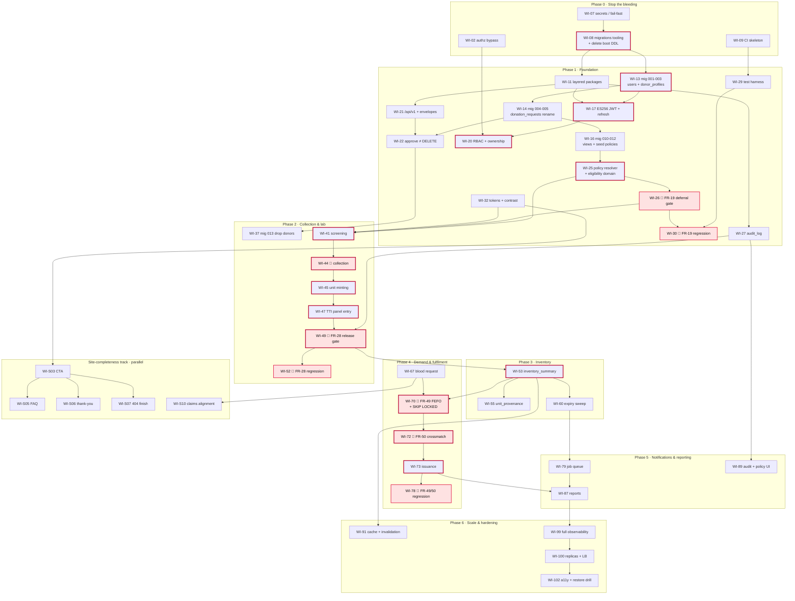

# BBank — Implementation Plan

> **Status:** Draft v1 · **Date:** 2026-09-01 · **Branch of record:** `oc-redesign-skill-refactor`
>
> This document sequences the work described by its five siblings. It invents no requirements,
> no table names and no technical decisions of its own. Where it appears to, that is a defect —
> report it against the owning document.

### Sibling documents

| Document | Owns | This plan uses it for |
|---|---|---|
| [`PRD.md`](./PRD.md) | Requirement IDs `FR-01`…`FR-83`, `NFR-01`…`NFR-26`, scope phasing (§6), open questions (§13) | Every work item's **Satisfies** column |
| [`TRD.md`](./TRD.md) | Architecture, API surface, auth model, testing (§13), CI/CD (§14), technical debt register `TD-01`…`TD-23` (§16.1) | Phase 0 and Phase 1 content; testing milestones; rollback |
| [`DATABASE_SCHEMA.md`](./DATABASE_SCHEMA.md) | 21 tables, 21 enums, 4 views, the ordered migration plan (§11.2) | Which migration runs in which phase |
| [`USER_JOURNEY.md`](./USER_JOURNEY.md) | Route inventory and gap table (§9), site-addition placement (§7) | Which routes go live in which phase |
| [`UIUX_BRIEF.md`](./UIUX_BRIEF.md) | Design tokens, component specs (§9), build order (§14.4), screen DoD (§14.5) | Frontend sequencing; the site-completeness track |
| [`PROJECT_STATUS.md`](./PROJECT_STATUS.md) | Live progress — the source of truth per `CLAUDE.md` | Updated at every phase boundary (§12 below) |

---

## 1. How to use this plan

### 1.1 Notation

| Symbol | Meaning |
|---|---|
| `WI-nn` | A work item on the main sequenced track. Numbering is global and never reused. |
| `WI-Snn` | A work item on the **site-completeness track** (§6) — deliberately low-dependency. |
| **Area** | `be` backend · `fe` frontend · `db` migrations & data · `infra` CI/CD, Docker, ops · `docs` |
| **Effort** | `S` ≤ 1 dev-day · `M` 2–4 dev-days · `L` 1–2 dev-weeks · `XL` 3+ dev-weeks. One "dev-day" is one focused engineer-day, not an elapsed calendar day. |
| **Satisfies** | The `FR-`/`NFR-` IDs the item delivers. `(enabler)` means the item makes those IDs *possible* without completing them. |
| **Deps** | Other `WI` IDs that must be **merged and deployed** first. |
| 🛑 | Touches one of the four clinical safety gates. Never shipped without its named regression test. |

### 1.2 What "done" means

A work item is done when **all** of the following hold:

1. Every acceptance criterion in its row is demonstrably true in a deployed environment (staging at minimum).
2. The `FR`/`NFR` acceptance criteria in [`PRD.md`](./PRD.md) §7–§8 for the cited IDs are satisfied — the plan's AC column is a *summary*, the PRD's is authoritative.
3. Tests exist at the layer [`TRD.md`](./TRD.md) §13.1 prescribes, and CI gates pass (§13.2 coverage floors).
4. If it is a UI item, the screen DoD in [`UIUX_BRIEF.md`](./UIUX_BRIEF.md) §14.5 is checked off in the PR.
5. `docs/PROJECT_STATUS.md` is updated **in the same change** (see §12).

A work item is **not** done because the code merged. It is done because the behaviour is observable.

### 1.3 The four clinical safety gates

These four are called out everywhere in this plan because they are the four places where a
software defect becomes patient harm. They are never deferred to "later hardening" and they never
ship behind a feature flag that can be turned off.

| Gate | Requirement | Enforced at | Named regression test lands in |
|---|---|---|---|
| **Deferral enforcement** | `FR-19` | Server-side on book, check-in and collection | Phase 1 — `WI-30` |
| **TTI release gate** | `FR-28` | Service layer **and** DB trigger (schema §9.3) | Phase 2 — `WI-52` |
| **Compatibility + FEFO + allocation concurrency** | `FR-49` | `SELECT … FOR UPDATE SKIP LOCKED` + partial unique index + trigger (TRD §10.2) | Phase 4 — `WI-78` |
| **No issue without crossmatch** | `FR-50` | Service layer, no admin bypass (`FR-71` explicitly cannot override it) | Phase 4 — `WI-78` |

---

## 2. Guiding sequencing principles

Stated explicitly, because every phase boundary below is derived from them.

| # | Principle | Why it constrains the order |
|---|---|---|
| **P1** | **Security fixes land before features.** | The session cookie is unsigned plain JSON (`TD-01`), admin is a hardcoded credential (`TD-02`), CORS is `*` (`TD-03`), and `getAppointment` returns any donor's appointment when `?donor_id=` is omitted (`TD-07`). Building a six-role clinical system on that foundation means every feature added is another surface behind a door that does not lock. Phase 0 and the auth block of Phase 1 exist to fix the door first. |
| **P2** | **Schema and migrations precede the API that reads them.** | Today the schema is created at boot with `CREATE TABLE IF NOT EXISTS` (`TD-04`), which silently skips drift and has no version and no down path (schema §11.1). Nothing downstream is safe until migrations are a real, ordered, reversible artefact. This is why `WI-08` is in Phase 0 and the bulk of the DDL is early Phase 1. |
| **P3** | **The four clinical safety gates are never deferred.** | `FR-19`, `FR-28`, `FR-49`, `FR-50` ship *with* their features, with their named regression tests (`NFR-26`), in the same phase. There is no phase in this plan labelled "add the safety checks". A release gate added after units are already flowing is not a gate, it is a retrofit with a hole behind it. |
| **P4** | **Every phase ends with the application working and deployable.** | No phase leaves the system half-migrated. The one genuinely one-way migration — `000013_drop_legacy_donors` — is a *separate release* at the Phase 2 entry, run only after the new code has been live and verified (schema §11.2 note on step 13). Expand/contract in three deploys (TRD §14.3) applies to every breaking change. |
| **P5** | **The site-completeness track is deliberately independent and runs in parallel.** | The nine requested additions (§6) touch `bbank/src/app/**` and `bbank/src/components/**` only. They depend on the design-token repairs and three primitives, and on nothing clinical. A second person can ship the whole track while the backend is mid-refactor — and it is the only part of this plan that produces visible progress in the first month, which matters for morale on a build this long. |
| **P6** | **No infrastructure before its named trigger fires.** | [`TRD.md`](./TRD.md) §9.11 gives each of the ten scaling rules a numeric adoption trigger, and `NFR-24` makes "trigger defined, not assumed" a requirement. Redis, the queue, the CDN, replicas and the load balancer are Phase 5–6 here for exactly that reason. `R-06` in TRD §16.2 names premature adoption as the failure mode this whole document set exists to prevent. |
| **P7** | **Strangler, never big-bang.** | TRD `R-08`: the layered refactor moves one resource per PR with tests, new resources are born in the new structure, and `main.go` shrinks. There is no "rewrite week". |

### 2.1 Phase numbering reconciliation

⚠️ **Read this before comparing phase numbers across documents.** The PRD (§6) and TRD (§9.11)
use a coarse four-phase scope scheme. This plan uses six execution phases plus Phase 0, because
sequencing needs finer granularity than scoping does. They map as follows:

| This plan | PRD §6 bucket | TRD §9.11 label |
|---|---|---|
| Phase 0 | (pre-v1 hygiene) | Phase 1 items `TD-01`…`TD-15` |
| Phase 1 | v1 | Phase 1 |
| Phase 2 · Phase 3 · Phase 4 | v1 | Phase 1–2 |
| Phase 5 | v1 tail + v2 | Phase 2 |
| Phase 6 | v2 + Later | Phase 3–4 |

Where a sibling document says "Phase 2", it means the PRD/TRD bucket. Where this document says
"Phase 2", it means the execution phase below.

---

## 3. Phase 0 — Stop the bleeding

> **Goal:** remove the findings that make the current deployment unsafe to expose, and put the
> two tools in place (migrations, CI) that everything after this depends on.
>
> **User-visible outcome:** none. The application behaves identically. That is the point — this
> phase is entirely below the waterline, and it is short.

**Entry criteria:** none. This starts today.

**Exit criteria:**
- No credential appears in application logs, source, or the committed compose file.
- `GET /appointments/{id}` cannot return another donor's record by any parameter manipulation.
- CORS responds only to the configured frontend origin.
- The application refuses to start without `DATABASE_URL` rather than guessing one.
- `migrate` runs from a `migrations/` directory; the boot-time `CREATE TABLE` block is deleted.
- CI runs on every push and fails on lint, vet, a known vulnerability, or a detected secret.
- `docs/` and `CLAUDE.md` are tracked in git.

### 3.1 Work items

| WI | Title | Description | Area | Effort | Deps | Satisfies | Acceptance criteria |
|---|---|---|:--:|:--:|---|---|---|
| **WI-01** | Redact the DSN at boot | `backend/main.go:71` prints the connection string **including the database password** to container logs. Log the host, port and database name only; never the DSN. | be | S | — | `NFR-13` · `TD-10` | `docker compose logs goapp` contains no password substring; a CI grep asserts it |
| **WI-02** | Close the appointment ownership bypass | `getAppointment` (`main.go:42-46`) gates its ownership check on `if donorId != ""` — omitting `?donor_id=` returns **any** donor's appointment. Make ownership unconditional; derive the donor from the session, not the query string. | be | S | — | `FR-65` · `NFR-11` · `TD-07` | `GET /appointments/{id}` with no `donor_id` and a non-owner session returns `404`; a regression test asserts it and stays in the suite permanently |
| **WI-03** | CORS lockdown | Replace `Access-Control-Allow-Origin: *` (`main.go:159`) with an env-driven allowlist per TRD §8.1; reflect only allowed origins; add `Vary: Origin`. | be | S | — | `NFR-12` · `TD-03` | A request from an unlisted origin receives no ACAO header; the configured origin does |
| **WI-04** | Connection pool configuration | `SetMaxOpenConns`, `SetMaxIdleConns`, `SetConnMaxLifetime`, `SetConnMaxIdleTime` are all unset. Apply the numbers in TRD §11.3. | be | S | — | `NFR-02` · `TD-09` | Pool settings are read from config; a load test does not produce `too many clients` |
| **WI-05** | HTTP server timeouts & graceful shutdown | Replace `http.ListenAndServe` with a configured `http.Server` (read/write/idle/header timeouts) and a signal-driven graceful shutdown. | be | S | — | `NFR-05` · `TD-14` | A slowloris-style connection is dropped at the header timeout; SIGTERM drains in-flight requests |
| **WI-06** | Track the documentation set in git | `.gitignore` lines 3–4 ignore `CLAUDE.md` and the **entire `docs/` directory** — the six planning documents and the designated source-of-truth progress file are all untracked. Remove both entries; keep `.env` and `.claude/` ignored. | docs · infra | S | — | `NFR-26` (enabler) · TRD `R-11` | `git ls-files docs/` lists all six documents; `CLAUDE.md` is tracked; `.env` remains ignored |
| **WI-07** | Secret hygiene & fail-fast configuration | Delete the hardcoded fallback DSN (`main.go:65`) — fail fast with a clear error when `DATABASE_URL` is absent. Remove `POSTGRES_PASSWORD: <dev-password>` from `compose.yaml`; inject with no default. Add `.env.example`. | be · infra | M | WI-01 | `NFR-13` · `TD-11` · `TD-12` | The container exits non-zero with a named error when config is missing; no password literal remains in the repo |
| **WI-08** | Adopt `golang-migrate`; stop creating the schema at boot | Introduce `backend/migrations/` and `cmd/migrate`. Capture today's three tables as a `000000_baseline` so existing databases reconcile. **Delete** the `CREATE TABLE IF NOT EXISTS` block (`main.go:90-125`) per schema §11.1. Add a `migrate` one-off compose service that runs to completion before `goapp`. | db · infra | M | WI-07 | `NFR-26` (enabler) · `TD-04` | `migrate … up` and `down` both run clean against an empty database and against a database holding today's data; the app no longer executes DDL |
| **WI-09** | CI skeleton | GitHub Actions per TRD §14.1, initially the cheap gates only: `golangci-lint`, `go vet`, `go build`, `tsc --noEmit`, `eslint`, `govulncheck`, `npm audit`, `gitleaks`. Test and coverage gates arrive with `WI-29`. | infra | M | WI-06 | `NFR-14` · `NFR-26` · `TD-18` | A PR with a lint error, a known-vulnerable dependency, or a committed secret cannot merge |
| **WI-10** | Structured logging with correlation IDs | Replace `log`/`fmt` with `log/slog` JSON. Middleware assigns a request ID, propagates it, and logs method, route, status, duration and actor. Redact known-sensitive fields. | be | M | WI-01 | `NFR-25` · `TD-13` | Any request is reconstructable from logs by correlation ID; no PHI or credential appears in a log line |

**Migrations run in this phase:** `000000_baseline` only — a faithful capture of the three
existing tables so that `golang-migrate` has a known starting point. No data is transformed.

**Routes that become live:** none.

### 3.2 Phase 0 risks

| Risk | Mitigation |
|---|---|
| `WI-06` un-ignores `docs/` — if any secret was ever written into a doc, this publishes it. | Run `gitleaks` over `docs/` **before** the un-ignore commit (that is why `WI-09` includes it and why `WI-06` is a dependency of `WI-09`, not the reverse — do the scan manually first). |
| Deleting the boot-time DDL (`WI-08`) breaks a fresh `docker compose up` for anyone who has not read the change. | The `migrate` compose service runs before `goapp` with `depends_on: condition: service_completed_successfully`; update the "Running locally" block in `CLAUDE.md` in the same PR. |
| `WI-02` changes an endpoint's behaviour without a version bump. | It is a security fix to a bypass, not a contract change. Any client relying on the bypass was reading data it had no right to. Note it in the changelog. |

---

## 4. Phase 1 — Foundation: identity, authorization, schema, architecture

> **Goal:** replace the forgeable two-role session with a real six-role identity model backed by
> an ES256 JWT; land the full 21-table schema; move the backend to the layered structure; make
> approval a status transition instead of a `DELETE`; turn clinical thresholds into policy data.
>
> **User-visible outcome:** the application looks almost unchanged, but the hardcoded admin is
> gone, every user is a real row with a real role, a tampered cookie signs you out, the donation
> request history survives approval, and a donor inside a deferral or interval window is blocked
> from booking with the date they become eligible.

**Entry criteria:** Phase 0 exit criteria met ✅; the deployment timezone is confirmed ✅ —
**`OD-14` answered 2026-09-01: `Africa/Douala`** (WAT, UTC+1, no DST).

**Exit criteria:**
- No code path reads `donors`; the application runs entirely on `users` + `donor_profiles`.
- Every endpoint is served under `/api/v1/`; `/api/go/` still works and carries `Deprecation`/`Sunset` headers.
- Approving a donation request writes `status='approved'` and creates the appointment; **no row is deleted**.
- Every eligibility threshold is read from `policies`; no clinical constant remains in Go source.
- `FR-19` deferral enforcement is live server-side with a named regression test (`WI-30`).
- `internal/domain` coverage ≥ 90 % and CI enforces it.
- `CLAUDE.md` describes the layered architecture, not the single-file one.

### 4.1 Work items

| WI | Title | Description | Area | Effort | Deps | Satisfies | Acceptance criteria |
|---|---|---|:--:|:--:|---|---|---|
| **WI-11** | Layered package skeleton | Create `cmd/api`, `cmd/migrate`, `internal/{domain,service,store,http,middleware,platform}` per TRD §4.2. Wire config → store → service → handlers. Enforce the dependency rule in CI (`domain` imports nothing from the project). Move `donors` first as the strangler pilot. Adopt `sqlc` + `pgx` in `store/`, retiring the maintenance-mode `lib/pq` driver (TRD §5.1). | be | L | WI-08 | `NFR-26` · `TD-06` · `TD-16` | The arch-lint check fails a deliberate `domain → store` import; `donors` is served entirely from the new structure |
| **WI-12** | Rewrite the `CLAUDE.md` backend convention | TRD §4.4 **supersedes** the "backend is intentionally one file; keep handlers as `func(db *sql.DB) http.HandlerFunc`" convention. Replace it with the §4.2 layout and dependency rule, and record the rationale in the diff. Until this lands, `CLAUDE.md` actively steers contributors — human and agent — back into `main.go`. | docs | S | WI-11 | `NFR-26` · `TD-22` | `CLAUDE.md` §Conventions matches TRD §4.2; the change is noted in `PROJECT_STATUS.md`'s changelog with its rationale |
| **WI-13** | Migrations `000001`–`000003` | `extensions_and_enums` (4 extensions, 20 `CREATE TYPE`); `core_identity` (`users`, `donor_profiles`, `migration_rejects`, backfill from `donors` preserving `donors.id` as `users.id`); `reference_and_facilities` (`donation_centers`, `storage_locations`, `hospitals`, `policies`, `test_types`, `abo_compatibility`). Schema §11.2 steps 1–3, §11.3. | db | L | WI-08 | `FR-01` · `FR-14` · `FR-44` · `FR-68` (enabler) | Every legacy donor is either a `users` row or a triaged `migration_rejects` row — the counts reconcile exactly; `donors` is untouched |
| **WI-14** | Migrations `000004`–`000005` | `rename_requests` (`requests` → `donation_requests`, add `center_id`/`preferred_date`/`status`/review columns, repoint FKs at `donor_profiles`, `TIMESTAMPTZ` conversion); `appointments_upgrade` (rename `request_id`, quarantine dangling values, add `scheduled_at`/`status`/`checked_in_at`, add the three real FKs). Schema §11.2 steps 4–5, §11.4, §11.5. | db | L | WI-13 | `FR-08` · `FR-09` · `FR-10` · `TD-05` | Row counts before and after match; every dangling `request_id` produced by the historical hard `DELETE` is quarantined and reported, never silently nulled |
| **WI-15** | Migrations `000006`–`000009` | `screening_and_collection`, `inventory`, `demand_and_fulfilment`, `platform` (partitioned `audit_log`, `notifications`). All purely additive — the tables are created empty now so later phases add behaviour, not DDL. Schema §11.2 steps 6–9. | db | M | WI-14 | `FR-15`…`FR-52` (enabler) · `FR-67` | All 21 tables exist; `migrate down` from `000009` to `000005` runs clean |
| **WI-16** | Migrations `000010`–`000012` | `views_and_triggers` (7 trigger functions, 4 views — `inventory_summary`, `active_policies`, `donor_eligibility`, `unit_provenance`); `indexes` (38, `CONCURRENTLY`, outside a transaction); `seed_reference_data` (`policies` from foundation §3.3 defaults, `test_types`, `abo_compatibility`, real centers). Schema §11.2 steps 10–12, §12. | db | L | WI-15 | `FR-20` · `FR-26` · `FR-32` · `FR-68` | `SELECT * FROM active_policies` resolves every clinical constant; the seed is idempotent under re-run (`ON CONFLICT DO NOTHING`) |
| **WI-17** | ES256 JWT + rotating refresh token | Keypair in `platform/auth`; Go holds the private key, Next.js only the public key. 15-minute access token with the §7.3 claim set (`sub`, `sid`, `role`, `cid`, `hid`, `ver`); opaque 7-day refresh with rotation and reuse detection (family revocation + `security.refresh_reuse` alert). `POST /api/v1/auth/{login,refresh,logout}`. | be | L | WI-11, WI-13 | `FR-03` · `NFR-08` · `TD-01` | A tampered token is rejected; a reused refresh token revokes the family; bumping `users.token_version` invalidates outstanding access tokens immediately |
| **WI-18** | Remove the hardcoded admin credential | Delete the credential from the login server action (`login/page.tsx:13-16`). Bootstrap the first admin from an environment-supplied one-time invite, not a literal. Implement invite / suspend / reactivate / role-change. | be · fe | M | WI-17 | `FR-65` · `FR-66` · `TD-02` | No credential literal exists in the frontend; suspending a user invalidates their session on the next request, not the next login |
| **WI-19** | Frontend session migration | Replace `JSON.parse` of the unsigned `bb_session` cookie with `jose` ES256 verification against the API public key. Rewrite `src/proxy.ts` for six roles (it currently knows `'admin' \| 'donor'`). Introduce `src/lib/apiClient.ts` — attaches the cookie, unwraps the `{data}` envelope, maps the error envelope, sets `Idempotency-Key`. Extract the inline server actions from `page.tsx` files into `src/lib/actions/<resource>.ts` (TRD §4.3) so they become testable. | fe | L | WI-17 | `FR-03` · `FR-65` · `NFR-11` · `TD-01` · `TD-19` | Editing the cookie by one byte signs the user out; a `staff` session cannot reach `/admin`; the Edge/Node runtime question (`OD-16`) is resolved or the ES256 default documented |
| **WI-20** | RBAC middleware & ownership from the token | Implement the TRD §7.6 permission matrix as middleware, and §7.7 ownership rules derived from `sub`/`cid`/`hid` — never from a query parameter. Generalises the `WI-02` hotfix into a rule. | be | L | WI-17 | `FR-65` · `NFR-11` · `TD-07` | Every cell of the §7.6 matrix is asserted positively and negatively in an integration test generated from a table |
| **WI-21** | `/api/v1/` router, envelopes, and the `/api/go/` shim | Canonical `/api/v1/` prefix (TRD §6.1). Success and error envelopes (§6.2) — no bare arrays. Pagination (§6.3). Idempotency scaffolding (§6.4). `/api/go/` serves the five unchanged legacy endpoints by internal rewrite, with `Deprecation: true` and `Sunset: Wed, 31 Mar 2027`, behind a feature flag so it can be toggled during sunset. Pagination closes the unbounded list scans on `/donors` and `/appointments`. | be | L | WI-11 | `NFR-02` (enabler) · `TD-15` · `TD-17` | No endpoint returns a raw driver error; every legacy path still works and carries the deprecation headers; the flag turns the shim off and on without a redeploy |
| **WI-22** | Migrate the three legacy resources to v1 | Donors, donation-requests and appointments handlers move into the layered structure. **`POST /donation-requests/{id}/approve` sets `status='approved'` and creates the appointment in one transaction — it does not delete the request row** (`main.go:452` today destroys the audit chain). The legacy alias also stops deleting: deleting was the bug. | be | L | WI-21, WI-14 | `FR-09` · `FR-11` · `TD-05` · `TD-21` | Approving a request leaves the row present with `status='approved'` and a linked appointment; rejection requires a reason from a controlled list |
| **WI-23** | Cancel, reschedule and the no-show sweep | The missing mutation endpoints (`P1-4`): cancel and reschedule an appointment before check-in, cancel a donation request. Daily idempotent `no_show` sweep. | be | M | WI-22 | `FR-11` · `FR-13` · `TD-21` | Cancelling frees the slot immediately; the sweep is safe to run twice and creates no deferral |
| **WI-24** | Donation centers & slot capacity | Center CRUD (address, region, hours, per-slot capacity) and capacity-aware scheduling. Over-booking must be impossible **under concurrent approvals** — a constraint, not a check-then-insert. | be · fe | L | WI-13 | `FR-10` · `FR-14` | Two simultaneous approvals into a one-seat slot produce exactly one appointment; deactivating a center stops new bookings and preserves history |
| **WI-25** | Policy resolver & the eligibility domain | `internal/domain/eligibility.go` and `shelflife.go` read every threshold from `active_policies` — age, weight, Hb by sex, interval, annual caps, vitals ranges, shelf lives, TTI panel composition. **No clinical constant remains in Go source.** Policy version is stamped on every decision. | be | L | WI-16 | `FR-17` · `FR-20` · `FR-68` | Changing a `policies` row changes the next decision and leaves past decisions untouched; `grep` finds no numeric clinical literal in `internal/` |
| **WI-26** 🛑 | Deferral enforcement — gate 1 | Wire the `donor_eligibility` view and the eligibility domain into booking, so an active deferral or an open interval window blocks a donation request **server-side**, with the eligible date and a plain-language reason. Extended to check-in and collection in Phase 2 (`WI-39`, `WI-44`). | be | M | WI-25 | **`FR-19`** · `FR-08` · `FR-04` | The block cannot be bypassed by calling the API directly; a permanent deferral is bypassable only by `admin`, and that override is audited |
| **WI-27** | Audit log | Append-only `audit_log` writes for every mutation and every privileged read of clinical or personal data: actor, action, entity, before/after, IP, user agent. Enforced by trigger (schema §9.5) so no application path can skip it. | be | L | WI-11, WI-15 | `FR-67` · `NFR-18` | A synthetic tampering attempt through the application fails; audit coverage is asserted by test, not by inspection |
| **WI-28** | Login rate limiting | In-process token bucket on `POST /auth/login` (5/min/IP) and signup, ahead of the Redis limiter in Phase 6. Document the emergency carve-out now so `WI-68` inherits it: **an `emergency` blood request is queued and alerted, never rejected**. | be | M | WI-17 | `NFR-12` · `FR-03` | The 6th login attempt in a minute is rejected and logged without revealing which factor was wrong |
| **WI-29** | Test harness & coverage gates | `testcontainers-go` + Postgres 18; migrations applied `up → down → up` in CI; table-driven domain tests; fixtures reproducing today's production shape. Add the coverage gates to `WI-09`'s pipeline: `internal/domain` ≥ 90 %, service ≥ 70 %, backend overall 80 % reported. | be · infra | L | WI-11, WI-16 | `NFR-26` · `TD-08` | CI fails a PR that drops domain coverage below 90 %; the `requests` → `donation_requests` migration is tested against a fixture including the rows the old `confirm` deleted |
| **WI-30** 🛑 | Phase 1 safety regression suite | Named, permanent tests for: `FR-19` deferral enforcement (temporary, permanent, interval boundary at 55/56/57 days); the `WI-02` ownership regression (omitting `donor_id`); the full §7.6 RBAC matrix; auth boundaries (expired, wrong-signature, `ver` bump, refresh reuse). | be | M | WI-29, WI-26, WI-20 | **`FR-19`** · `FR-65` · `NFR-26` | Each test is named for the requirement it guards; deleting the guard makes a test fail, not merely reduce coverage |
| **WI-31** | Admin CRUD consoles — users, donors, requests | `/admin/users`: invite, assign role, suspend, reactivate, trigger password reset — replacing the hardcoded admin operationally, not just in code. Plus the **edit/delete donor** and **reject request** UI the backend has supported since day one but no operator can reach (`P2-6`). Destructive actions go through `ConfirmDialog`. | fe | M | WI-18, WI-20 | `FR-66` · `FR-09` · `TD-20` | An admin can create a `lab_tech` who can log in and reach `/lab` and nothing else; no backend mutation remains unreachable from the UI |
| **WI-32** | Design token layer & contrast repairs | UI/UX §14.4 step 1. Add the §5.1–§5.8 token blocks. **Repair `--text-3` and `--border-strong`, and introduce `--accent-fill`** — rose-600 `#e11d48` as a background with white text measures 4.6:1 and fails AA for small text (`NFR-20`). Add the reduced-motion and `scripting: none` rules. No new pages. | fe | L | — | `NFR-20` · `NFR-21` | Every token pairing in use passes AA at its rendered size; `.btn-primary` uses the compliant fill; automated contrast check is clean |
| **WI-33** | Status primitives | UI/UX §14.4 step 2. `src/lib/status.ts`, `StatusBadge`, `BloodGroupChip`. **Retrofit the three existing admin tables immediately** so the primitives are proven before the new consoles depend on them. | fe | M | WI-32 | `NFR-20` · `FR-59` (enabler) | No status renders as an ad-hoc `badge-green`/`badge-muted` class anywhere; every status is readable in greyscale |
| **WI-34** | `DataTable`, `EmptyState`, density scale | UI/UX §14.4 step 3 and §5.3. Retrofit the same three admin tables. Screen-reader semantics for clinical tables per §6.5. | fe | M | WI-33 | `NFR-21` · `FR-59` (enabler) | The three retrofitted tables are keyboard-navigable and announce correctly; every zero-result path shows an `EmptyState` |
| **WI-34a** | Donor profile completion | `/donor/settings` gains the fields the schema adds but no UI reaches: `national_id`, `emergency_contact_name`/`_phone`, `city`/`region`. Blood group and rhesus become fixed selects bound to the `blood_group`/`rhesus` enums, never free text. Date of birth is validated against the 16–100 band at entry. A completeness meter names the missing fields. Declared group stays advisory until `WI-48` confirms it. | fe · be | M | WI-13, WI-34 | `FR-02` · `FR-01` | A donor can fill every profile field the schema stores; an out-of-band date of birth is rejected at entry, not at submit; the meter names each missing field rather than showing a bare percentage |

**Migrations run in this phase:** schema §11.2 steps **1 through 12** (`000001`…`000012`), in the
documented order. Step 13 (`drop_legacy_donors`, shipping as `000014`) is deliberately **not** run here — see `WI-37`.

**Routes that become live** (UJ §9.7, §9.8): `/admin/users` `[NEW]`; `/admin/donation-requests`
(renamed from `/admin/requests`); the existing `/admin`, `/admin/donors`, `/admin/appointments`,
`/donor/[id]`, `/donor/settings` all move to real role guards. The `staff`, `lab_tech`,
`inventory_manager` and `hospital_user` roles become *creatable* but have no console yet.

### 4.2 Phase 1 risks

| Risk | Mitigation |
|---|---|
| **The `donors` → `users` + `donor_profiles` split loses or mangles history** (PRD `R7`, TRD `R-05`) | `donors.id` is preserved as `users.id`; rows that cannot become a user go to `migration_rejects`, never silently dropped; `donors` is left in place and untouched until `WI-37`, a separate release. Full rollback procedure in §11.2. |
| The layered refactor stalls half-done (TRD `R-08`) | Strangler by resource, one PR each, `donors` first as the pilot. `main.go` line count is tracked in `PROJECT_STATUS.md` as a visible burn-down. |
| Timezone assumed rather than confirmed (schema `Q6`) | **Hard blocker on `WI-14`/`WI-15`.** Confirm before the backfill runs; a wrong guess shifts every backfilled appointment by hours and is not cheaply reversible after users see the data. |
| ES256 verification fails on the deployed Next.js runtime | TRD `Q7` — ES256 is chosen precisely because Web Crypto supports it on both Node and Edge. Verify on the actual target runtime in `WI-19`, not in local dev only. |
| `/api/go/` consumers break during the migration | The shim is behind a feature flag (`WI-21`) and every legacy path is covered by an integration test asserting the old response shape. |

---

## 5. Phases 2–6 — the main body

### 5.1 Phase 2 — Collection & laboratory: the safety spine

> **Goal:** the system records *blood* for the first time. Check-in → screening → deferral or
> collection → units minted into quarantine → TTI panel → release or discard.
>
> **User-visible outcome:** a phlebotomist works the morning queue in BBank instead of on paper,
> and a lab technician releases units through a gate that cannot be skipped. Of the 15 master-flow
> steps in UJ §3.1, this phase moves roughly seven from ❌ to ✅.

**Entry criteria:** Phase 1 exit met; the new tables have been live in production for at least one
full week with reconciled row counts; a verified restorable backup exists (precondition for `WI-37`).

**Exit criteria:** a donation recorded in BBank produces coded units in `quarantined`; a complete
non-reactive panel releases them to `available` and no other path can; a reactive result discards
every sibling unit, defers the donor and queues a confidential notification; `FR-28` has a named
regression test; legacy `donors` is dropped.

| WI | Title | Description | Area | Effort | Deps | Satisfies | Acceptance criteria |
|---|---|---|:--:|:--:|---|---|---|
| **WI-35** | `ConsoleShell`, `nav.ts`, dashboard error boundary | UI/UX §14.4 step 5. Role → sidebar manifest replacing the role ternary in `SidebarNav`; console switcher; centre context; 44px targets; console skip target; `(dashboard)/error.tsx`. Unblocks all four new consoles. | fe | L | WI-34 | `FR-59` · `NFR-21` | A `lab_tech` sees only lab navigation; keyboard path through the shell is verified |
| **WI-36** | `ConfirmDialog` | UI/UX §14.4 step 6. Blocks every destructive clinical action — build before the first one ships. Copy from §13.6. | fe | S | WI-32 | `FR-40` (enabler) · `NFR-21` | Focus is trapped and restored; the destructive verb appears in the confirm button, not "OK" |
| **WI-37** | Migration `000014` — drop legacy `donors` | Schema §11.2 step 13, renumbered to `000014` (WI-11 took `000013` for the donation-counter fix). **A separate release, one-way.** Runs only after the application has run entirely on `users` + `donor_profiles` in production, `migration_rejects` is empty or triaged, a row-count reconciliation passes, and a restorable backup is verified. | db | S | WI-22 (live ≥ 1 week) | `NFR-26` | The reconciliation query returns zero discrepancies before the drop; the pre-drop snapshot is recorded with its restore command |
| **WI-38** | Staff shift board `/staff` | Today's appointments, arrival state, capacity, emergency banner slot. `DataTable` compact density. | fe | M | WI-35 | `FR-59` | Every figure states its period and refresh time; loads within `NFR-04` |
| **WI-39** 🛑 | Donor search & check-in | Postgres `pg_trgm` fuzzy search by name, phone, email, national ID, donor code (schema §7.2). Check-in sets `checked_in_at`; same-day only with an audited override; **blocks on an active deferral** with the reason shown. | be · fe | L | WI-20, WI-26, WI-35 | `FR-05` · `FR-12` · **`FR-19`** · `NFR-03` | A misspelt name still returns the record; p95 search ≤ 500 ms; check-in of a deferred donor is refused server-side |
| **WI-40** | Walk-in registration | `/staff/check-in?walkin=1` — staff create a donor and check them in without a prior request. | be · fe | M | WI-39 | `FR-01` · `FR-05` | A walk-in reaches screening in under a minute of keystrokes; duplicate warning on matching national ID or phone |
| **WI-41** | Screening: questionnaire and vitals | Structured versioned questionnaire (answers stored with the version used); Hb, BP, pulse, weight, temperature with physiologically-plausible range rejection at entry and fixed displayed units. Missing Hb blocks a `passed` outcome. UI/UX §8.4. | be · fe | XL | WI-25, WI-39, WI-36 | `FR-15` · `FR-16` | Required questions cannot be skipped to reach an outcome; an implausible value is refused at the field, not at submit |
| **WI-42** | Automated eligibility evaluation & override | The domain evaluates vitals, age, interval and deferral history against active policy and **proposes** an outcome, naming each failing criterion individually. Staff override requires a reason and is audited. Policy version stored on the screening. | be | L | WI-41, WI-25, WI-27 | `FR-17` · `FR-20` · `FR-67` | The UI never shows a bare "ineligible"; an override without a reason is impossible |
| **WI-43** 🛑 | Deferral recording & donor-facing view | A `deferred_temporary`/`deferred_permanent` outcome creates a `deferrals` row (type, reason, start, end); the appointment moves to `deferred`, not `completed`. Donor sees `/donor/[id]/deferral` with a plain-language explanation and the lift date. Extends `FR-19` enforcement to all three chokepoints. | be · fe | L | WI-41 | `FR-18` · **`FR-19`** · `FR-04` | A temporary deferral requires an end date; a permanent one must not have one; the donor cannot rebook and is told why, not shown an error code |
| **WI-44** 🛑 | Record a collection | `donations` row against a checked-in, screened-and-passed appointment: volume, time, bag lot, phlebotomist. Appointment → `completed` and donor counters + next-eligible date update **in the same transaction** (TRD §10.3). Refuses without a passing screening, and refuses on an active deferral. | be · fe | L | WI-42, WI-43 | `FR-21` · `FR-25` · **`FR-19`** | Collection without a passing screening on the same appointment is refused server-side; the donor's next-eligible date is visible immediately |
| **WI-45** | Unit code generation & quarantine minting | Each collection mints one or more `blood_units` with globally unique, never-reused codes, `status='quarantined'`, expiry from the component's policy shelf life, and the **first** `unit_status_events` row. Printable/scannable label (physical printing deferred — `OD-15`). | be | L | WI-44, WI-25 | `FR-22` · `FR-24` · `FR-37` · `FR-32` | No quarantined unit is visible to allocation by any role; unit creation always writes the first status event |
| **WI-46** | Adverse reaction recording | Severity, action taken, visibility on the donor record for future screenings; a severe reaction prompts a deferral decision before the record closes. | be · fe | M | WI-44 | `FR-23` | Reaction data appears in the safety report input set (`WI-101`) |
| **WI-47** | Lab worklist & TTI panel entry | `/lab` worklist ordered by donation age; `/lab/donations/[id]` five-test radio matrix (HIV 1/2, HBsAg, HCV, syphilis, malaria — **panel composition from `test_types` policy, not code**). Each result records tester and timestamp. `indeterminate` holds the unit and flags a repeat; originals are never overwritten. | be · fe | XL | WI-45, WI-16 | `FR-26` · `FR-30` | A donation with any `pending` line stays on the worklist; a repeat result is an additional record |
| **WI-48** | ABO/Rh confirmation | The lab confirms group and rhesus independently of the donor's declaration. A discrepancy raises an alert and **blocks release**; the confirmed group is what allocation uses. | be · fe | M | WI-47 | `FR-27` | A mismatched declaration blocks release until resolved; the donor profile updates only after resolution, with audit |
| **WI-49** 🛑 | The TTI release gate | `quarantined → available` only when **every** mandatory panel line is `non_reactive` and the group is confirmed. Enforced in the service layer **and** by the DB trigger (schema §9.3), so there is no UI path — admin included — that skips it. Release writes a status event with actor and reason. | be | L | WI-47, WI-48 | **`FR-28`** · `FR-37` | Release is refused server-side if any line is missing, `pending`, `reactive` or `indeterminate`; a direct SQL `UPDATE` attempting the bypass is rejected by the trigger |
| **WI-50** | Reactive result handling | One atomic action: discard **all** sibling units from the donation, apply the policy deferral for the specific marker, and raise a confidential donor notification whose body states no clinical finding. UI/UX §13.3 — the most sensitive screen in the system. | be · fe | L | WI-49 | `FR-29` · `FR-57` | No notification payload contains a result; the discard, deferral and notification succeed or fail together |
| **WI-51** | Quarantine view `/lab/quarantine` | Held units, oldest first, with `ExpiryIndicator`. Donations held beyond a configurable window escalate to the lab lead. | fe | M | WI-49 | `FR-24` · `FR-30` | Escalation window is a policy value, not a constant |
| **WI-52** 🛑 | Phase 2 safety regression suite | Named permanent tests: `FR-28` release gate (every refusal branch, plus the trigger-level bypass attempt); shelf-life per component including DST and leap-year boundaries; eligibility boundaries per TRD §13.3; the unit state machine's illegal transitions. Playwright journeys 1–5 (TRD §13.5). | be | L | WI-49, WI-29 | **`FR-28`** · `NFR-26` | Removing any branch of the release gate makes a named test fail |

**Migrations:** `000013_drop_legacy_donors` (schema §11.2 step 13) as its own release at the phase
entry. No other DDL — the collection, screening and inventory tables were created in `WI-15`.

**Routes live** (UJ §9.2–§9.4): `/staff`, `/staff/check-in`, `/staff/screening/[id]`,
`/staff/collection/[id]`, `/staff/donors`, `/lab`, `/lab/donations/[id]`, `/lab/quarantine`,
`/donor/[id]/deferral`, `/donor/[id]/eligibility`, `/donor/[id]/donations`.

**Phase 2 risks**

| Risk | Mitigation |
|---|---|
| **Staff adoption fails — the desk reverts to paper** (PRD `R5`) | The screening and collection screens are designed against the 08:00–11:00 window (UJ §4.2). Collection must be recordable in under a minute. Pilot at one center. Keep the documented paper fallback and reconciliation path (`NFR-07`) — it is part of the product, not an admission of failure. |
| `WI-37` is one-way and irreversible in practice | Gated on four explicit preconditions and a separate release. §11.2 below carries the full rollback. |
| The release gate is implemented in the service layer only and a later bug bypasses it | Two independent enforcement points are required (service **and** trigger). `WI-52` tests both, including a raw SQL bypass attempt. |
| Reactive-result handling leaks a clinical finding | `FR-57` forbids the finding in any message body; `WI-50`'s acceptance criteria assert it; UI/UX §13.3 owns the copy. `OD-09` must be answered before this ships. |

---

### 5.2 Phase 3 — Inventory & traceability

> **Goal:** stock becomes visible, countable and walkable end to end. Every unit's full provenance
> is retrievable, expiry is enforced by a job rather than by hope, and discards are authorised.
>
> **User-visible outcome:** the inventory manager has a real dashboard — units on hand by group,
> rhesus, component and status, with a 72-hour expiry queue as the first thing on the page.

**Entry criteria:** Phase 2 exit met; units are being released to `available` in production.

**Exit criteria:** `inventory_summary` and `unit_provenance` back real screens; the expiry sweep
runs daily and is idempotent; no code path changes a unit's status without writing an event;
a vein-to-vein trace from a unit code completes in under two minutes (`NFR-19`).

| WI | Title | Description | Area | Effort | Deps | Satisfies | Acceptance criteria |
|---|---|---|:--:|:--:|---|---|---|
| **WI-53** | Inventory dashboard `/inventory` | `inventory_summary` view (schema §8.2) behind `InventoryGrid` + `ExpiryIndicator` + a demand panel. **Quarantined, available, reserved and issued are never conflated into one "in stock" figure.** Filterable by center. UI/UX §8.3. | be · fe | L | WI-49, WI-35 | `FR-35` · `NFR-03` | Figures reflect committed transactions with no stale read; p95 ≤ 500 ms |
| **WI-54** | Unit register & lookup by code | `/inventory/units` dense `DataTable` with a filter rail; lookup by scan or manual entry. | be · fe | L | WI-53 | `FR-36` · `NFR-03` | Lookup by code completes within `NFR-03`; donor identity is masked for roles without donor-data permission |
| **WI-55** | Provenance timeline `/inventory/units/[code]` | The `unit_provenance` view (schema §8.4) rendered as a timeline: donation, donor reference, screening, test results, storage moves, allocation, issuance. UI/UX §8.5. | be · fe | L | WI-54 | `FR-36` · `NFR-19` | A trained user completes a full trace in under 2 minutes; the trace is exportable |
| **WI-56** | Append-only status-event enforcement audit | Verify by test that no application path updates `blood_units.status` without writing `unit_status_events`; confirm the trigger rejects direct updates; confirm events cannot be edited or deleted by any role. | be | M | WI-53 | `FR-37` · `NFR-18` | Current status is reconstructible from event history for every unit in a fixture; a deliberate bypass attempt fails |
| **WI-57** | Component separation | Split a whole-blood unit into PRBC / FFP / platelets / cryo as child units linked to the parent; the parent is closed out and cannot be issued. `/inventory/processing`. | be · fe | L | WI-55 | `FR-31` | Each child has its own code and status history and inherits the donation's traceability chain |
| **WI-58** | Per-component expiry from policy | Expiry computed from collection time and the component's configured shelf life; recomputed with audit if a component type is corrected; shown wherever a unit is shown. | be | M | WI-57, WI-25 | `FR-32` | Shelf lives are `policies` rows; a component-type correction re-derives expiry and writes an audit entry |
| **WI-59** | Storage locations & temperature class | `/inventory/storage`; assigning a component to an incompatible storage class is refused; moves write status events with origin and destination; occupancy shown. | be · fe | M | WI-53 | `FR-33` | Assigning platelets to a freezer is refused at the API, not just in the UI |
| **WI-60** | Expiry sweep job | Scheduled, idempotent sweep moving past-expiry units to `expired` and out of availability, attributed to the system actor. Runs from `cmd/worker` (a minimal cron runner ahead of the full queue in `WI-79`). | be · infra | M | WI-58 | `FR-38` | Re-running the sweep changes nothing; an expired unit can never be allocated or issued; failure to run for 26 h raises an alert (TRD §12.4) |
| **WI-61** | Expiring-soon queue & alerts | `/inventory/expiry` with 72 h / 7 d / 30 d bands; window configurable per component type; the alert list is the first thing on the inventory dashboard; daily digest to inventory managers. | be · fe | M | WI-60 | `FR-39` | The window is a policy value; the digest send is recorded |
| **WI-62** | Discard with reason and authorisation | Controlled reason list (expired, reactive, processing loss, breakage, temperature excursion, returned unusable) plus an identified authorising actor. Writes a status event and an audit entry. Through `ConfirmDialog`. | be · fe | M | WI-56, WI-36 | `FR-40` · `FR-34` | A discard without a reason or an actor is impossible; a discarded unit cannot be resurrected — a correction is a new audited event |
| **WI-63** | Low-stock thresholds | Configurable minimum levels per center, group and component; breach notifies inventory managers and admins; current level vs threshold on the dashboard. | be · fe | M | WI-53 | `FR-42` | Thresholds are configuration, not code |
| **WI-64** | Phase 3 regression suite | Sweep idempotency; provenance completeness across a full synthetic chain; illegal state transitions (`issued → available`, `expired → reserved`, `discarded → anything`); storage-class refusal. | be | L | WI-60, WI-29 | `NFR-19` · `NFR-26` | The full vein-to-vein integration test of TRD §13.4 passes end to end for the supply side |

**Migrations:** none required — the inventory tables, views, triggers and indexes landed in
`WI-15`/`WI-16`. Any additive change here starts at `000014`.

**Routes live** (UJ §9.5): `/inventory`, `/inventory/units`, `/inventory/units/[code]`,
`/inventory/processing`, `/inventory/expiry`, `/inventory/storage`.

**Phase 3 risks**

| Risk | Mitigation |
|---|---|
| **The expiry sweep silently stops** (TRD `R-03`) | Zero-error-budget SLO; alert at 26 h without a success; a metric on units swept, not merely on job exit code. |
| Inventory figures are read from a cache or a replica and shown stale during an emergency (TRD `R-02`) | Hard rule, restated here: **availability is never cached without event-driven invalidation and never read from a replica.** Caching arrives only in `WI-91`, with synchronous invalidation on `unit_status_events`. |
| Component separation loses the traceability chain | `WI-57` acceptance criteria require the child to inherit the donation chain; `WI-64` asserts provenance completeness across a split. |

---

### 5.3 Phase 4 — Demand & fulfilment

> **Goal:** the demand side — the half of a blood bank that does not exist in the codebase today
> and that the landing page currently promises. Hospitals raise requests; staff triage; the system
> allocates compatible units FEFO without ever double-issuing a bag; crossmatch gates issuance.
>
> **User-visible outcome:** a clinician at a partner hospital raises a request at 02:00 and sees it
> fulfilled. The "priority matching" claim on the landing page becomes true (`FR-72`, `WI-S10`).

**Entry criteria:** Phase 3 exit met; at least one hospital design partner is identified (`OD-06`);
the patient-reference privacy question is answered (`OD-11`).

**Exit criteria:** all four gates live and regression-tested; a unit cannot be allocated twice under
concurrency; issuance without a compatible crossmatch is impossible; fill rate is measurable.

| WI | Title | Description | Area | Effort | Deps | Satisfies | Acceptance criteria |
|---|---|---|:--:|:--:|---|---|---|
| **WI-65** | Hospitals registry `/admin/hospitals` | Name, licence number, address, contacts, status. Only an `active` hospital can raise requests; suspension blocks new requests without deleting history. | be · fe | M | WI-13, WI-35 | `FR-44` | Licence number is stored and shown on every request from that hospital |
| **WI-66** | Hospital user accounts | `hospital_user` scoped to exactly one hospital via the `hid` claim; invited by an admin, never self-registered; deactivation preserves raised requests. | be · fe | M | WI-65, WI-20 | `FR-45` · `FR-65` | A hospital user cannot see another hospital's requests by any ID manipulation |
| **WI-67** | Raise a blood request | `/hospital/requests/new` — group, rhesus, component, quantity, urgency, needed-by, opaque patient reference (**never patient identity**). UI/UX §8.6. | be · fe | L | WI-66 | `FR-46` | Acknowledged on screen and by notification within seconds; the patient reference field rejects anything shaped like an identity |
| **WI-68** | Emergency lane | `urgency=emergency` bypasses throttling, sorts above everything in every staff view, and alerts on-duty staff out of band within one minute. **Never silently queued, never rate-limited into failure.** UJ §5.4. | be · fe | M | WI-67, WI-28 | `FR-47` · `NFR-12` | Under synthetic rate-limit pressure an emergency request is queued and alerted, not rejected |
| **WI-69** | Request triage `/admin/blood-requests` | Approve, partially approve or reject with a reason; only the defined status values; every transition timestamped and attributed. | be · fe | L | WI-67 | `FR-48` | Rejection requires a reason and notifies the requester; no ad-hoc states exist |
| **WI-70** 🛑 | Compatibility + FEFO allocation | `internal/domain/compatibility.go` driven by the seeded `abo_compatibility` table. The FEFO allocation query of schema §10.1 — `SELECT … FOR UPDATE SKIP LOCKED`, ordered strictly by earliest expiry — with the partial unique index and DB trigger as the second and third independent layers (TRD §10.2). | be | XL | WI-53, WI-69 | **`FR-49`** | Incompatible units are never offered and cannot be forced through the API; two staff allocating simultaneously can never reserve the same unit |
| **WI-71** | Allocation UI & reservation | Suggested units in FEFO order with compatibility rationale shown; reserving writes `unit_allocations` and a status event. Substitution rule per UJ §5.4. | fe · be | L | WI-70 | `FR-49` | The UI offers no incompatible unit; a race shows the losing user a different unit, not an error |
| **WI-72** 🛑 | Crossmatch record | Result, performer, timestamp, against the request. An incompatible crossmatch returns the unit to `available` with an event. | be · fe | L | WI-71 | **`FR-50`** | Issuance is refused server-side without a compatible crossmatch record; `FR-71` break-glass explicitly cannot override this |
| **WI-73** | Issuance & delivery note | Units → `issued`, leaving availability immediately; delivery note lists every unit code, group and component; issuer and receiver captured at handover. | be · fe | L | WI-72 | `FR-51` | An issued unit disappears from availability in the same transaction; the note is reproducible from the record |
| **WI-74** | Fulfilment outcome & returns | Full vs partial fulfilment as explicit states with the shortfall communicated; issued units record `transfused`/`returned`/`discarded`; a returned unit is assessed and either restored with a reason or discarded. | be · fe | M | WI-73 | `FR-52` | A request cannot close without an outcome; partial fulfilment notifies the requester with the shortfall |
| **WI-75** | Hospital availability `/hospital/stock` | Counts only — never unit codes, never donor data — with an explicit "as at" timestamp, scoped to serving centers. | fe · be | M | WI-53, WI-66 | `FR-53` | The response contains no unit code and no donor field, asserted by test |
| **WI-76** | Hospital console & request detail | `/hospital` list, `/hospital/requests/[id]` fulfilment timeline and allocation list, `/hospital/deliveries`. | fe | L | WI-74 | `FR-59` | A clinician can answer "where is my blood" without phoning |
| **WI-77** | Idempotency middleware | TRD §6.4 — `Idempotency-Key` on allocation, issuance and request creation, with fingerprint mismatch and in-flight handling (§10.4). | be | M | WI-21, WI-70 | `FR-49` (enabler) · `NFR-02` | A replayed allocation returns the identical response and creates no second row |
| **WI-78** 🛑 | Phase 4 safety regression suite | **All 64 recipient × donor red-cell pairs** asserted individually against foundation §3.3, plus the inverted plasma matrix; a genuine concurrency test — N goroutines allocating from a pool of M < N units against real Postgres, asserting exactly M allocations and zero double-allocations; the partial unique index rejects a bypass; the crossmatch gate's every refusal branch. Playwright journeys 6 and 7 (two browser contexts allocating the same unit). | be · infra | L | WI-70, WI-72, WI-29 | **`FR-49`** · **`FR-50`** · `NFR-26` | The 64-pair table is written one case per pair with no loop that could mask an asymmetry |

**Migrations:** none required — `blood_requests`, `unit_allocations` and `issuances` landed in
`WI-15`. Additive changes start at `000014`.

**Routes live** (UJ §9.6, §9.7): `/hospital`, `/hospital/requests/new`, `/hospital/requests/[id]`,
`/hospital/stock`, `/hospital/deliveries`, `/admin/blood-requests`, `/admin/hospitals`.

**Phase 4 risks**

| Risk | Mitigation |
|---|---|
| **Double-issuing one physical unit** (PRD `R4`, TRD `R-01`) — the single worst bug this system could ship | Three independent layers, not one: `SKIP LOCKED`, a partial unique index, and a DB trigger. A CI concurrency test with real Postgres, not a mock. |
| **Hospital partners don't adopt** (PRD `R8`) | Onboard one hospital as a design partner **before** `WI-67` is built. Keep the emergency path phone-compatible — BBank augments the 02:00 call, it does not replace it. Make `WI-75` availability visibility the adoption hook. |
| The rate limiter blocks a legitimate emergency (TRD `R-10`) | `WI-68`'s carve-out is an explicit, tested requirement, inherited from `WI-28`'s design note. |
| Patient identity leaks into `patient_ref` | `OD-11` must be answered first; `WI-67` validates the field shape; `WI-75` is asserted free of identifying data. |

---

### 5.4 Phase 5 — Notifications, reporting & the async platform

> **Goal:** close the loop with donors and give the director numbers. This is the first phase where
> infrastructure is added, and only because named triggers have now fired (`NFR-24`, TRD §9.11).
>
> **User-visible outcome:** donors get reminded and nudged; the director opens `/admin/reports` and
> sees wastage and fill rate instead of asking someone to count.

**Entry criteria:** Phase 4 exit met; an SMS provider decision exists or email-only is accepted
(`OD-04`); baseline wastage and fill-rate figures are available or explicitly unavailable (`OD-08`).

**Exit criteria:** every notification send is recorded with channel, template and delivery status;
reports reconcile with `unit_status_events`; the audit log has a UI; clinical policy is editable
without a deploy.

| WI | Title | Description | Area | Effort | Deps | Satisfies | Acceptance criteria |
|---|---|---|:--:|:--:|---|---|---|
| **WI-79** | Job queue & worker | River (Postgres-backed) in `cmd/worker` — deliberately not Kafka at this scale (foundation §5 rule 5). Absorbs the `WI-60` cron sweep. Retries, dead-letter, and a failed-job alert. | be · infra | L | WI-60 | `NFR-25` · `FR-54` (enabler) | A failing job retries with backoff and alerts after exhaustion; the expiry sweep runs as a queue job |
| **WI-80** | Email channel, templates & delivery logging | Provider integration behind an interface; `notifications` rows for every send with channel, template, payload and delivery status. Circuit-breaker-ready boundary (TRD §9.7). | be | L | WI-79 | `FR-54` · `FR-57` | Every send is recorded; a provider outage degrades to queued, not lost |
| **WI-81** | Appointment confirmations & reminders | Confirmation on booking; reminder at a configurable lead time (default 24 h) with date, time, center address and preparation advice. | be | M | WI-80 | `FR-54` | Lead time is configuration; reminder deliverability is measurable |
| **WI-82** | Eligibility-restored nudge | Fires **on** the eligibility date, not before; suppressed for permanently deferred donors; links straight to booking, pre-filled with the usual center. | be | M | WI-81, WI-26 | `FR-55` | A permanently deferred donor never receives one, asserted by test |
| **WI-83** | Channel preferences & opt-out | Donor chooses channels and opts out of non-essential messages. **Transactional and clinical messages are not opt-outable.** | be · fe | M | WI-80 | `FR-58` | An opted-out donor still receives a deferral notification |
| **WI-84** | SMS channel behind a flag | Time-critical clinical and emergency messages only, given per-message cost (PRD `R9`). Blocked on `OD-04`. | be · infra | M | WI-80 | `FR-54` · `FR-57` | Disabled by default; enabling requires no code change |
| **WI-85** | Urgent-need broadcast | Filtered by compatibility, eligibility and center proximity; one broadcast per donor per configurable cooldown; records contacted and booked counts. | be · fe | L | WI-84, WI-70 | `FR-56` | An ineligible or recently-contacted donor is excluded, asserted by test |
| **WI-86** | Role dashboards finalised | Each of the six roles lands on a dashboard showing its own work and figures, every figure stating period and refresh time. | fe | L | WI-76 | `FR-59` · `NFR-04` | No dashboard exposes data its role cannot access; loads within `NFR-04` |
| **WI-87** | Wastage, fulfilment and donor reports | `/admin/reports`. Wastage by reason/component/group/period as a percentage of units produced; fill rate, partial rate, rejection reasons, time-to-fulfilment by urgency with emergency reported separately and both median and p90; new vs returning donors, deferral rate by category, no-show rate. | be · fe | XL | WI-74, WI-64 | `FR-60` · `FR-61` · `FR-62` | Every figure reconciles with `unit_status_events`; a 12-month report renders within `NFR-04` or is asynchronous with a progress state |
| **WI-88** | Regulatory export | Machine-readable export of collection, testing, issuance and wastage for a period. Contents and period recorded in the audit log; direct donor identifiers excluded unless explicitly requested and justified. Format blocked on `OD-01`. | be · fe | M | WI-87 | `FR-63` | The export is itself audited; a re-run for the same period is byte-reproducible |
| **WI-89** | Audit, policy and configuration consoles | `/admin/audit` (filter by actor, entity type, entity, date range); `/admin/policies` (versioned, effective-dated, before/after audited); `/admin/centers`; notification templates. **No operational configuration requires a deploy.** | fe · be | L | WI-27, WI-25 | `FR-67` · `FR-68` · `FR-70` | Editing a policy does not retroactively alter past decisions; every change is audited with before/after |
| **WI-90** | Object storage | S3-compatible private buckets (MinIO or R2) with presigned URLs ≤ 15 min and server-side encryption, for consent forms, lab result PDFs, donor ID scans and delivery notes. **This is PHI.** | be · infra | L | WI-73 | `NFR-10` · `FR-51` · `FR-07` (enabler) | No health-data object is publicly retrievable; signed URL lifetime ≤ 15 minutes, asserted by test |

**Migrations:** additive only, from `000014` — notification preferences, report projections if
`WI-87` needs materialisation (schema §8.5 governs the materialised-or-not decision).

**Routes live:** `/admin/reports`, `/admin/audit`, `/admin/policies`, `/admin/centers`,
`/donor/[id]/notifications`.

**Phase 5 risks**

| Risk | Mitigation |
|---|---|
| **Notification cost and deliverability** (PRD `R9`) | Email-first; SMS behind a flag and reserved for time-critical clinical and emergency messages; per-message delivery logging from `WI-80` so cost is modelled before `WI-85` ships. |
| Reports disagree with the ledger and erode trust | `WI-87` acceptance criteria require reconciliation against `unit_status_events`, and `WI-64` proves the ledger is complete first. That ordering is deliberate. |
| A misconfigured cache or CDN exposes PHI (TRD `R-04`) | `no-store, private` on every PHI response; `/admin`, `/donor`, `/api` are never edge-cached; a CI check asserts the header before `WI-93` ships. |
| Reporting queries contend with collection writes | The named trigger for read replicas (`NFR-24`, TRD §9.8) is primary CPU > 70 %. Until then, index and paginate. **Never route allocation or availability to a replica.** |

---

### 5.5 Phase 6 — Scale, compliance & hardening

> **Goal:** everything whose adoption trigger has now genuinely fired, plus the compliance
> obligations that cannot be shipped before the data they govern exists.
>
> **User-visible outcome:** the system stays fast under real load, survives a node loss, can
> answer a data-subject request, and can recall a unit after a transfusion reaction.

**Entry criteria:** Phase 5 exit met, **and** for each infrastructure item, its numeric trigger from
TRD §9.11 has actually fired. An item whose trigger has not fired is not started (`P6`).

**Exit criteria:** the WCAG 2.2 AA audit passes on every route; a restore drill has been performed
and timed; SLO alerting is live; retention runs as a job, not as an intention.

| WI | Title | Description | Area | Effort | Deps | Satisfies | Acceptance criteria |
|---|---|---|:--:|:--:|---|---|---|
| **WI-91** | Redis cache for inventory summary | Trigger: inventory summary p95 > 300 ms. 30–60 s TTL **with synchronous invalidation on every `unit_status_events` write** — TTL alone is a patient-safety hazard. Allocation reads are never cached. | be · infra | L | WI-53 | `NFR-03` · `NFR-24` | A unit status change is reflected in the summary on the next read, not after the TTL |
| **WI-92** | Redis rate limiter | Trigger: multi-replica, or first observed abuse. Token bucket on `/login`, `/signup`, `/donation-requests`. **The `WI-68` emergency carve-out is preserved and re-tested here.** | be · infra | M | WI-28, WI-68 | `NFR-12` · `FR-47` | The emergency carve-out test from `WI-78` still passes against the Redis limiter |
| **WI-93** | CDN & caching headers | Trigger: public launch. Cloudflare in front of Next.js; `cache-control` on `/_next/static`; a CI check asserting `/admin`, `/donor` and `/api` responses carry `no-store, private`. Terminate TLS 1.2+ with HSTS and no mixed content. | infra | M | WI-S02 | `NFR-01` · `NFR-09` · `NFR-10` | The CI header check fails if a PHI route becomes cacheable; an external security header scan returns no high findings |
| **WI-94** | Recall & lookback | Recall units traced from a donor, a donation or a bag lot, including components already issued. Marks matching units `recalled` and removes them from availability instantly; already-issued units produce an alert naming the receiving hospital and request; exportable report. | be · fe | L | WI-73, WI-55 | `FR-41` | A recall from a bag lot reaches every descendant unit, including split children |
| **WI-95** | Retention & anonymisation jobs | Retention per data category as a **job, not an intention** (`NFR-16`). Anonymisation removes direct identifiers while preserving the donation-to-unit chain. Each run audited. Produce the **field inventory** mapping every personal data field to a purpose and a retention period (schema §13.1). Blocked on `OD-01` and `OD-13` for the actual periods. | be · docs | L | WI-79, WI-89 | `FR-69` · `NFR-15` · `NFR-16` | An anonymised donor's units remain fully traceable; the run is audited; every PHI column in the schema appears in the field inventory with a purpose |
| **WI-96** | Data-subject rights | Consent version and timestamp at registration; export in a portable format; erasure via anonymisation (`FR-69`). Actionable within one calendar month. | be · fe | M | WI-95, WI-90 | `FR-07` · `NFR-17` | Each request type has a documented, **tested** procedure — not a runbook nobody has executed |
| **WI-97** | Break-glass access | An admin overrides a defined block with a mandatory verbatim reason and heightened audit, alerting other admins immediately. **Cannot bypass `FR-28` or `FR-50`** — enforced, not merely documented. | be · fe | M | WI-49, WI-72, WI-27 | `FR-71` | A break-glass attempt against the release gate or the crossmatch gate is refused, and the attempt itself is alerted |
| **WI-98** | Duplicate detection & merge | Registration warns on a matching national ID or phone; admin merge preserves both records' donations, screenings and deferrals under the survivor; audited with both original identifiers. | be · fe | L | WI-40 | `FR-06` | A merged donor's full clinical history is intact and reachable from the surviving record |
| **WI-99** | Full observability stack | Trigger: multi-service topology. OpenTelemetry traces, Prometheus metrics, Grafana, the SLIs/SLOs of TRD §12.3 and the clinically-meaningful alerts of §12.4. The `audit_log` remains a **separate** domain requirement. | be · infra | XL | WI-10 | `NFR-25` · `NFR-05` | Alerting fires on failed jobs, failed notifications and a stalled expiry sweep before a human notices |
| **WI-100** | Horizontal scale | Trigger: > 200 concurrent sessions. Reverse proxy in front of N stateless Go replicas (possible only because auth is stateless from `WI-17`); circuit breakers on external dependencies, fail-open for reads and fail-closed for writes; read replicas for reporting and registry scans. **Availability and allocation are never read from a replica.** | infra · be | XL | WI-99 | `NFR-05` · `NFR-24` | A replica loss is invisible to users; a replica-routing test asserts allocation still hits the primary |
| **WI-101** | Safety & quality report | Adverse reactions, transfusion outcomes, ABO discrepancies and repeat-test rates, as trends over time with links to underlying records. | be · fe | M | WI-87, WI-46 | `FR-64` | Each entry links to its source record; exportable |
| **WI-102** | Accessibility audit, load test & restore drill | UI/UX §14.4 step 8: keyboard-only walkthrough of the full staff workflow, `axe-core` on every route (Playwright journey 9), greyscale review of every status surface. Browser and device matrix sweep — current and previous Chrome, Firefox, Safari and Edge; Android 10+ and iOS 15+; 360 px to 1920 px, with staff screens verified on a 1366×768 desk monitor. Plus a k6 load test against the `NFR-02`/`NFR-03` budgets and a **timed, documented PITR restore drill**. | fe · infra | L | WI-100 | `NFR-20` · `NFR-21` · `NFR-22` · `NFR-06` | Zero critical axe violations on every route; no horizontal scroll at 360 px; the restore drill meets RTO ≤ 4 h / RPO ≤ 15 min and the timing is recorded |

**Deliberately out of this plan** (PRD §6 "Later"): inter-center transfer (`FR-43`), a dedicated
search index beyond Postgres trigram (foundation §5 rule 9 at > 100 000 donors), localisation
rollout (`NFR-23` — structural readiness is required throughout, the rollout is not), and LIS /
national-registry integration. Each becomes a new phase when its owning open decision is answered.

---

## 6. The site-completeness track

> **This track is deliberately independent of everything above.** It touches `bbank/src/app/**` and
> `bbank/src/components/**` only, has no backend dependency beyond `WI-25` for one item, and can be
> executed by a second person, or interleaved by one person as a change of pace. It is also the only
> part of this plan that produces **visible** progress inside the first month — on a build this long,
> that is worth planning for deliberately, not treating as a bonus.

**Prerequisites, and they are real:** the design-token layer and contrast repairs (`WI-32`) and the
three primitives (`WI-33`, `WI-34`) come first, per [`UIUX_BRIEF.md`](./UIUX_BRIEF.md) §14.4 steps
1–3. Building the FAQ or the thank-you page on the unrepaired `--accent-fill` bakes in an AA failure
(`NFR-20`) that then has to be undone on every page. Step 4 of that build order **is** this track.

**Note on the 404:** `src/app/not-found.tsx` **already exists** — 29 lines, on-brand, and good
(UJ §9.1 marks it ✅). It does **not** need a rewrite. It needs a `metadata` export and a
dashboard-scoped sibling. `WI-S07` is scoped accordingly.

| WI | Title | Description | Area | Effort | Deps | Satisfies | Acceptance criteria |
|---|---|---|:--:|:--:|---|---|---|
| **WI-S01** | Unique page titles & metadata | Root layout gains `metadataBase` and `title: { default, template: '%s · BBank' }`; every route exports its own `metadata` from the UI/UX §10.2 table. Dashboard routes are excluded from indexing. | fe | M | WI-32 | `FR-77` | No two routes share a title; every public route has a description under 160 characters |
| **WI-S02** | `robots.ts` and `sitemap.ts` | Next.js metadata routes. Allow public routes; **`Disallow: /admin`, `/donor`, `/api`**. Sitemap lists only publicly reachable routes. UI/UX §10.4. | fe | S | WI-S01 | `FR-79` | Both served at their conventional paths; the dashboard, donor area and API are disallowed |
| **WI-S03** | `CTA` component & placement rule | One reusable component, one documented rule: at most one primary CTA per viewport, "Donate blood" primary and "Request blood" secondary. Replace the three ad-hoc `btn-primary` uses on the landing page. UI/UX §9.1. | fe | M | WI-32 | `FR-74` | All public CTAs render through the one component; no viewport has two competing primaries; every CTA's accessible name makes sense out of context |
| **WI-S04** | `USPBar` | Horizontal strip under the hero, four items grounded in the **new** capabilities: every unit screened and tested; traceable vein-to-vein; live stock for hospitals; free health check with every donation. UI/UX §9.2. | fe | S | WI-S03 | `FR-73` | Single row on desktop, scrollable or stacked on mobile; AA contrast; no marketing superlatives |
| **WI-S05** | FAQ page `/faq` | ~12 questions across Eligibility / The process / Safety / After donation, in `src/content/faq.ts` as a single source for both the accordion and the `FAQPage` JSON-LD. UI/UX §9.4. **Content is derived from the actual eligibility policy, not invented.** | fe | M | WI-S03 | `FR-75` | Answers are individually linkable; expand/collapse is keyboard operable; structured data validates |
| **WI-S06** | Thank-you page `/thank-you` | Shown after signup and after booking. States the confirmed date where one exists, offers add-to-calendar and share, and **always carries at least one onward link** — never a dead end. UI/UX §9.6, UJ §7.2. | fe | M | WI-S03 | `FR-76` | Reached from both signup and booking; renders correctly with and without a date |
| **WI-S07** | Custom 404 — finish it | Add `export const metadata = { title: 'Page not found' }` to the **existing** `src/app/not-found.tsx`, and add `src/app/(dashboard)/not-found.tsx` that keeps the authenticated shell and sidebar. UI/UX §10.5. | fe | S | WI-S01, WI-35 | `FR-80` | Both return HTTP 404; the public one links to landing, FAQ and booking; the dashboard one keeps the user in the shell |
| **WI-S08** | Social sharing image | Dynamic 1200×630 `opengraph-image.tsx` via `ImageResponse`, with per-route variants where they add value. The root layout has OG tags today but **no image**. UI/UX §10.3. | fe | M | WI-S01 | `FR-78` | Preview renders on at least one major social platform and one messaging app; generation does not block page rendering |
| **WI-S09** | Breadcrumbs | Dashboard-only, for routes deeper than one level, with `BreadcrumbList` JSON-LD. **Not on the landing page** — it is one level deep. UI/UX §9.3, UJ §7.4. | fe | M | WI-35 | `FR-81` | Reflects the actual hierarchy, not the URL string; the current page is present but not a link |
| **WI-S10** | Claims alignment on the landing page | Every public claim maps to a shipped capability. The **"24/7 priority matching"** claim is either backed by `FR-46`/`FR-47` or removed — today it describes a demand side that does not exist. Headline statistics become live figures or are explicitly labelled illustrative. UI/UX §8.2. | fe | M | WI-67 *(or removal, which has no dependency)* | `FR-72` | A claims review is added to the release checklist for any public-site change |
| **WI-S11** | Public eligibility self-check `/eligibility` | Anonymous short questionnaire returning an **indicative** result, driven by the same `policies` rows as the real screening. Highest-leverage missing public page per UJ §9.1. | fe · be | L | WI-25, WI-S03 | `FR-82` | Clearly labelled as indicative, not a clinical decision; nothing is stored against an identifiable person unless the visitor registers |
| **WI-S12** | Hospital partner enquiry `/hospitals/register` | Public route feeding an **admin queue**, not an email into the void. Captures hospital name, licence number and a verifiable contact; acknowledges with an expected response time. | fe · be | M | WI-65 | `FR-83` | A submission creates an admin task visible in `/admin/hospitals` |
| **WI-S13** | Centers list `/centers` | Public list of donation centers with accurate hours, from `donation_centers`. Closes the `FR-14` public-facing acceptance criterion. | fe | M | WI-24 | `FR-14` · `FR-72` | Hours shown match the center record; a deactivated center does not appear |

**Sequencing within the track:** `WI-S01` → `WI-S02` → `WI-S03` → (`WI-S04`, `WI-S05`, `WI-S06`,
`WI-S07`, `WI-S08` in any order) → `WI-S09`. `WI-S10`, `WI-S11`, `WI-S12` and `WI-S13` wait on their
backend dependencies and land alongside the phases that provide them.

**Component library decision, restated so nobody relitigates it:** [`UIUX_BRIEF.md`](./UIUX_BRIEF.md)
§14.1 recommends **staying hand-rolled** rather than adopting shadcn/ui. The existing token system
and utility classes are coherent and in real use; migrating would mean re-theming every primitive to
match tokens that already work. This track builds on `globals.css`, not on a new dependency.

---

## 7. Dependency graph



### 7.1 The critical path, named

> **`WI-08` → `WI-13` → `WI-17` → `WI-20` → `WI-25` → `WI-41` → `WI-44` → `WI-45` → `WI-47` →
> `WI-49` → `WI-53` → `WI-70` → `WI-72` → `WI-73`**

Call it **the vein-to-vein critical path**. Every item on it is a link in the physical chain the
system exists to track, and none of them can be parallelised away:

- You cannot create the schema until migrations are a real tool (`WI-08`).
- You cannot authorise anyone until identity is a real table (`WI-13` → `WI-17` → `WI-20`).
- You cannot screen without policy (`WI-25`), collect without screening (`WI-41` → `WI-44`),
  mint units without a collection (`WI-45`), test without units (`WI-47`), or release without a
  complete panel (`WI-49`).
- You cannot show stock without released units (`WI-53`), allocate without stock (`WI-70`),
  crossmatch without an allocation (`WI-72`), or issue without a crossmatch (`WI-73`).

**Total critical-path effort: ~137 dev-days** — roughly a fifth of the whole plan sitting on a
single strictly-ordered chain. Everything off the path (`WI-32`/`WI-33`/`WI-34`, the entire
site-completeness track, `WI-27` audit, `WI-31` user admin, reporting, most of Phase 6) is
parallelisable. **This is the single most useful fact in the document for staffing:** a second
person adds real throughput immediately, and a third adds less than you would hope until Phase 3.

---

## 8. Effort & sequencing summary

### 8.1 Rollup

Dev-day conversion: `S` = 1, `M` = 3, `L` = 8, `XL` = 18.

| Phase | WI range | Items | S | M | L | XL | **Dev-days** | Share |
|---|---|:--:|:--:|:--:|:--:|:--:|---:|---:|
| **0 — Stop the bleeding** | WI-01 … WI-10 | 10 | 6 | 4 | 0 | 0 | **18** | 3 % |
| **1 — Foundation** | WI-11 … WI-34a | 25 | 1 | 10 | 14 | 0 | **143** | 22 % |
| **2 — Collection & lab** | WI-35 … WI-52 | 18 | 2 | 5 | 9 | 2 | **125** | 19 % |
| **3 — Inventory** | WI-53 … WI-64 | 12 | 0 | 7 | 5 | 0 | **61** | 9 % |
| **4 — Demand & fulfilment** | WI-65 … WI-78 | 14 | 0 | 6 | 7 | 1 | **92** | 14 % |
| **5 — Notifications & reporting** | WI-79 … WI-90 | 12 | 0 | 5 | 6 | 1 | **81** | 13 % |
| **6 — Scale & hardening** | WI-91 … WI-102 | 12 | 0 | 5 | 5 | 2 | **91** | 14 % |
| **S — Site completeness** | WI-S01 … WI-S13 | 13 | 3 | 9 | 1 | 0 | **38** | 6 % |
| | | **116** | 12 | 51 | 47 | 6 | **649** | 100 % |

Add a **25 % contingency** for review cycles, environment problems, the things nobody estimated,
and the fact that clinical software gets re-specified once someone real uses it:
**≈ 810 dev-days ≈ 3.2 developer-years.**

### 8.2 Calendar under two staffing scenarios

**Be honest about what this is.** This is not a weekend, a sprint, or a semester project. It is the
replacement of a 543-line CRUD app with a regulated clinical traceability system covering 21
entities, six role consoles, four safety gates and an audit obligation. The scale below is what
that actually costs.

#### Scenario A — one developer, part-time (~2 days/week ≈ 100 productive dev-days/year)

| Phase | Dev-days | Elapsed |
|---|---:|---|
| 0 | 18 | ~2 months |
| 1 | 140 | ~17 months |
| 2 | 125 | ~15 months |
| 3 | 61 | ~7 months |
| 4 | 92 | ~11 months |
| 5 | 81 | ~10 months |
| 6 | 91 | ~11 months |
| S | 38 | ~4.5 months (interleaved) |
| **Total with contingency** | **810** | **≈ 8 years** |

**This scenario cannot deliver the full plan, and pretending otherwise helps nobody.** PRD `R6`
names exactly this risk. The honest recommendation under Scenario A is to **descope to a narrow,
complete, safe chain rather than a broad, unsafe one**: Phase 0 + Phase 1 + Phase 2 + the
site-completeness track — a single-center system that registers donors, books, screens, defers,
collects, tests and releases, with no demand side and no reporting. That is **321 dev-days
(≈ 400 with contingency) ≈ 4 years part-time**, or about **19 months at full time**, and it is a
genuinely useful, genuinely safe product. Phases 3–6 then become a funded second stage.

#### Scenario B — a team of three, full-time (1 backend, 1 frontend, 1 full-stack/QA)

Three people do not produce three people's throughput on a critical path this narrow. Applying a
0.75 parallel-efficiency factor gives ≈ 2.25 effective developers ≈ 47 dev-days per calendar month.

| Phase | Dev-days | Elapsed | Notes |
|---|---:|---|---|
| 0 | 18 | ~0.5 month | Mostly serial, one person |
| 1 | 140 | ~3 months | Backend on the critical path; frontend on `WI-32`–`WI-34` and the site track |
| 2 | 125 | ~2.7 months | Highest parallelism: `WI-41`/`WI-47` are large and independent |
| 3 | 61 | ~1.3 months | |
| 4 | 92 | ~2 months | `WI-70` is the bottleneck and should be the strongest engineer |
| 5 | 81 | ~1.7 months | |
| 6 | 91 | ~2 months | Trigger-gated — may legitimately be shorter |
| S | 38 | absorbed | Runs inside Phases 0–2 |
| **Total with contingency** | **810** | **≈ 16–18 months** | |

**Milestone dates under Scenario B, from a 2026-09-01 start:**

| Milestone | Target |
|---|---|
| Phase 0 complete — safe to expose | mid-Oct 2026 |
| Phase 1 complete — real auth, real schema | mid-Jan 2027 |
| Phase 2 complete — **the system records blood** | early Apr 2027 |
| Phase 3 complete — inventory visible and traceable | mid-May 2027 |
| Phase 4 complete — **v1 clinical scope done** | mid-Jul 2027 |
| Phase 5 complete — notifications and reporting | early Sep 2027 |
| Phase 6 complete — hardened, audited, load-tested | Nov 2027–Jan 2028 |

The site-completeness track lands in full by **mid-Nov 2026** under Scenario B and is the first
thing anyone outside the team will notice.

---

## 9. Testing milestones

Tied to [`TRD.md`](./TRD.md) §13. **The rule that governs all of it: a safety-gate regression test
lands in the same PR as, or before, the feature it guards.** There is no milestone in this plan at
which safety tests are "caught up on".

| Milestone | Lands with | What is proven | TRD reference |
|---|---|---|---|
| **M0** | Phase 0 (`WI-09`) | Lint, vet, build, `govulncheck`, `npm audit`, `gitleaks` gate every PR. No test coverage yet — this milestone proves the pipeline exists. | §14.1 |
| **M1** | Phase 1 (`WI-29`, `WI-30`) | `testcontainers-go` + Postgres 18; migrations `up → down → up`; the `requests` → `donation_requests` migration against a fixture reproducing today's data **including the rows the old `confirm` deleted**; `internal/domain` ≥ 90 % gated; **🛑 `FR-19` deferral enforcement named regression**; the `WI-02` ownership regression (omitting `?donor_id=`); every cell of the §7.6 RBAC matrix, positive and negative; auth — expired, wrong-signature, `ver` bump, refresh rotation, **refresh reuse revokes the family**. | §13.2, §13.3, §13.4 |
| **M2** | Phase 2 (`WI-52`) | **🛑 `FR-28` release gate** — every refusal branch (missing / `pending` / `reactive` / `indeterminate` / unconfirmed group) at both the service layer and the DB trigger, including a raw-SQL bypass attempt; shelf life per component with **DST and leap-year boundaries**; eligibility boundaries (age 17/18/65/66, weight 49.9/50/50.1, Hb ±0.1, **interval at 55/56/57 days**, annual caps, policy override from a `policies` row); unit state machine illegal transitions. Playwright journeys **1–5**. | §13.3, §13.5 |
| **M3** | Phase 3 (`WI-64`) | Expiry sweep idempotency; provenance completeness across a component split; append-only enforcement (edit and delete both rejected); storage-class refusal. The **full vein-to-vein integration test** of §13.4 passes for the supply side. | §13.4 |
| **M4** | Phase 4 (`WI-78`) | **🛑 `FR-49`** — all **64** recipient × donor red-cell pairs asserted one case per pair (no loop that could mask an asymmetry), plus the inverted plasma matrix; FEFO ordering under a mixed-expiry fixture; **N goroutines allocating from a pool of M < N units against real Postgres, asserting exactly M allocations and zero double-allocations**; the partial unique index rejects a bypass; idempotent replay creates no second row. **🛑 `FR-50`** — every issuance refusal branch. Playwright journeys **6 and 7** (two browser contexts, same unit). Emergency carve-out under rate-limit pressure. | §13.3, §13.5 |
| **M5** | Phase 5 (`WI-87`) | Notification delivery logging; opt-out honoured for nudges and **not** for clinical messages; report figures reconcile against `unit_status_events`; regulatory export is byte-reproducible for a fixed period. | §13.4 |
| **M6** | Phase 6 (`WI-102`) | Playwright journey **9** — `axe-core` on every route, zero critical violations; keyboard-only walkthrough of the full staff workflow; k6 load test against `NFR-02`/`NFR-03`; **timed PITR restore drill** against `NFR-06`; OpenAPI breaking-change diff clean. | §13.5, §14.1 |

**Deliberately not tested** (TRD §13.6, restated so the coverage number is not gamed): generated
`sqlc` code, logic-free DTOs, Tailwind class strings, and snapshot tests of rendered markup.

---

## 10. Definition of done per phase

Copy this into the phase-closing PR description and check every box. A phase is not closed because
its last work item merged.

```markdown
### Phase N — Definition of Done

**Functional**
- [ ] Every WI in the phase table meets its acceptance criteria in a deployed environment
- [ ] Every cited FR/NFR's acceptance criteria in PRD §7–§8 are satisfied (not just the summary here)
- [ ] The phase's exit criteria are all demonstrably true
- [ ] Every route listed as "live" for this phase renders, is guarded, and is reachable from navigation

**Safety**
- [ ] Every 🛑 item in this phase has its named regression test, merged, passing, and named for its requirement
- [ ] No safety gate is behind a feature flag that can be turned off
- [ ] `FR-71` break-glass (once it exists) still cannot bypass FR-28 or FR-50

**Quality**
- [ ] `internal/domain` coverage ≥ 90 %; service ≥ 70 %; CI enforces both
- [ ] All merge gates in TRD §14.1 pass: lint, govulncheck, no secrets, no breaking OpenAPI change
      without a version bump, no new sequential scan in the EXPLAIN gate, no HIGH/CRITICAL CVE with a fix
- [ ] Every new screen meets the UI/UX §14.5 screen DoD
- [ ] axe-core clean on every route touched in this phase

**Data**
- [ ] Every migration in this phase ran `up → down → up` clean in CI against a production-shaped fixture
- [ ] A pre-migration snapshot exists for production and its restore command is recorded
- [ ] Row-count reconciliation between source and target passes for any data-moving migration
- [ ] `migration_rejects` is empty, or every row in it is triaged with a named owner

**Operations**
- [ ] The application is deployable and deployed; `/readyz` reports the schema version matching the binary
- [ ] Rollback for this phase (§11) is written down and, for data migrations, rehearsed on staging
- [ ] Alerting exists for anything new that can silently stop (jobs, sweeps, sends)

**Documentation**
- [ ] `docs/PROJECT_STATUS.md` checkboxes, percentages and changelog updated (§12)
- [ ] Any decision that changes TRD §5 is recorded as an ADR
- [ ] `CLAUDE.md` still describes what the code actually does
```

---

## 11. Rollback & risk mitigation

### 11.1 General posture

| Scenario | Action | Target | Source |
|---|---|---|---|
| Bad application code, schema unchanged | Redeploy the previous image tag | **< 5 min** | TRD §14.4 |
| Bad code, schema expanded (deploy 1 of expand/contract) | Roll back the app; **leave the schema** | < 5 min | TRD §14.4 |
| Bad migration caught in staging | Fix forward; it never reaches production | n/a | TRD §14.4 |
| Bad migration reached production | **Fix forward with a new migration.** `migrate down` in production is a last resort — down-migrations are the least-tested code in any repository | < 30 min | TRD §14.4 |
| Data corruption | PITR restore to just before the incident **into a new instance**, verify, then cut over | RTO < 2 h, RPO < 5 min | TRD §14.4 |
| Behavioural regression | Toggle the feature flag; a rollback should be a config change, not a redeploy | seconds | TRD §14.4 |

**Nothing is dropped in the same release that stops using it.** Every breaking change is
expand → migrate → contract across three deploys (TRD §14.3).

### 11.2 The `users` / `donor_profiles` split — the one that needs a written plan

This is the highest-risk migration in the plan (PRD `R7`, TRD `R-05`). It is also, by design, the
most recoverable — provided the sequence below is followed exactly.

**Why it is survivable at all:** migration `000002` is **purely additive**. It creates `users`,
`donor_profiles` and `migration_rejects` and backfills them **from** `donors`. It does not modify
or delete a single row of `donors`. The legacy table sits there, complete, until `WI-37` — which is
a separate release, in a later phase, gated on four preconditions.

**Before running `000002` in production:**

1. Take a snapshot and **record its restore command in the deploy ticket**, not in someone's memory.
2. Run the migration against a staging database seeded from an anonymised production copy
   (TRD §14.2 — staging never holds real PHI).
3. Run the §11.6 verification queries from [`DATABASE_SCHEMA.md`](./DATABASE_SCHEMA.md) and record
   the counts: `count(donors)` = `count(users where role='donor')` + `count(migration_rejects)`.
4. ~~Confirm the deployment timezone (`OD-14`).~~ **Done — `Africa/Douala`.**

**If the backfill produces wrong data (wrong counts, mangled names, bad dates):**

| Step | Action |
|---|---|
| 1 | **Do not roll the application forward.** The old code still reads `donors`, which is untouched and correct. |
| 2 | Roll back the application image to the pre-`WI-22` version. The system is fully functional on `donors`. |
| 3 | `migrate down` to `000001`. This drops `users`, `donor_profiles` and `migration_rejects` — **all three are derived tables holding no original data**. Nothing is lost. |
| 4 | Fix the backfill SQL, add the failing shape to the test fixture in `WI-29`, and re-run in staging first. |

**If the new code has been live for a while and the problem is discovered late** — some users have
changed passwords or edited profiles against `users`/`donor_profiles`, so `donors` is now stale:

| Step | Action |
|---|---|
| 1 | **Stop.** Do not `migrate down` — that would discard the divergent writes. |
| 2 | Put the application in read-only mode (feature flag) to stop further divergence. |
| 3 | Identify divergent rows by comparing `users.updated_at` against the migration timestamp. |
| 4 | **Fix forward:** write a corrective migration that repairs the specific defect in place, tested against a restored copy of production, never against production directly. |
| 5 | If the damage is too broad to repair: PITR restore to just before the incident **into a new instance**, replay the divergent writes from the audit log (`WI-27` — this is precisely why `audit_log` is a Phase 1 deliverable, not a Phase 5 one), verify, then cut over. |

**`WI-37` — `000013_drop_legacy_donors` — the one-way door.** Its four preconditions are not
advisory:

- [ ] The application has run entirely on `users` + `donor_profiles` in production for ≥ 1 week
      with no rollback.
- [ ] `migration_rejects` is empty, or every row is triaged and signed off by a named person.
- [ ] The row-count reconciliation query returns zero discrepancies.
- [ ] A backup has been taken **and a restore from it has been verified**, not merely scheduled.

After `WI-37`, recovery is PITR-only. Recreating `donors` from `users` + `donor_profiles` is
possible but lossy for `password` if any hash has since been rotated.

### 11.3 Per-phase rollback

| Phase | Highest-risk change | Rollback |
|---|---|---|
| **0** | Deleting boot-time DDL (`WI-08`) | Revert the commit; the `CREATE TABLE IF NOT EXISTS` block restores itself. No data risk — it was idempotent. |
| **1** | The `donors` split (`WI-13`) and the `requests` rename (`WI-14`) | §11.2 above. For `WI-14`: the rename is reversible structurally; dropped columns (`donor_name`, `last_donation`) lose values — **snapshot first**, which the migration's own notes require. |
| **2** | `WI-37` drop legacy `donors` | One-way. PITR only. Preconditions above. Everything else in Phase 2 is additive data — roll back the app image. |
| **3** | The expiry sweep marking units `expired` incorrectly | Status events are append-only, so the erroneous transition is *recorded*, not hidden. Correct with a new, audited event — never by editing history. Pause the job via feature flag while investigating. |
| **4** | Allocation writing bad reservations | `unit_allocations` rows are individually reversible with a compensating status event. **Issued units are not** — an issuance is a physical handover. Any doubt about `WI-70` correctness pauses issuance, not just allocation. |
| **5** | A notification storm (misconfigured reminder job) | Kill switch on the queue per job type; `notifications` records every send so the blast radius is measurable; a per-donor cooldown is a `WI-85` requirement, not an afterthought. |
| **6** | Cache serving stale availability (`WI-91`) | Feature-flag the cache off — reads fall through to the database. This is why invalidation is synchronous on `unit_status_events` and not TTL-only (TRD `R-02`). |

---

## 12. Documentation maintenance

Per `CLAUDE.md`, **`docs/PROJECT_STATUS.md` is the single source of truth for progress and must be
updated in the same change as the work it describes.** Two things about that instruction need
fixing before it can be followed:

1. **`docs/` is currently gitignored** (`.gitignore` lines 3–4), so the file designated as the
   source of truth is not in version control. `WI-06` fixes this in Phase 0. Until it lands, the
   instruction is unenforceable.
2. **`CLAUDE.md` §Conventions currently contradicts the TRD.** It mandates the single-file backend
   with `func(db *sql.DB) http.HandlerFunc` handlers; [`TRD.md`](./TRD.md) §4.4 **formally supersedes
   that**. `WI-12` rewrites it as a **tracked Phase 1 deliverable, not a side effect of
   refactoring** — with the rationale recorded in the diff and in the `PROJECT_STATUS.md` changelog.
   Until `WI-12` lands, `CLAUDE.md` will keep steering contributors, human and agent, back into
   `main.go`.

### 12.1 What moves at each phase boundary

`PROJECT_STATUS.md` today reads **~77 % overall**. That figure was honest against the old scope —
a three-table CRUD app — and is badly wrong against this one. **Rebaselining it is itself a Phase 0
deliverable**, folded into `WI-06`: against the scope in this plan, the true starting figure is
around **8 %**, and saying so is not pessimism, it is the point of having the document.

| At the end of… | Overall | Areas that move | Checklist changes |
|---|:--:|---|---|
| **Phase 0** | 8 % *(rebaselined)* | Auth & Security 60→35 %*, DevOps 85→70 %*, Testing 5→10 % | Rewrite the Completion Snapshot against this plan's scope. Add rows for **Clinical domain**, **Inventory**, **Demand & fulfilment**, **Notifications**, **Reporting**. Resolve P1-2 (CORS). Add the `TD-07` bypass to the resolved list. |
| **Phase 1** | ~25 % | Auth & Security → 75 %, Data model → 60 %, Backend API → 45 %, Testing → 40 %, Documentation → 60 % | Resolve **P1-1** (signed session), **P1-3** (hardcoded admin), **P1-4** (cancel/delete). Close `TD-01`…`TD-15`, `TD-18`, `TD-21`, `TD-22`. Tick the six-role model, migrations tooling, audit log, `FR-19`. |
| **Phase 2** | ~45 % | Clinical domain → 70 %, Data model → 85 %, Frontend → 45 % | Tick screening, deferrals, collection, unit minting, TTI entry, **release gate**. Add `staff` and `lab_tech` console sections to the Feature Checklist. |
| **Phase 3** | ~58 % | Inventory → 80 %, Backend API → 70 % | Tick inventory summary, provenance, expiry sweep, discards, storage. |
| **Phase 4** | ~72 % | Demand & fulfilment → 85 %, Testing → 70 % | Tick hospitals, blood requests, allocation, crossmatch, issuance. **Mark `FR-72` claims alignment resolved** — the landing page promise is finally true. |
| **Phase 5** | ~85 % | Notifications → 80 %, Reporting → 75 %, Documentation → 85 % | Tick reminders, nudges, reports, regulatory export, audit UI, policy UI. |
| **Phase 6** | ~95 % | Every area to its target; Testing → 90 % | Tick accessibility audit, restore drill, observability, recall, retention. Anything still open moves to a v2 backlog section, honestly labelled. |

\* Some percentages **go down** in Phase 0. That is correct: the areas are being re-measured against
a much larger scope, not regressing. Say so explicitly in the changelog entry — a silent drop looks
like a mistake, and an inflated figure is worse than a low one.

### 12.2 The per-change ritual

Every PR, not just phase boundaries:

1. Tick or untick the relevant Feature Checklist boxes.
2. Adjust the Completion Snapshot percentages **proportionally to the actual change**. Do not inflate.
3. Move resolved items out of Weaknesses & Fixes; add new ones discovered.
4. Add a dated Changelog line and bump "Last updated".
5. If the change touches security or auth, re-check the P0/P1 list specifically.
6. If the change alters a decision in TRD §5, write an ADR.

Optionally enforce it: a `Stop` or `PostToolUse` hook in `.claude/settings.json` that refuses to
close a task with a stale `PROJECT_STATUS.md`. `CLAUDE.md` already suggests this; wiring it up is a
worthwhile hour in Phase 0.

---

## 13. Open decisions blocking the plan

These come from the sibling documents' open-questions sections. **No answers are invented here.**
Where a document states a default-if-unanswered, it is quoted as such — a default is a way to keep
moving, not an answer.

**Hard blockers** must be answered before the named work item starts. **Soft blockers** can be
carried with the stated default, but the decision must be recorded before the dependent phase closes.

| ID | Question | Source | Blocks | Hard? | Owner | Stated default, if any |
|---|---|---|---|:--:|---|---|
| **OD-01** | **Which regulatory regime applies?** Confirm the national blood transfusion authority, its record-retention period, its mandatory TTI panel composition, and its reporting format. | PRD Q1 · TRD Q1 · Schema Q1 | `WI-16` (policy seed) · `WI-47` (panel) · `WI-88` (export) · `WI-95` (retention) | **Yes** for `WI-88`/`WI-95`; soft for `WI-16` | Director / legal | TRD: ship foundation §3.3 defaults as editable `policies` rows |
| **OD-02** | **Is there an existing Laboratory Information System?** If results flow by integration rather than keyed entry, `FR-26` changes substantially. | PRD Q2 | `WI-47` · `WI-48` | **Yes** | Laboratory lead | — |
| **OD-03** | **Does the bank perform apheresis?** If yes, the procedure workflow moves from deferred into a scoped phase. | PRD Q3 | `WI-25` (interval policy) · `WI-41` | No | Clinical lead | Represented in the data model; workflow out of v1 |
| **OD-04** | **SMS provider, per-message cost, and delivery reporting.** Determines whether SMS is the default channel or the exception. | PRD Q4 · TRD Q4 · UJ Q3 | `WI-84` · `WI-85` | **Yes** for `WI-84` | Director / ops | TRD: email only at v1; SMS behind a flag |
| **OD-05** | **How many donation centers and storage locations exist, and does the bank run mobile drives?** Mobile collection changes the center model. | PRD Q5 · TRD Q2 · UJ Q5 | `WI-13` (seed) · `WI-24` · `WI-59` | No | Operations | TRD: build multi-center in the schema, launch with one row |
| **OD-06** | **Which hospitals are realistic launch partners, and who is the design partner?** | PRD Q6 · TRD Q3 | Phase 4 entry | **Yes** — Phase 4 should not start without one | Director | TRD: build schema and API in Phase 1; enable hospital UI later |
| **OD-07** | **Who signs off a discard, and who signs off a recall?** Is a countersignature required? | PRD Q7 | `WI-62` · `WI-94` | **Yes** for `WI-62` | Quality lead | — |
| **OD-08** | **What is the current wastage and fill-rate baseline?** Without it the PRD §10.2 targets are unanchored. | PRD Q8 | `WI-87` reporting targets | No | Operations | — |
| **OD-09** | **How are reactive results communicated to donors today** — through what confidential channel, by whom? | PRD Q9 · UJ Q1 | `WI-50` · `WI-51` | **Yes** — `WI-50` is the most sensitive flow in the system | Clinical lead | — |
| **OD-10** | **Which languages must the UI support at launch?** Is French required for staff-facing screens specifically? | PRD Q10 | Every UI item — string externalisation (`NFR-23`) is structural and expensive to retrofit | **Yes** — decide before `WI-32` | Director | v1 ships one locale, structurally ready for a second |
| **OD-11** | **Is patient-level data ever stored, or does the patient reference stay opaque?** Materially changes the privacy posture. | PRD Q11 | `WI-67` · `WI-75` · Phase 4 entry | **Yes** | Legal / director | — |
| **OD-12** | **Who owns production operations** — backups, restores, incident response — once this handles real donations? | PRD Q12 · TRD Q6 | `WI-102` · go-live | **Yes** before go-live | Director | TRD: managed Postgres as soon as real PHI exists |
| **OD-13** | **Retention period for `audit_log` and reactive-result access logs.** | UJ Q6 | `WI-95` | No | Compliance | — |
| ~~**OD-14**~~ **RESOLVED 2026-09-01** | **Deployment timezone = `Africa/Douala`** (WAT, UTC+1, no DST). Confirmed by the project owner. Cameroon has never observed DST, so the backfill needs no ambiguous- or skipped-hour handling. | Schema Q6 | `WI-14` · `WI-15` | ~~Blocker~~ — cleared | Operations | **Answered: `Africa/Douala`** |
| **OD-15** | **Is barcode / label printing in scope?** Determines the `unit_code` format and whether hardware is needed. | TRD Q5 | `WI-45` | No | Operations | TRD: generate and display a code; defer physical printing |
| **OD-16** | **Does `proxy.ts` run on the Edge or the Node runtime?** | TRD Q7 | `WI-19` | No | Engineering | TRD: ES256 — works on both |
| **OD-17** | **Do donors self-book confirmed slots, or does every request stay staff-confirmed?** This changes the whole booking journey. | UJ Q2 | `WI-24` · `WI-S11` · the donor journey design | **Yes** before `WI-24` | Product | — |
| ~~**OD-18**~~ **RESOLVED 2026-09-01** | **No TTI override exists, ever.** Confirmed by the project owner: `FR-28`/`FR-71` stand as written and UJ §5.4 must be corrected to match. A unit cannot reach `available` until every mandatory TTI test is `non_reactive`; this is enforced by the `guard_unit_release` trigger, not only in application code. `WI-49` implements no override path and `WI-97` has no override to audit. | UJ Q4 vs PRD `FR-28`/`FR-71` | `WI-49` · `WI-97` | ~~Blocker~~ — cleared | Clinical lead + director | **Answered: no override** |
| **OD-19** | **Is a directed / autologous donation flow in scope?** It needs a reservation on `blood_units` for a named recipient, which the model does not currently express. | Schema Q2 | `WI-45` · `WI-70` | No | Product | Not modelled |
| **OD-20** | **Are units transferred between centers?** If so `blood_units` needs `current_center_id` distinct from the collection center, plus transfer events. | Schema Q3 | `FR-43` (deferred beyond this plan) | No | Product | Deferred to "Later" |
| **OD-21** | **Does the lab need Rh phenotype / antibody screening beyond ABO+D** (Kell, Duffy…)? `abo_compatibility` alone becomes insufficient. | Schema Q4 | `WI-48` · `WI-70` | No | Clinical | ABO+D only |
| **OD-22** | **Is cost recovery / billing to hospitals in scope?** | Schema Q5 | Out of scope as written | No | Product | Out of scope |

### 13.1 The three that should be answered this week

If only three questions get asked before work starts, ask these:

1. ~~**`OD-14` — the timezone.**~~ **Answered 2026-09-01: `Africa/Douala`.**
2. ~~**`OD-18` — emergency TTI override.**~~ **Answered 2026-09-01: no override, ever.** `USER_JOURNEY.md` §5.4 has been corrected to match `FR-28`/`FR-71`.
3. **`OD-10` — launch languages.** Not urgent-feeling, and the single most expensive thing on this list to retrofit. It touches every UI work item.

---

## 14. Change log

| Date | Version | Change |
|---|---|---|
| 2026-09-01 | Draft v1 | Initial implementation plan. 116 work items (`WI-01`…`WI-102`, `WI-34a`, `WI-S01`…`WI-S13`) across Phase 0 plus six execution phases and a parallel site-completeness track. Effort ≈ 649 dev-days before contingency, ≈ 811 with. Critical path named (vein-to-vein, ~137 dev-days). Every work item cites its `FR`/`NFR` IDs; the four clinical safety gates carry named regression tests in the phase that ships them. Migration sequencing follows `DATABASE_SCHEMA.md` §11.2; UI sequencing follows `UIUX_BRIEF.md` §14.4; testing follows `TRD.md` §13. 22 open decisions consolidated and de-duplicated from the four sibling open-questions sections, with three flagged as answer-this-week. |

---

*Draft v1 · 2026-09-01 · Work item IDs `WI-01`…`WI-102` and `WI-S01`…`WI-S13` are stable and citable.*
