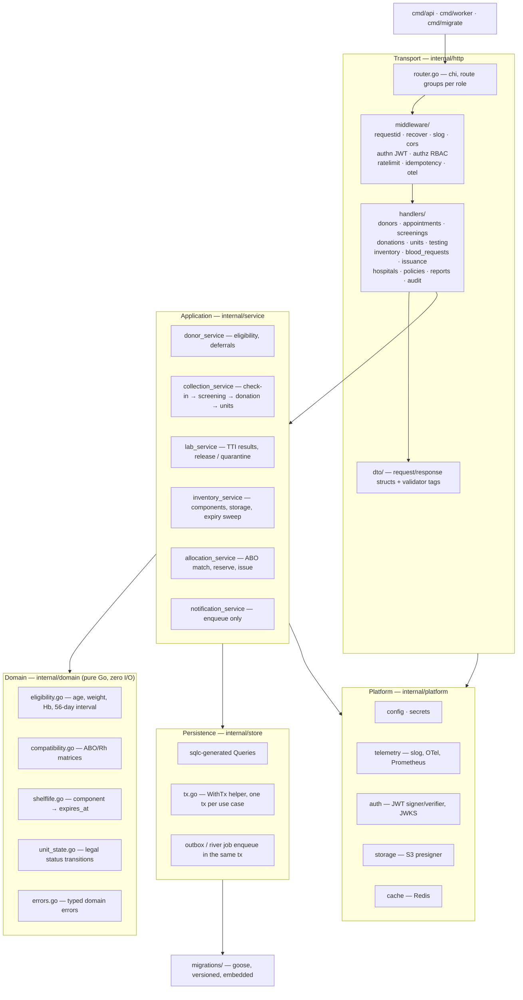
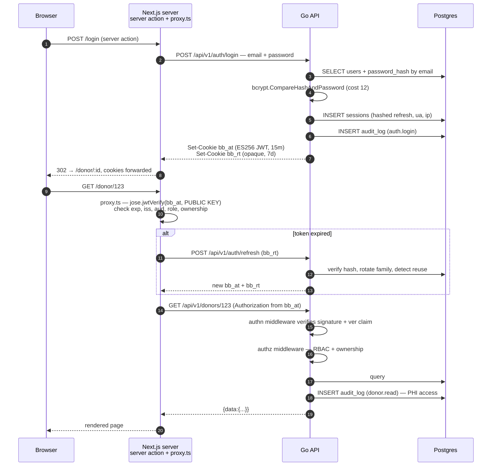
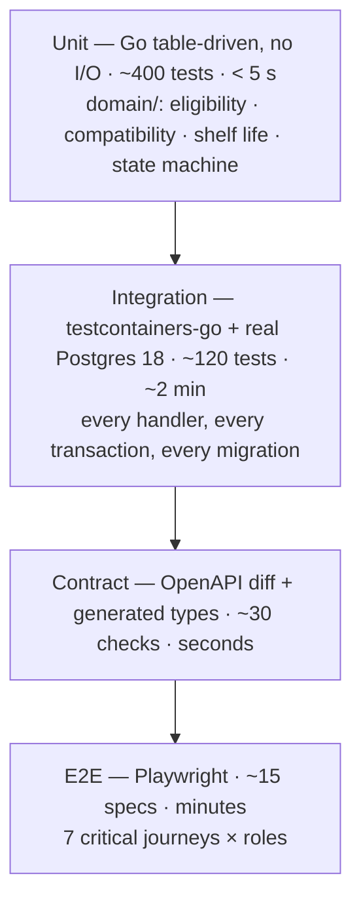
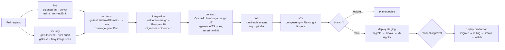
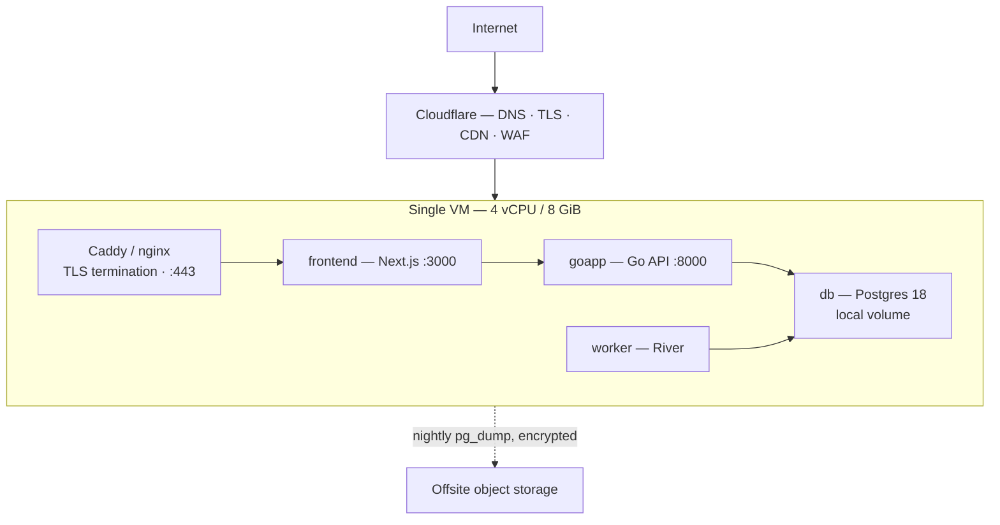
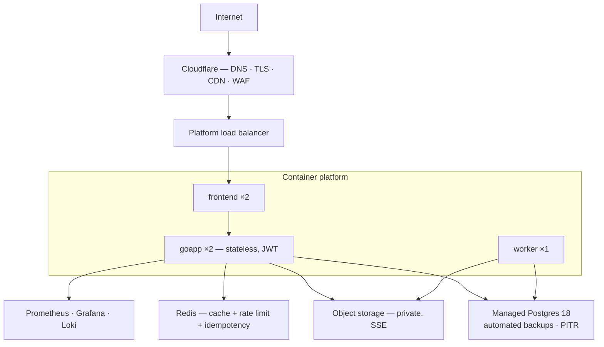
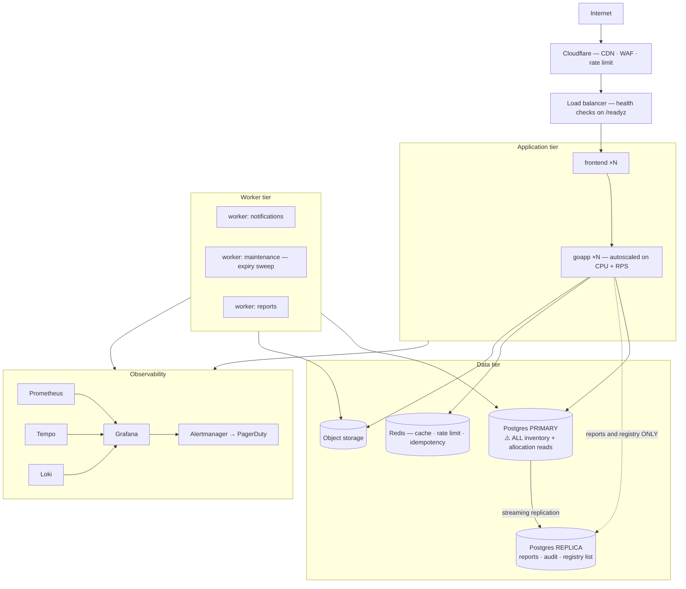

# BBank — Technical Requirements Document

> **Status:** `Draft v1` · **Date:** 2026-09-01 · **Branch:** `oc-redesign-skill-refactor`
> **Owner:** Engineering · **Audience:** Backend, frontend, infra, and whoever reviews the security posture.

## Sibling documents

| Document | Owns | This doc's relationship |
|---|---|---|
| [`./PRD.md`](./PRD.md) | Problem, personas, scope, **functional requirement IDs (`FR-xx`) and non-functional IDs (`NFR-xx`)** | Cites `FR-xx` / `NFR-xx`. **Never defines new ones.** |
| [`./USER_JOURNEY.md`](./USER_JOURNEY.md) | Persona flows, screen-by-screen steps, edge cases | Cited for the flows behind each endpoint group |
| [`./UIUX_BRIEF.md`](./UIUX_BRIEF.md) | Design tokens, page inventory, component specs, a11y | Cited for frontend rendering/caching constraints |
| [`./DATABASE_SCHEMA.md`](./DATABASE_SCHEMA.md) | **All table and column names, DDL, enums, indexes, migration path** | Cites table names. **Never restates DDL.** |
| [`./IMPLEMENTATION_PLAN.md`](./IMPLEMENTATION_PLAN.md) | Phasing, sequencing, effort, acceptance criteria | Supplies the "Phase N" labels used throughout |
| [`./PROJECT_STATUS.md`](./PROJECT_STATUS.md) | Live progress, weakness register (P0/P1/P2) | This doc resolves P1-1, P1-2, P1-3, P1-4, P2-5 |

**Reading rule.** If a name appears in both this document and `DATABASE_SCHEMA.md`, the schema
doc wins. If a requirement appears in both this document and `PRD.md`, the PRD wins. This
document describes *how*, not *what* or *why*.

---

## 1. Scope of this document

This TRD covers: the as-built architecture, an honest assessment of it, the target
architecture, technology decisions, the full target API surface, the authentication and
authorization model, security and compliance posture, the ten scaling rules mapped to real
BBank triggers, concurrency and data integrity, performance and capacity, observability,
testing, CI/CD, deployment topology, and the technical-debt register.

It does **not** cover: product rationale (PRD), SQL DDL (schema doc), visual design (UI/UX
brief), or the work breakdown (implementation plan).

---

## 2. Current architecture (as built, verified 2026-09-01)

### 2.1 The real numbers

| Fact | Value | Source |
|---|---|---|
| Backend source | **1 file, 543 lines** | `backend/main.go` |
| Go version | 1.26.0 | `backend/go.mod` |
| Direct Go dependencies | **3** — `gorilla/mux v1.8.1`, `lib/pq v1.11.2`, `golang.org/x/crypto v0.53.0` | `backend/go.mod` |
| Database tables | **3** — `donors`, `requests`, `appointments` | `main.go:90–118` |
| HTTP routes registered | **12 method+path routes across 8 path patterns** (13 counting the `OPTIONS` preflight short-circuit in `enableCORS`) | `main.go:131–148` |
| Middleware | **2** — `enableCORS`, `jsonContentTypeMiddleware` | `main.go:157–177` |
| Schema management | `CREATE TABLE IF NOT EXISTS` at boot | `main.go:120–125` |
| Frontend | Next.js 16.2.9, React 19.2.3, Tailwind 4, TypeScript | `bbank/package.json` |
| Frontend runtime deps | 5 (`next`, `react`, `react-dom`, `axios`, `react-icons`) | `bbank/package.json` |
| Compose services | **3** — `goapp:8000`, `db` (Postgres 18, host `5433`), `frontend:3000` | `compose.yaml` |
| Automated tests | **0** | repo-wide |

### 2.2 Diagram

```mermaid
flowchart LR
  subgraph Browser
    U["Donor / Admin browser"]
  end

  subgraph FE["frontend container - Next.js 16 :3000"]
    PX["proxy.ts route guard<br/>matcher /admin/* /donor/*<br/>JSON.parse of bb_session"]
    SC["Server Components<br/>fetch cache: no-store"]
    SA["Server Actions<br/>inline in page.tsx"]
    SESS["lib/session.ts<br/>httpOnly cookie bb_session<br/>plain JSON role + id"]
    APIB["lib/api.ts<br/>API_BASE_URL"]
  end

  subgraph BE["goapp container - Go 1.26 :8000"]
    CORS["enableCORS<br/>Allow-Origin: *"]
    JSONM["jsonContentTypeMiddleware"]
    MUX["gorilla/mux router<br/>12 routes"]
    H["9 handler funcs<br/>func db *sql.DB http.HandlerFunc<br/>raw SQL inline"]
  end

  subgraph DB["db container - Postgres 18"]
    T1["donors"]
    T2["requests"]
    T3["appointments"]
  end

  U -->|HTTPS not terminated| PX
  PX --> SC
  U --> SA
  SC --> APIB
  SA --> APIB
  SA --> SESS
  APIB -->|"/api/go/... over compose network"| CORS
  CORS --> JSONM --> MUX --> H
  H -->|"database/sql + lib/pq<br/>pool never configured"| DB
```



### 2.3 What the code actually does

- **Boot** (`main.go:60–125`) — reads `DATABASE_URL` (fallback DSN with credentials in source at
  `main.go:65`), retries `db.Ping()` 30× at 2 s, then executes three `CREATE TABLE IF NOT EXISTS`
  statements. There is no migration history, no version table, no down path.
- **Routing** (`main.go:128–151`) — `gorilla/mux`, eight path constants, no sub-routers, no
  per-route middleware, no auth middleware of any kind. Every handler is
  `func(db *sql.DB) http.HandlerFunc` with SQL written inline.
- **Auth** (`main.go:180–211`) — `POST /api/go/login` looks up by lowercased email, compares with
  `bcrypt.CompareHashAndPassword`, returns the donor JSON with `Password` blanked. **It returns no
  token and sets no cookie.** The session is invented entirely on the frontend.
- **Session** (`bbank/src/lib/session.ts`) — `bb_session` cookie, `httpOnly`, `SameSite=lax`,
  `secure` only in production, value is `JSON.stringify({role, id})`. Unsigned.
- **Guard** (`bbank/src/proxy.ts`) — `JSON.parse`s that cookie and branches on `session.role`.
  Ownership is enforced by comparing `session.id` to the `/donor/(\d+)` path segment.
- **Admin** (`bbank/src/app/(root)/login/page.tsx:13–16`) — a literal
  `email === 'admin@admin.com' && password === 'admin'` branch that calls `setSession({role:'admin'})`.
  The admin never touches the database.
- **The confirm flow** (`main.go:432–487`) — correctly transactional, but step 3 is
  `DELETE FROM requests WHERE id = $1`. The request row is destroyed on confirmation.
- **Frontend data access** — every `fetch` in `bbank/src` passes `cache: 'no-store'`
  (11 call sites), with `revalidatePath` after mutations.

---

## 3. Architectural assessment

Honest verdict: **the current system is a competent CRUD prototype and a correct one for what
it does.** Passwords are bcrypt-hashed, queries are parameterised, the confirm flow is
transactional, the Docker startup race was found and fixed, and the frontend is well organised.
None of that is throwaway. What follows is not a criticism of the code that exists — it is a
statement of what will break when the domain in [`../docs/DATABASE_SCHEMA.md`](./DATABASE_SCHEMA.md)
(~18 more entities) lands on top of it.

| # | Finding | Evidence | Why it fails at target scale | Severity | Phase to fix |
|---|---|---|---|---|---|
| A1 | **Single-file `main.go` will not survive ~15 more entities** | 543 lines / 3 tables ≈ 180 lines per entity. 21 entities extrapolates to ~3 800 lines in one file, one package, zero seams | Merge conflicts on every parallel task; no unit-testable surface; no place to put a shared rule like "a unit may not be reserved past its expiry" | **High** | 1 |
| A2 | **No migration tool** | `CREATE TABLE IF NOT EXISTS` at `main.go:90–125` | `IF NOT EXISTS` is a no-op against an existing table, so **column additions silently never happen**. Renaming `requests` → `donation_requests` is impossible without a real migration. No rollback, no environment parity | **Critical** | 1 |
| A3 | **No service / repository layer** | SQL is inline in HTTP handlers | Business rules (ABO compatibility, 56-day interval, TTI release gate, expiry) have literally nowhere to live except a handler, where they cannot be unit-tested and will be duplicated across the API and the background jobs | **Critical** | 1 |
| A4 | **Unsigned session cookie** (P1-1) | `session.ts` stores `JSON.stringify({role,id})`; `proxy.ts` `JSON.parse`s it | A user who can set a cookie on their own browser mints `{"role":"admin"}` and owns the system. This is a total authorization bypass, not a hardening item | **Critical** | 1 |
| A5 | **`Access-Control-Allow-Origin: *`** (P1-2) | `main.go:159` | Any origin can call the API directly. Combined with A4 (no bearer auth at all on the Go side) the API is effectively public and unauthenticated | **Critical** | 1 |
| A6 | **Hardcoded admin credential** (P1-3) | `login/page.tsx:13–16`, `admin@admin.com` / `admin` | Cannot be rotated, revoked, audited, or attributed. Every admin action in `audit_log` would have a null actor | **Critical** | 1 |
| A7 | **Zero automated tests** (P2-5) | no `_test.go`, no test runner in `package.json` | ABO compatibility and eligibility arithmetic are patient-safety logic. Shipping them untested is not acceptable at any phase | **High** | 1 |
| A8 | **Hard `DELETE` in `confirmRequest`** | `main.go:470` | Destroys the audit trail of who asked for what and when. In a traceability domain, deleting the demand record is a compliance defect, not a tidy-up. Must become a status transition to `approved` | **High** | 1 |
| A9 | **No structured logging** | `log.Printf` / `fmt.Println` only; `main.go:71` prints the **DSN including the password** to stdout | No correlation IDs, no severity, unqueryable, and a credential leak into container logs | **High** | 1 |
| A10 | **Connection pool never configured** | `sql.Open` at `main.go:67`; `SetMaxOpenConns`, `SetMaxIdleConns`, `SetConnMaxLifetime`, `SetConnMaxIdleTime` are all unset | Go's default `MaxOpenConns` is **unlimited**. Under load the API will happily open more connections than Postgres' `max_connections` (default 100) and start failing with `FATAL: sorry, too many clients already` — including for the migration job and for `psql` | **High** | 1 |
| A11 | No request timeouts | `http.ListenAndServe(":8000", …)` with no `http.Server` struct → no `ReadHeaderTimeout`, `ReadTimeout`, `WriteTimeout`, `IdleTimeout`; no `context` propagation into any query | A single slow client or slow query pins a goroutine and a DB connection indefinitely (Slowloris) | Medium | 1 |
| A12 | Error responses leak internals | `http.Error(w, err.Error(), 500)` at 9 sites returns raw driver errors, and sets `text/plain` bodies under a `Content-Type: application/json` header | Information disclosure; frontend cannot branch on error type | Medium | 1 |
| A13 | `id` path params passed straight to SQL as strings | e.g. `main.go:241`, `354` | Safe from injection (parameterised), but a non-numeric id becomes a 500 rather than a 400 | Low | 1 |
| A14 | Ownership check is advisory | `getAppointment` only enforces ownership *if the caller supplies* `?donor_id=` (`main.go:532–539`) | Omit the query param and read anyone's appointment. Authorization must never be opt-in by the caller | **Critical** | 1 |
| A15 | No pagination anywhere | `SELECT … FROM donors` with no `LIMIT` (`main.go:216`) | The donor registry is the table that grows without bound. Unbounded scan + full JSON serialisation | Medium | 2 |
| A16 | Frontend owns identity | Backend issues nothing; Next.js decides who you are | Any second client (mobile app, hospital integration, the background job worker) has no way to authenticate. Auth must move to the API | **Critical** | 1 |

### 3.1 What holds up and should be kept

- **bcrypt via `golang.org/x/crypto`** — correct choice, keep it (raise the cost, §8.2).
- **Parameterised queries throughout** — every single query uses `$1`-style placeholders. There is
  no string concatenation into SQL anywhere in `main.go`. This is genuinely good and must survive
  the refactor.
- **The transaction in `confirmRequest`** — the right instinct; only the `DELETE` is wrong.
- **The DB connection retry loop** (`main.go:75–86`) — pragmatic and correct for compose; keep it,
  but bound it with a context and log it structurally.
- **`lib/api.ts` single base URL** and **compose `API_BASE_URL`** — the right shape already.
- **Server components + server actions** — the API key/token never reaches the browser. This is a
  strong foundation for the JWT design in §7.
- **Postgres 18** — no reason to change. It will carry this workload for years.

---

## 4. Target architecture

### 4.1 Layered backend



### 4.2 Proposed package layout

```
backend/
├── cmd/
│   ├── api/main.go            # HTTP server: wire config → store → service → handlers
│   ├── worker/main.go         # River job worker: reminders, expiry sweep, reports
│   └── migrate/main.go        # goose runner (also used as the CI/CD migration step)
├── internal/
│   ├── domain/                # pure business logic — NO database, NO http, 100% unit-testable
│   ├── service/               # use cases, transaction boundaries, authorization decisions
│   ├── store/                 # sqlc-generated queries + hand-written tx helpers
│   ├── http/
│   │   ├── router.go
│   │   ├── handlers/          # one file per resource; decode → validate → call service → encode
│   │   ├── dto/               # wire types, decoupled from domain and db types
│   │   └── response/          # error envelope, pagination envelope
│   ├── middleware/            # authn, authz, rate limit, idempotency, request id, otel, cors
│   └── platform/              # config, telemetry, auth keys, s3, redis
├── migrations/                # 0001_init.sql … goose format, embedded via embed.FS
├── queries/                   # .sql input files for sqlc
├── sqlc.yaml
├── go.mod
└── go.dockerfile
```

**Dependency rule:** `domain` imports nothing from the project. `service` may import `domain` and
`store`. `http` may import `service` and `dto`. Nothing imports `http`. Enforced in CI with
`go-arch-lint` or a simple `go list -deps` assertion.

### 4.3 Frontend target

No framework change. Next.js 16 App Router stays. Changes:

| Area | Current | Target |
|---|---|---|
| Server actions | inline in `page.tsx` files | extracted to `src/lib/actions/<resource>.ts` with `'use server'`, one module per resource |
| API client | bare `fetch(api(...))` | `src/lib/apiClient.ts` — attaches the bearer cookie, unwraps the `{data}` envelope, maps the error envelope to typed errors, sets `Idempotency-Key` on mutating calls |
| Session | `JSON.parse` of an unsigned cookie | `jose` verification of an ES256 JWT against the API's public key (§7) |
| Caching | `cache: 'no-store'` on all 11 call sites | no-store for PHI/per-user; `next: { tags: [...] }` + `revalidateTag` for public/reference data (§11.4) |
| Types | hand-written interfaces | generated from the OpenAPI spec (`openapi-typescript`), so a backend contract change breaks the frontend build |

### 4.4 ⚠️ This supersedes an existing convention in `CLAUDE.md`

`CLAUDE.md` currently states, under **Conventions**:

> *"Backend is intentionally one file; keep handlers as `func(db *sql.DB) http.HandlerFunc`."*

**That convention is hereby superseded.** It was a correct and deliberate choice for a 3-table
CRUD app — it kept the whole system readable in one screenful of scrolling and avoided premature
abstraction. It is the wrong choice for a 21-entity traceability system with clinical safety
logic, because:

1. `func(db *sql.DB) http.HandlerFunc` binds every handler directly to a raw connection pool. There
   is no seam at which to substitute a fake, so **handlers cannot be unit-tested** without a live
   database, and the domain rules embedded in them cannot be tested at all.
2. Business rules that must be shared between the HTTP API and the background worker (expiry sweep,
   eligibility recalculation, notification triggers) have no home. They would be duplicated, and
   duplicated clinical logic drifts.
3. Transaction boundaries belong to a use case, not to an HTTP request. The collection flow (§10.3)
   spans four tables and cannot be expressed cleanly in a handler signature that receives a `*sql.DB`.

**Required action, tracked as a deliverable, not a side effect:** as part of Phase 1, edit
`CLAUDE.md` to replace the single-file convention with the layered convention in §4.2 and the
dependency rule in §4.2. Until that edit lands, `CLAUDE.md` and this TRD are in direct conflict and
`CLAUDE.md` will keep steering contributors (human and agent) back into `main.go`. This is a
**deliberate architectural decision with a recorded rationale**, not an accident of refactoring —
record it as such in the `CLAUDE.md` diff and in `PROJECT_STATUS.md`'s changelog.

---

## 5. Technology decisions

Each row is a recommendation, not a survey. "Alternatives" records what was rejected and why, so
the decision can be revisited with the reasoning intact.

### 5.1 Backend

| Concern | **Recommendation** | Alternatives considered | Rationale |
|---|---|---|---|
| **Migrations** | **`pressly/goose` v3**, SQL migrations embedded via `embed.FS`, run by `cmd/migrate` | `golang-migrate` (more popular, cleaner CLI, but Go migrations are second-class); `atlas` (declarative + drift detection, but a heavier mental model and a hosted-service pull); hand-rolled | The `requests` → `donation_requests` migration is **not a rename** — it is a rename plus a backfill of `status`, `center_id`, and reconstruction of the request rows that `confirmRequest` deleted. That needs a **Go migration with real logic**, which goose treats as first-class. Embedding means the binary and its schema version ship together, so an image can never run against a schema it doesn't know |
| **HTTP router** | **`go-chi/chi v5`** | Keep `gorilla/mux` (works, but middleware composition and sub-routers are clumsier); stdlib `net/http.ServeMux` (Go 1.22+ has method+wildcard patterns and is genuinely viable — rejected only for middleware ergonomics); `echo`/`fiber` (framework lock-in, non-stdlib handler types) | Six roles × ~15 resources needs **route groups with different middleware stacks** (`r.Group(func(r chi.Router){ r.Use(RequireRole("lab_tech")); ... })`). chi is `http.Handler` all the way down, so every handler stays stdlib-compatible and `httptest` works unchanged. One small dependency |
| **SQL access** | **`sqlc`** — write SQL in `queries/*.sql`, generate type-safe Go | Stay with hand-written `database/sql` (see counterargument below); `sqlx` (halfway house, still stringly-typed columns); GORM/ent (ORM) | See §5.1.1 |
| **Driver** | **`jackc/pgx/v5`** (via `pgxpool`, or `stdlib` shim if staying on `database/sql`) | Keep `lib/pq` | `lib/pq` is in maintenance mode and its author recommends pgx. pgx gives native `jsonb`, arrays (needed for the ABO compatible-group `= ANY($2)` query in §10.2), `COPY`, prepared-statement caching, and materially better performance. `sqlc` targets pgx natively |
| **Validation** | **`go-playground/validator/v10`** on DTO structs at the transport boundary, **plus** domain invariants in `internal/domain` | Hand-rolled `if x == ""` (current, `main.go:264–269`); `ozzo-validation` | Two-layer on purpose. Tags catch shape errors (required, email, range, oneof-enum) uniformly and produce a consistent `details[]` array for the error envelope. **Clinical invariants are not validation tags** — "Hb ≥ 12.5 for female donors" belongs in `domain/eligibility.go` where it is table-driven testable and configurable from `policies` |
| **Auth tokens** | **ES256 JWT access token + opaque rotating refresh token** | HS256 JWT; server-side session table only; JWT-in-localStorage | See §7 |
| **Password hashing** | **bcrypt, cost 12** (up from `DefaultCost` = 10), with rehash-on-login | argon2id; scrypt | Already in use, already correct, `golang.org/x/crypto` is maintained. Cost 12 is ~250 ms on commodity hardware — acceptable for a login endpoint that is rate-limited to 5/min. argon2id is stronger but its parameters are easy to get wrong; revisit at Phase 3 with rehash-on-login making the migration transparent |
| **Background jobs** | **`riverqueue/river`** (Postgres-backed) | `hibiken/asynq` (Redis-backed — good, but adds a second durability domain); Kafka (rejected outright); cron + a table | River enqueues jobs **inside the same Postgres transaction as the domain write**. That is the deciding property: "unit released" and "notify the hospital" either both happen or neither does. With Redis or Kafka you need an outbox to get the same guarantee, which is more moving parts for a system doing tens of jobs per minute. Kafka is a 5-service dependency for a workload a single Postgres table handles; adopting it here would be the textbook premature-scaling defect |
| **Cache** | **Redis 7 / Valkey**, Phase 2 only | In-process `ristretto` (no cross-replica invalidation → dangerous for stock, §9.2); Postgres materialized view alone | Needed only when there is more than one replica or when `inventory_summary` becomes measurably hot. See §9.2 for the mandatory invalidation rule |
| **Object storage** | **S3-compatible**: MinIO self-hosted for on-prem, Cloudflare R2 or AWS S3 for cloud | Postgres `bytea` (bloats backups, kills restore times); local disk (not durable, not shareable across replicas) | Lab PDFs, consent forms, donor ID scans, delivery notes are **PHI**. Private buckets, SSE at rest, short-lived presigned URLs (≤ 5 min), no public objects ever. Object keys must be unguessable (ULID), never `donor_123_id.jpg` |
| **Structured logging** | **`log/slog`**, JSON handler, stdlib | zerolog, zap (both faster; neither is worth a dependency at this volume) | Stdlib since Go 1.21, `slog.Handler` composes with OTel trace-ID injection cleanly |
| **Rate limiting** | Redis token bucket via **`go-redis/redis_rate`**; `golang.org/x/time/rate` per-instance for Phase 1 | nginx/Traefik-level limiting (loses per-user granularity and can't special-case emergencies) | Must be application-aware — see the emergency-request carve-out in §9.3 |
| **Circuit breaker** | **`sony/gobreaker`**, Phase 3 | resilience4go, hand-rolled | Only meaningful once there are outbound third-party calls (SMS, email, hospital webhooks) |

#### 5.1.1 SQL access: the honest argument for `sqlc`

The counterargument deserves a straight answer, because it is a good one:

> *"Raw `database/sql` is already working. The queries are parameterised and readable. sqlc adds a
> code-generation step, a `sqlc.yaml`, and a class of confusing build failures. Don't."*

That argument wins at 3 tables. It loses at 21, for three specific reasons:

1. **`rows.Scan` is positional and unchecked.** `main.go:227` scans ten columns in a fixed order.
   Add a column to `donors` in the middle of the `SELECT` and you get a runtime type error or,
   worse, silently swapped values. With 21 tables and hundreds of columns, that is a *when*, not an
   *if*. sqlc makes it a compile error.
2. **`sql.NullString` boilerplate is already 20 % of the file.** Count the `var lastDonation
   sql.NullString` / `x.Field = lastDonation.String` pairs in `main.go` — five of them for one
   nullable column. `blood_units` alone has several nullable columns. sqlc generates
   `pgtype.Timestamptz` handling once.
3. **It keeps the thing that is good about the current code.** sqlc is not an ORM. You still write
   the exact SQL, including `FOR UPDATE SKIP LOCKED` (§10.2), CTEs, and window functions. Nothing is
   hidden. The generated code is plain, readable Go you can open and read.

Rejected: **GORM/ent**. An ORM would obscure the locking semantics that this system's single most
dangerous query depends on, and would make the append-only `unit_status_events` pattern fight the
framework's update-in-place model.

**Adoption path:** introduce sqlc for new tables in Phase 1, migrate existing queries opportunistically.
Do not do a big-bang rewrite of working query code.

### 5.2 Frontend, testing, and operations

| Concern | **Recommendation** | Alternatives | Rationale |
|---|---|---|---|
| JWT verification in Next | **`jose`** (`jwtVerify` with an imported SPKI public key) | `jsonwebtoken` (Node-only, won't run in the Edge runtime); custom HMAC | Works in both Node and Edge runtimes; ES256 is supported by Web Crypto everywhere |
| Generated API types | **`openapi-typescript`** from the backend's OpenAPI 3.1 spec | Hand-written interfaces (current) | A backend field rename should break `npm run build`, not production |
| Go unit tests | stdlib `testing` + table-driven + `stretchr/testify/require` for assertions | testify suites; ginkgo | Table-driven is the right shape for ABO matrices and eligibility rules |
| Go integration tests | **`testcontainers-go`** against real Postgres 18, migrations applied per suite | sqlmock (tests your mock, not your SQL); shared CI Postgres service (state bleed between tests) | `SKIP LOCKED` semantics, `jsonb` behaviour, and constraint violations **cannot** be tested against a mock. This is non-negotiable for the allocation path |
| E2E | **Playwright** (`@playwright/test`) | Cypress; Selenium | Multi-tab/multi-role scenarios and trace viewer; needed to test the concurrent-allocation journey from two staff browsers |
| Contract tests | OpenAPI spec as the source of truth; `oapi-codegen` server-side validation + `openapi-typescript` client-side; **spec diff gate in CI** | Pact (broker overhead for a 2-party contract) | One producer, one consumer — a shared spec file plus a breaking-change diff check is proportionate |
| Load testing | **k6** | Locust, JMeter | Scripts live in the repo, run in CI nightly, thresholds fail the build |
| Tracing | **OpenTelemetry SDK** → OTLP → Tempo/Jaeger | Vendor SDKs | Vendor-neutral; the collector can be re-pointed without touching code |
| Metrics | **Prometheus** client → scrape `/metrics` → Grafana | StatsD; vendor agents | Standard, self-hostable, alerting via Alertmanager |
| CI | **GitHub Actions** | GitLab CI, Drone | Repo is already on GitHub; no reason to look further |
| Secrets | Phase 1 `.env` + compose secrets; Phase 2 **SOPS + age** in-repo encrypted, or the platform's secret manager | Vault (operationally heavy for this size) | See §8.6 |

---

## 6. API design

### 6.1 Path convention — **recommendation: `/api/v1/`**

**Decision: adopt `/api/v1/` as the canonical prefix. Keep `/api/go/` as a deprecated alias
through Phase 2, then delete it.**

Rationale:

- `go` names an implementation language, not a contract. If the API is ever rewritten, split, or
  fronted by a gateway, `/api/go/` becomes a lie that clients depend on.
- This work **changes the meaning of an existing path**. `/api/go/requests` today means *donor
  asks for an appointment*; the target `blood-requests` means *hospital asks for units*. Reusing
  `/requests` for either would be a semantic trap. A version boundary is the honest place to make
  that break.
- A future hospital-facing integration will be an external contract with an external deprecation
  clock. Versioning from the start costs one path segment.

**Prefix map:**

| Prefix | Status | Notes |
|---|---|---|
| `/api/v1/...` | **Canonical** | All new and migrated endpoints |
| `/api/go/...` | **Deprecated** | Serves the five legacy endpoints whose meaning is unchanged, by internal rewrite to `/api/v1`. Every response carries `Deprecation: true` and `Sunset: Wed, 31 Mar 2027 00:00:00 GMT`. Removed at the end of Phase 2 |
| `/healthz`, `/readyz`, `/metrics` | Unversioned | Operational, never public, never versioned |

**Deprecation path for endpoints whose meaning changes:**

| Legacy | Target | Break type | Migration |
|---|---|---|---|
| `GET/POST /api/go/requests` | `GET/POST /api/v1/donation-requests` | **Rename only** | `/api/go/requests` rewrites to the v1 handler and continues to work until sunset. Response gains fields; existing fields keep their names and types |
| `GET /api/go/requests/{id}` | `GET /api/v1/donation-requests/{id}` | Rename only | As above |
| `POST /api/go/requests/{id}/confirm` | `POST /api/v1/donation-requests/{id}/approve` | **Behaviour change** | v1 sets `status='approved'` and creates the appointment. It **no longer deletes the row** (fixes A8). The legacy alias keeps working but also stops deleting — deleting was the bug, and preserving a data-destroying behaviour for compatibility would be wrong |
| `POST /api/go/login` | `POST /api/v1/auth/login` | **Response change** | v1 returns `{data:{user, access_token_expires_at}}` and sets cookies. Legacy path returns the old donor-shaped body **and** sets the new cookies, so the frontend can migrate in one commit. Removed at Phase 2 |
| — | `POST /api/v1/blood-requests` | **New concept** | Never aliased under `/api/go/`. Deliberately has no legacy name, so nobody can confuse it with the donation request |
| `GET /api/go/donors`, `/donors/{id}`, `/appointments`, `/appointments/{id}` | same paths under `/api/v1/` | Additive | Fields added, none removed or retyped |

### 6.2 Response envelope

All responses are enveloped. No bare arrays, no bare scalars, ever — an unenveloped array cannot
gain a `page` object later without breaking clients.

**Success:**
```json
{
  "data": { "id": "unt_01JQ8Z5K2R", "unit_code": "BB-2026-000481", "status": "available" },
  "meta": { "request_id": "01JQ8Z5K2RY9F4T3", "server_time": "2026-09-01T10:14:02Z" }
}
```

**List:**
```json
{
  "data": [ { "...": "..." } ],
  "page": { "next_cursor": "eyJpZCI6InVudF8wMUpROFo1SzJSIn0", "has_more": true, "limit": 50 },
  "meta": { "request_id": "01JQ8Z5K2RY9F4T3" }
}
```

**Error:**
```json
{
  "error": {
    "code": "unit_not_available",
    "message": "Unit BB-2026-000481 is no longer available for allocation.",
    "details": [
      { "field": "unit_ids[0]", "issue": "status is 'reserved', expected 'available'" }
    ],
    "request_id": "01JQ8Z5K2RY9F4T3"
  }
}
```

Rules:
- `code` is a **stable, machine-readable snake_case string**, never a translated sentence. Clients
  branch on `code`, never on `message` or on the HTTP status alone.
- `message` is human-readable, safe to display, and **never contains a raw driver error**. This
  directly replaces the 9 `http.Error(w, err.Error(), 500)` sites (A12).
- `request_id` is the ULID from the request-ID middleware and appears in every log line and trace
  for that request. A user reporting a bug quotes it and the whole trace is one query away.
- Validation failures → `422` with a populated `details[]`. Malformed JSON → `400`.
- Domain-rule refusals (donor not eligible, unit expired, TTI incomplete) → `409 Conflict` with a
  specific `code`, **not** `400`. The request was well-formed; the world said no.
- **`next_eligible_on` (optional, added by `WI-26`).** A clinical refusal that clears with time
  carries the date it clears, as `YYYY-MM-DD`, alongside `code` and `details[]`. `FR-08` requires a
  blocked donor to be told "the date they become eligible", and that is a property of the whole
  refusal rather than of one `details[]` entry — putting a date inside an `issue` string would make
  every client parse prose to find it. **Absent means there is no such date**: a permanent deferral
  or an age ceiling does not clear by waiting, and saying nothing is the honest answer. The field is
  omitted on every other error, so it is additive for existing clients.
  On an eligibility refusal, `code` is the failing criterion (`temporarily_deferred`,
  `interval_not_elapsed`, …) and `details[]` carries **one entry per failing criterion** — `field`
  is the criterion code, `issue` its plain-language sentence — because `FR-17` requires each to be
  named individually rather than collapsed into a single "ineligible".

**Canonical status codes:** `200` read/update · `201` create (with `Location`) · `202` accepted for
async · `204` delete · `400` malformed · `401` unauthenticated · `403` authenticated but not
permitted · `404` absent **or hidden by authorization** · `409` domain conflict · `422` validation ·
`429` rate limited (with `Retry-After`) · `500` unexpected · `503` dependency down.

> **Note on `404` vs `403`:** for PHI resources a donor is not permitted to see, return `404`, not
> `403`. `403` confirms the record exists, which is itself a disclosure.

### 6.3 Pagination

| Case | Convention |
|---|---|
| **Default** | **Cursor / keyset.** `?limit=50&cursor=…`. Opaque base64 cursor encoding the sort key. Stable under concurrent inserts — which matters because `blood_units` and `audit_log` grow while an admin is paging |
| Admin tables needing page numbers | Offset permitted **only** where the result set is bounded and small (`centers`, `hospitals`, `storage_locations`, `policies`): `?page=1&per_page=25`, response `page` object gains `total` |
| `limit` | default 25, max 100. A request over the max is clamped, not rejected, and `page.limit` reports the applied value |
| Never | Unbounded list endpoints. `GET /api/v1/donors` must never repeat A15 |

### 6.4 Idempotency

**Required** on the endpoints marked `Idem` in §6.5. The failure this prevents is concrete: a
phlebotomist on a laggy tablet double-taps "Record collection" and the system creates **two
donations, two bags, two barcodes** for one venepuncture. That is an inventory-integrity incident
and a traceability failure.

| Rule | Detail |
|---|---|
| Header | `Idempotency-Key: <ULID>`, client-generated per user intent (generated when the form is *rendered*, not when it is submitted, so a retry reuses it) |
| Storage | `idempotency_keys` table (schema doc): key, actor_id, endpoint, request fingerprint (SHA-256 of method+path+body), response status, response body, `created_at` |
| Replay | Same key + same fingerprint → return the stored response verbatim with `Idempotent-Replay: true`. Same key + **different** fingerprint → `422 idempotency_key_reuse` |
| In-flight | Key present but no stored response yet → `409 request_in_progress`, `Retry-After: 1` |
| TTL | 24 h, swept nightly by a River job |
| Enforcement | Missing key on a required endpoint → `400 idempotency_key_required`. Not optional; a client that forgets it is a client that will double-issue |

### 6.5 Target REST surface

Auth column key: `pub` = public · `auth` = any authenticated user · role names per foundation §2.
`own` = ownership rule applies (§7.4). `Idem` = `Idempotency-Key` required. `Aud` = writes to `audit_log`.

#### Authentication & session

| Method | Path | Auth | Purpose | Request → Response |
|---|---|---|---|---|
| POST | `/api/v1/auth/login` | pub | Exchange credentials for a session | `{email, password}` → sets `bb_at` + `bb_rt` cookies; `{user, expires_at}` · **Aud** |
| POST | `/api/v1/auth/refresh` | refresh cookie | Rotate the token pair | `∅` → new cookies; `{expires_at}` |
| POST | `/api/v1/auth/logout` | auth | Revoke the refresh family | `∅` → `204` · **Aud** |
| GET | `/api/v1/auth/me` | auth | Current user + role + permissions | → `{user, role, center_id, permissions[]}` |
| POST | `/api/v1/auth/password/forgot` | pub | Send reset link | `{email}` → `202` (always, no enumeration) |
| POST | `/api/v1/auth/password/reset` | pub + token | Complete reset | `{token, new_password}` → `204` · **Aud** |
| POST | `/api/v1/auth/password/change` | auth | Change own password | `{current, new}` → `204` · **Aud** |
| GET | `/.well-known/jwks.json` | pub | Public keys for token verification | → JWKS |

#### Users & roles

| Method | Path | Auth | Purpose |
|---|---|---|---|
| GET | `/api/v1/users` | admin | List staff accounts; `?role=&status=&q=` |
| POST | `/api/v1/users` | admin | Create a staff account (invite email) · **Aud** |
| GET | `/api/v1/users/{id}` | admin, own | Read one |
| PATCH | `/api/v1/users/{id}` | admin | Change role, status, center assignment · **Aud** |
| POST | `/api/v1/users/{id}/deactivate` | admin | Disable + revoke all sessions · **Aud** |

#### Donors

| Method | Path | Auth | Purpose |
|---|---|---|---|
| GET | `/api/v1/donors` | staff, inventory_manager, admin | Registry search: `?q=&blood_group=&rhesus=&eligible_only=&center_id=&cursor=` · **Aud** (PHI list access) |
| POST | `/api/v1/donors` | pub (self-registration), staff, admin | Create user + donor profile |
| GET | `/api/v1/donors/{id}` | staff, lab_tech, admin, **own** | Full donor record · **Aud** |
| PATCH | `/api/v1/donors/{id}` | admin, **own** (subset of fields) | Update profile · **Aud** |
| DELETE | `/api/v1/donors/{id}` | admin | **Soft** delete — anonymise PII, retain donation lineage · **Aud** |
| GET | `/api/v1/donors/{id}/eligibility` | staff, admin, **own** | Computed: `{eligible, next_eligible_date, reasons[], active_deferrals[]}` |
| GET | `/api/v1/donors/{id}/donations` | staff, admin, **own** | Donation history · **Aud** |
| GET | `/api/v1/donors/{id}/deferrals` | staff, lab_tech, admin, **own** | Deferral history · **Aud** |

#### Centers, slots & storage

| Method | Path | Auth | Purpose |
|---|---|---|---|
| GET | `/api/v1/centers` | pub | Public center directory (no PHI) — **cacheable** |
| POST · PATCH | `/api/v1/centers` · `/{id}` | admin | Manage centers · **Aud** |
| GET | `/api/v1/centers/{id}/slots` | auth | Bookable slots: `?date=&days=` — derived from capacity minus booked appointments |
| GET · POST | `/api/v1/storage-locations` | inventory_manager, admin | Fridges, freezers, agitators |
| PATCH | `/api/v1/storage-locations/{id}` | inventory_manager, admin | Update, incl. temperature range · **Aud** |

#### Donation requests (was `/api/go/requests`)

| Method | Path | Auth | Purpose |
|---|---|---|---|
| GET | `/api/v1/donation-requests` | staff, admin; donor sees **own** | `?status=&center_id=&from=&to=&cursor=` |
| POST | `/api/v1/donation-requests` | donor, staff | Book a donation. Rejects with `409 donor_not_eligible` if the interval or an active deferral blocks it |
| GET | `/api/v1/donation-requests/{id}` | staff, admin, **own** | Read one |
| POST | `/api/v1/donation-requests/{id}/approve` | staff, admin | `{scheduled_at, center_id}` → creates the appointment, sets `status='approved'`. **Does not delete** (fixes A8) · **Aud** |
| POST | `/api/v1/donation-requests/{id}/reject` | staff, admin | `{reason}` → `status='rejected'` · **Aud** |
| POST | `/api/v1/donation-requests/{id}/cancel` | **own**, staff, admin | `status='cancelled'` (fixes P1-4) · **Aud** |

#### Appointments

| Method | Path | Auth | Purpose |
|---|---|---|---|
| GET | `/api/v1/appointments` | staff, admin; donor sees **own** | `?donor_id=&center_id=&date=&status=&cursor=` |
| POST | `/api/v1/appointments` | staff, admin | Direct booking (walk-in) |
| GET | `/api/v1/appointments/{id}` | staff, admin, **own** | Read one. **Ownership enforced server-side, not by query param** (fixes A14) |
| PATCH | `/api/v1/appointments/{id}` | staff, admin | Amend notes/slot |
| POST | `/api/v1/appointments/{id}/check-in` | staff | `status='checked_in'`, stamps `checked_in_at` · **Aud** |
| POST | `/api/v1/appointments/{id}/reschedule` | staff, admin, **own** | `{scheduled_at}` · **Aud** |
| POST | `/api/v1/appointments/{id}/cancel` | staff, admin, **own** | `{reason}` (fixes P1-4) · **Aud** |
| POST | `/api/v1/appointments/{id}/no-show` | staff | `status='no_show'` · **Aud** |

#### Screening & deferrals

| Method | Path | Auth | Purpose |
|---|---|---|---|
| POST | `/api/v1/appointments/{id}/screening` | staff | Record vitals + questionnaire. Server computes `outcome` from `policies`; a `deferred_*` outcome **creates the deferral in the same transaction** · **Idem** · **Aud** |
| GET | `/api/v1/screenings/{id}` | staff, lab_tech, admin, **own** | Read one · **Aud** |
| GET | `/api/v1/deferrals` | staff, lab_tech, admin | `?donor_id=&active=true` |
| POST | `/api/v1/deferrals` | staff, lab_tech, admin | Manual deferral · **Aud** |
| POST | `/api/v1/deferrals/{id}/lift` | admin | Early lift with reason · **Aud** |

#### Donations & blood units

| Method | Path | Auth | Purpose |
|---|---|---|---|
| POST | `/api/v1/donations` | staff | **The collection event.** `{appointment_id, volume_ml, bag_lot_number, adverse_reaction?}` → creates the donation **and** the initial `quarantined` unit(s) + `unit_status_events` row, atomically · **Idem (required)** · **Aud** |
| GET | `/api/v1/donations` | staff, lab_tech, inventory_manager, admin | `?center_id=&from=&to=&untested=true&cursor=` |
| GET | `/api/v1/donations/{id}` | staff, lab_tech, admin, **own** | Read one · **Aud** |
| POST | `/api/v1/donations/{id}/adverse-reaction` | staff | Record a post-hoc reaction · **Aud** |
| POST | `/api/v1/donations/{id}/units` | inventory_manager | **Component split** — one whole-blood unit → PRBC + FFP + platelets, each with its own `expires_at` from `domain/shelflife.go`, `parent_unit_id` set · **Idem** · **Aud** |
| GET | `/api/v1/units` | staff, lab_tech, inventory_manager, admin | `?status=&component_type=&blood_group=&rhesus=&expires_before=&location_id=&cursor=` |
| GET | `/api/v1/units/{code}` | staff, lab_tech, inventory_manager, admin | Lookup by barcode |
| POST | `/api/v1/units/{id}/status` | role-gated per transition | Append a status event. **The only way `blood_unit.status` ever changes** · **Idem** · **Aud** |
| POST | `/api/v1/units/{id}/move` | inventory_manager | Change `storage_location_id` · **Aud** |
| POST | `/api/v1/units/{id}/discard` | inventory_manager, lab_tech, admin | `{reason}` → `discarded` · **Aud** |
| GET | `/api/v1/units/{id}/trace` | admin, lab_tech | **Vein-to-vein chain**: donor → donation → tests → splits → allocation → issuance → outcome, plus the full `unit_status_events` timeline. This endpoint is the traceability requirement made concrete · **Aud** |

#### Laboratory / TTI

| Method | Path | Auth | Purpose |
|---|---|---|---|
| POST | `/api/v1/donations/{id}/test-results` | lab_tech | Record one or more TTI results · **Idem** · **Aud** |
| GET | `/api/v1/test-results` | lab_tech, admin | `?donation_id=&result=&overdue=true` |
| POST | `/api/v1/donations/{id}/release` | lab_tech | **The release gate.** Succeeds only if every mandatory panel test is `non_reactive`; moves units `quarantined → available`. Any `reactive` → units `discarded`, donor deferred, notification enqueued — all in one transaction · **Idem** · **Aud** |

#### Inventory

| Method | Path | Auth | Purpose |
|---|---|---|---|
| GET | `/api/v1/inventory/summary` | staff, inventory_manager, admin, hospital_user (aggregate only) | The dashboard read: counts by `blood_group` × `rhesus` × `component_type` × `status` + `expiring_within_72h`. **Cache-eligible, see §9.2** |
| GET | `/api/v1/inventory/expiring` | inventory_manager, admin | `?within=72h` — units approaching expiry |
| POST | `/api/v1/inventory/expiry-sweep` | admin (also invoked by the nightly job) | Transition `available/reserved` → `expired` where `expires_at < now()` · **Idem** · **Aud** |

#### Hospitals & blood requests (the demand side — entirely new)

| Method | Path | Auth | Purpose |
|---|---|---|---|
| GET · POST | `/api/v1/hospitals` | admin | Partner registry |
| PATCH | `/api/v1/hospitals/{id}` | admin | Update, incl. `status` (suspend a defaulting partner) · **Aud** |
| GET | `/api/v1/blood-requests` | inventory_manager, admin; hospital_user sees **own hospital** | `?status=&urgency=&blood_group=&needed_by=&cursor=` |
| POST | `/api/v1/blood-requests` | hospital_user, admin | Raise a request for units · **Aud** |
| GET | `/api/v1/blood-requests/{id}` | inventory_manager, admin, **own hospital** | Read one incl. allocations |
| POST | `/api/v1/blood-requests/{id}/approve` | inventory_manager, admin | `status='approved'` · **Aud** |
| POST | `/api/v1/blood-requests/{id}/reject` | inventory_manager, admin | `{reason}` · **Aud** |
| POST | `/api/v1/blood-requests/{id}/cancel` | **own hospital**, admin | · **Aud** |
| GET | `/api/v1/blood-requests/{id}/candidate-units` | inventory_manager, admin | ABO/Rh-compatible available units, **FEFO-ordered**. Read-only, reserves nothing. **Strongly consistent — primary only** (§9.8) |
| POST | `/api/v1/blood-requests/{id}/allocations` | inventory_manager, admin | **Reserve units.** `SELECT … FOR UPDATE SKIP LOCKED` (§10.2) · **Idem (required)** · **Aud** |
| DELETE | `/api/v1/allocations/{id}` | inventory_manager, admin | Release a reservation → `available` · **Aud** |
| POST | `/api/v1/blood-requests/{id}/issuances` | inventory_manager, admin | **Hand over units.** `reserved → issued`, delivery note recorded · **Idem (required)** · **Aud** |
| POST | `/api/v1/issuances/{id}/outcome` | inventory_manager, hospital_user, admin | `transfused` \| `returned` \| `discarded` · **Aud** |

#### Policies, reports, audit, notifications, files, ops

| Method | Path | Auth | Purpose |
|---|---|---|---|
| GET | `/api/v1/policies` | staff, lab_tech, admin | Eligibility + shelf-life constants (never magic numbers in code) |
| PUT | `/api/v1/policies/{key}` | admin | Change a clinical constant. **Versioned, never overwritten** · **Aud** |
| GET | `/api/v1/reports/donations` | admin, inventory_manager | `?from=&to=&center_id=&group_by=` — replica-eligible (§9.8) |
| GET | `/api/v1/reports/inventory-movement` | admin, inventory_manager | Collected / released / issued / expired / discarded — replica-eligible |
| GET | `/api/v1/reports/wastage` | admin | Expiry and discard rate by component — replica-eligible |
| GET | `/api/v1/audit-log` | admin | `?actor_id=&entity_type=&entity_id=&from=&to=&cursor=` — **read-only, no write or delete endpoint exists at any role** |
| GET | `/api/v1/notifications` | auth (**own**) | Own notification history |
| POST | `/api/v1/files/presign` | auth, role-gated by `purpose` | `{purpose, content_type, size}` → short-lived presigned PUT URL |
| GET | `/api/v1/files/{id}` | role-gated + ownership | `302` to a ≤ 5-minute presigned GET · **Aud** (PHI access) |
| GET | `/healthz` | internal | Liveness — process up, no dependency checks |
| GET | `/readyz` | internal | Readiness — DB ping, migration version matches binary, Redis reachable |
| GET | `/metrics` | internal | Prometheus scrape. **Must not be routable from the internet** |

---

## 7. Authentication & authorization

Resolves **P1-1** (unsigned cookie), **P1-3** (hardcoded admin), **A14** (opt-in ownership) and
**A16** (frontend owns identity).

### 7.1 The principle

**The API is the authority on identity. The frontend is a client.** Today it is backwards: the Go
API issues nothing, and `bbank/src/app/(root)/login/page.tsx` decides that a particular
email/password pair means "admin". Any future client — a mobile app, a hospital HL7 bridge, the
River worker — would have no way to authenticate. Identity moves to the backend, permanently.

### 7.2 Token design

**Recommendation: short-lived ES256 JWT access token + opaque, rotating, server-side refresh token.**

| Option | Verdict |
|---|---|
| **HS256 JWT** (shared secret) | **Rejected.** `proxy.ts` must verify the token, so the Next.js server would hold the *signing* key. A frontend compromise then mints admin tokens. Symmetric keys make every verifier an issuer |
| **ES256 JWT** (ECDSA P-256, asymmetric) | **Chosen.** Go holds the private key; Next.js holds only the public key and can verify but never mint. ECDSA P-256 is supported by Web Crypto in **both** the Node and Edge runtimes, so `proxy.ts` works wherever it is deployed |
| EdDSA / Ed25519 | Good — smaller, faster — but Web Crypto Ed25519 support is uneven across Edge runtimes. Revisit when the deployment runtime is pinned |
| Pure server-side sessions (opaque token + DB lookup) | Rejected **for the access token**: it makes `proxy.ts` do a network round-trip on every navigation. **Adopted for the refresh token**, where the round-trip is rare and instant revocation matters |

This hybrid buys the important property: **an access token is stateless and fast; a session is
still revocable within 15 minutes**, because revoking the refresh family stops renewal.

### 7.3 Claims and lifetimes

```json
{
  "iss": "https://api.bbank.example",
  "aud": "bbank-web",
  "sub": "usr_01JQ8Z5K2RY9F4T3XKQW",
  "sid": "ses_01JQ8Z5K7B2M9NPQ",
  "role": "lab_tech",
  "cid": "ctr_01JQ8Z2A",
  "hid": null,
  "ver": 3,
  "iat": 1788000000,
  "exp": 1788000900,
  "jti": "01JQ8Z5K9WQ2"
}
```

| Claim | Meaning |
|---|---|
| `sub` | `users.id` |
| `sid` | Session id → the refresh-token family. Revoking it kills renewal |
| `role` | Exactly one of the six roles from foundation §2. **Single role per user.** Multi-role is a real complication; if it is ever needed, add a `roles[]` claim then, not now |
| `cid` | Home `donation_centers.id`, or `null` for donors and admins. Scopes staff to their center |
| `hid` | `hospitals.id` for `hospital_user`, `null` otherwise. Scopes a clinician to their own hospital's requests |
| `ver` | `users.token_version`. Incremented on role change, password change, or forced logout → **all outstanding access tokens for that user fail verification immediately**. This is the escape hatch from the 15-minute revocation window |

| Token | TTL | Storage | Cookie attributes |
|---|---|---|---|
| Access | **15 min** | `bb_at` cookie | `HttpOnly; Secure; SameSite=Lax; Path=/` |
| Refresh | **7 days**, sliding | `bb_rt` cookie; SHA-256 hash stored in `sessions` | `HttpOnly; Secure; SameSite=Strict; Path=/api/v1/auth/refresh` |

**Refresh rotation with reuse detection.** Each refresh mints a new refresh token and invalidates
the old one. If an already-used refresh token is presented, the entire family is revoked and a
`security.refresh_reuse` event is logged and alerted — that pattern means a token was stolen.

**`SameSite=Strict` on the refresh cookie** with a narrow `Path` means it is never sent on ordinary
navigation, only to the refresh endpoint. The access cookie is `Lax` so that top-level navigation
into `/donor/123` still works.

**No CSRF token is required for `SameSite` cookies on same-site requests**, but because the API is
also reachable cross-origin, mutating endpoints additionally require an `Origin` header match
against the CORS allowlist (§8.1). Belt and braces, both cheap.

### 7.4 Flow



**`proxy.ts` change, precisely:** replace

```ts
session = JSON.parse(raw)                    // ← forgeable
```

with

```ts
const { payload } = await jwtVerify(raw, publicKey, {
  issuer: 'https://api.bbank.example',
  audience: 'bbank-web',
})
```

`proxy.ts` remains a **UX optimisation only** — it stops an unauthenticated user seeing a dashboard
shell. **It is not the security boundary.** The Go API re-verifies every token and re-checks every
permission on every request, and would do so correctly even if `proxy.ts` were deleted. Any design
where the frontend guard is the only check is the bug we are fixing.

### 7.5 Replacing the hardcoded admin (P1-3)

1. Migration creates the `users` table with `role` (foundation §2 enum) and `status`.
2. Existing `donors` rows are backfilled as `users` with `role='donor'` + linked `donor_profiles`.
3. A **bootstrap admin** is created by `cmd/migrate --seed-admin`, reading
   `BOOTSTRAP_ADMIN_EMAIL` and `BOOTSTRAP_ADMIN_PASSWORD` from the environment. It runs once, is
   idempotent, and **refuses to run if the password is shorter than 16 characters or if any admin
   already exists**.
4. `login/page.tsx:13–16` is deleted. There is no code path that grants a role without a database row.

### 7.6 RBAC permission matrix

Actions: **C** create · **R** read · **U** update · **D** delete/soft-delete · **X** execute a
state transition. `own` = only rows the caller owns (§7.7). `ctr` = only rows at the caller's
`cid` center. `hosp` = only rows for the caller's `hid` hospital. `agg` = aggregate figures only,
no row-level detail. `—` = no access.

| Resource | `donor` | `staff` | `lab_tech` | `inventory_manager` | `hospital_user` | `admin` |
|---|---|---|---|---|---|---|
| `users` | R own | — | — | — | — | C R U D |
| `donor_profiles` | R U own | C R U (ctr) | R | — | — | C R U D |
| `donation_centers` | R | R | R | R | R | C R U D |
| `storage_locations` | — | — | R | C R U | — | C R U D |
| `donation_requests` | C R X-cancel own | C R X-approve/reject (ctr) | — | — | — | C R U D X |
| `appointments` | R X-cancel/reschedule own | C R U X (ctr) | R | — | — | C R U D X |
| `screenings` | R own | C R (ctr) | R | — | — | R U |
| `deferrals` | R own | C R | C R | — | — | C R U X-lift |
| `donations` | R own | C R (ctr) | R | R | — | R U |
| `blood_units` | — | R (ctr) | R X-quarantine/discard | C R U X-move/discard/expire | — | R X (all) |
| `unit_status_events` | — | R | C R | C R | — | R |
| `test_results` | R own (result only) | — | C R U | R | — | R |
| `inventory_summary` | — | R (ctr) | R | R | **R agg** | R |
| `hospitals` | — | — | — | R | R own | C R U D |
| `blood_requests` | — | — | — | R U X-approve/reject | C R X-cancel (hosp) | C R U D X |
| `unit_allocations` | — | — | — | C R D X | R (hosp) | C R D X |
| `issuances` | — | — | — | C R X | R X-outcome (hosp) | C R U X |
| `policies` | — | R | R | R | — | C R U |
| `audit_log` | — | — | — | — | — | **R only** |
| `notifications` | R own | — | — | — | R own | C R |
| `reports/*` | — | R (ctr) | R | R | R hosp | R |
| `files` | C R own | C R (ctr) | C R | C R | C R hosp | R |

**Structural invariants:**
- `audit_log` has **no create, update, or delete endpoint at any role, including `admin`.** It is
  written only by the audit middleware inside the same transaction as the domain write. An admin who
  can edit the audit log makes the audit log worthless.
- `blood_units.status` is **never** exposed as a `PATCH`. The only mutation path is
  `POST /units/{id}/status`, which appends a `unit_status_events` row. Enforced by a database
  trigger as well as by the service layer (schema doc), so no future code path can bypass it.
- `hospital_user` sees **aggregate** inventory only — "12 units of O− available", never a unit code,
  never a donor. Detail-level stock is a competitive and privacy concern between partner hospitals.
- `staff` are scoped to their `cid` center for writes. Reads of the donor registry are
  cross-center (a donor may present at any center) but every such read is audit-logged.

### 7.7 Ownership rules

Ownership is evaluated **in the service layer, from the token — never from a request parameter.**

| Rule | Implementation |
|---|---|
| A donor may read only their own records | `service` compares `token.sub` to the row's `donor_id`. **Never** to a `?donor_id=` query param. This directly fixes A14, where omitting the param skipped the check entirely |
| Donor id in the URL is not identity | `GET /api/v1/donors/{id}` with `id != token.sub` and `role='donor'` → **`404`**, not `403` (§6.2) |
| A hospital_user sees only their hospital | `blood_requests.hospital_id == token.hid`, enforced as a mandatory `WHERE` clause injected by the store layer, not an optional filter |
| Staff writes are center-scoped | `appointments.center_id == token.cid` unless `role='admin'` |
| Self-service field subset | A donor `PATCH`ing their own profile may change contact/address/emergency contact. They may **not** change `blood_group`, `total_donations`, or `status` — those are clinical facts, set by staff |
| **Every PHI read is audit-logged** | Not just writes. `donors`, `donations`, `screenings`, `test_results`, `units/{id}/trace`, `files/{id}` all write an `audit_log` row on **read**, recording actor, entity, IP, and user-agent. "Who looked at this donor's HIV result?" must be answerable |

---

## 8. Security & compliance

### 8.1 CORS lockdown (P1-2)

Replace `main.go:157–169` entirely.

| Setting | Value |
|---|---|
| `Access-Control-Allow-Origin` | **Echo the request `Origin` only if it is in an explicit allowlist** from `CORS_ALLOWED_ORIGINS`. Never `*`. Never reflect an unvalidated origin |
| `Access-Control-Allow-Credentials` | `true` (required for cookie auth — and note `*` is *illegal* with credentials, so the current config could never have supported cookie auth anyway) |
| `Access-Control-Allow-Methods` | `GET, POST, PATCH, PUT, DELETE, OPTIONS` |
| `Access-Control-Allow-Headers` | `Content-Type, Authorization, Idempotency-Key, X-Request-Id` |
| `Access-Control-Expose-Headers` | `X-Request-Id, Deprecation, Sunset, Retry-After, Idempotent-Replay` |
| `Access-Control-Max-Age` | `600` |
| `Vary` | `Origin` — **mandatory**, or a shared cache will serve one origin's CORS headers to another |

Note that in the target topology the browser rarely calls the Go API directly at all — server
components and server actions do, server-to-server, where CORS does not apply. CORS therefore
protects against a *misconfiguration* or a future direct client, and should be as tight as possible.

### 8.2 Passwords & credentials

| Control | Requirement |
|---|---|
| Hashing | bcrypt cost **12**; rehash transparently on successful login if the stored cost is lower |
| Minimum length | 12 characters for staff/admin, 10 for donors. **No composition rules** (no "must contain a symbol") — they push users to predictable patterns |
| Breach check | Reject passwords found in the Have I Been Pwned k-anonymity range API. Fail **open** on API error (never lock a donor out because a third party is down) |
| Storage | Never logged, never echoed. `main.go:298` and `:346` already blank the field on the way out — preserve that behaviour in the DTO layer by simply not having a password field on any response type |
| Reset tokens | 32 bytes from `crypto/rand`, stored hashed, single-use, 30-minute TTL, invalidated on use or on password change |
| Lockout | 10 consecutive failures → 15-minute exponential lockout **per account**, plus the per-IP rate limit. Lockout notifies the account owner by email |
| Enumeration | `/auth/login` and `/auth/password/forgot` return identical responses and identical timing whether or not the account exists |

### 8.3 Rate limiting

| Endpoint class | Limit | Key | Notes |
|---|---|---|---|
| `POST /auth/login` | **5 / min**, burst 5 | IP **and** email (both must pass) | Per foundation §5 rule 3 |
| `POST /auth/password/forgot` | 3 / hour | email + IP | |
| `POST /donors` (self-signup) | 3 / hour | IP | Plus a CAPTCHA/Turnstile challenge after the first failure |
| `POST /donation-requests` | 5 / day | donor | Booking spam |
| `POST /blood-requests` (`routine`, `urgent`) | 60 / hour | hospital | |
| **`POST /blood-requests` (`urgency=emergency`)** | **Never rejected.** Soft threshold 20/hour → **accept, flag, page the on-call inventory manager** | hospital | See §9.3 — this carve-out is a patient-safety requirement, not a nicety |
| Authenticated reads | 300 / min | user | Generous; catches runaway clients, not humans |
| Global per IP | 1 000 / min | IP | Backstop |

`429` responses always carry `Retry-After` and `X-RateLimit-{Limit,Remaining,Reset}`.

### 8.4 Input validation & injection posture

| Vector | Posture |
|---|---|
| **SQL injection** | **Already sound and must stay that way.** Every query in `main.go` uses `$n` placeholders; there is no string concatenation into SQL anywhere in the current 543 lines. Moving to `sqlc` makes this structural rather than a matter of discipline. **CI gate:** a lint rule that fails any `fmt.Sprintf` whose result reaches a `Query`/`Exec` call |
| Path parameters | Parsed and type-checked in the DTO layer before reaching the store. A non-numeric id becomes `400`, not `500` (fixes A13) |
| Request body size | `http.MaxBytesReader`, 1 MiB default, 10 MiB on file-metadata endpoints. Currently unbounded |
| JSON decoding | `decoder.DisallowUnknownFields()` on all mutating endpoints — silently ignoring a misspelled `blood_group` field is how wrong clinical data gets stored |
| `jsonb` questionnaire | Schema-validated against a versioned JSON Schema before insert |
| XSS | React escapes by default; **no `dangerouslySetInnerHTML` anywhere**, enforced by an ESLint rule. CSP: `default-src 'self'` with a nonce-based `script-src` |
| File uploads | Content-type sniffed server-side (never trust the header), extension allowlist, size cap, stored under a ULID key, **served only via short-lived presigned URLs from a private bucket** |
| SSRF | No user-supplied URL is ever fetched server-side. Hospital webhook URLs (Phase 3) are admin-configured, allowlisted by host, and blocked from private IP ranges |

### 8.5 HTTP hardening

Add to the response middleware, plus a real `http.Server` (fixes A11):

```
Strict-Transport-Security: max-age=63072000; includeSubDomains; preload
X-Content-Type-Options: nosniff
X-Frame-Options: DENY
Referrer-Policy: strict-origin-when-cross-origin
Permissions-Policy: geolocation=(), camera=(), microphone=()
Content-Security-Policy: default-src 'self'; script-src 'self' 'nonce-...'; object-src 'none'; frame-ancestors 'none'
Cache-Control: no-store, private     ← on every response containing PHI
```

Server timeouts: `ReadHeaderTimeout: 5s`, `ReadTimeout: 15s`, `WriteTimeout: 30s`,
`IdleTimeout: 120s`, `MaxHeaderBytes: 1<<20`. Graceful shutdown on `SIGTERM` with a 20 s drain.

### 8.6 Secrets management

**Current state, stated plainly:**

| Item | Status |
|---|---|
| `backend/.env` | Exists (73 bytes, contains `DATABASE_URL`). **Correctly gitignored** — `git check-ignore` confirms `.gitignore:1`. Dev-only |
| `compose.yaml` | Contains **`POSTGRES_PASSWORD: <dev-password>` in plaintext, committed to the repository**, and the same credential inlined in the `goapp` `DATABASE_URL` |
| `main.go:65` | Fallback DSN `postgres://admin:<dev-password>@localhost:5433/...` **hardcoded in source** |
| `main.go:71` | `fmt.Println("Connected using DSN:", dsn)` — **prints the password to container logs on every boot** |

**These are acceptable for local development and must never reach a deployed environment.**

| Requirement | Detail |
|---|---|
| No production credential in the repo | `compose.yaml` becomes dev-only. `compose.prod.yaml` reads every secret from the environment with no defaults, and the container **fails to start** if any required secret is absent — never falls back |
| Delete the fallback DSN | `main.go:65`'s hardcoded DSN is removed. Absent `DATABASE_URL` is a fatal config error with a clear message, not a silent connection to a guessed host with a guessed password |
| Never log secrets | `main.go:71` prints the DSN. Replace with a redacted form logging host, port, and database name only. Add a CI grep gate for `Println.*dsn` and similar |
| Secret storage | Phase 1: environment injected by the deployment platform. Phase 2: **SOPS + age** encrypted files in-repo (auditable, versioned, no extra service) or the platform's native secret manager |
| Rotation | JWT signing keys rotate quarterly with a **two-key JWKS overlap window** so tokens signed by the outgoing key stay valid until expiry. DB credentials rotate on any staff departure |
| Key material | ES256 private key is never in the repo, never in an image layer, mounted at runtime only. The **public** key is deliberately public — publish it at `/.well-known/jwks.json` |

### 8.7 Transport & data at rest

| Layer | Requirement |
|---|---|
| Public TLS | TLS 1.2 minimum (prefer 1.3) terminated at the reverse proxy. HSTS preload. Certificates via Let's Encrypt, auto-renewed |
| App ↔ DB | **`sslmode=require` minimum, `verify-full` in production.** Compose currently uses `sslmode=disable` — acceptable on a private compose network, unacceptable to a managed Postgres |
| Data at rest | Full-disk or volume encryption on the DB host; SSE on the object store |
| Backups | Encrypted, offsite, **restore-tested quarterly**. A backup that has never been restored is a hypothesis |

### 8.8 PHI handling

Everything in `donor_profiles`, `screenings`, `test_results`, `deferrals`, `donations`, and any
document in object storage is **Protected Health Information**. Concretely:

- **Minimum necessary.** `GET /api/v1/inventory/summary` returns counts, never donor identities.
  `hospital_user` never sees a donor. A list endpoint returns fewer fields than a detail endpoint.
- **No PHI in logs, ever.** Log `donor_id`, never `full_name`, `national_id`, or a test result. The
  slog handler carries a redaction list and CI greps for the obvious offenders.
- **No PHI in URLs.** Identifiers only. URLs land in proxy logs, browser history, and `Referer`.
- **No PHI in analytics or error-tracking payloads.** Sentry/OTel scrubbing configured before, not
  after, the first incident.
- **Retention.** Donation and unit lineage is retained long-term (traceability obligations
  typically run 10–30 years). Contact details and marketing consent are deleted on request. A
  donor "delete" is a **soft delete that anonymises PII while preserving the unit lineage** — you
  cannot both honour an erasure request and keep the ability to trace a transfusion reaction, and
  the clinical obligation wins for the lineage while the personal identifiers go.
- **Access logging.** Every PHI read writes `audit_log` (§7.7). This is the control that makes
  "who accessed this record?" answerable.

### 8.9 OWASP Top 10 (2021) walk-through

| # | Category | Current state | Target control |
|---|---|---|---|
| A01 | **Broken Access Control** | **Failing.** Forgeable cookie (A4), hardcoded admin (A6), opt-in ownership check (A14), no authz in the Go API at all | Signed ES256 tokens (§7.2), RBAC middleware (§7.6), ownership from token only (§7.7), `404` not `403` on hidden resources, deny-by-default routing |
| A02 | **Cryptographic Failures** | Partial. bcrypt is correct; but unsigned session, `sslmode=disable`, no TLS, DSN in logs | Cost 12, ES256, TLS everywhere, `verify-full` to DB, SSE on objects, redacted logging |
| A03 | **Injection** | **Passing.** All queries parameterised, no dynamic SQL | Keep it; `sqlc` makes it structural; CI lint gate; `DisallowUnknownFields`; CSP for XSS |
| A04 | **Insecure Design** | Failing. `DELETE` of a domain record on confirm (A8); no state machine; no threat model | Append-only `unit_status_events`, DB-trigger-enforced transitions, explicit state machines in `domain/`, threat model reviewed each phase |
| A05 | **Security Misconfiguration** | **Failing.** CORS `*`, committed DB password, no security headers, driver errors returned to clients (A12) | §8.1, §8.5, §8.6; generic error envelope; `docker scout`/Trivy image scan in CI |
| A06 | **Vulnerable & Outdated Components** | Unknown — no scanning. `lib/pq` is in maintenance mode | Dependabot on `go.mod` and `package.json`; `govulncheck` and `npm audit` as CI gates; migrate to `pgx` |
| A07 | **Identification & Auth Failures** | **Failing.** No lockout, no rate limit, no MFA, unlimited-lifetime forgeable session | §8.2, §8.3; 15-min access tokens; rotation with reuse detection; **TOTP MFA required for `admin` and `lab_tech`** (Phase 2) — these roles release units for transfusion |
| A08 | **Software & Data Integrity Failures** | Partial. No lockfile verification, no image signing, no schema versioning | `go.sum` verified; `npm ci` only; pinned base image digests; Cosign signing (Phase 3); goose version table as the schema integrity record |
| A09 | **Logging & Monitoring Failures** | **Failing.** `fmt.Println`, no correlation ids, no audit log, no alerting | §12 — slog JSON + OTel + Prometheus; `audit_log` as a domain requirement; clinical alerting rules |
| A10 | **SSRF** | Not applicable today (no outbound fetches) | Stays not-applicable by policy: allowlisted webhook hosts, private-range blocking, no user-supplied URLs fetched (§8.4) |

### 8.10 Regulatory posture — deliberately jurisdiction-neutral

**We are not claiming HIPAA or GDPR compliance, and this document should not be read as doing so.**
BBank's deployment jurisdiction is not settled, blood-service regulation is national (and often
sits with a health ministry rather than a general data-protection regulator), and compliance is a
legal determination made with counsel and an auditor, not an engineering one.

What we *can* do is build the controls that every such regime requires, so that a future compliance
exercise is a documentation and attestation effort rather than a rewrite:

| Obligation that recurs across regimes | Engineering control already specified |
|---|---|
| Access control & least privilege | §7.6 RBAC matrix, §7.7 ownership |
| Audit trail of who accessed what, when | §7.7 PHI-read auditing, immutable `audit_log` |
| Traceability from recipient back to donor | Append-only `unit_status_events`, `GET /units/{id}/trace` |
| Encryption in transit and at rest | §8.7 |
| Breach detection & notification readiness | §12 alerting, `audit_log` queryable by entity and actor |
| Data subject access / portability | `GET /donors/{id}` + an export job |
| Right to erasure, balanced against clinical retention | §8.8 anonymising soft delete |
| Data minimisation | §8.8 minimum-necessary responses |
| Records retention schedule | `policies` table — configurable per region rather than hardcoded |
| Vendor/processor management | Documented in the deployment runbook, not in code |

**Deliberately out of scope for v1:** BAAs, DPIAs, a named DPO, formal validation/qualification
(IQ/OQ/PQ) of the software as a medical device, and any claim of conformance to a specific national
blood-service standard. Those are Phase 4 items requiring legal input. Flagging them here so nobody
assumes they were handled.

---

## 9. The ten scaling rules — applied to BBank

This section expands foundation brief §5. **The honest headline: seven of the ten are Phase 2 or
later, and three are Phase 3+. Adopting them early is not "building for scale" — it is a defect.**
Every one of them adds a failure mode, an operational surface, and a debugging cost. A blood bank
serving one city with a dozen staff will run happily for years on a single Go binary and a single
Postgres, and the engineering budget is far better spent on the traceability chain that does not
exist yet than on a load balancer in front of one replica.

Each rule below gives the **trigger** (the number that says "now"), the **implementation**, the
**cost**, and the **failure mode of adopting it too early**.

### 9.1 Load balancer — Phase 3

| | |
|---|---|
| **Trigger** | Any of: sustained CPU > 60 % on the single `goapp` container for 15 min; **> 200 concurrent staff sessions**; a business requirement for zero-downtime deploys (i.e. a center opens outside the existing maintenance window); or a stated uptime target above 99.5 % |
| **Implementation** | Traefik or nginx in front of N stateless Go replicas. Least-connections. Health checks against `/readyz` (not `/healthz` — a replica whose migration version is behind must not receive traffic). Graceful drain on `SIGTERM`. **Hard prerequisite: §7's stateless JWT auth must ship first** — with today's frontend-owned session there is nothing to load-balance safely |
| **Cost** | +1 component, +1 config surface, TLS termination moves, real client IP now arrives via `X-Forwarded-For` (so the rate limiter must be taught to trust the proxy — and *only* the proxy, or the IP limit is trivially spoofed) |
| **Too early** | Two replicas with no shared session store, no distributed rate limiter, and no distributed idempotency store gives you **inconsistent auth and duplicated writes** — a strictly worse system than one replica. In-process `golang.org/x/time/rate` silently becomes an N× limit |

### 9.2 Cache — Phase 2 ⚠️ safety-critical invalidation

| | |
|---|---|
| **Trigger** | **p95 for `GET /api/v1/inventory/summary` exceeds 300 ms**, or the admin dashboard's p95 total load exceeds **800 ms**, or the summary aggregation exceeds 5 % of total DB CPU. Measure first — Postgres will aggregate a few thousand `blood_units` rows in single-digit milliseconds, and a cache added before that is pure liability |
| **Implementation** | Redis. Key `inv:summary:{center_id}`, **TTL 30–60 s**. Also cache computed donor eligibility (`elig:{donor_id}`, 5 min) since it is recomputed on every booking attempt |
| **⚠️ Mandatory invalidation rule** | **Every write to `unit_status_events` must invalidate `inv:summary:*` in the same code path, synchronously, before the API returns.** TTL expiry alone is **not** acceptable. The reason is clinical: a 60-second stale cache can show an available O− unit that was issued 40 seconds ago. A clinician plans around stock that does not exist, and in an emergency that delay is measured in a patient's blood pressure. Treat "stale stock" as a patient-safety bug class, not a UX annoyance. If invalidation cannot be guaranteed, **do not cache this key at all** |
| Corollary | Never cache `GET /blood-requests/{id}/candidate-units`. Allocation reads must hit the primary, uncached (see §9.8, §10.2) |
| **Cost** | +1 stateful service, cache-stampede handling (single-flight on miss), a second source of truth to reason about during incidents |
| **Too early** | Caching a query that takes 8 ms to save 7 ms, while introducing a stale-stock patient-safety risk, is a straight negative trade |

### 9.3 Rate limiter — Phase 2 (login limiting: **Phase 1**) ⚠️ emergency carve-out

| | |
|---|---|
| **Trigger** | `POST /auth/login` limiting is needed **from day one of public exposure** — it is not a scaling concern, it is a security control, and a single scripted attacker justifies it. The rest triggers at first abuse or first public launch |
| **Implementation** | Phase 1: in-process `golang.org/x/time/rate`, single replica, login + signup only. Phase 2: Redis token bucket (`redis_rate`), shared across replicas, per §8.3's table |
| **⚠️ Emergency carve-out** | **`POST /api/v1/blood-requests` with `urgency=emergency` is never rate-limited into failure.** A mass-casualty event legitimately produces a burst of emergency requests from one hospital, and that burst is exactly when the system must not say "429". Instead: accept the request, mark it, **page the on-call inventory manager**, and let a human triage. A rate limiter that blocks an emergency blood request has caused clinical harm to prevent a hypothetical abuse. If abuse ever occurs, the answer is suspending that `hospital_user` account — an authorization action with a human in the loop — not a counter |
| **Cost** | Redis dependency; every limited endpoint needs a tested `429` path; legitimate bursts (a mobile donation drive checking in 40 donors) need per-role tuning |
| **Too early** | Aggressive limits on staff endpoints during a busy donation drive turn a working check-in desk into a queue of `429`s. Set limits from observed p99 usage, not from imagination |

### 9.4 Object storage — Phase 2

| | |
|---|---|
| **Trigger** | The first feature that stores a file: signed consent forms, lab result PDFs, donor ID scans, or delivery notes. There is no volume threshold — it is triggered by the *existence* of the feature, because the alternative (Postgres `bytea` or container-local disk) is wrong at any size |
| **Implementation** | S3-compatible. MinIO for on-prem, R2/S3 for cloud. **Private buckets only.** Presigned PUT for upload (≤ 5 min), presigned GET for download (≤ 5 min), issued by `POST /files/presign` after an authorization check. ULID object keys. SSE at rest. Lifecycle rules matching the retention schedule in `policies` |
| **Cost** | +1 service, presigned-URL expiry edge cases, a second backup domain (object store backups are separate from DB backups and are commonly forgotten until a restore) |
| **Too early** | Standing up MinIO with no files to put in it. But note the inverse failure is worse: shipping `bytea` blobs and then discovering the nightly `pg_dump` takes four hours |

### 9.5 Message queue — Phase 2

| | |
|---|---|
| **Trigger** | The first operation that must not run inside an HTTP request: SMS/email reminders, the **nightly expiry sweep**, eligibility-restored nudges, urgent-need donor broadcasts, or report generation exceeding ~2 s |
| **Implementation** | **River** (Postgres-backed). `cmd/worker` runs the job pool. Jobs are enqueued **inside the domain transaction** — "unit released" and "notify the hospital" commit together or not at all. Exponential backoff, dead-letter queue, per-queue concurrency. Queues: `notifications`, `maintenance` (expiry sweep, idempotency-key GC), `reports` |
| **Cost** | +1 deployable, job idempotency required (a retried "send SMS" must not double-send — dedupe on `notifications.id`), a DLQ that someone must actually watch |
| **Too early** | A queue for work that takes 50 ms turns a synchronous, debuggable operation into an asynchronous one with an invisible failure mode. **Kafka here would be the canonical over-engineering error**: 3+ services, partition/consumer-group semantics, and an ops burden, for a workload of tens of jobs per minute that one Postgres table handles with room to spare |

### 9.6 CDN — Phase 2

| | |
|---|---|
| **Trigger** | Public launch. Donors arrive on mobile over poor networks; **LCP on `/` above 2.5 s on a simulated 4G connection** is the number that says "now" |
| **Implementation** | Cloudflare in front of Next.js. `Cache-Control: public, max-age=31536000, immutable` on `/_next/static/*`; short TTL with stale-while-revalidate on public marketing pages (`/`, `/faq`, `/privacy`, `/terms`); OG images and fonts cached at the edge |
| **⚠️ Hard rule** | **Nothing under `/admin`, `/donor`, or `/api` is ever edge-cached.** Every such response carries `Cache-Control: no-store, private`. A CDN caching one donor's dashboard and serving it to another is a PHI breach, and it is a configuration mistake that has happened to real products |
| **Cost** | Cache-purge discipline on deploy; an extra layer between you and a bug report; DNS now routes through a third party |
| **Too early** | Negligible risk, genuinely cheap — this is the one rule that is nearly free. The only real hazard is the caching rule above |

### 9.7 Circuit breaker — Phase 3

| | |
|---|---|
| **Trigger** | The existence of an outbound third-party dependency: an SMS gateway, an email provider, or a hospital webhook. Concretely: **error rate to any external dependency exceeds 20 % over a 30-request window** |
| **Implementation** | `sony/gobreaker` per dependency. Open after 20 % failures in 30 requests, half-open probe after 30 s |
| **⚠️ Directional policy** | **Fail open for reads, fail closed for writes.** If the cache is down, serve stock figures from Postgres (degraded but correct). If the SMS gateway is down, the reminder job retries via the queue — nobody is blocked. But if the **database** is unavailable, a collection or an issuance must **fail loudly and refuse**. Recording a donation "optimistically" and reconciling later would produce a bag with no provenance, which is worse than a staff member retrying in thirty seconds |
| **Cost** | Tuning; a breaker that opens too eagerly causes the outage it was meant to prevent |
| **Too early** | A breaker in front of a dependency that has never failed is untestable configuration. With zero external calls today, it protects nothing |

### 9.8 Read replicas — Phase 3 ⚠️ never for allocation

| | |
|---|---|
| **Trigger** | Reporting and audit queries measurably contend with collection writes: **replication-lag-free primary CPU sustained > 70 %**, or `GET /reports/*` p95 above 3 s, or lock waits appearing on `blood_units` during a busy collection session |
| **Implementation** | Postgres streaming replica. Route to it: `/reports/*`, `/audit-log`, the donor registry list (`GET /donors`), and dashboard *historical* charts. Explicit routing in the store layer — a `Queries` instance bound to the replica pool — **never** an automatic "reads go to the replica" rule, which is how the next line gets violated by accident |
| **⚠️ Absolute rule** | **Inventory availability is never read from a replica.** `GET /blood-requests/{id}/candidate-units`, the allocation `SELECT … FOR UPDATE SKIP LOCKED`, the issuance check, and `GET /inventory/summary` when it feeds an allocation decision **all read the primary**. Replication lag of even 200 ms means two staff members can both be shown the same "available" unit. `FOR UPDATE` on a replica is not merely inadvisable — it is impossible; a hot standby rejects row locks. Allocation must be **strongly consistent, full stop** |
| **Cost** | Replication monitoring, failover runbook, lag alerting, and a permanent "which pool does this query use?" question on every new query |
| **Too early** | Replicas at low traffic add lag bugs with no performance benefit, and the first one always shows up as an unreproducible "I confirmed it but it's not in the list" report |

### 9.9 Search index — Phase 2 (Postgres) / Phase 4 (OpenSearch)

| | |
|---|---|
| **Trigger — Postgres FTS** | Check-in desk needs donor lookup by partial name, national ID, or phone. **Trigger: > 5 000 donors, or `GET /donors?q=` p95 above 500 ms**. At a busy desk a 2-second lookup is a queue |
| **Trigger — OpenSearch** | **> 100 000 donors** *and* Postgres `pg_trgm` p95 still above 500 ms after index tuning. Both conditions, not either |
| **Implementation** | **Start with Postgres.** `pg_trgm` GIN index on a generated `search_vector` over name, national ID, and phone; `unit_code` gets a plain B-tree (exact match — a barcode scan is never fuzzy). This handles the realistic ceiling for a national blood service |
| **Cost** | Postgres: an index and a generated column, essentially free. OpenSearch: a cluster, an indexing pipeline, an eventual-consistency window, and a second copy of PHI to secure and back up |
| **Too early** | **OpenSearch is the single most likely over-engineering mistake in this list.** It duplicates PHI into a system with its own auth model, and for a 20 000-row donor table Postgres trigram search is faster end-to-end because there is no network hop |

### 9.10 Observability — Phase 1 (logs + audit) / Phase 3 (full stack)

| | |
|---|---|
| **Trigger** | **Phase 1, immediately — no threshold.** The moment a `donation` row exists, "which unit came from which donor and who touched it" must be reconstructable. This is the one rule with no "wait until you need it" argument, because you need it retroactively and cannot backfill it |
| **Implementation** | Phase 1: `log/slog` JSON with a request-ID correlation field on every line, plus the `audit_log` table. Phase 2: Prometheus metrics + Grafana + Alertmanager. Phase 3: OpenTelemetry traces, exemplars linking metrics to traces, log aggregation (Loki) |
| **⚠️ Critical distinction** | **`audit_log` is a domain and regulatory requirement. Application logging is an operational one. They are different systems with different retention, different access control, and different guarantees.** `audit_log` rows are written **inside the domain transaction** (so an audit entry cannot exist for a rolled-back write, and a committed write cannot lack one), are immutable, are retained for years, and are readable only by `admin`. Application logs are best-effort, written outside the transaction, retained for weeks, and readable by engineers. **Never** try to satisfy the audit requirement with log shipping — logs are lossy by design, and a lossy audit trail is not an audit trail |
| **Cost** | Phase 1 is nearly free (stdlib + one table). The full stack is 3–4 services and real ongoing tuning |
| **Too early** | Full OTel + Tempo + Loki + Grafana for a single-container app is more infrastructure than application. But note this is the **only** rule where under-adoption is more dangerous than over-adoption |

### 9.11 Summary

| Rule | Phase | Adopt when |
|---|---|---|
| 10. Observability (logs + `audit_log`) | **1** | Immediately — cannot be backfilled |
| 3. Rate limiter (`/login` only) | **1** | At public exposure |
| 2. Cache | 2 | Inventory summary p95 > 300 ms |
| 3. Rate limiter (full, Redis) | 2 | Multi-replica or first abuse |
| 4. Object storage | 2 | First file feature |
| 5. Message queue | 2 | First async job |
| 6. CDN | 2 | Public launch |
| 9. Search (Postgres FTS) | 2 | > 5 000 donors |
| 1. Load balancer | 3 | > 200 concurrent sessions |
| 7. Circuit breaker | 3 | First external dependency |
| 8. Read replicas | 3 | Primary CPU > 70 % |
| 10. Observability (full OTel) | 3 | Multi-service topology |
| 9. Search (OpenSearch) | 4 | > 100 000 donors **and** pg too slow |

---

## 10. Concurrency & data integrity

### 10.1 The one race that matters

Two inventory managers, at two desks, both fulfilling urgent requests for O− PRBC. Both open the
candidate-unit list. Both see unit `BB-2026-000481`. Both click allocate.

Without locking, both `UPDATE blood_units SET status='reserved'` succeed — the second overwrites the
first with an identical value, so **no error is raised anywhere**. Two `unit_allocations` rows now
point at one physical bag. Two delivery notes are printed. One bag leaves the building. The other
request arrives at a hospital short, and the inventory count is wrong until someone counts by hand.

**Double-issuing one bag is the single worst bug this system could ship**, and it is completely
silent. It must be prevented structurally, not by careful coding.

### 10.2 `SELECT … FOR UPDATE SKIP LOCKED` — the chosen mechanism

```sql
-- internal/store/queries/allocation.sql
-- name: ReserveCompatibleUnits :many
WITH candidate AS (
    SELECT id
    FROM blood_units
    WHERE status = 'available'
      AND component_type = @component_type
      AND blood_group   = ANY(@compatible_groups::text[])  -- computed in domain/compatibility.go
      AND expires_at    > now() + interval '4 hours'       -- no unit that expires in transit
      AND storage_location_id IS NOT NULL
    ORDER BY expires_at ASC                                -- FEFO: first-expiring, first-out
    LIMIT @units_needed
    FOR UPDATE SKIP LOCKED
)
UPDATE blood_units u
SET status = 'reserved'
FROM candidate c
WHERE u.id = c.id
RETURNING u.id, u.unit_code, u.blood_group, u.rhesus, u.expires_at;
```

| Property | Why it matters here |
|---|---|
| `FOR UPDATE` | Takes a row lock. The second transaction cannot touch a locked row |
| `SKIP LOCKED` | The second transaction **skips** locked rows and takes the *next* compatible unit instead of blocking. Two managers allocating simultaneously both succeed, with different units — which is exactly the desired clinical behaviour. Plain `FOR UPDATE` would serialise them into a queue, and under a mass-casualty burst that queue is latency nobody can afford |
| `ORDER BY expires_at ASC` | **FEFO.** The dominant driver of wastage in real blood banks is issuing fresh units while older ones expire on the shelf. This one clause is a meaningful clinical and financial control |
| `ANY(@compatible_groups)` | The compatible set comes from `domain/compatibility.go` (foundation §3.3 matrix), **not** from SQL. Compatibility is unit-testable logic, not a query detail |
| `expires_at > now() + 4h` | A unit that expires during transport is not usable. The interval is a `policies` value, not a literal |
| Single statement | The `SELECT` and the `UPDATE` are one atomic statement. There is no window between deciding and reserving |

**Rejected alternative — optimistic locking** (`version` column, `UPDATE … WHERE version = $n`,
retry on zero rows affected). It is correct, and it is the right choice for low-contention edits
like a donor profile. It is the wrong choice here because the contention is real and bursty
(mass-casualty allocation), retry storms under contention are exactly the wrong behaviour in an
emergency, and a failed optimistic update must be surfaced to a human who is holding a pager.
`SKIP LOCKED` succeeds first time with a different unit; optimistic locking fails and asks the user
to try again. **Use optimistic locking for `donor_profiles`, `blood_requests` metadata, and
`policies`; use `SKIP LOCKED` for `blood_units`.**

**Defence in depth — three independent layers:**
1. `SKIP LOCKED` in the allocation query (above).
2. A **partial unique index**: at most one active allocation per unit —
   `CREATE UNIQUE INDEX ON unit_allocations (unit_id) WHERE released_at IS NULL` (schema doc owns
   the exact DDL). Even a future code path that bypasses the service layer cannot double-allocate.
3. A **status-transition trigger** rejecting illegal moves (`issued → available`,
   `discarded → reserved`, `expired → anything`). The database refuses, regardless of caller.

### 10.3 Transaction boundaries

One transaction per **use case**, opened in the service layer, never in a handler and never in the
store. Isolation: `READ COMMITTED` (Postgres default) is sufficient everywhere, because the explicit
row locks provide the ordering guarantee — `SERIALIZABLE` would add retry handling for no benefit.

**Collection flow — `POST /api/v1/donations`:**

```
BEGIN
  1. SELECT appointment FOR UPDATE            -- lock, assert status='checked_in'
  2. Assert screening exists and outcome='passed'   -- domain rule, in Go
  3. INSERT donations
  4. INSERT blood_units (status='quarantined',
       expires_at = domain.ShelfLife(component, collected_at))
  5. INSERT unit_status_events (NULL → 'quarantined')
  6. UPDATE appointments SET status='completed'
  7. UPDATE donor_profiles SET total_donations = total_donations + 1,
                               last_donation = collected_at
  8. INSERT deferrals (56-day interval, from policies)
  9. INSERT audit_log
 10. river.InsertTx  -- enqueue "thank you + next eligible date" notification
COMMIT
```

All ten steps or none. Step 10 inside the transaction is the payoff of choosing River (§5.1): the
notification cannot be sent for a donation that rolled back.

**Issuance flow — `POST /api/v1/blood-requests/{id}/issuances`:**

```
BEGIN
  1. SELECT blood_request FOR UPDATE          -- assert status in (approved, partially_fulfilled)
  2. SELECT units via unit_allocations FOR UPDATE   -- assert every unit is still 'reserved'
  3. Assert every unit's donation has a complete non-reactive TTI panel   -- the release gate,
     re-checked at issue time, not trusted from the earlier release step
  4. INSERT issuances
  5. UPDATE blood_units SET status='issued'
  6. INSERT unit_status_events ('reserved' → 'issued')  -- one row per unit
  7. UPDATE blood_requests SET status = 'fulfilled' | 'partially_fulfilled'
  8. INSERT audit_log
  9. Invalidate inv:summary:* (§9.2)          -- after COMMIT, before response
COMMIT
```

Step 3 deserves emphasis: **the TTI check is re-run at issuance.** It was already checked at
release. Checking twice costs one query and defends against a unit that was released and then
retro-flagged by a lookback investigation. In this domain, cheap redundant safety checks are correct.

**Rules:**
- No HTTP call, no Redis call, and no file upload inside a transaction. Presign before, publish after.
- Lock ordering is fixed and documented (`blood_requests` → `unit_allocations` → `blood_units`) to
  make deadlock structurally impossible.
- Transactions have a **5-second `statement_timeout`**. A transaction holding locks on
  `blood_units` is blocking a clinical workflow; failing fast beats hanging.

### 10.4 Idempotency and concurrency together

`Idempotency-Key` (§6.4) and row locking solve **different** problems and both are required:

| Problem | Solved by |
|---|---|
| Two **different** users racing for the same unit | `FOR UPDATE SKIP LOCKED` |
| One user submitting the **same** intent twice (double-click, retry, flaky network) | `Idempotency-Key` |

Without idempotency, `SKIP LOCKED` cheerfully allocates a *second, different* unit to the
double-clicking manager — technically race-free, clinically wrong. The idempotency record is written
in the **same transaction** as the domain write, so a replay cannot observe a partially-applied state.

---

## 11. Performance requirements & capacity

### 11.1 Latency budgets (server-side, p95, measured at the Go API)

| Endpoint class | Examples | p50 | **p95** | p99 | Notes |
|---|---|---|---|---|---|
| Auth | `POST /auth/login` | 250 ms | **400 ms** | 600 ms | bcrypt cost 12 dominates; deliberately slow |
| Token refresh | `POST /auth/refresh` | 10 ms | **40 ms** | 80 ms | One indexed lookup + one insert |
| Simple read | `GET /donors/{id}` | 15 ms | **60 ms** | 120 ms | |
| List + filter | `GET /units?…` | 30 ms | **150 ms** | 300 ms | Requires the right composite indexes |
| Search | `GET /donors?q=` | 40 ms | **200 ms** | 400 ms | Trigger for §9.9 is 500 ms |
| Dashboard aggregate | `GET /inventory/summary` | 50 ms | **250 ms** | 500 ms | Trigger for §9.2 is 300 ms |
| Simple write | `POST /donation-requests` | 30 ms | **120 ms** | 250 ms | |
| Complex transaction | `POST /donations` | 80 ms | **300 ms** | 600 ms | 10 statements in one tx |
| **Allocation** | `POST /blood-requests/{id}/allocations` | 60 ms | **250 ms** | 500 ms | Under lock contention; **hard ceiling 1 s** |
| Traceability | `GET /units/{id}/trace` | 100 ms | **400 ms** | 800 ms | Multi-join, low frequency |
| Reports | `GET /reports/*` | 300 ms | **1.5 s** | 3 s | Replica-eligible (§9.8) |

**End-user budgets** (browser, including Next.js SSR): dashboard p95 **< 800 ms**; landing page LCP
**< 2.5 s on simulated 4G**. These are the numbers that trigger §9.2 and §9.6.

### 11.2 Throughput targets

Sized for a realistic regional blood service, not for an imagined one:

| Metric | Phase 1–2 target | Phase 3 target |
|---|---|---|
| Concurrent staff sessions | 25 | 200 |
| Concurrent donor sessions | 100 | 2 000 |
| Sustained API RPS | 50 | 500 |
| Peak API RPS (donation drive) | 150 | 1 500 |
| Donations recorded / day | 200 | 2 000 |
| Blood requests / day | 50 | 500 |
| Donor registry size | 20 000 | 250 000 |
| Live `blood_units` rows | 5 000 | 50 000 |
| `unit_status_events` (append-only) | ~500 k / yr | ~5 M / yr |
| `audit_log` (append-only) | ~2 M / yr | ~20 M / yr |

`unit_status_events` and `audit_log` are the only tables with unbounded growth. Both are
time-partitioned monthly from the start (schema doc), because retrofitting partitioning onto a
20 M-row table is a maintenance window nobody wants.

### 11.3 Database connection pool — actual numbers (fixes A10)

Currently **unset**, which means `MaxOpenConns` is unlimited.

```go
db.SetMaxOpenConns(25)                       // hard ceiling per API replica
db.SetMaxIdleConns(25)                       // == MaxOpenConns: never churn under steady load
db.SetConnMaxLifetime(30 * time.Minute)      // recycle; lets a failover drain naturally
db.SetConnMaxIdleTime(5 * time.Minute)       // release during quiet periods
```

**Budget against Postgres `max_connections` (default 100):**

| Consumer | Connections | Note |
|---|---|---|
| API replicas | 2 × 25 = **50** | Phase 3 |
| Worker (`cmd/worker`) | **10** | River pool |
| Migration job | **2** | Transient, but must never be starved — a migration that cannot get a connection is a failed deploy |
| Monitoring (`postgres_exporter`) | **2** | |
| Human `psql` / emergency access | **5** | **Reserve this.** Being unable to connect during an incident because the app ate every slot is a self-inflicted outage |
| Postgres `superuser_reserved_connections` | **3** | Default |
| **Total** | **72 / 100** | 28 % headroom |

**Rule:** `replicas × MaxOpenConns + worker + migration + monitoring + 5` must stay **below 80 % of
`max_connections`**. When adding a replica, either raise `max_connections` **or** lower
`MaxOpenConns` — not neither. At Phase 3 with more than 3 replicas, introduce **PgBouncer in
transaction mode** rather than growing `max_connections` indefinitely.

**Caveat:** transaction-mode pooling breaks session-level features. BBank uses none of them today
(no `LISTEN/NOTIFY`, no session-level advisory locks, no prepared-statement reuse across
transactions) — verify that is still true before introducing PgBouncer.

### 11.4 Next.js caching strategy — assessment of `cache: 'no-store'`

**Current state:** all 11 `fetch` call sites in `bbank/src` pass `cache: 'no-store'`, with
`revalidatePath` after mutations.

**Verdict: correct as a default, wrong as a universal rule.**

Correct, because the pages it is applied to are authenticated dashboards rendering PHI. Caching a
donor's record risks serving it to another user, and `no-store` makes that structurally impossible.
For `/donor/[id]`, `/donor/settings`, `/admin/*` this is the right call and must be kept — indeed
**hardened**, since `no-store` on the fetch does not by itself prevent the *rendered page* from
being cached. Add `export const dynamic = 'force-dynamic'` to the `(dashboard)` layout and
`Cache-Control: no-store, private` on API responses.

Wrong as a universal rule, because it is also applied where the data is public and stable, which
forces a round-trip to Go and to Postgres for content that changes hourly at most.

**Target policy:**

| Data | Directive | Invalidation |
|---|---|---|
| Any PHI or per-user data (`/donor/*`, `/admin/*`) | `cache: 'no-store'` + `dynamic = 'force-dynamic'` + `Cache-Control: no-store, private` | n/a |
| Auth mutations (login, signup) | `cache: 'no-store'` | n/a |
| Public center directory | `next: { revalidate: 3600, tags: ['centers'] }` | `revalidateTag('centers')` on center write |
| FAQ, privacy, terms, landing copy | Static (`generateStaticParams`, build-time) | Redeploy |
| Public aggregate stock ("O− is low") | `next: { revalidate: 60, tags: ['inventory'] }` | `revalidateTag('inventory')` on `unit_status_events` write — **the same invalidation hook as §9.2** |
| Policies / clinical constants | `next: { revalidate: 3600, tags: ['policies'] }` | `revalidateTag('policies')` on policy write |

**Rule:** the Redis invalidation of §9.2 and the `revalidateTag` of this table are triggered by the
**same** domain event and must live in the **same** service-layer code path. Two independent
invalidation mechanisms will drift, and the drift shows up as stale stock, which is the
patient-safety class of bug. One hook, two effects.

### 11.5 Indexing and query discipline

Owned by `DATABASE_SCHEMA.md`; the requirements this document places on it:

- Every foreign key has an index (Postgres does not create them automatically, and their absence is
  the most common cause of slow `DELETE`/`UPDATE` cascades).
- Composite index on `blood_units (status, component_type, blood_group, expires_at)` — this is the
  allocation query's index and it is the hottest index in the system.
- Partial index on `blood_units (expires_at) WHERE status IN ('available','reserved')` for the sweep.
- `unit_status_events` and `audit_log`: monthly range partitions on `occurred_at` / `created_at`.
- **CI gate:** `EXPLAIN (ANALYZE, BUFFERS)` on every query in the critical path, run against a
  seeded dataset; a sequential scan on a table over 10 000 rows fails the build.

---

## 12. Observability

### 12.1 The three pillars, and the fourth thing that is not one

| Pillar | Tool | Retention | Who reads it |
|---|---|---|---|
| **Logs** | `log/slog` JSON → stdout → Loki | 30 days | Engineers |
| **Metrics** | Prometheus → Grafana + Alertmanager | 1 year (downsampled) | Engineers + ops |
| **Traces** | OpenTelemetry → Tempo/Jaeger | 7 days (tail-sampled) | Engineers |
| **`audit_log`** | Postgres table | **Years** | `admin`, auditors, investigators |

**`audit_log` is not observability.** It is a domain entity with regulatory weight (§9.10):

| | `audit_log` | Application logs |
|---|---|---|
| Purpose | Regulatory / clinical accountability | Debugging and operations |
| Written | Inside the domain transaction | Outside, best-effort |
| Guarantee | Exactly-once with the write it records | Lossy by design |
| Mutability | **Immutable** — no update or delete endpoint at any role | Rotated and deleted freely |
| Retention | Years, per the retention policy | Weeks |
| Access | `admin` only, itself audited | Any engineer |
| Contains PHI? | Entity **identifiers** and before/after diffs — access-controlled | **Never** |

Do not attempt to satisfy the audit requirement with log shipping.

### 12.2 What specifically to instrument

**Every log line carries:** `request_id` (ULID), `trace_id`, `actor_id`, `role`, `method`, `path`,
`status`, `duration_ms`. **Never:** name, national ID, contact details, test results, or any token.

| Signal | Type | Why |
|---|---|---|
| `bbank_unit_status_transitions_total{from,to,reason}` | Counter | **The most important metric in the system.** A spike in `→discarded` or `→expired` is wastage; a spike in `→recalled` is an incident |
| `bbank_allocation_duration_seconds` | Histogram | Directly measures the lock contention of §10.2. A rising p99 means desks are queueing |
| `bbank_allocation_conflicts_total` | Counter | How often `SKIP LOCKED` actually skipped. Non-zero is healthy; a spike means real contention |
| `bbank_expiry_sweep_units_total{result}` | Counter | Nightly sweep outcome. **A sweep that expires zero units for a week is more likely broken than lucky** |
| `bbank_login_failures_total{reason}` | Counter | Credential stuffing detection |
| `bbank_refresh_reuse_total` | Counter | **Any non-zero value is a probable stolen token.** Page immediately |
| `bbank_inventory_units_available{blood_group,rhesus,component}` | Gauge | The clinical stock gauge; drives the alerts in §12.4 |
| `bbank_units_expiring_hours{bucket}` | Gauge | 24 h / 72 h / 7 d buckets |
| `bbank_tti_pending_age_hours` | Histogram | Donations awaiting TTI results. Overdue tests hold units in quarantine and cause artificial shortage |
| `bbank_screening_outcomes_total{outcome}` | Counter | Deferral rate; a sudden shift suggests a miscalibrated device or a policy misconfiguration |
| `bbank_http_request_duration_seconds{route,method,status}` | Histogram | Standard RED |
| `bbank_db_pool_{in_use,idle,wait_count,wait_duration}` | Gauge/Counter | Validates §11.3. A rising `wait_count` is the signal to tune the pool |
| `bbank_job_duration_seconds{queue,kind,status}` | Histogram | River health |
| `bbank_audit_log_writes_total` | Counter | **A drop to zero while traffic continues means auditing has silently broken.** Alert on the ratio of audit writes to PHI reads |

**Tracing:** one span per HTTP request, child spans per service call and per SQL statement.
Attributes: `bbank.actor_id`, `bbank.role`, `bbank.entity_type`, `bbank.entity_id`,
`bbank.idempotency_key`. **No PHI in span attributes.** Tail sampling: keep 100 % of errors, 100 %
of allocation and issuance spans, 5 % of everything else.

### 12.3 SLIs and SLOs

| SLI | SLO | Window | Error budget |
|---|---|---|---|
| API availability (non-5xx / total) | **99.5 %** Phase 1–2, **99.9 %** Phase 3 | 30 d | 3.6 h / 43 min |
| Read latency p95 < 250 ms | 99 % of minutes | 30 d | |
| **Allocation success rate** (non-5xx on allocate + issue) | **99.9 %** | 30 d | 43 min — the tightest SLO in the system, deliberately |
| Allocation latency p99 < 1 s | 99.5 % of minutes | 30 d | |
| Job completion (River, incl. retries) | 99.9 % within 15 min | 7 d | |
| Expiry sweep completes | 100 % of nights | 30 d | **Zero budget.** A missed sweep leaves expired units marked available |
| Notification delivery | 99 % within 5 min | 7 d | |

**Error-budget policy:** if the allocation budget is exhausted, feature work on that path stops
until reliability work restores it. Everything else follows normal prioritisation.

### 12.4 Alerting that matters clinically

Split deliberately: **clinical alerts go to the blood bank's on-call staff; technical alerts go to
engineering.** Paging an engineer about low O− stock is useless; paging a nurse about pool
saturation is worse.

| Alert | Condition | Severity | Routes to |
|---|---|---|---|
| **Critical stock shortage** | `units_available` for any `blood_group`+`component` below the `policies` threshold for 15 min | **P1 page** | Inventory manager + admin |
| **Units expiring in 24 h** | Any unit with `status IN ('available','reserved')` and `expires_at < now()+24h` | P2 (business hours) | Inventory manager |
| **TTI results overdue** | Any donation with `status='quarantined'` units and no complete panel after 48 h | P2 | Lab supervisor |
| **Emergency request unfulfilled** | `blood_requests` with `urgency='emergency'` and `status='pending'` for **> 15 min** | **P1 page** | Inventory manager + admin |
| **Expiry sweep did not run** | No `expiry-sweep` job success in 26 h | **P1 page** | Engineering + admin |
| **Cold chain excursion** | A `storage_location` reading outside its `temp_min`/`temp_max` (Phase 4, sensor integration) | **P1 page** | Inventory manager |
| **Unit recalled** | Any transition to `recalled` | **P1 page** | Admin + lab supervisor |
| Refresh-token reuse | `bbank_refresh_reuse_total` increases | **P1 page** | Engineering + security |
| Audit log writes stalled | Audit-write:PHI-read ratio < 0.9 over 15 min | **P1 page** | Engineering |
| Allocation p99 > 1 s | 10 min | P2 | Engineering |
| Error rate > 1 % | 5 min | P2 | Engineering |
| DB pool saturated | `wait_count` rising for 5 min | P2 | Engineering |
| Replication lag > 30 s | 5 min (Phase 3) | P2 | Engineering |
| Certificate expiring | < 14 days | P3 ticket | Engineering |

**Alert hygiene:** every alert links to a runbook. An alert with no runbook and no action is deleted
at the next review — alert fatigue in a system with genuine P1 clinical pages is dangerous, because
it trains people to ignore the pager that actually matters.

---

## 13. Testing strategy

Current state: **zero tests** (P2-5). Target below.

### 13.1 The pyramid



### 13.2 Coverage targets

| Layer | Target | Gate |
|---|---|---|
| `internal/domain` | **95 %+** | **CI fails below 90 %.** Non-negotiable — this is the clinical logic |
| `internal/service` | 80 % | CI fails below 70 % |
| `internal/http/handlers` | 70 % | Covered mainly via integration tests |
| `internal/store` | via integration only | Every query executed at least once against real Postgres |
| Frontend components | 60 % | Not gated; the E2E suite carries more weight here |
| **Overall backend** | **80 %** | Reported per PR; a drop over 2 points blocks merge |

Coverage percentage is a smoke detector, not a goal. The list below matters more.

### 13.3 Non-negotiable test targets

These four have a direct path from a bug to patient harm. They are tested exhaustively, and a PR
touching any of them without adding tests is rejected on sight.

| Logic | Location | Required tests |
|---|---|---|
| **ABO/Rh compatibility** | `domain/compatibility.go` | **All 64 recipient × donor pairs** for red cells, asserted against foundation §3.3, plus the **inverted** plasma matrix. Table-driven, one case per pair, no loops that could mask an asymmetry. A property test asserting O− is compatible with all 8 recipients and AB+ accepts all 8 donors |
| **Donor eligibility** | `domain/eligibility.go` | Age boundaries (17/18/65/66, first-time cap at 60); weight 49.9/50/50.1; Hb at the female and male thresholds ±0.1; the **56-day interval at 55/56/57 days**; annual caps 6 (M) / 4 (F); apheresis 7-day interval; BP and pulse bounds; active temporary deferral; permanent deferral; **policy override from a `policies` row** |
| **Shelf life / expiry** | `domain/shelflife.go` | Each component from foundation §3.3 (whole blood 35 d, PRBC 42 d, platelets 5 d and the 7-day bacterial-testing variant, FFP and cryo 12 months); **timezone and DST boundaries** (an expiry computed in local time that shifts by an hour across a DST change is a real and embarrassing bug); leap year |
| **Allocation & state transitions** | `service/allocation`, `domain/unit_state.go` | Every legal transition accepted; every illegal one rejected (`issued → available`, `expired → reserved`, `discarded → anything`); FEFO ordering under a mixed-expiry fixture; **a genuine concurrency test: N goroutines allocating from a pool of M < N units against real Postgres, asserting exactly M allocations and zero double-allocations**; the partial unique index rejects a bypass attempt; idempotent replay returns the identical response and creates no second row |

### 13.4 Integration tests

`testcontainers-go` starts Postgres 18, applies **all** goose migrations, seeds a fixture, and runs
the suite against `httptest.Server` wrapping the real router.

Mandatory coverage:
- **Migrations apply cleanly from empty, and from the current 3-table production shape.** The
  `requests` → `donation_requests` migration is tested against a fixture that reproduces today's
  data, including the rows `confirmRequest` deleted.
- Every `Down` migration is exercised (`up → down → up`) and leaves a working schema.
- Auth: expired token rejected, wrong-signature rejected, `ver` bump invalidates, refresh rotation
  works, **refresh reuse revokes the family**.
- **Every cell of the §7.6 matrix is asserted, positively and negatively.** Generated from a table,
  so adding a role or resource forces the test to be updated.
- Ownership: a donor requesting another donor's record gets `404` — including the specific A14
  regression (omitting `?donor_id=`).
- Idempotency: replay, fingerprint mismatch, in-flight.
- The full vein-to-vein chain as one test: register → request → approve → check-in → screen →
  collect → test → release → hospital request → allocate → issue → trace, asserting the
  `unit_status_events` timeline is complete and correctly ordered.

### 13.5 E2E (Playwright) — critical journeys

| # | Journey | Roles |
|---|---|---|
| 1 | Donor signs up → books → sees the thank-you page and the next-eligible date | donor |
| 2 | Staff approves a request → checks in → screens (pass) → records collection | staff |
| 3 | Staff screens → **defers** → donor sees the deferral and cannot rebook | staff, donor |
| 4 | Lab tech enters a full non-reactive panel → units become `available` | lab_tech |
| 5 | Lab tech enters a **reactive** result → units discarded, donor deferred, notification queued | lab_tech |
| 6 | Hospital raises an emergency request → manager allocates → issues → records outcome | hospital_user, inventory_manager |
| 7 | **Two browser contexts allocate the same unit simultaneously** → exactly one succeeds, the other is offered a different unit | inventory_manager ×2 |
| 8 | Auth boundaries: donor cannot reach `/admin`; donor cannot reach another donor's page | donor |
| 9 | Accessibility sweep: `axe-core` on every public page, zero critical violations | — |

### 13.6 What is deliberately not tested

Getting-started honesty, so the coverage number is not gamed: no unit tests for generated `sqlc`
code, DTO structs with no logic, or Tailwind class strings. No snapshot tests of rendered markup —
they break on every design change and catch nothing that matters.

---

## 14. CI/CD & environments

### 14.1 Pipeline (GitHub Actions)



**Merge gates (all required):** lint clean · `govulncheck` clean · no secrets detected · domain
coverage ≥ 90 % · all tests green · **no breaking OpenAPI change without a version bump** · no new
sequential scan in the `EXPLAIN` gate (§11.5) · image scan has no HIGH/CRITICAL CVE with a fix
available.

### 14.2 Environment matrix

| | **local** | **dev** | **staging** | **production** |
|---|---|---|---|---|
| Runs on | Developer machine | Shared VM | Shared VM (prod-like) | Managed |
| Deploy | `docker compose up --build` | Push to any branch | Merge to `main` | Manual approval |
| Data | Seed fixtures | Seed fixtures | **Anonymised** copy of prod | Real PHI |
| Database | compose Postgres 18 | compose Postgres | Managed Postgres, own instance | Managed Postgres + PITR |
| Secrets | `.env` (gitignored) | CI variables | Secret manager | Secret manager, separate keys |
| TLS | none | self-signed | real cert | real cert + HSTS preload |
| CORS | `http://localhost:3000` | dev origin | staging origin | production origin only |
| Migrations | manual | auto on deploy | auto on deploy | **auto, gated on approval** |
| Log level | `debug` | `debug` | `info` | `info` |
| Rate limits | disabled | relaxed 10× | production values | production values |
| Observability | stdout | stdout | full stack | full stack + paging |
| Backups | none | none | daily | **continuous PITR + daily snapshot, restore-tested quarterly** |

**Staging must never contain real PHI.** The anonymisation job replaces names, national IDs,
contacts, addresses, and dates of birth while preserving referential integrity and blood-group
distribution, so that performance testing stays representative.

### 14.3 Migration execution in the pipeline

**Migrations run as a separate step before the application deploys**, never as part of application
startup. Today's `CREATE TABLE IF NOT EXISTS` at boot is the anti-pattern this replaces: with more
than one replica, N containers race to mutate the schema simultaneously.

```
1. Take a pre-migration snapshot (production only)
2. Run `cmd/migrate up` as a one-off job — a single instance, holding a Postgres advisory
   lock so a concurrent runner cannot start
3. Assert the goose version equals the version embedded in the new image
4. Roll out the new application image
5. `/readyz` reports NOT READY if the schema version does not match the binary's expectation
```

**Expand/contract for every breaking change**, in three deploys:

| Deploy | Action | Compatible with |
|---|---|---|
| **1. Expand** | Add the new column/table. Backfill. Write to **both** old and new. Read from old | old and new code |
| **2. Migrate** | Read from new. Still write to both | new code |
| **3. Contract** | Stop writing to old. Drop it | new code only |

Deploy 1 must be reversible by rolling back the application alone. **Nothing is dropped in the same
release that stops using it** — the `requests` → `donation_requests` change specifically must be a
view or a dual-write window, not a bare `ALTER TABLE ... RENAME`, or a rollback loses data.

### 14.4 Rollback plan

| Scenario | Action | Target |
|---|---|---|
| Bad app code, schema unchanged | Redeploy the previous image tag | **< 5 min** |
| Bad code, schema expanded (deploy 1) | Roll back the app; leave the schema | < 5 min |
| Bad migration, caught in staging | Fix forward; never reaches prod | n/a |
| Bad migration, reached prod | **Fix forward with a new migration.** `goose down` in production is a last resort — down-migrations are the least-tested code in any repo | < 30 min |
| Data corruption | PITR restore to just before the incident, into a **new** instance, verify, then cut over | < 2 h RTO, < 5 min RPO |

**Feature flags** for behavioural changes so a rollback is a config toggle, not a redeploy. The
first flag: the `/api/go/` compatibility shim, so it can be switched off and back on during sunset.

### 14.5 Production Docker changes required

The current `compose.yaml` is a good development file and an unusable production one.

| Issue | Current | Required |
|---|---|---|
| **Credentials in the repo** | `POSTGRES_PASSWORD: <dev-password>` and the same password inlined in `DATABASE_URL` | Environment-injected with **no defaults**; the container fails to start if absent |
| **No resource limits** | none | `deploy.resources.limits`: `goapp` 1 CPU / 512 MiB; `frontend` 1 CPU / 512 MiB; `db` 2 CPU / 4 GiB. Without limits one container OOM-kills the host |
| Postgres exposed to the host | `ports: 5433:5432` | **Remove.** No published port; reachable only on the internal network |
| Go API exposed to the host | `ports: 8000:8000` | **Remove.** Only the reverse proxy publishes a port |
| `sslmode=disable` | in the DSN | `sslmode=verify-full` against managed Postgres |
| No healthcheck on `goapp` | only `db` has one | `/healthz` healthcheck; `depends_on: condition: service_healthy` |
| Runs as root | `go.dockerfile` ends `WORKDIR /root/` | Non-root `USER`, read-only root filesystem, `cap_drop: [ALL]`, `no-new-privileges` |
| Unpinned base images | `golang:1.26-alpine`, `alpine:3.21`, `node:20-alpine` | Pin by **digest**; renovate them on a schedule |
| Volume mounts the parent dir | `postgres_data:/var/lib/postgresql` | Managed Postgres in production; if self-hosting, mount `/var/lib/postgresql/data` |
| No log rotation | default json-file, unbounded | `logging.options.max-size: 10m`, `max-file: 3` |
| `restart: unless-stopped` | fine for compose | Orchestrator restart policy with backoff |
| No migration service | none | A `migrate` one-off service that runs to completion before `goapp` starts |

The frontend `Dockerfile` is already close to correct — multi-stage, standalone output, non-root
`nextjs` user. It needs a digest-pinned base and `NEXT_TELEMETRY_DISABLED=1`.

---

## 15. Deployment topology

### 15.1 v1 — single VM, Docker Compose (Phase 1–2)

Appropriate for: pilot at one center, ≤ 25 concurrent staff, 99.5 % target.



Honest limits: one machine is a single point of failure; deploys have a brief interruption;
`pg_dump` is not PITR, so the RPO is up to 24 hours. **This is the right architecture for a pilot**
and pretending otherwise wastes money on complexity nobody is operating yet.

### 15.2 v2 — managed database, containerised app (Phase 2–3)

Trigger: real PHI in production, or an uptime target above 99.5 %.



Gains: PITR, automated failover, horizontal app scaling, zero-downtime rolling deploys, no database
operations burden. **Prerequisite: stateless JWT auth (§7) must ship before a second replica**, or
sessions break unpredictably.

### 15.3 v3 — multi-replica with replicas, cache and queue (Phase 3+)

Trigger: > 200 concurrent staff, multi-center, or a 99.9 % target.



**The annotation on `PGP` is a design constraint, not a comment.** Any query touching
`blood_units` availability goes to the primary (§9.8). The store layer exposes two explicitly named
`Queries` instances — `primary` and `replica` — and there is no default, so choosing a pool is a
conscious act at every call site.

---

## 16. Risks & technical debt register

Severity: **S1** = patient safety or data loss · **S2** = security or compliance · **S3** =
correctness or maintainability · **S4** = polish.

### 16.1 Debt existing today

| ID | Debt | Evidence | Severity | Impact | Remediation | Phase |
|---|---|---|---|---|---|---|
| TD-01 | Unsigned session cookie (P1-1) | `session.ts`, `proxy.ts` | **S2** | Total authorization bypass — anyone can be admin | ES256 JWT (§7) | **1** |
| TD-02 | Hardcoded admin credential (P1-3) | `login/page.tsx:13–16` | **S2** | Unrotatable, unauditable, unattributable | `users` table + bootstrap admin (§7.5) | **1** |
| TD-03 | `Access-Control-Allow-Origin: *` (P1-2) | `main.go:159` | **S2** | Any origin calls an unauthenticated API | Allowlist (§8.1) | **1** |
| TD-04 | No migrations | `main.go:90–125` | **S1** | Cannot evolve the schema; `IF NOT EXISTS` silently skips column changes | goose (§5.1) | **1** |
| TD-05 | Hard `DELETE` in `confirmRequest` | `main.go:470` | **S1** | Destroys the demand audit trail | Status transition (§6.5) | **1** |
| TD-06 | No service/repository layer | whole file | **S3** | Clinical rules have nowhere testable to live | Layered packages (§4.2) | **1** |
| TD-07 | Ownership check is opt-in | `main.go:532–539` | **S2** | Omit `?donor_id=` and read anyone's appointment | Token-derived ownership (§7.7) | **1** |
| TD-08 | Zero automated tests (P2-5) | repo-wide | **S1** | ABO and eligibility logic unverified | §13 | **1** |
| TD-09 | Connection pool unconfigured | `main.go:67` | **S3** | Unlimited connections → `too many clients` under load | §11.3 | **1** |
| TD-10 | DSN with password printed at boot | `main.go:71` | **S2** | Credential in container logs | Redacted logging (§8.6) | **1** |
| TD-11 | Hardcoded fallback DSN | `main.go:65` | **S2** | Credential in source; silently connects to a guessed host | Fail fast on missing config | **1** |
| TD-12 | `POSTGRES_PASSWORD: <dev-password>` committed | `compose.yaml` | **S2** | Dev-only today; must never reach prod | §8.6, §14.5 | **1** |
| TD-13 | No structured logging | `log`/`fmt` calls | **S3** | Unqueryable, no correlation | slog JSON (§12) | **1** |
| TD-14 | No server timeouts | `main.go:154` | **S3** | Slowloris; goroutine and connection exhaustion | `http.Server` (§8.5) | **1** |
| TD-15 | Raw driver errors returned to clients | 9 `http.Error` sites | **S3** | Information disclosure; unbranchable errors | Error envelope (§6.2) | **1** |
| TD-16 | `lib/pq` in maintenance mode | `go.mod` | S3 | No new features; no jsonb/array ergonomics | Migrate to `pgx` (§5.1) | 2 |
| TD-17 | No pagination on list endpoints | `main.go:216` | S3 | Unbounded scans as the registry grows | §6.3 | 2 |
| TD-18 | No CI (P2-5) | no workflow file | S3 | Nothing enforces any of the above | §14.1 | **1** |
| TD-19 | Server actions inline in page files | `admin/page.tsx` et al. | S4 | Untestable, unreusable | Extract to `lib/actions/*` (§4.3) | 2 |
| TD-20 | No admin edit/delete UI (P2-6) | — | S4 | Backend supports it; operators cannot use it | Implementation plan | 2 |
| TD-21 | No cancel/delete endpoints (P1-4) | routes list | S3 | Bookings cannot be undone | §6.5 | **1** |
| TD-22 | `CLAUDE.md` mandates single-file backend | `CLAUDE.md` Conventions | S3 | **Actively steers contributors against this TRD** | Update as a Phase 1 deliverable (§4.4) | **1** |
| TD-23 | `axios` in `package.json`, unused in `src` | `package.json` | S4 | Dependency surface for nothing | Remove or adopt deliberately | 2 |

### 16.2 Forward-looking risks

| ID | Risk | Likelihood | Impact | Mitigation |
|---|---|---|---|---|
| R-01 | **Double-allocation of a unit** | Medium without controls | **Catastrophic** — a bag issued twice | Three independent layers (§10.2): `SKIP LOCKED`, partial unique index, DB trigger. Concurrency test in CI |
| R-02 | **Stale inventory shown during an emergency** | Medium | **Severe** — clinical decision on data that is wrong | Synchronous invalidation on `unit_status_events` (§9.2); allocation reads never cached and never from a replica (§9.8) |
| R-03 | **Expiry sweep silently stops** | Medium | **Severe** — expired units marked available | Zero-error-budget SLO (§12.3); alert on 26 h without a success (§12.4); metric on units swept |
| R-04 | PHI breach via a misconfigured cache or CDN | Low | **Severe** | `no-store, private` on every PHI response; hard rule that `/admin`, `/donor`, `/api` are never edge-cached (§9.6); a CI check asserting the header |
| R-05 | The `requests` → `donation_requests` migration loses data | Medium | High | Expand/contract over three deploys (§14.3); tested against a production-shaped fixture; pre-migration snapshot |
| R-06 | Premature adoption of scaling rules | **High** — the failure mode this document exists to prevent | Medium | Every rule has a numeric trigger (§9); "too early" failure modes documented; phase labels in the implementation plan |
| R-07 | Clinical constants drift from national guidance | Medium | High | `policies` table, versioned, admin-editable, effective-dated — never literals in Go |
| R-08 | Refactor to the layered architecture stalls half-done | Medium | High | Strangler pattern: new resources in the new structure from day one, existing handlers migrated per-resource, each in its own PR with tests. Never a big-bang rewrite |
| R-09 | Access token cannot be revoked fast enough | Low | Medium | 15-minute TTL plus the `ver` claim for immediate invalidation (§7.3) |
| R-10 | Rate limiter blocks a legitimate emergency request | Low | **Severe** | Emergency carve-out is an explicit, tested requirement (§8.3, §9.3) |
| R-11 | Solo-maintainer bus factor | High | Medium | This document set; `CLAUDE.md` conventions; ADRs for every decision that changes §5 |
| R-12 | Scope creep into a full LIS/HIS | Medium | Medium | PRD owns scope. Cold-chain sensors, HL7/FHIR, and donor mobile apps are explicitly Phase 4+ |

---

## 17. Open questions for the implementation plan

| # | Question | Blocks | Default if unanswered |
|---|---|---|---|
| Q1 | Deployment jurisdiction — determines the mandatory TTI panel, retention schedule, and regulator | §8.10, `policies` seed | Ship the foundation §3.3 defaults as `policies` rows; make them editable |
| Q2 | Single center or multi-center at launch? | `cid` claim scoping, §7.6 | Build multi-center in the schema, launch with one row |
| Q3 | Are hospital partners onboarded at v1, or is the demand side internal-only first? | Whether `hospital_user` and `/blood-requests` are Phase 1 or 2 | Build the schema and API in Phase 1; enable the hospital-facing UI in Phase 2 |
| Q4 | SMS provider and cost model | §5.1 queue jobs, §9.5 | Email only at v1; SMS behind a flag |
| Q5 | Is barcode/label printing in scope? | `unit_code` format, hardware | Generate and display a code; defer physical printing |
| Q6 | Self-hosted or managed Postgres in production? | §15.2 timing, backup strategy | Managed, as soon as real PHI exists |
| Q7 | Does `proxy.ts` run on the Edge or Node runtime? | ES256 vs EdDSA (§7.2) | ES256 — works on both |

---

## 18. Change log

| Date | Version | Change |
|---|---|---|
| 2026-09-01 | Draft v1 | Initial TRD. As-built assessment of `main.go` (543 lines, 3 tables, 12 routes); layered target architecture superseding the single-file convention in `CLAUDE.md` §Conventions; ES256 JWT + rotating refresh auth model; full `/api/v1/` REST surface with `/api/go/` deprecation path; the ten scaling rules mapped to numeric BBank triggers with premature-adoption failure modes; concurrency design for unit allocation; testing, CI/CD, deployment and debt registers. |
