# BBank — User Journey Flow

> **Status:** Draft v1 · **Date:** 2026-09-01 · **Owner:** Product/UX
> **Siblings:** [PRD](./PRD.md) · [TRD](./TRD.md) · [UI/UX Brief](./UIUX_BRIEF.md) · [Database Schema](./DATABASE_SCHEMA.md) · [Implementation Plan](./IMPLEMENTATION_PLAN.md) · [Project Status](./PROJECT_STATUS.md)

This document describes **what happens to a human being** as blood moves from one person's
arm into another person's arm. It is the narrative counterpart to the PRD: the PRD says
*what the system must do*, this document says *what it feels like when it does it*.

Requirement IDs (`FR-xx`, `NFR-xx`) are owned by the PRD. Table and column names are owned
by the schema doc. Status enum values come from the canonical foundation brief and are used
here verbatim — never paraphrased.

---

## 1. How to read this document

### 1.1 Screen maturity tags

Every screen referenced carries one of three tags. **This distinction is load-bearing** —
it is the difference between "polish this" and "build this from nothing".

| Tag | Meaning |
|---|---|
| `[EXISTS]` | The route and a usable UI are in the repo today on `oc-redesign-skill-refactor`. |
| `[PARTIAL]` | The route exists but is missing the data, states, or actions the journey needs. |
| `[NEW]` | No route, no component, no server action. Greenfield. |

### 1.2 Status notation

States are written as `entity.status = value` using the exact enums:

- `appointment.status`: `scheduled` · `checked_in` · `completed` · `no_show` · `cancelled` · `deferred`
- `donation_request.status`: `pending` · `approved` · `rejected` · `cancelled` · `expired`
- `screening.outcome`: `passed` · `deferred_temporary` · `deferred_permanent`
- `blood_unit.status`: `quarantined` · `available` · `reserved` · `issued` · `transfused` · `expired` · `discarded` · `recalled`
- `test_result.result`: `non_reactive` · `reactive` · `indeterminate` · `pending`
- `blood_request.status`: `pending` · `approved` · `partially_fulfilled` · `fulfilled` · `rejected` · `cancelled` · `expired`
- `blood_request.urgency`: `routine` · `urgent` · `emergency`
- `deferral.type`: `temporary` · `permanent`

Every `blood_unit.status` change in this document implies a row written to
`unit_status_events`. There are **no silent UPDATEs** on a unit. If a step in a table says
a unit changed status, an event row was written; the tables do not repeat this.

### 1.3 Diagram conventions

- `flowchart` diagrams: rectangles are screens/actions, diamonds are decision points,
  rounded stadiums are terminal states.
- `sequenceDiagram` is used where timing and who-tells-whom matters (notifications,
  emergency escalation).
- Persona lanes are shown as `subgraph` blocks.
- Route parameters are written `{id}` in prose and tables, and `:id` inside Mermaid labels
  (braces are unsafe in Mermaid node text). `/donor/:id` and `/donor/{id}` are the same route.

### 1.4 Gap marking

In the gap table (§10) and inline: ✅ exists · ⚠️ partial · ❌ missing.

---

## 2. Journey map overview

Six personas. Their journeys are not parallel — they are a **relay race**, and the baton is
a numbered bag of blood. The interesting parts of this document are the handoffs.

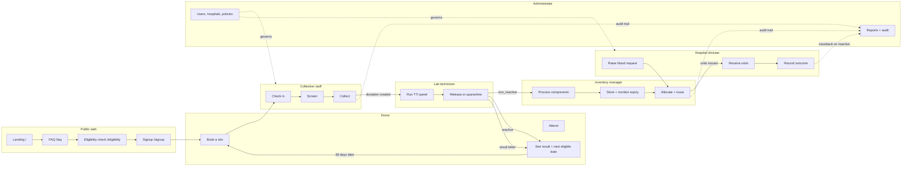

**The three intersections that matter:**

1. **Donor ↔ Staff** (`S1`/`S2`) — the only face-to-face moment. Everything the donor did
   online is either honoured here or wasted here.
2. **Lab ↔ Donor** (`T2` → `D3`) — a `reactive` result turns an inventory event into a
   life-changing medical disclosure. See §6.3.
3. **Inventory ↔ Hospital** (`I3` ↔ `H1`) — the donor's bag becomes a patient's transfusion.
   This is the entire point of the product, and it does not exist in code today.

---

## 3. The master flow: vein to vein

This is the centrepiece. It is the chain from the foundation brief §3.1, annotated with the
acting persona and the entity/status transition at each step.

```mermaid
flowchart TD
    Start(["Person decides to donate"]) --> R1["Register account<br/><i>donor</i><br/>users + donor_profiles created"]
    R1 --> R2["Raise donation request<br/><i>donor</i><br/>donation_request.status = pending"]
    R2 --> R3{"Slot available at<br/>chosen center?"}
    R3 -->|no| R4["Offer alternative dates<br/>request stays pending"]
    R4 --> R3
    R3 -->|yes| R5["Confirm booking<br/><i>staff or admin</i><br/>donation_request.status = approved<br/>appointment.status = scheduled"]

    R5 --> N1[/"Reminder T-48h and T-2h<br/>notifications row"/]
    N1 --> C1{"Donor arrives?"}
    C1 -->|no| C2(["appointment.status = no_show<br/>re-engagement nudge at T+24h"])
    C1 -->|cancels first| C3(["appointment.status = cancelled<br/>slot returned to pool"])
    C1 -->|yes| C4["Check in at desk<br/><i>staff</i><br/>appointment.status = checked_in<br/>checked_in_at set"]

    C4 --> SC1["Screening: Hb, BP, pulse,<br/>weight, temp, questionnaire<br/><i>staff</i> · screenings row"]
    SC1 --> SC2{"screening.outcome"}
    SC2 -->|deferred_temporary| SC3(["appointment.status = deferred<br/>deferrals row type = temporary<br/>ends_on set · donor notified"])
    SC2 -->|deferred_permanent| SC4(["appointment.status = deferred<br/>deferrals row type = permanent<br/>counselling referral"])
    SC2 -->|passed| CO1["Collect whole blood 450 ml<br/><i>staff</i><br/>donations row created<br/>appointment.status = completed"]

    CO1 --> U1["Create blood unit(s)<br/><i>staff/system</i><br/>blood_unit.status = quarantined<br/>unit_code issued, expires_at set"]
    U1 --> TT1["TTI panel: HIV, HBsAg,<br/>HCV, Syphilis, Malaria<br/><i>lab_tech</i> · test_results rows"]
    TT1 --> TT2{"All non_reactive?"}
    TT2 -->|"any reactive"| TT3["blood_unit.status = discarded<br/>reason = TTI reactive"]
    TT3 --> TT4(["Donor recalled for<br/>counselling + confirmatory test<br/>deferral type = permanent"])
    TT2 -->|"indeterminate"| TT5["Repeat testing<br/>unit stays quarantined"]
    TT5 --> TT2
    TT2 -->|"all non_reactive"| TT6["blood_unit.status = available"]

    TT6 --> P1{"Split into components?"}
    P1 -->|yes| P2["Centrifuge + separate<br/><i>inventory_manager</i><br/>child units: PRBC, FFP, platelets<br/>parent_unit_id set, parent discarded"]
    P1 -->|no| P3["Store whole blood<br/>storage_location_id set"]
    P2 --> P3
    P3 --> ST1["Shelf life clock running<br/>PRBC 42d · platelets 5d<br/>FFP/cryo 12 months"]

    ST1 --> BR1["Hospital raises blood request<br/><i>hospital_user</i><br/>blood_request.status = pending"]
    BR1 --> BR2{"Reviewed"}
    BR2 -->|rejected| BR3(["blood_request.status = rejected<br/>reason recorded"])
    BR2 -->|approved| BR4["blood_request.status = approved"]
    BR4 --> AL1["Match by ABO/Rh + component<br/>FEFO ordering<br/><i>inventory_manager</i>"]
    AL1 --> AL2{"Enough compatible<br/>units on hand?"}
    AL2 -->|"none"| AL3(["blood_request.status = pending<br/>urgent-donor broadcast<br/>escalate to admin"])
    AL2 -->|"some"| AL4["Allocate what exists<br/>blood_request.status = partially_fulfilled"]
    AL2 -->|"all"| AL5["Allocate full quantity"]
    AL4 --> XM1
    AL5 --> XM1["Crossmatch<br/>unit_allocations row<br/>blood_unit.status = reserved"]
    XM1 --> IS1["Issue to hospital<br/>issuances row<br/>blood_unit.status = issued"]
    IS1 --> IS2{"Fate of the unit"}
    IS2 -->|"given to patient"| OUT1(["blood_unit.status = transfused<br/>blood_request.status = fulfilled"])
    IS2 -->|"returned in cold chain"| OUT2(["blood_unit.status = available<br/>returned within 30 min rule"])
    IS2 -->|"cold chain broken"| OUT3(["blood_unit.status = discarded"])

    ST1 -.->|"nightly sweep"| EX1{"Expires within 72h?"}
    EX1 -->|yes| EX2["Flag for priority issuance<br/><i>inventory_manager</i><br/>FEFO boost + alert"]
    EX2 --> AL1
    EX1 -->|"past expires_at"| EX3(["blood_unit.status = expired<br/>then discarded with reason<br/>wastage report"])

    OUT1 -.->|"transfusion reaction"| TB1["Traceback: recipient to unit<br/>to donation to donor<br/><i>admin</i> · unit_status_events walk"]
    TB1 --> TB2(["blood_unit.status = recalled<br/>for sibling units"])
```

### 3.1 The chain in one table

| # | Step | Persona | Entity + status | Screen |
|---|---|---|---|---|
| 1 | Register | `donor` | `users`, `donor_profiles` created | `/signup` `[EXISTS]` |
| 2 | Request donation | `donor` | `donation_request.status = pending` | `/donor/{id}/book` `[NEW]` |
| 3 | Confirm booking | `staff`/`admin` | `= approved`, `appointment.status = scheduled` | `/admin/donation-requests` `[PARTIAL]` |
| 4 | Check in | `staff` | `appointment.status = checked_in` | `/staff/checkin` `[NEW]` |
| 5 | Screen | `staff` | `screening.outcome` set | `/staff/appointments/{id}/screening` `[NEW]` |
| 6 | Collect | `staff` | `donations` row, `appointment.status = completed` | `/staff/appointments/{id}/collection` `[NEW]` |
| 7 | Label units | `staff`/system | `blood_unit.status = quarantined` | same screen `[NEW]` |
| 8 | Test | `lab_tech` | `test_result.result` per assay | `/lab/donations/{id}/results` `[NEW]` |
| 9 | Release | `lab_tech` | `blood_unit.status = available` | `/lab` `[NEW]` |
| 10 | Process | `inventory_manager` | child units created | `/inventory/processing` `[NEW]` |
| 11 | Request units | `hospital_user` | `blood_request.status = pending` | `/hospital/requests/new` `[NEW]` |
| 12 | Approve | `inventory_manager`/`admin` | `= approved` | `/admin/blood-requests` `[NEW]` |
| 13 | Allocate + crossmatch | `inventory_manager` | `blood_unit.status = reserved` | `/hospital/requests/{id}` (staff view) `[NEW]` |
| 14 | Issue | `inventory_manager` | `blood_unit.status = issued` | `/inventory/units/{unitCode}` `[NEW]` |
| 15 | Outcome | `hospital_user` | `transfused` / `available` / `discarded` | `/hospital/deliveries` `[NEW]` |

**Fourteen of fifteen steps do not exist.** Step 3 exists in a broken form: it hard-`DELETE`s
the request row instead of transitioning it (`backend/main.go:452`), which destroys the audit
chain at the very first handoff.

---

## 4. Per-persona journeys

### 4.1 Donor

The donor is the only persona who is not paid to be here. Every gram of friction is a
donation that does not happen.

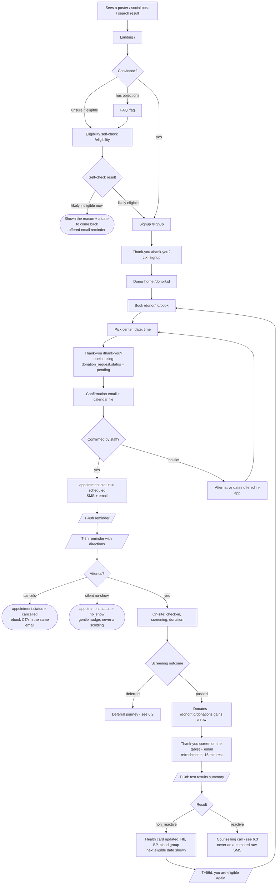

#### Step table — donor

| # | Donor action | System response | Screen / route | Entity + status | Edge cases |
|---|---|---|---|---|---|
| D1 | Lands on site | Hero, USP bar, live need indicator | `/` `[EXISTS]` | — | Arrives on a deep link from a share card; slow 3G — LCP budget in TRD |
| D2 | Opens FAQ | Accordion, 12 questions, `FAQPage` JSON-LD | `/faq` `[NEW]` | — | Arrives directly from a Google featured snippet |
| D3 | Runs eligibility self-check | Client-side quiz against `policies` | `/eligibility` `[NEW]` | none — deliberately anonymous | Answers suggest permanent ineligibility: must be phrased as "based on what you told us", never as a diagnosis |
| D4 | Creates account | `POST /api/go/donors` then session cookie | `/signup` `[EXISTS]` | `users`, `donor_profiles` | Email already registered → today returns a generic failure; must say "that email already has an account · log in" |
| D5 | Lands on thank-you | Confirms what happens next + next action | `/thank-you?ctx=signup` `[NEW]` | — | Must not dead-end (§8.2) |
| D6 | Opens home | Profile, eligibility card, upcoming appointment, history | `/donor/{id}` `[PARTIAL]` | — | Profile incomplete banner exists today and works well — keep it |
| D7 | Books | Picks center → date → slot | `/donor/{id}/book` `[NEW]` | `donation_request.status = pending` | Books while inside a `temporary` deferral → blocked with the exact end date |
| D8 | Waits | Reminder cadence T-48h, T-2h | email + SMS | `notifications` rows | Wrong phone number: fall back to email, flag profile |
| D9 | Cancels | One-tap cancel from the email | `/donor/{id}/appointments/{aid}` `[NEW]` | `appointment.status = cancelled` | **No cancel endpoint exists today** (P1-4) |
| D10 | Attends | Staff check-in | `/staff/checkin` `[NEW]` | `= checked_in` | Arrives 40 min late; arrives at the wrong center |
| D11 | Is screened | Vitals recorded | `/staff/appointments/{id}/screening` `[NEW]` | `screenings` row | See §6.2 |
| D12 | Donates | Collection recorded | `/staff/appointments/{id}/collection` `[NEW]` | `donations`, `blood_unit.status = quarantined` | Vasovagal reaction mid-draw → short draw, `adverse_reaction` recorded, unit may be discarded |
| D13 | Sees results | Health summary | `/donor/{id}/donations/{did}` `[NEW]` | `test_results` | `reactive` never surfaces in the app before a human call (§6.3) |
| D14 | Waits out interval | Countdown + re-eligibility nudge | `/donor/{id}/eligibility` `[NEW]` | `deferrals` / interval rule | 56-day whole-blood interval; 6/yr male, 4/yr female cap |

#### Emotional and friction notes — donor

- **The first-time donor is frightened of the needle, not of the form.** The FAQ must lead
  with "Does it hurt?" and "How much blood do you take?", not with opening hours.
- **The self-check must be anonymous.** Asking someone to create an account before telling
  them whether they can donate at all is the single largest avoidable drop-off in the funnel.
- **Deferral is experienced as rejection.** See §6.2 — this is the most delicate screen in
  the product.
- **The repeat donor wants two things and nothing else:** the next eligible date, and a
  one-tap rebook. Their home screen should answer both above the fold.
- **The thank-you must be specific.** "Thank you" is noise. "Your donation on 12 Sept went
  to Douala General Hospital" is why people come back.

#### Failure sub-flow: no-show recovery

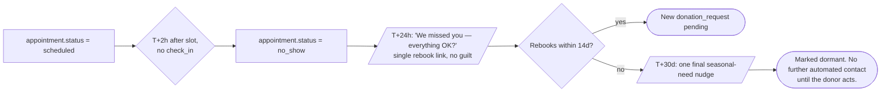

---

### 4.2 Collection staff (phlebotomist / front desk)

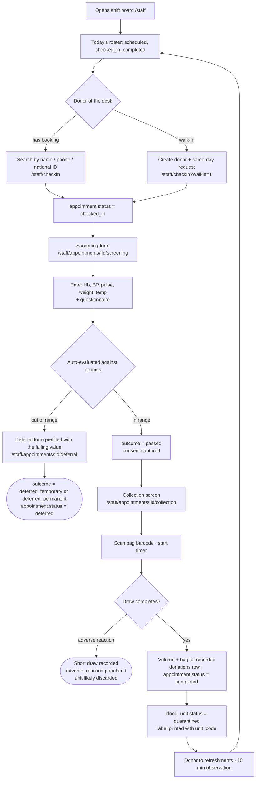

#### Step table — collection staff

| # | Action | System response | Screen / route | Entity + status | Edge cases |
|---|---|---|---|---|---|
| S1 | Opens shift board | Today's appointments grouped by status | `/staff` `[NEW]` | — | Network down at the center → offline queue is out of scope v1; document the manual fallback |
| S2 | Finds donor | Trigram search on name/phone/national ID | `/staff/checkin` `[NEW]` | — | Two donors, same name; donor forgot which email they used |
| S3 | Checks in | Timestamp recorded | same | `appointment.status = checked_in`, `checked_in_at` | Donor has no booking → walk-in path |
| S4 | Records vitals | Live range validation, red on out-of-range | `/staff/appointments/{id}/screening` `[NEW]` | `screenings` row | Hb device gives a borderline 12.4 g/dL → retest allowed, both values stored |
| S5 | Records outcome | Deferral form or consent capture | same | `screening.outcome` | Donor withdraws consent after screening → `appointment.status = cancelled`, not `deferred` |
| S6 | Records collection | Bag scan, volume, lot, phlebotomist | `/staff/appointments/{id}/collection` `[NEW]` | `donations`, `blood_unit` | Duplicate bag scan must hard-fail — `unit_code` is `UNIQUE` |
| S7 | Prints label | `unit_code` + blood group + expiry | same | — | Printer offline → manual code with a mandatory reconciliation task |

#### Emotional and friction notes — collection staff

- **They have gloves on.** Every screening field must be reachable with large touch targets,
  a numeric keypad, and no free-text where a choice will do. The questionnaire is
  yes/no chips, not a textarea.
- **They are talking to a nervous human while typing.** The screen must never need more than
  a glance. Range validation should be colour + icon, not a paragraph.
- **Barcode over keyboard, always.** Typing a unit code by hand is where mislabelling
  incidents come from. The scan field must be autofocused on screen load.
- **They will be interrupted mid-form.** Screening and collection forms must autosave drafts
  keyed to `appointment_id`.

---

### 4.3 Lab technician

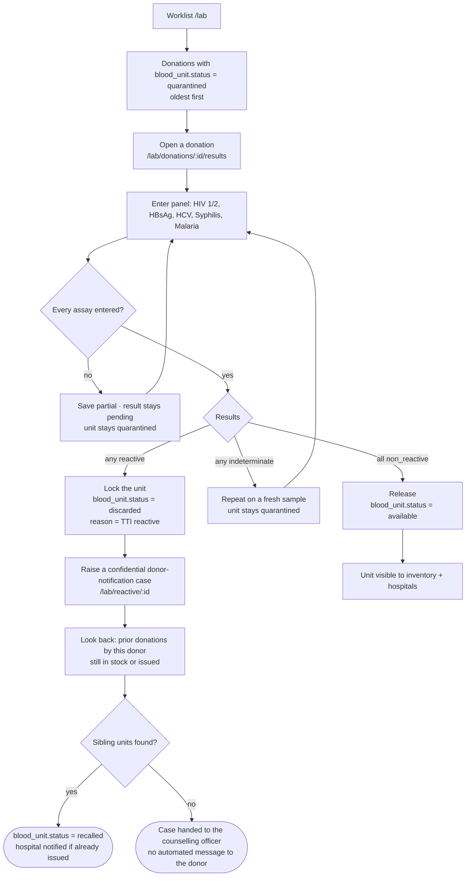

#### Step table — lab technician

| # | Action | System response | Screen / route | Entity + status | Edge cases |
|---|---|---|---|---|---|
| T1 | Opens worklist | Quarantined donations, ageing indicator | `/lab` `[NEW]` | — | Platelets age out in 5 days — worklist must sort by expiry pressure, not arrival |
| T2 | Enters results | One row per `test_type` | `/lab/donations/{id}/results` `[NEW]` | `test_results` rows | Partial entry must be resumable; never auto-release on a partial panel |
| T3 | Releases | All five `non_reactive` | same | `blood_unit.status = available` | Release must be blocked in code, not just UI, if any result is `pending` |
| T4 | Quarantines | Any `indeterminate` | same | stays `quarantined` | Third indeterminate → escalate to `admin`, discard |
| T5 | Handles reactive | Unit locked, case opened | `/lab/reactive/{id}` `[NEW]` | `discarded` + `recalled` siblings | See §6.3 in full |

#### Emotional and friction notes — lab technician

- **The lab tech must never be the person who tells the donor.** The UI must make it
  structurally impossible: entering a `reactive` result opens a *case*, it does not open a
  message composer. There is no "notify donor" button on this screen.
- **Double-entry for reactive results.** A mis-keyed `reactive` is a catastrophe in both
  directions. Require a confirm step that restates the donor's name and the assay.
- **Ageing pressure is the primary sort.** A tech who works oldest-first on a list that
  mixes platelets and FFP will waste platelets.

---

### 4.4 Inventory manager

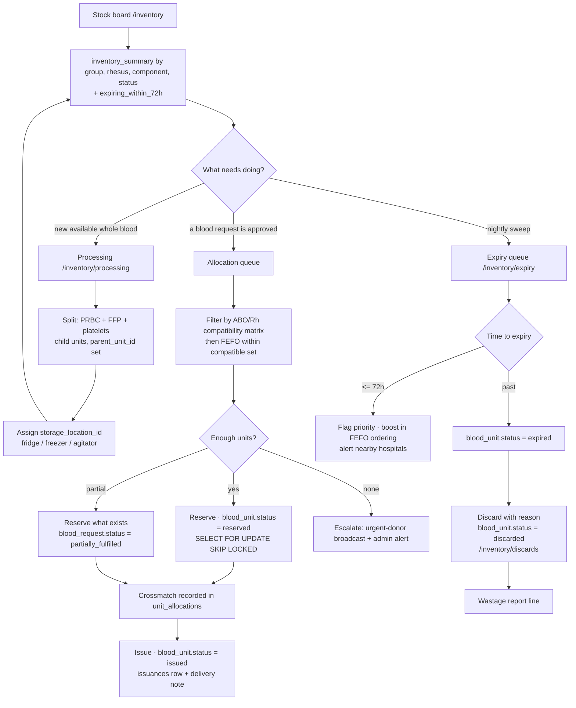

#### Step table — inventory manager

| # | Action | System response | Screen / route | Entity + status | Edge cases |
|---|---|---|---|---|---|
| I1 | Reads stock board | Cached `inventory_summary`, ≤60 s TTL | `/inventory` `[NEW]` | — | Cache **must** be invalidated on every `unit_status_events` write — stale stock is a patient-safety issue |
| I2 | Splits components | Child units inherit group, get own `expires_at` | `/inventory/processing` `[NEW]` | children `available`, parent `discarded` | Platelet yield fails QC → that child alone is discarded |
| I3 | Assigns storage | Location + temperature range validated | `/inventory/storage` `[NEW]` | `storage_location_id` | FFP into a fridge instead of a freezer must be rejected by the form |
| I4 | Allocates | Compatibility matrix then FEFO | `/hospital/requests/{id}` staff view `[NEW]` | `reserved` | **Race:** two managers allocating the same bag. Row lock or optimistic version column, per TRD |
| I5 | Issues | Delivery note generated | `/inventory/units/{unitCode}` `[NEW]` | `issued` | Courier rejects the box → revert to `available` only if cold chain intact |
| I6 | Runs expiry sweep | Nightly job flags then expires | `/inventory/expiry` `[NEW]` | `expired` → `discarded` | See §6.5 |

#### Emotional and friction notes — inventory manager

- **Wastage is personal.** A discarded unit is a specific person's donation that helped
  nobody. The discard screen should show the donation date and require a reason — this is
  friction that is *worth* adding.
- **They live in a spreadsheet mindset.** Give them dense tables with sorting and CSV export
  before giving them dashboards with charts.
- **Never show a number they cannot trust.** If the cache is older than 60 s, say so.

---

### 4.5 Hospital clinician

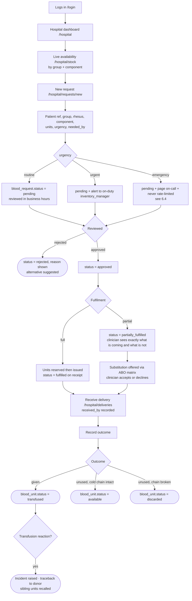

#### Step table — hospital clinician

| # | Action | System response | Screen / route | Entity + status | Edge cases |
|---|---|---|---|---|---|
| H1 | Checks stock | Live counts by group/component | `/hospital/stock` `[NEW]` | — | Counts must be strongly consistent for allocation, not read from a replica |
| H2 | Raises request | Form with urgency + `needed_by` | `/hospital/requests/new` `[NEW]` | `blood_request.status = pending` | Emergency path must be ≤3 fields — see §6.4 |
| H3 | Tracks | Status timeline per request | `/hospital/requests/{id}` `[NEW]` | — | Clinician refreshes obsessively at 2am; use polling or SSE, show a timestamp |
| H4 | Accepts substitution | Compatible alternative offered | same | — | Must show *why* it is compatible, not just that it is |
| H5 | Receives | Delivery note signed | `/hospital/deliveries` `[NEW]` | `issued` → `transfused`/`available`/`discarded` | Units arrive but nobody records the outcome → chase job at T+48h |

#### Emotional and friction notes — hospital clinician

- **At 2am with a haemorrhaging patient, the clinician has one hand free.** The emergency
  form is blood group, units, patient reference. Everything else is filled in afterwards.
- **Silence is worse than bad news.** A request that sits at `pending` with no visible
  progress will be abandoned for a phone call, and the phone call will bypass the audit
  trail. Show a live timeline with named steps.
- **Partial fulfilment must be honest and immediate.** "2 of 4 units are on the way, the
  other 2 are not available and here is who else has them" beats a silent `pending`.

---

### 4.6 Administrator

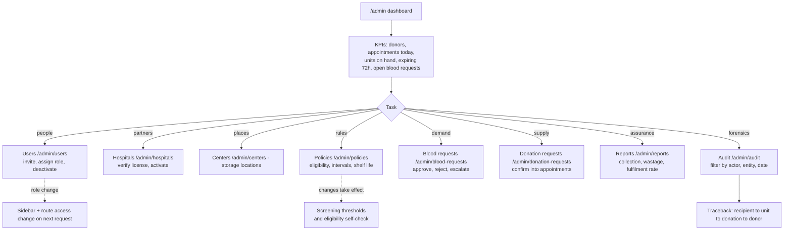

#### Step table — administrator

| # | Action | System response | Screen / route | Entity + status | Edge cases |
|---|---|---|---|---|---|
| A1 | Reviews KPIs | Cached summary + live counters | `/admin` `[PARTIAL]` | — | Today's dashboard shows three counts and a donor-creation form; the form belongs on `/admin/donors/new` |
| A2 | Manages users | Invite, role assign, deactivate | `/admin/users` `[NEW]` | `users.role`, `users.status` | **Replaces the hardcoded `admin@admin.com`/`admin` credential (P1-3)** |
| A3 | Verifies hospitals | License check → `active` | `/admin/hospitals` `[NEW]` | `hospitals.status` | An unverified hospital cannot raise `emergency` requests |
| A4 | Edits policies | Versioned, `effective_from` | `/admin/policies` `[NEW]` | `policies` rows | A change to the donation interval must not retroactively invalidate booked appointments |
| A5 | Confirms donation requests | Picks a date → appointment | `/admin/donation-requests` `[PARTIAL]` | `pending` → `approved` | **Today this DELETEs the request row — must become a status transition** |
| A6 | Runs traceback | Walks `unit_status_events` backwards | `/admin/audit` `[NEW]` | — | This is the regulatory reason the system exists |

#### Emotional and friction notes — administrator

- **The admin is accountable to a regulator.** Every screen they use should be exportable
  and every action they take should be attributable. "Who confirmed this and when" must
  never require a database query.
- **Do not put operational work on the admin.** Today `/admin` contains a donor-registration
  form because there was nowhere else to put it. In the target model that is a `staff` job.

---

## 5. Critical journey deep-dives

### 5.1 First-time donor — the flagship journey, screen by screen

Amara, 24, saw a post about a shortage of O− after a road accident. She has never donated.
She is on a phone, on mobile data, at 21:40.

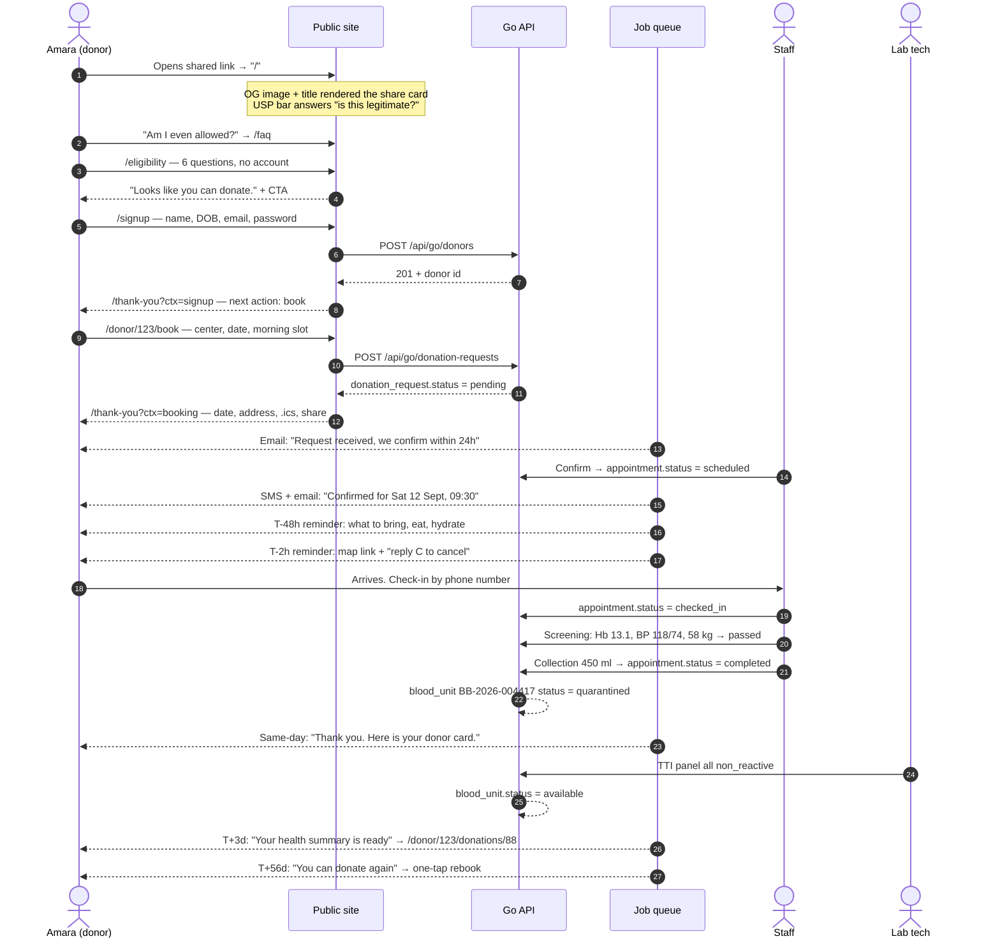

#### Screen-by-screen

| Screen | Route | Tag | What Amara must be able to do in under 10 seconds |
|---|---|---|---|
| Landing | `/` | `[EXISTS]` | Understand what this is, see the USP bar, hit one primary CTA |
| FAQ | `/faq` | `[NEW]` | Find "Does it hurt?" without scrolling past opening hours |
| Eligibility self-check | `/eligibility` | `[NEW]` | Get a yes/no/maybe **without creating an account** |
| Signup | `/signup` | `[EXISTS]` | Four fields. Today it asks name, DOB, email, password — correct restraint, keep it |
| Thank-you (signup) | `/thank-you?ctx=signup` | `[NEW]` | See exactly one next action: "Book your first donation" |
| Donor home | `/donor/{id}` | `[PARTIAL]` | See eligibility state, next appointment, and a book button |
| Booking | `/donor/{id}/book` | `[NEW]` | Center → date → slot in three taps |
| Thank-you (booking) | `/thank-you?ctx=booking` | `[NEW]` | Date, address, add-to-calendar, and what to bring |
| Appointment detail | `/donor/{id}/appointments/{aid}` | `[NEW]` | Reschedule or cancel without emailing anyone |
| Donation detail | `/donor/{id}/donations/{did}` | `[NEW]` | Blood group, Hb, BP, and "you can donate again on 7 Nov" |

**What exists today for Amara:** signup, a donor page, and a single button labelled
"Request appointment" that sends a request with **no date, no center, and no confirmation of
what happens next**. She then waits with no visibility until an admin picks a date. The
booking journey is effectively a suggestion box.

---

### 5.2 The deferral journey

This is the most emotionally delicate flow in the product, and it does not exist at all today.

Someone took a half-day off work, travelled across the city, sat down, rolled up a sleeve,
and is now being told no. **How this is handled determines whether they ever come back.**

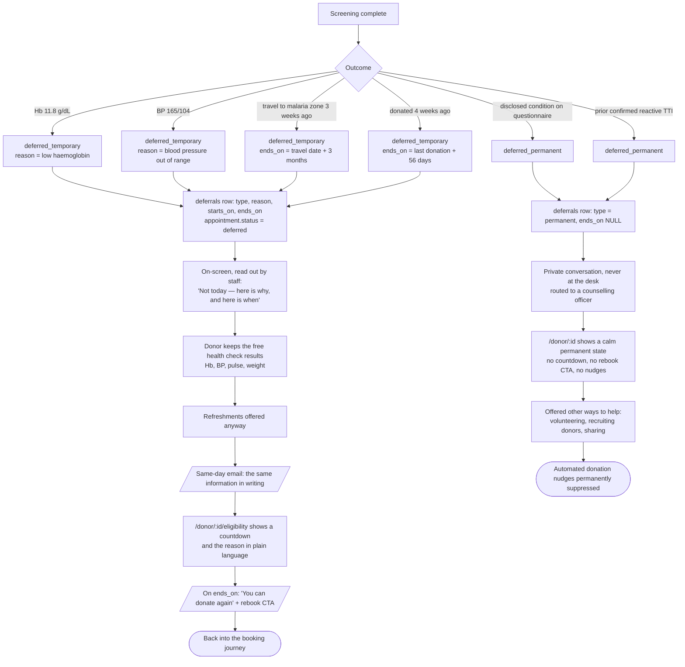

#### Deferral communication rules

| Rule | Why |
|---|---|
| Never use the word "rejected", "failed", or "unsuitable" | These describe the person. Use "deferred" and name the *value*, not the person |
| Always give a date for a `temporary` deferral | An open-ended no is indistinguishable from a permanent no |
| Always give the health numbers | The free health check is real value the donor keeps regardless |
| Never deliver a `permanent` deferral by SMS or email first | It goes through a person, in private, then in writing |
| Suppress all donation nudges after a `permanent` deferral | Receiving "you can donate again!" after a permanent deferral is a product failure with real human cost |
| Offer a non-donation next action | The person came to help. Let them help another way |

#### Edge cases

| Case | Handling |
|---|---|
| Donor deferred, then books online anyway | `/donor/{id}/book` is blocked during an active `temporary` deferral, showing `ends_on` |
| Deferral reason is sensitive (questionnaire disclosure) | Reason stored, but the donor-facing text is generic; full reason is visible to `staff`, `lab_tech`, `admin` only |
| Deferral entered in error | `admin` can void a deferral; the void is an `audit_log` entry, the original row is never deleted |
| Temporary deferral expires while the donor is dormant | One re-eligibility message. If ignored, no further automated contact |
| Donor is deferred at check-in before screening | `appointment.status = deferred` with a `screenings` row that has only the failing field |

---

### 5.3 Reactive test result

A donation tests `reactive` for HBsAg. There are three parallel obligations: **protect the
recipient**, **inform the donor humanely**, and **prove afterwards that both happened**.

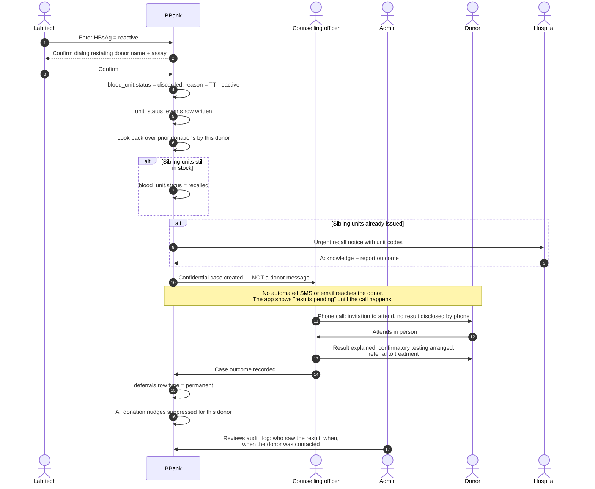

#### The three paths in detail

**Path 1 — the unit.** Immediate and automatic. `blood_unit.status = discarded` with a reason;
an event row; the unit disappears from `inventory_summary` in the same transaction, and the
cache is invalidated on the event write. Any sibling unit from a prior donation goes to
`recalled`, including units already `issued` — the hospital is notified with the unit codes.

**Path 2 — the donor.** Deliberately slow and entirely human.

| Anti-pattern | What BBank does instead |
|---|---|
| Automated SMS: "Your HIV test was reactive" | A phone call inviting the donor to attend, disclosing nothing |
| Result visible in the donor portal | Portal shows "results pending" until the counselling case closes |
| Notification queued like any other | Reactive results are **excluded** from the notification pipeline by design, not by configuration |
| Lab tech contacts the donor | Structurally impossible — no contact affordance exists on `/lab/donations/{id}/results` |

A single `reactive` screening result is **not a diagnosis**. Confirmatory testing is required
before anything is stated as fact. The product must never phrase a screening result as one.

**Path 3 — the audit trail.** Every read of a reactive result is logged, not just every write.
`audit_log` must answer: who entered it, who confirmed it, who accessed the donor record
afterwards, when the donor was contacted, and by whom. This is the strongest access-control
requirement in the system — see the PRD's confidentiality NFRs.

---

### 5.4 Emergency blood request at 2am

Dr. Nkeng needs **4 units of O− PRBC** for a road-traffic polytrauma. It is 02:14.

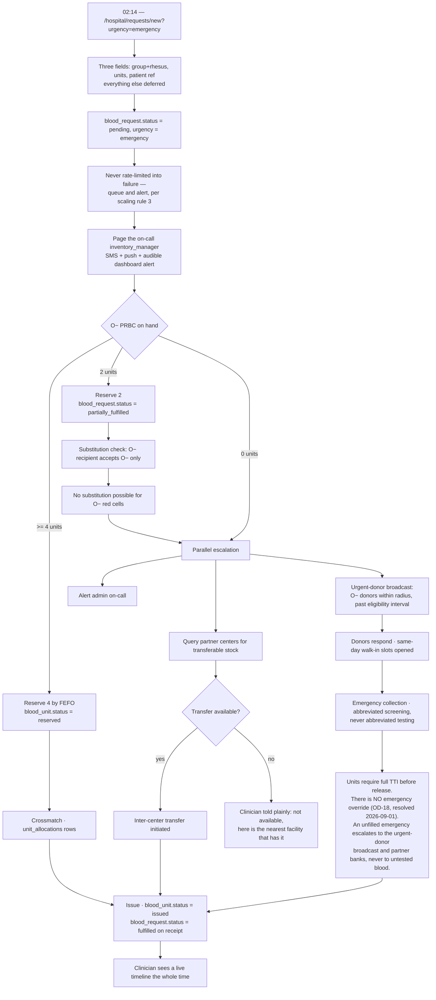

#### The substitution rule

For **red cells**, the recipient determines the acceptable donor groups:

| Recipient | Acceptable donor groups |
|---|---|
| `O-` | `O-` |
| `O+` | `O-`, `O+` |
| `A-` | `O-`, `A-` |
| `A+` | `O-`, `O+`, `A-`, `A+` |
| `B-` | `O-`, `B-` |
| `B+` | `O-`, `O+`, `B-`, `B+` |
| `AB-` | `O-`, `A-`, `B-`, `AB-` |
| `AB+` | all |

O− is the hardest case in the system precisely because it substitutes for everyone and
nothing substitutes for it. The allocation UI must **discourage** spending O− on an `O+` or
`A+` recipient when a compatible non-O− unit exists — FEFO within the compatible set, but
with O− weighted last unless the recipient is Rh-negative. Plasma compatibility is inverted:
AB is the universal plasma donor.

#### Escalation ladder

| T+ | Action | Actor |
|---|---|---|
| 0 s | Request created, on-call paged | system |
| 2 min | No acknowledgement → second page + backup on-call | system |
| 5 min | No acknowledgement → admin paged, request pinned to `/admin` | system |
| 10 min | Stock insufficient → urgent-donor broadcast fires | `inventory_manager` |
| 15 min | Partner-center transfer request | `admin` |
| Any point | Clinician sees every one of these on the request timeline | — |

**The rule that matters:** an emergency request must never fail *silently*. Rate limiting,
circuit breakers, and cache staleness must all fail *loudly and open* on this path.

---

### 5.5 Expiry sweep

Blood is a perishable donated by a volunteer. Every expired unit is a wasted act of
generosity, and platelets give you five days to not waste them.

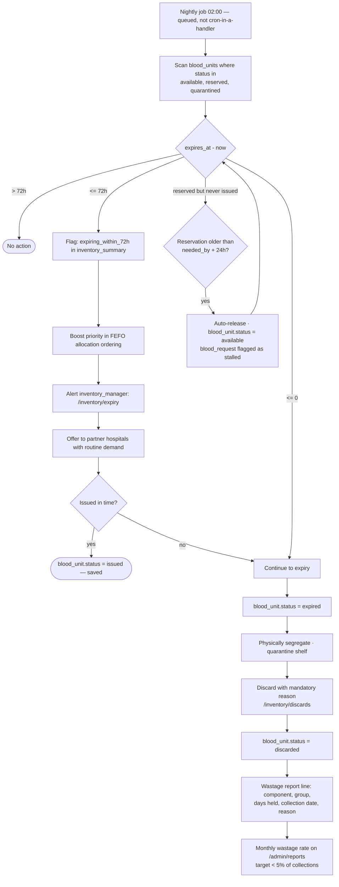

#### Expiry facts that drive the UI

| Component | Storage | Shelf life | UI consequence |
|---|---|---|---|
| Whole blood (CPDA-1) | 1–6 °C | 35 days | Weekly review is enough |
| Packed red cells (SAGM/AS-1) | 1–6 °C | 42 days | Weekly review is enough |
| **Platelets** | 20–24 °C, agitated | **5 days** (7 with bacterial testing) | **Daily, prominent, top of the board** |
| Fresh frozen plasma | ≤ −18 °C | 12 months | Quarterly |
| Cryoprecipitate | ≤ −18 °C | 12 months | Quarterly |

A single expiry list sorted by date is wrong. Platelets need their own panel, because a
platelet unit with 48 hours left is more urgent than a PRBC unit with 5 days left, and a
date sort buries it.

---

## 6. Cross-cutting flows

### 6.1 Authentication and session

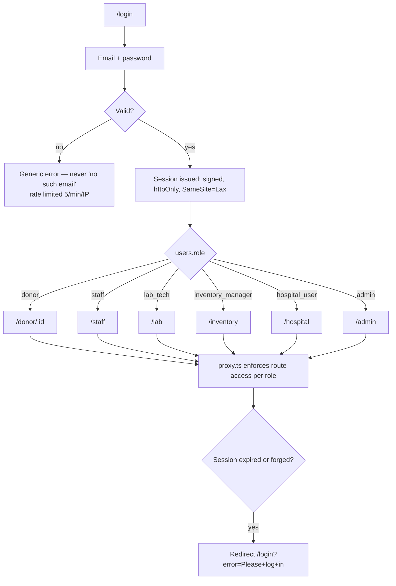

**Today:** `src/lib/session.ts` writes `bb_session` as **plain JSON in an httpOnly cookie**.
It is httpOnly, but it is not signed — a user can hand-craft `{"role":"admin"}` and the
`proxy.ts` guard will honour it. `/login` also contains a hardcoded `admin@admin.com` /
`admin` branch. Both are P1 items and both are on the critical path for every journey in
this document. Roles beyond `admin` and `donor` do not exist in the session type at all.

**Role switching:** a user has exactly one `role`. A person who is both a donor and a staff
member gets two accounts with two emails; this is deliberate — dual-role sessions make the
audit trail ambiguous, and audit clarity outranks convenience here.

### 6.2 Notification touchpoints

Every automated message in the system. Channel, recipient, and urgency are as important as
the content.

| # | Trigger | Channel | Recipient | Template summary | Urgency |
|---|---|---|---|---|---|
| N1 | Account created | email | donor | Welcome, what happens next, book a slot | low |
| N2 | `donation_request.status = pending` | email | donor | Request received, confirmed within 24h | low |
| N3 | `appointment.status = scheduled` | SMS + email | donor | Date, time, center address, `.ics` attachment | medium |
| N4 | T-48h before appointment | email | donor | What to bring, eat and hydrate, reschedule link | medium |
| N5 | T-2h before appointment | SMS | donor | Map link, "reply C to cancel" | medium |
| N6 | `appointment.status = completed` | email | donor | Thank you, donor card, rest advice, results in 3 days | medium |
| N7 | `appointment.status = no_show` +24h | email | donor | "We missed you" + one rebook link, no guilt | low |
| N8 | `deferred_temporary` recorded | email | donor | Reason in plain language, health numbers, `ends_on` | medium |
| N9 | `deferrals.ends_on` reached | email + SMS | donor | You can donate again + one-tap rebook | medium |
| N10 | All TTI `non_reactive` | email | donor | Health summary ready, link to `/donor/{id}/donations/{did}` | low |
| N11 | Any TTI `reactive` | **none — human phone call** | counselling officer (case), **never the donor** | Confidential case created | critical |
| N12 | `blood_request.urgency = emergency` | SMS + push + dashboard alarm | on-call `inventory_manager` | Group, units, hospital, patient ref | critical |
| N13 | Emergency unacknowledged 2 min | SMS + push | backup on-call, then `admin` | Escalation notice | critical |
| N14 | Stock insufficient for a request | in-app + email | `admin`, requesting `hospital_user` | What is short and what is being done | high |
| N15 | Urgent-donor broadcast | SMS | eligible donors, matching group, in radius | "O− needed at {center} — can you come today?" | high |
| N16 | Unit `expiring_within_72h` | in-app digest | `inventory_manager` | Count by component, platelets first | high |
| N17 | Unit `expired` | in-app | `inventory_manager` | Discard task created | medium |
| N18 | Unit `recalled` after look-back | SMS + email + phone | receiving `hospital_user` | Unit codes, immediate quarantine instruction | critical |
| N19 | `blood_request.status = partially_fulfilled` | in-app + email | `hospital_user` | Exactly what is coming, what is not, alternatives | high |
| N20 | Delivery received, outcome unrecorded +48h | email | `hospital_user` | Chase for transfusion outcome | low |
| N21 | New user invited | email | invited user | Set password link, expires 24h | medium |

**Broadcast throttle (N15):** an eligible donor receives at most one urgent broadcast per
14 days regardless of how many emergencies occur. Broadcast fatigue destroys the channel,
and the channel is the last line of defence when stock hits zero.

### 6.3 Error and empty states

| Situation | Today | Target |
|---|---|---|
| Failed server action | `redirect('...?error=...')` → `ToastAlert` reads the query param `[EXISTS]` | Keep the pattern; add inline field-level errors for forms |
| API unreachable | Page renders with empty arrays, silently | Explicit "we cannot reach the service" panel with a retry, plus the last known cache timestamp for stock |
| Empty appointment list | Good empty state on `/donor/{id}` `[EXISTS]` | Keep. Extend the same treatment to every new list |
| Empty stock for a group | n/a | Show zero explicitly with a "request a broadcast" action, never an empty table |
| Unknown route | `not-found.tsx` `[EXISTS]` | Add `(dashboard)/not-found.tsx` so an in-app 404 keeps the sidebar (§8.6) |
| Unhandled exception | `(root)/error.tsx` `[EXISTS]` | Add a dashboard-scoped `error.tsx` |
| Loading | `loading.tsx` `[EXISTS]` | Per-route skeletons for the dense tables |

---

## 7. Placement of the requested site additions

Each item from the foundation brief §6, positioned at the exact point in a journey where it
does work.

### 7.1 FAQ — `/faq` `[NEW]`

**Position:** between landing and signup, on the objection-handling arc (D2 in §4.1).
Also linked from `/eligibility` and from the T-48h reminder email.

**Purpose:** a nervous first-time donor has specific fears and will not create an account
until they are answered. These are the actual questions, in the order they are actually asked:

*Eligibility*
1. Am I old enough — or too old? (18–65; first-time donors often capped at 60)
2. I weigh under 50 kg — can I still donate?
3. I'm on medication. Does that disqualify me?
4. I have a tattoo from last month. Can I donate?
5. I travelled recently. Does that matter?
6. Can I donate while menstruating, pregnant, or breastfeeding?

*The process*

7. How long does the whole thing take?
8. **Does it hurt?**
9. **How much blood do you take?** (about 450 ml — roughly 8% of your blood volume)
10. Do I need an appointment or can I walk in?

*Safety*

11. Can I catch anything from donating? (No — every needle and bag is sterile and single-use)
12. What tests do you run on my blood, and will you tell me the results?

*After*

13. When can I donate again? (56 days for whole blood)
14. What should I do for the rest of the day?
15. What happens to my blood after I leave?

Ships with `FAQPage` JSON-LD so questions 8 and 9 can win a featured snippet — which is
itself a top-of-funnel acquisition channel.

### 7.2 Thank-you page — `/thank-you` `[NEW]`

**Two positions, one route, differentiated by `?ctx=`:**

| Context | Route | Must show | Next action |
|---|---|---|---|
| After signup | `/thank-you?ctx=signup` | Account created, what a donation involves | **"Book your first donation"** → `/donor/{id}/book` |
| After booking | `/thank-you?ctx=booking` | Date, time, center address, what to bring | Add to calendar `.ics`, then "Share — invite a friend" |
| After donation (email + on-site tablet) | `/thank-you?ctx=donation` | Units collected, next eligible date | "See your health summary" |

**Why it must carry a next action:** a thank-you page that dead-ends converts a moment of
peak goodwill into a bounce. The moment immediately after someone commits to donating is the
single highest-intent moment in the entire funnel — it is the only time a share prompt has a
real chance of working.

### 7.3 CTA system — `src/components/CTA.tsx` `[NEW]`

**Placement rule: one primary CTA per viewport.** Everything else is secondary or a text link.

**Hierarchy across the journey:**

| Surface | Primary | Secondary |
|---|---|---|
| Landing hero | "Become a donor" → `/signup` | "How it works" → `/#how` |
| Landing mid-page | "Check if you can donate" → `/eligibility` | "Read the FAQ" → `/faq` |
| Landing final | "Become a donor" → `/signup` | "Request blood as a hospital" → `/hospital` |
| FAQ footer | "Check your eligibility" → `/eligibility` | "Sign up" → `/signup` |
| Eligibility result (pass) | "Create your account" → `/signup` | — |
| Eligibility result (defer) | "Remind me on {date}" | "Other ways to help" |
| Donor home, eligible | "Book a donation" → `/donor/{id}/book` | "View history" |
| Donor home, deferred | — (no primary; a CTA here is cruel) | "Why?" → `/donor/{id}/eligibility` |
| Thank-you (booking) | "Add to calendar" | "Invite a friend" |
| Hospital dashboard | "New blood request" → `/hospital/requests/new` | "Check availability" |

**System-wide:** "Donate blood" is always primary rose (`--accent`); "Request blood" is always
secondary. The landing page has CTAs today but no shared component and no rule — the same
"Become a donor" button is rendered with three different class combinations in
`(root)/page.tsx`.

### 7.4 Breadcrumbs — `src/components/Breadcrumbs.tsx` `[NEW]`

**Position:** dashboard only, and only once routes go three levels deep. Not on the landing
page — it is one level deep and a breadcrumb there is decoration.

Where they become necessary in the target routes:

- `/admin` › `Donors` › `Amara Tchinda`
- `/admin` › `Blood requests` › `BR-2026-0142`
- `/inventory` › `Units` › `BB-2026-004417`
- `/staff` › `Appointments` › `12 Sept 09:30` › `Screening`
- `/hospital` › `Requests` › `BR-2026-0142`
- `/donor/{id}` › `Donations` › `12 Sept 2026`

The last crumb is never a link. Ships with `BreadcrumbList` JSON-LD. Today `SidebarNav`
highlights the top-level section and nothing tells you where you are below it — which is
survivable at two levels and unusable at four.

### 7.5 USP bar — `src/components/USPBar.tsx` `[NEW]`

**Position:** immediately under the landing hero, above the fold on desktop.

**Purpose:** pre-empt the four objections a stranger has in the first three seconds, using
claims grounded in the *new* capabilities rather than the current aspirational copy:

| Claim | Objection it kills |
|---|---|
| "Every unit screened and tested" | "Is this safe / legitimate?" |
| "Traceable vein to vein" | "Where does my blood actually go?" |
| "Live stock for hospitals" | "Does this do anything real?" |
| "Free health check with every donation" | "What's in it for me?" |

The landing page today shows `10,847 registered donors` / `26,392 units collected` /
`51,074 lives impacted` — **all three are hardcoded literals** in `(root)/page.tsx:12-16`.
Once `inventory_summary` exists these become real, and until then they are a credibility
liability on a page whose main job is establishing trust.

### 7.6 Discovery layer — titles, OG image, robots, sitemap

This is how the journey *starts at all*, and it is currently one shared title for every page.

| Item | Today | Target | Journey role |
|---|---|---|---|
| Page titles | One `title` in the root layout, inherited by every route | `title: { default, template: '%s · BBank' }` + per-route `metadata` | Search snippet, browser tab, and the text of every shared link |
| OG image | OG tags exist, **no image** | Dynamic `ImageResponse` 1200×630 at `src/app/opengraph-image.tsx` | A shared link with no image is roughly half as likely to be clicked. This is the top of Amara's funnel in §5.1 |
| robots.txt | none | `src/app/robots.ts` — allow public, `Disallow: /admin`, `/donor`, `/staff`, `/lab`, `/inventory`, `/hospital`, `/api` | Keeps PHI-adjacent routes out of the index. Not a security control — the route guard is |
| sitemap.xml | none | `src/app/sitemap.ts` — `/`, `/faq`, `/eligibility`, `/centers`, `/privacy`, `/terms` | Gets the FAQ answers indexed so they win the snippet |

### 7.7 Custom 404 — `not-found.tsx` `[EXISTS]` + `(dashboard)/not-found.tsx` `[NEW]`

**Position:** the recovery path from any broken link, mistyped route, or stale bookmark.

The public 404 exists and is good — branded, calm, one clear "Back home" CTA. The gap is
in-app: a mistyped `/admin/donors/9999` currently drops the user onto the public 404, losing
the sidebar and their sense of place. A dashboard-scoped `not-found.tsx` keeps the shell, the
breadcrumbs, and offers a role-appropriate return path.

---

## 8. Journey metrics

### 8.1 The acquisition funnel

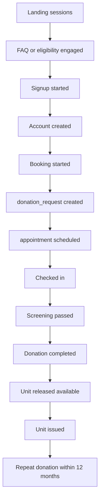

| Stage transition | Metric | Named drop-off risk |
|---|---|---|
| Landing → engaged | Scroll depth past USP bar | Hero fails to say what this is |
| Engaged → signup started | FAQ/eligibility → `/signup` click rate | Objections unanswered; eligibility gated behind an account |
| Signup started → created | Form completion rate | Too many fields; duplicate-email error is generic |
| Created → booking started | % who reach `/donor/{id}/book` | Thank-you page dead-ends |
| Booking started → request created | Booking wizard completion | No slots at a convenient center or time |
| Request → scheduled | Confirmation latency (target < 24h) | Manual admin confirmation is the bottleneck |
| Scheduled → checked in | **Attendance rate** (target ≥ 80%) | No reminders — the largest single loss today |
| Checked in → passed | Deferral rate (expect 10–15%) | Screening surprises that a self-check could have caught |
| Passed → completed | Collection completion | Adverse reaction, short draw |
| Completed → released | TTI turnaround (target < 72h) | Lab backlog; platelets die at 5 days |
| Released → issued | **Utilisation rate**; inverse is wastage (target < 5%) | Poor FEFO discipline; no expiry sweep |
| Completed → repeat | **Repeat donation rate at 12 months** (target ≥ 40%) | No re-eligibility nudge at day 56 |

### 8.2 Operational metrics by persona

| Persona | Metric | Target | Instrumented at |
|---|---|---|---|
| Donor | Time from landing to booked | < 6 min | `/` → `/thank-you?ctx=booking` |
| Donor | Days from `no_show` to rebook | < 21 | `notifications` N7 click |
| Staff | Check-in to collection complete | < 45 min | `checked_in_at` → `donations.collected_at` |
| Staff | Screening form completion time | < 4 min | screening form telemetry |
| Lab | Collection to result entered | < 72h | `collected_at` → `test_results.tested_at` |
| Inventory | Units expiring per month | < 5% of collections | expiry sweep output |
| Inventory | Allocation conflicts (double-reserve attempts) | 0 | row-lock contention counter |
| Hospital | Request creation to first unit issued, `emergency` | < 30 min | `blood_requests.created_at` → `issuances.issued_at` |
| Hospital | `partially_fulfilled` rate | trending down | `blood_requests` status distribution |
| Admin | % `blood_unit` transitions with an event row | 100% | invariant check, alert on drift |

These map to the PRD success metrics; the PRD owns the targets and this document owns the
instrumentation points.

---

## 9. Current-state gap table

Every journey step against today's codebase on `oc-redesign-skill-refactor`.

### 9.1 Public / acquisition

| Step | Route | State | Note |
|---|---|---|---|
| Landing page | `/` | ✅ | Well-built; stats are hardcoded literals |
| USP bar | `/` | ❌ | No component |
| CTA system | — | ⚠️ | CTAs exist, no shared component, no placement rule |
| FAQ | `/faq` | ❌ | — |
| Eligibility self-check | `/eligibility` | ❌ | Highest-leverage missing public page |
| Centers list | `/centers`, `/centers/{id}` | ❌ | No `donation_centers` table either |
| Thank-you | `/thank-you` | ❌ | — |
| Per-route titles | all | ❌ | One title in the root layout for the whole site |
| OG image | `opengraph-image.tsx` | ❌ | OG tags present, no image |
| robots.txt / sitemap | `robots.ts`, `sitemap.ts` | ❌ | — |
| Public 404 | `not-found.tsx` | ✅ | Good |
| Dashboard 404 | `(dashboard)/not-found.tsx` | ❌ | — |
| Privacy / terms | `/privacy`, `/terms` | ✅ | — |

### 9.2 Donor journey

| Step | Route | State | Note |
|---|---|---|---|
| Signup | `/signup` | ✅ | Four fields, correct restraint |
| Login | `/login` | ⚠️ | Works; hardcoded admin credential (P1-3) |
| Donor home | `/donor/{id}` | ⚠️ | Profile + appointments + one request button |
| Booking wizard | `/donor/{id}/book` | ❌ | Today: a single button, no date, no center |
| Appointment list/detail | `/donor/{id}/appointments[/{aid}]` | ❌ | — |
| Cancel / reschedule | same | ❌ | No backend endpoint either (P1-4) |
| Donation history | `/donor/{id}/donations` | ❌ | No `donations` table |
| Health summary | `/donor/{id}/donations/{did}` | ❌ | No `test_results` table |
| Eligibility + countdown | `/donor/{id}/eligibility` | ❌ | — |
| Deferral view | `/donor/{id}/deferral` | ❌ | No `deferrals` table |
| Notification centre | `/donor/{id}/notifications` | ❌ | No `notifications` table |
| Profile settings | `/donor/settings` | ✅ | Works |
| Reminders | — | ❌ | No queue, no provider, no templates |

### 9.3 Collection staff

| Step | Route | State |
|---|---|---|
| Shift board | `/staff` | ❌ |
| Donor search / check-in | `/staff/checkin` | ❌ |
| Walk-in registration | `/staff/checkin?walkin=1` | ❌ |
| Screening form | `/staff/appointments/{id}/screening` | ❌ |
| Deferral form | `/staff/appointments/{id}/deferral` | ❌ |
| Collection form | `/staff/appointments/{id}/collection` | ❌ |
| Unit labelling | same | ❌ |
| `staff` role | — | ❌ Session type is `'admin' \| 'donor'` only |

### 9.4 Lab

| Step | Route | State |
|---|---|---|
| Worklist | `/lab` | ❌ |
| Result entry | `/lab/donations/{id}/results` | ❌ |
| Release / quarantine | same | ❌ |
| Reactive case handling | `/lab/reactive/{id}` | ❌ |
| `lab_tech` role | — | ❌ |

### 9.5 Inventory

| Step | Route | State |
|---|---|---|
| Stock board | `/inventory` | ❌ |
| Unit register / detail | `/inventory/units[/{unitCode}]` | ❌ |
| Component processing | `/inventory/processing` | ❌ |
| Storage locations | `/inventory/storage` | ❌ |
| Expiry queue | `/inventory/expiry` | ❌ |
| Discards + wastage | `/inventory/discards` | ❌ |
| `inventory_manager` role | — | ❌ |

### 9.6 Hospital

| Step | Route | State |
|---|---|---|
| Hospital dashboard | `/hospital` | ❌ |
| Live availability | `/hospital/stock` | ❌ |
| New blood request | `/hospital/requests/new` | ❌ |
| Request list / detail | `/hospital/requests[/{id}]` | ❌ |
| Deliveries + outcome | `/hospital/deliveries` | ❌ |
| `hospital_user` role | — | ❌ |
| Emergency path | — | ❌ Landing page currently promises hospitals "priority matching" that does not exist |

### 9.7 Admin

| Step | Route | State | Note |
|---|---|---|---|
| Dashboard | `/admin` | ⚠️ | Three counts + a donor-creation form |
| Donation requests | `/admin/donation-requests` | ⚠️ | Exists as `/admin/requests`; **confirm DELETEs the row** (`main.go:452`) |
| Blood requests | `/admin/blood-requests` | ❌ | The entire demand side |
| Donor register | `/admin/donors` | ✅ | List only, no detail route |
| Donor detail | `/admin/donors/{id}` | ❌ | — |
| Appointments | `/admin/appointments` | ✅ | List only |
| Appointment detail | `/admin/appointments/{id}` | ❌ | — |
| Users + roles | `/admin/users` | ❌ | Replaces the hardcoded admin credential |
| Hospitals | `/admin/hospitals` | ❌ | — |
| Centers | `/admin/centers` | ❌ | — |
| Policies | `/admin/policies` | ❌ | Eligibility rules are not configurable |
| Reports | `/admin/reports` | ❌ | — |
| Audit log | `/admin/audit` | ❌ | The regulatory reason the system exists |
| Settings | `/admin/settings` | ✅ | Logout only |
| Breadcrumbs | — | ❌ | — |

### 9.8 Cross-cutting

| Concern | State | Note |
|---|---|---|
| Toasts from query params | ✅ | `ToastAlert` + the `redirect('...?success=')` convention works well — keep it |
| Loading state | ✅ | Global `loading.tsx` |
| Public error boundary | ✅ | `(root)/error.tsx` |
| Dashboard error boundary | ❌ | — |
| Route guard | ⚠️ | `proxy.ts` guards `/admin` and `/donor`; knows only two roles |
| Session integrity | ⚠️ | httpOnly but **unsigned plain JSON — forgeable** (P1-1) |
| Six-role model | ❌ | Session type is `'admin' \| 'donor'` |
| Notifications | ❌ | No queue, no provider, no templates |
| Audit trail | ❌ | No `audit_log`, no `unit_status_events` |
| Automated tests | ❌ | Zero (P2-5) |

**Score:** of the 15 master-flow steps in §3.1, **1 exists correctly, 2 exist partially, 12 do
not exist.** Of six personas, **two have any UI at all**, and one of those two (`admin`) is
doing work that belongs to `staff`. The product today is the first 10% of the chain, built
well.

---

## 10. Open questions

| # | Question | Owner | Blocks |
|---|---|---|---|
| Q1 | Is the counselling officer a distinct role, or an `admin` with a flag? §5.3 assumes a named human, not necessarily a role enum value. | Product | Reactive-result flow |
| Q2 | Do donors self-book confirmed slots, or does every request stay staff-confirmed? This changes the whole booking journey. | Product | §4.1, §5.1 |
| Q3 | SMS provider and cost per message in-region — drives the notification matrix. | Ops | §6.2 |
| ~~Q4~~ | ~~Is emergency clinical override of TTI release ever permitted?~~ **RESOLVED 2026-09-01: no override exists.** `FR-28`/`FR-71` stand; `guard_unit_release` enforces it at the database level. §5.4 corrected. | Clinical | §5.4 |
| Q5 | Multi-center from day one, or single center with the table present? | Product | Booking, inventory, transfers |
| Q6 | Retention period for `audit_log` and reactive-result access logs. | Compliance | §5.3 |

---

## 11. Change log

| Date | Version | Change |
|---|---|---|
| 2026-09-01 | Draft v1 | Initial document. Six persona journeys, five deep-dives, notification matrix, funnel metrics, and a full current-state gap table against `oc-redesign-skill-refactor`. |
